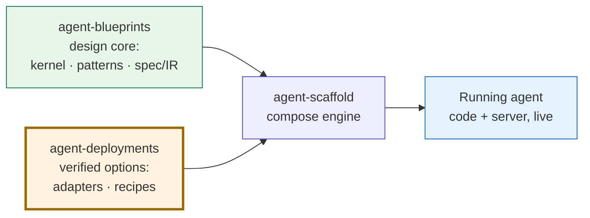

# agent-deployments

The **verified-options arm** of the agent toolchain — a port-typed registry of production-shaped agent recipes plus the vetted adapters that run them, all as self-contained markdown specs that [`agent-scaffold`](https://github.com/jagguvarma15/agent-scaffold) composes into a running agent.

---

## The ecosystem: two arms of a generator

`agent-blueprints` and `agent-deployments` are the two **arms** that feed [`agent-scaffold`](https://github.com/jagguvarma15/agent-scaffold) — the engine that composes a selection into a real, running agent. **This repo is the verified-options arm: the menu `agent-scaffold` picks from.**



- **[agent-blueprints](https://github.com/jagguvarma15/agent-blueprints)** — the **design core**. Framework-agnostic patterns / primitives / modifiers documented at five levels (Concepts → Architecture → Flow → Design → Implementation), plus the spec/IR a selection compiles to. *What the agent is and how it's shaped.*
- **[agent-deployments](https://github.com/jagguvarma15/agent-deployments)** *(this repo)* — the **verified options**: a port-typed registry of vetted adapters (model / vector_db / framework / host / eval / …) bound to the kernel's ports, plus production-shaped recipes. It works as a **menu** — given the chosen pattern + adapters, the catalog hands `agent-scaffold` exactly the docs it needs (the pattern's levels + the chosen adapters' stack docs) so it builds without eating context. *Which concrete options realize each port.*
- **[agent-scaffold](https://github.com/jagguvarma15/agent-scaffold)** — the **composition engine**: validates a selection, binds each port to a deployments option, and emits a complete, running project. *Cooks the agent.*

> **Boundary.** Blueprints owns the *design-time* shape; deployments owns the *operational realization* — the concrete adapters + the menu of what to load. The kernel's **ports** are the seam where the two meet.

> **Machine-readable index:** [`catalog.yaml`](./catalog.yaml) **is** that menu — it aggregates every recipe, port-typed adapter (capability), port contract, compatibility edge, and per-recipe **context manifest** (the exact, pre-costed doc set to load), plus the agent-blueprints pattern catalog (all five levels per pattern) embedded at CI time. The **single source of truth** consumers (the `agent-scaffold` CLI, third-party tools) read. Auto-generated by [`scripts/generate_catalog.py`](./scripts/generate_catalog.py); see [`MANIFEST_SCHEMA.md`](./MANIFEST_SCHEMA.md).

---

## Which blueprint should I start from?

Each recipe declares its **three orthogonal picks** in frontmatter: one `agent_pattern:` + zero-or-more `primitives:` + zero-or-more `modifiers:`. Pattern is the cognitive flow shape (from `catalog.patterns[]`); primitives are building blocks the agent uses across patterns (memory, tool_use, skills, sub_agents); modifiers are transformations layered on top (guardrails, human_in_the_loop). See [`docs/recipes/SCHEMA.md`](docs/recipes/SCHEMA.md).

| If you're building... | Start here | Pattern | Primitives |
|----------------------|------------|---------|------------|
| A chatbot that routes to specialists | [`customer-support-triage`](docs/recipes/customer-support-triage.md) | `routing` | `tool_use` |
| Q&A over your own docs | [`docs-rag-qa`](docs/recipes/docs-rag-qa.md) | `rag` | — |
| An open-ended research tool | [`research-assistant`](docs/recipes/research-assistant.md) | `react` | `tool_use` |
| A content generation pipeline | [`content-pipeline`](docs/recipes/content-pipeline.md) | `prompt-chaining` | — |
| Automated code review | [`code-review-agent`](docs/recipes/code-review-agent.md) | `plan_and_execute` | `tool_use` |
| A team of agents collaborating | [`ops-crew`](docs/recipes/ops-crew.md) | `multi_agent` | `tool_use`, `sub_agents` |
| Batch enrichment at scale | [`parallel-enricher`](docs/recipes/parallel-enricher.md) | `parallel-calls` | — |
| A personal assistant with memory | [`memory-assistant`](docs/recipes/memory-assistant.md) | `react` | `tool_use`, `memory` |
| A hierarchical multi-agent system | [`hierarchical-agent`](docs/recipes/hierarchical-agent.md) | `multi_agent` | `tool_use`, `sub_agents` |
| An event-driven rebooking agent | [`restaurant-rebooking`](docs/recipes/restaurant-rebooking.md) | `event_driven` | `tool_use` |
| A CLI host that delegates to a Claude Code subagent | [`claude-code-subagent`](docs/recipes/claude-code-subagent.md) | `react` | `tool_use`, `sub_agents`, `skills` |

Every blueprint includes **Python** (FastAPI + Pydantic AI) and **TypeScript** (Hono + Vercel AI SDK) specifications side by side.

> **Pipeline placement.** agent-blueprints decides the cognitive shape; this repo decides the stack to run it on; agent-scaffold builds the project. After you've picked a pattern upstream, this is where you pick the framework, infrastructure capabilities, and cross-cutting concerns.

---

## What's in a blueprint?

Each blueprint is a full-spec markdown document with 13 sections:

1. **What it does** — problem statement and approach
2. **Architecture** — ASCII diagram of the agent flow
3. **Data Models** — full Pydantic + Zod schemas with field docs
4. **API Contract** — every endpoint with request/response JSON and error codes
5. **Tool Specifications** — each tool with parameters, return types, examples
6. **Prompt Specifications** — actual system prompts with design rationale
7. **Key files** — file-by-file implementation spec (Python + TypeScript)
8. **Implementation Roadmap** — ordered build steps
9. **Environment & Deployment** — env vars table, Docker Compose reference
10. **Test Strategy** — example tests per tier (unit/integration/eval)
11. **Eval Dataset** — inline golden examples
12. **Design Decisions** — trade-offs and rationale
13. **Reference Implementation** — full source code (validated blueprints only)

---

## What "production-shaped" means

Every blueprint specifies the same **11-point checklist**:

1. **Containerized** — multi-stage Dockerfile, <200 MB final image
2. **Local up in one command** — `docker compose up` brings everything online
3. **Config via env** — `.env.example` committed, validated at boot
4. **Auth** — JWT-bearer on all agent endpoints
5. **Rate limiting** — per-user and per-IP, Redis-backed
6. **Structured logging** — JSON with request/session/user context
7. **Tracing** — every LLM call, tool call, and agent step traced in Langfuse
8. **Persistence** — conversation state in Postgres with managed migrations
9. **Tests** — unit (mocked LLM), integration (real LLM), eval (golden datasets)
10. **CI** — lint, typecheck, unit, eval, docker build, security scan
11. **Docs** — architecture diagram, API contract, eval docs

---

## The canonical stack

One opinionated pick per slot. See [`docs/stack/`](docs/stack/) for detailed rationale per choice.

| Slot | Pick |
|------|------|
| LLM (primary) | Anthropic Claude (Sonnet 4.6 / Haiku 4.5) |
| Agent framework (Py) | LangGraph, Pydantic AI, or CrewAI (per blueprint) |
| Agent framework (TS) | Vercel AI SDK |
| API layer | FastAPI (Py) / Hono (TS) |
| Vector DB | Qdrant (self-hosted) |
| Relational store | Postgres 16 |
| Cache / rate limit | Redis 7 |
| Observability | Langfuse (self-hosted) |
| Eval | DeepEval + RAGAS + Promptfoo |
| Tool protocol | MCP (Model Context Protocol) |
| Container orchestration | docker-compose |

---

## Quick start

1. **Pick a blueprint** from the table above
2. **Check its "Load as Context" section** — it lists the exact files to feed your AI coding assistant, split by tier
3. **Start at Tier 1** (working agent) — just the recipe + pattern + framework docs. No Docker, no infra.
4. **Add Tier 2** (API-ready) when you need to serve it — API layer, DB, Docker
5. **Add Tier 3** (production) when you're shipping — auth, rate limiting, observability, CI

Each recipe also has an **Infrastructure Dependencies** table showing what's required vs optional. See [`docs/quickstart.md`](docs/quickstart.md) for the full walkthrough with AI prompt templates.

Want to swap a stack component? See [`docs/playbook/stack-swaps.md`](docs/playbook/stack-swaps.md).

---

## Repo structure

```
agent-deployments/
├── catalog.yaml           # Single source of truth (auto-generated)
├── docs/
│   ├── recipes/           # 11 agent blueprints (the main content)
│   ├── ports/             # Abstract port contracts → catalog.ports[]
│   ├── capabilities/      # Port-typed adapters (the verified options) → catalog.capabilities[]
│   ├── suggestions/       # Per-combo recommended stacks (pinned to a blueprints version)
│   ├── frameworks/        # Framework-specific guides (LangGraph, Pydantic AI, etc.)
│   ├── stack/             # Stack choice docs (Postgres, Redis, Qdrant, etc.)
│   ├── cross-cutting/     # Auth, logging, observability, rate limiting, testing
│   ├── getting-started/   # First-run remediation docs (one screen per service)
│   ├── reference/         # Dockerfile, docker-compose, CI, Makefile templates
│   └── playbook/          # Design guides and production checklist
├── reference/
│   └── blueprints/
│       └── patterns-catalog.yaml  # SHA-pinned reference copy of the upstream blueprints catalog
├── scripts/
│   └── generate_catalog.py  # Reads reference/blueprints/patterns-catalog.yaml + this repo's docs/
├── CONTRIBUTING.md
├── CODE_OF_CONDUCT.md
├── SECURITY.md
└── LICENSE
```

> The previous `docs/patterns/` lighter mirror has been retired. Pattern content now lives upstream in `agent-blueprints` (note: blueprints uses underscored ids like `event_driven`, `multi_agent`, `plan_and_execute`) — the catalog emits blueprint doc paths as GitHub URLs like `https://github.com/jagguvarma15/agent-blueprints/blob/main/patterns/react/overview.md`, which consumers resolve against their own blueprints checkout. The only blueprints artifact kept in-repo is a SHA-pinned reference copy of the pattern catalog at [`reference/blueprints/patterns-catalog.yaml`](reference/blueprints/patterns-catalog.yaml), so the build stays offline and deterministic. Refreshes are **release-driven**: a release on `agent-blueprints` triggers the `sync-blueprints.yml` workflow, which fetches the released `patterns-catalog.yaml` into `reference/blueprints/` and regenerates `catalog.yaml`; the daily `blueprints-bump.yml` tracks live upstream `main`. Never edit `reference/blueprints/` by hand — edit upstream and cut a release.

---

## Ports, adapters & verification

This repo is a **port-typed verified-options registry**. Three concepts:

- **Ports** — the abstract selection axes a generator binds: the kernel IR protocols (`model`, `tools`, `memory`, `runtime`, `agents`), the cross-cutting concerns (`obs`, `eval`, `guardrail`), and the deploy axes (`framework`, `api_layer`, `frontend`, `host`, …). Each port ([`docs/ports/`](docs/ports/) → `catalog.ports[]`) declares a `cardinality`, a smart `default`, and the `kinds` that satisfy it.
- **Adapters** — the concrete, vetted options (today's **capabilities**), each typed to a port. An adapter declares `implements: {port}`, `provides: [<flags>]` (the substitution currency), cross-tree `requires`/`excludes`/`conflicts`, and a `verification: {tier}` floor (`T1` pinned + reviewed → `T2` adds CI conformance → `T3+` signing / SBOM / SLSA).
- **Compatibility** — `catalog.compatibility[]` denormalizes the per-adapter edges + same-port `substitutes` into `{a, b, relation, via}`, so a generator can resolve a valid, verified configuration (bind each port → check cardinality + compatibility) instead of guessing.

A recipe selects adapters by id in its frontmatter — each id is a port-typed adapter:

```yaml
# In a recipe's frontmatter:
capabilities:
  - cache.redis           # port: cache
  - relational.postgres   # port: relational
  - vector_db.qdrant      # port: vector_db
  - obs.langfuse          # port: obs
  - frontend.nextjs-chat  # port: frontend
  - host.vercel           # port: host
```

`agent-scaffold` (≥ v0.3) resolves each id against [`docs/capabilities/`](docs/capabilities/), feeds the adapter bodies to the LLM during generation, then runs per-adapter bootstrap steps after `docker compose up` (create vector collections, Kafka topics, observability projects, write `vercel.json`, …).

See [`docs/capabilities/README.md`](docs/capabilities/README.md) for the adapter frontmatter contract and [`MANIFEST_SCHEMA.md`](MANIFEST_SCHEMA.md) for the `ports[]` / `compatibility[]` schema. The port-typing keys are **additive** — older `agent-scaffold` versions ignore them and recipes stay backwards-compatible.

---

## Relationship to agent-blueprints

```
agent-blueprints          →    agent-deployments
(architecture)                 (execution)

pattern: ReAct             →    blueprint: research-assistant
                                (Pydantic AI + FastAPI + Langfuse + full spec)
```

Each blueprint opens with a **Composes** section linking to the relevant pattern, framework, and stack docs. See [`docs/blueprint-map.md`](docs/blueprint-map.md) for the full mapping.

---

## Contributing

See [`CONTRIBUTING.md`](CONTRIBUTING.md) for how to contribute a blueprint or improve existing docs.

## License

[MIT](LICENSE)
