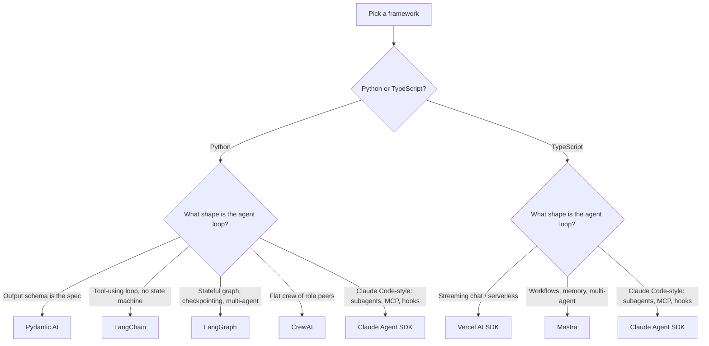

# Framework capability comparison

Hand-curated comparison across every framework documented in [`docs/frameworks/`](README.md). Each rating links to the section of the framework's own doc that backs it; this file does not introduce new claims.

## At a glance

- [**LangGraph**](langgraph.md) — explicit stateful graphs, durable checkpoints, multi-agent supervisors. The right answer when the agent loop has shape (branches, fan-out, resumable runs).
- [**LangChain**](langchain.md) — tool-rich agents without a state machine, plus the ecosystem (retrievers, history backends, LCEL chains). The right answer when the loop is straightforward and you want the integrations.
- [**Pydantic AI**](pydantic-ai.md) — minimal, typed single-agent. `result_type` is its differentiator. The right answer when the output schema is the spec.
- [**CrewAI**](crewai.md) — purpose-built for a flat crew of role-specialized peers. The right answer for "researcher + writer + reviewer" shapes.
- [**Claude Agent SDK**](claude-agent-sdk.md) — Anthropic's first-party Claude Code-style harness. Subagents, MCP hosting, lifecycle hooks. Two language packages on independent semver tracks.
- [**Mastra**](mastra.md) — TypeScript-first workflows + memory + multi-agent. Batteries-included for TS agents that need shape.
- [**Vercel AI SDK**](vercel-ai-sdk.md) — lightweight TS streaming agent. The right answer for serverless and chat UIs.

## Capability matrix

Cell values:

- **yes** — first-class API surface, no caveats.
- **partial** — works, but with a known awkward edge or via a community extension.
- **no** — not supported; pick a different framework or roll your own.
- **integration** — supported only via an external library that the framework consumes.

Every non-trivial cell links to the section of the per-framework doc that justifies the rating. Per-row rationale follows the matrix.

| Capability | LangGraph | LangChain | Pydantic AI | CrewAI | Claude Agent SDK | Mastra | Vercel AI SDK |
|---|---|---|---|---|---|---|---|
| Tool use (function calling) | [yes](langgraph.md#core-abstractions) | [yes](langchain.md#tools) | [yes](pydantic-ai.md#core-abstractions) | [yes](crewai.md#core-abstractions) | [yes](claude-agent-sdk.md#tools) | [yes](mastra.md#core-abstractions) | [yes](vercel-ai-sdk.md#core-abstractions) |
| Structured output (Pydantic / Zod) | [integration](langgraph.md#patterns-it-supports-well) | [yes](langchain.md#structured-output) | [yes](pydantic-ai.md#core-abstractions) | [partial](crewai.md#core-abstractions) | [partial](claude-agent-sdk.md#tools) | [yes](mastra.md#core-abstractions) | [yes](vercel-ai-sdk.md#core-abstractions) |
| Memory / message history | [yes](langgraph.md#core-abstractions) | [yes](langchain.md#memory) | [partial](pydantic-ai.md#patterns-where-its-awkward) | [yes](crewai.md#core-abstractions) | [partial](claude-agent-sdk.md#mental-model) | [yes](mastra.md#core-abstractions) | [partial](vercel-ai-sdk.md#core-abstractions) |
| Checkpointing / state persistence | [yes](langgraph.md#core-abstractions) | [no](langchain.md#anti-patterns) | [no](pydantic-ai.md#patterns-where-its-awkward) | [partial](crewai.md#core-abstractions) | [yes](claude-agent-sdk.md#mental-model) | [yes](mastra.md#core-abstractions) | [no](vercel-ai-sdk.md#core-abstractions) |
| Streaming (tokens) | [yes](langgraph.md#patterns-it-supports-well) | [yes](langchain.md#streaming) | [yes](pydantic-ai.md#core-abstractions) | [partial](crewai.md#trade-offs) | [yes](claude-agent-sdk.md#minimal-python-agent) | [yes](mastra.md#core-abstractions) | [yes](vercel-ai-sdk.md#core-abstractions) |
| Streaming (tool calls) | [yes](langgraph.md#patterns-it-supports-well) | [yes](langchain.md#streaming) | [yes](pydantic-ai.md#core-abstractions) | [partial](crewai.md#trade-offs) | [yes](claude-agent-sdk.md#minimal-python-agent) | [yes](mastra.md#core-abstractions) | [yes](vercel-ai-sdk.md#core-abstractions) |
| Multi-agent orchestration | [yes](langgraph.md#patterns-it-supports-well) | [no](langchain.md#anti-patterns) | [no](pydantic-ai.md#patterns-where-its-awkward) | [yes](crewai.md#patterns-it-supports-well) | [yes](claude-agent-sdk.md#subagents) | [yes](mastra.md#patterns-it-supports-well) | [no](vercel-ai-sdk.md#patterns-where-its-awkward) |
| Async / concurrency | [yes](langgraph.md#core-abstractions) | [yes](langchain.md#tools) | [yes](pydantic-ai.md#patterns-it-supports-well) | [yes](crewai.md#core-abstractions) | [yes](claude-agent-sdk.md#tools) | [yes](mastra.md#core-abstractions) | [yes](vercel-ai-sdk.md#core-abstractions) |
| Sync API | [yes](langgraph.md#core-abstractions) | [yes](langchain.md#minimal-agent) | [yes](pydantic-ai.md#idiomatic-minimal-example) | [yes](crewai.md#core-abstractions) | [partial](claude-agent-sdk.md#minimal-python-agent) | [no](mastra.md#trade-offs) | [no](vercel-ai-sdk.md#trade-offs) |
| Built-in observability | [partial](langgraph.md#strengths) | [yes](langchain.md#observability) | [yes](pydantic-ai.md#strengths) | [partial](crewai.md#strengths) | [partial](claude-agent-sdk.md#observability) | [partial](mastra.md#strengths) | [no](vercel-ai-sdk.md#trade-offs) |
| Built-in retries / backoff | [no](langgraph.md#trade-offs) | [yes](langchain.md#tools) | [no](pydantic-ai.md#trade-offs) | [partial](crewai.md#strengths) | [no](claude-agent-sdk.md#anti-patterns) | [yes](mastra.md#strengths) | [no](vercel-ai-sdk.md#trade-offs) |
| MCP support | [integration](langgraph.md#patterns-it-supports-well) | [integration](langchain.md#tools) | [integration](pydantic-ai.md#trade-offs) | [no](crewai.md#trade-offs) | [yes](claude-agent-sdk.md#mcp-server-hosting-and-consumption) | [yes](mastra.md#strengths) | [no](vercel-ai-sdk.md#trade-offs) |
| First-class TypeScript | [partial](langgraph.md#trade-offs) | [partial](langchain.md#composition-matrix) | [no](pydantic-ai.md#trade-offs) | [no](crewai.md#trade-offs) | [yes](claude-agent-sdk-typescript.md) | [yes](mastra.md#core-abstractions) | [yes](vercel-ai-sdk.md#core-abstractions) |

## Decision tree

GitHub renders the diagram inline. For a quick text-mode skim, use the per-track bullets in [`README.md`](README.md#how-to-pick-a-framework).

## When to mix

A few combinations come up often enough to call out:

- **Pydantic AI for typed extraction + LangGraph for orchestration.** Use Pydantic AI inside a node when a step needs a strict result schema; let LangGraph drive the multi-step flow. Lower invention than building one giant LangGraph with manual schema validation.
- **LangChain retriever + LangGraph state machine.** LangChain's `as_retriever()` returns a `Runnable` you can call from a LangGraph node. Reuses the ecosystem without inheriting LangChain's "one executor, no state" limitation.
- **Vercel AI SDK frontend + Mastra backend.** Vercel AI SDK on the chat UI side (token streaming, optimistic UI), Mastra-backed agents on the API side (workflows, memory, multi-agent). The shapes are complementary.
- **Claude Agent SDK + raw `anthropic` SDK in the same process.** Use the Agent SDK for the tool-use loop; drop into raw `anthropic.Anthropic().messages.create()` for one-shot completions where the loop is dead weight.

What not to mix: LangChain and LangGraph as peers (LangGraph already imports LangChain runnables — pick one as the orchestrator); two different agent SDKs in one workflow (re-implements the agent loop twice).

## Per-cell rationale

- **Tool use** — All seven support function calling natively. Variation in ergonomics, not capability.
- **Structured output** — Pydantic AI bakes `result_type` into the agent (the framework's pitch); LangChain has `with_structured_output`; Vercel AI SDK has `generateObject`; Mastra uses Zod schemas. LangGraph delegates to LangChain's wrapper. CrewAI supports `output_pydantic` per task but coverage is partial. Claude Agent SDK exposes JSON Schema through the `@tool` decorator but has no first-class "force this schema as final answer" primitive.
- **Memory** — LangGraph (checkpointer), LangChain (`RunnableWithMessageHistory`), CrewAI (memory module), Mastra (memory feature) ship batteries-included. Pydantic AI exposes a `message_history` parameter but the backend is the caller's problem. Claude Agent SDK has session resumption (not the same as a long-lived message history). Vercel AI SDK's `useChat` keeps history client-side; backend persistence is the caller's problem.
- **Checkpointing** — LangGraph's checkpointer is the differentiator. Claude Agent SDK supports session resumption, Mastra supports workflow state persistence. Everyone else punts to the caller.
- **Streaming (tokens)** — Universal in 2026; even CrewAI streams via its underlying LLM client, though `partial` reflects that the framework's higher-level surface buffers more than the others.
- **Streaming (tool calls)** — LangGraph (`astream_events`) and LangChain (`astream_events v2`) expose tool boundaries as typed events. Pydantic AI (`run_stream`) and Claude Agent SDK (`query()` async generator) yield tool-use blocks inline. Vercel AI SDK (`streamText` + tool deltas) and Mastra cover it. CrewAI's tool-call stream is harder to introspect from outside.
- **Multi-agent** — LangGraph (`langgraph-supervisor`), CrewAI (purpose-built), Claude Agent SDK (subagents), Mastra (workflows + agents) are first-class. LangChain, Pydantic AI, Vercel AI SDK can simulate it by hand but the abstraction collapses past two agents.
- **Async / concurrency** — Universal. All Python frameworks have first-class asyncio; all TS frameworks are async by default.
- **Sync API** — LangGraph (`invoke`), LangChain (`invoke`), Pydantic AI (`run_sync`), CrewAI all support sync entry points. Claude Agent SDK is async-first (`query()` is an async generator); a sync wrapper is possible but not the documented path. Mastra and Vercel AI SDK are async-only by design.
- **Built-in observability** — LangChain (Langfuse + OTel via callbacks) and Pydantic AI (Logfire native + OTel) are the strongest. LangGraph, CrewAI, Claude Agent SDK, Mastra expose hooks / callbacks but require wiring. Vercel AI SDK has no observability primitive — you instrument at the call site.
- **Built-in retries** — LangChain's `Runnable.with_retry(...)` and Mastra's workflow retry config are first-class. CrewAI has task-level retries. Everyone else punts to `tenacity` (Python) or a manual try-loop.
- **MCP support** — Claude Agent SDK and Mastra ship MCP as a first-class consumer surface. LangGraph, LangChain, Pydantic AI consume MCP servers via community adapter packages (`langchain-mcp-adapters`, `pydantic-ai-mcp`, etc.). CrewAI and Vercel AI SDK have no MCP path today.
- **First-class TypeScript** — Mastra and Vercel AI SDK are TS-native. Claude Agent SDK ships a TypeScript package at parity with the Python one. LangGraph and LangChain have TS ports that lag the Python releases by 1–2 minor versions. Pydantic AI and CrewAI are Python-only.

## Out of scope (kept here so reviewers don't ask)

- **Benchmark numbers.** Latency / cost / tool-selection accuracy are evaluator concerns, not capability concerns. See [`../cross-cutting/eval-data.md`](../cross-cutting/eval-data.md) for how to measure these per agent.
- **Auto-generated matrix.** This file is hand-curated. A future improvement: derive cells from per-framework frontmatter so the matrix can't drift from the source docs.
- **Non-Claude model coverage.** Every framework here speaks to multiple model providers; the matrix is scoped to the Claude path because that's what the recipes use. OpenAI / Gemini coverage is a separate research investment.
