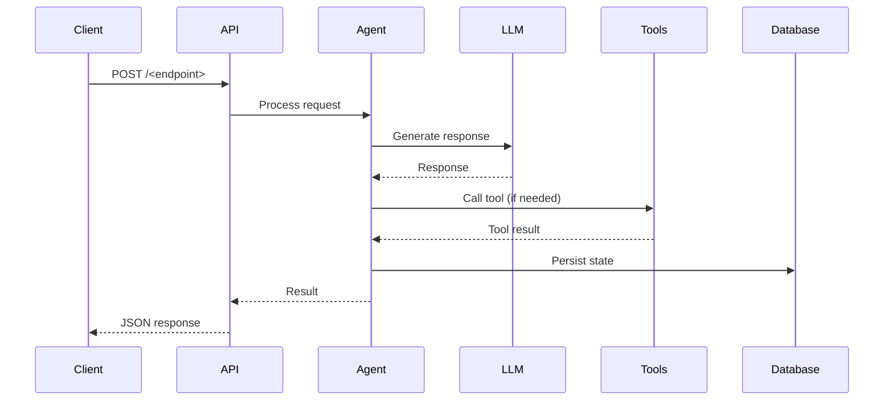

# Architecture — <prototype-name>

## Data flow

## Component overview

| Component | Responsibility |
|-----------|---------------|
| `app/main.py` / `src/index.ts` | API entrypoint, middleware setup |
| `app/agent/` / `src/agent/` | Agent graph/logic |
| `app/api/` / `src/api/` | Route handlers |
| `app/models/` / `src/schemas/` | Request/response schemas |
| `app/tools/` / `src/tools/` | Tool implementations |
| `app/db/` / `src/db/` | Database models and migrations |

## Decision log

| Decision | Rationale |
|----------|-----------|
| | |
