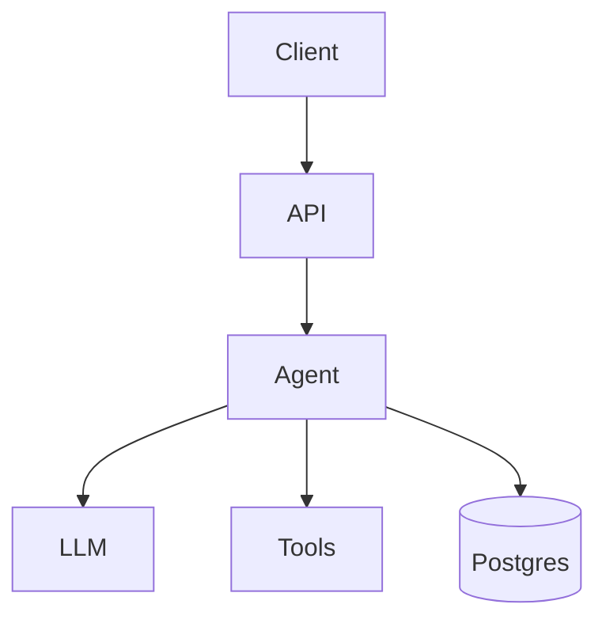

# <prototype-name>

<one-sentence description>

## Blueprint Map

- Overview: agent-blueprints/patterns/<pattern>/overview.md
- Design: agent-blueprints/patterns/<pattern>/design.md
- Implementation: agent-blueprints/patterns/<pattern>/implementation.md
<!-- - Evolution: agent-blueprints/patterns/<pattern>/evolution.md -->

## What this is

<problem statement, in readers' language>

## Stack

| Slot | Python | TypeScript |
|------|--------|------------|
| Agent framework | | |
| API layer | FastAPI | Hono |
| LLM | Claude Sonnet 4.6 | Claude Sonnet 4.6 |
| Tools | | |

Defaults match [`docs/stack.md`](../../docs/stack.md) unless noted above.

## Architecture



## Run it locally

```bash
cd prototypes/<prototype-name>/python   # or typescript
cp .env.example .env                    # add ANTHROPIC_API_KEY, ...
make up
curl localhost:8000/health
```

## API

### `POST /<endpoint>`

```bash
curl -X POST http://localhost:8000/<endpoint> \
  -H "Content-Type: application/json" \
  -H "Authorization: Bearer <token>" \
  -d '{"key": "value"}'
```

Response:
```json
{
  "result": "...",
  "trace_id": "..."
}
```

### `GET /health`

Returns `200 OK` when the service is ready.

## Observability

Traces visible at http://localhost:3000 (Langfuse).

Key spans to look for:
- `<span-name>` — <description>

## Evaluation

```bash
make eval PROTOTYPE=<prototype-name>
```

Current baseline on the bundled dataset:
- `<metric>`: `<value>`

## Swaps

See [docs/swaps.md](./docs/swaps.md) for documented alternatives.

## Python vs TypeScript — what we learned

<2-4 paragraphs comparing the two implementations>
