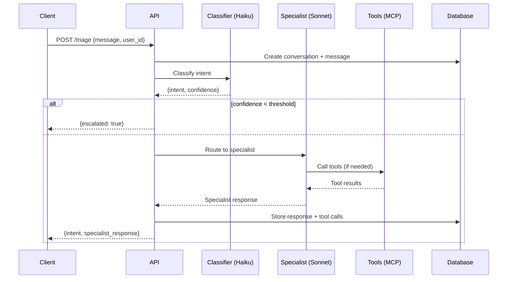

# Architecture — customer-support-triage

## Data flow

## Component overview

| Component | Responsibility |
|-----------|---------------|
| `app/main.py` / `src/index.ts` | API entrypoint, middleware (auth, rate limit, logging) |
| `app/agent/classifier.py` / `src/agent/classifier.ts` | Intent classification (Haiku) |
| `app/agent/specialists.py` / `src/agent/specialists.ts` | Per-intent specialist agents (Sonnet) |
| `app/api/triage.py` / `src/api/triage.ts` | Route handlers |
| `app/models/` / `src/schemas/` | Request/response + DB schemas |
| `app/tools/stripe.py` / `src/tools/stripe.ts` | Mock Stripe MCP client |
| `app/tools/kb.py` / `src/tools/kb.ts` | KB search via Qdrant |
| `app/db/` / `src/db/` | SQLAlchemy/Drizzle models, migrations |

## Decision log

| Decision | Rationale |
|----------|-----------|
| Haiku for classifier, Sonnet for specialists | Classification is a simple structured output — cheap/fast model suffices. Specialists need reasoning + tool use quality. |
| Confidence threshold for escalation | Prevents hallucinated responses when the model is unsure. Configurable via `ESCALATION_THRESHOLD` env var. |
| Mock Stripe MCP server | Real Stripe requires credentials and has side effects. Mock returns realistic responses for demo/eval purposes. |
| Qdrant for KB, not pgvector | Prototype exercises the full stack — separate vector DB demonstrates the common infra. |
