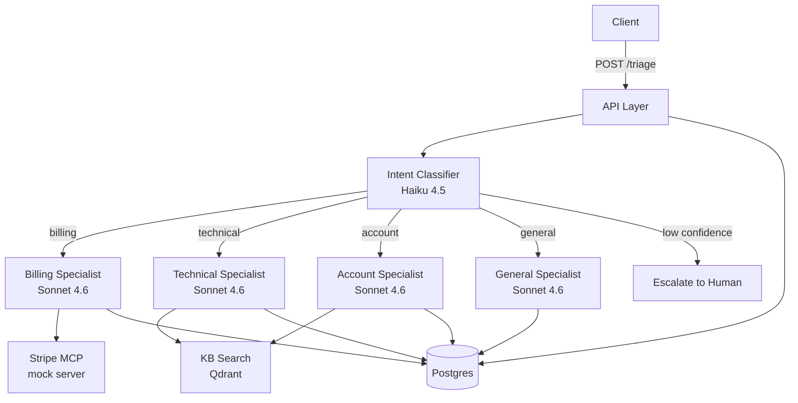

# customer-support-triage

Route incoming customer messages to the right specialist agent, resolve with the right tools, or escalate to a human.

## Blueprint Map

- Overview: [agent-blueprints/patterns/routing/overview.md](https://github.com/jagguvarma15/agent-blueprints/blob/main/patterns/routing/overview.md)
- Design: [agent-blueprints/patterns/routing/design.md](https://github.com/jagguvarma15/agent-blueprints/blob/main/patterns/routing/design.md)
- Implementation: [agent-blueprints/patterns/routing/implementation.md](https://github.com/jagguvarma15/agent-blueprints/blob/main/patterns/routing/implementation.md)
- Also uses: [agent-blueprints/patterns/tool-use/](https://github.com/jagguvarma15/agent-blueprints/tree/main/patterns/tool-use)
- Why Routing: [agent-blueprints/foundations/choosing-a-pattern.md](https://github.com/jagguvarma15/agent-blueprints/blob/main/foundations/choosing-a-pattern.md)

## What this is

A customer writes in: "I need to update my billing info." The system classifies the intent (billing, technical, account, general), routes to a specialist agent that has access to the right tools (Stripe for billing, internal KB for technical questions), and returns a structured resolution — or escalates to a human when confidence is low.

This is the **Routing + Tool Use** pattern: a lightweight classifier at the front, specialist agents behind it, each with scoped tool access.

## Stack

| Slot | Python | TypeScript |
|------|--------|------------|
| Agent framework | Pydantic AI | Mastra |
| API layer | FastAPI | Hono |
| Classifier LLM | Claude Haiku 4.5 | Claude Haiku 4.5 |
| Specialist LLM | Claude Sonnet 4.6 | Claude Sonnet 4.6 |
| Tools | Stripe MCP (mock), KB search (Qdrant) | Same |

All other defaults match [`docs/stack.md`](../../docs/stack.md).

## Architecture



## Run it locally

```bash
cd prototypes/customer-support-triage/python   # or typescript
cp .env.example .env                            # add ANTHROPIC_API_KEY
docker compose up --build
curl localhost:8000/health
```

## API

### `POST /triage`

```bash
curl -X POST http://localhost:8000/triage \
  -H "Content-Type: application/json" \
  -H "Authorization: Bearer <token>" \
  -d '{"message": "I need to update my billing info", "user_id": "user-1"}'
```

Response:
```json
{
  "conversation_id": "conv-abc123",
  "intent": "billing",
  "specialist_response": "I can help you update your billing information. ...",
  "escalated": false,
  "trace_id": "trace-xyz789"
}
```

### `GET /conversations/:id`

```bash
curl http://localhost:8000/conversations/conv-abc123 \
  -H "Authorization: Bearer <token>"
```

### `GET /health`

Returns `200 OK` when the service is ready.

## Observability

Traces visible at http://localhost:3000 (Langfuse).

Key spans to look for:
- `classify-intent` — the Haiku classification call
- `specialist-<intent>` — the Sonnet specialist response
- `tool-call-<name>` — each tool invocation (Stripe, KB search)

## Evaluation

```bash
make eval PROTOTYPE=customer-support-triage TRACK=python
```

Current baseline on the bundled dataset:
- Intent classification accuracy: target >= 90%
- Tool-call correctness: target >= 85%

## Swaps

See [docs/swaps.md](./docs/swaps.md) for documented alternatives.

## Python vs TypeScript — what we learned

*To be written after both tracks are implemented.*
