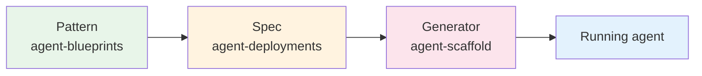
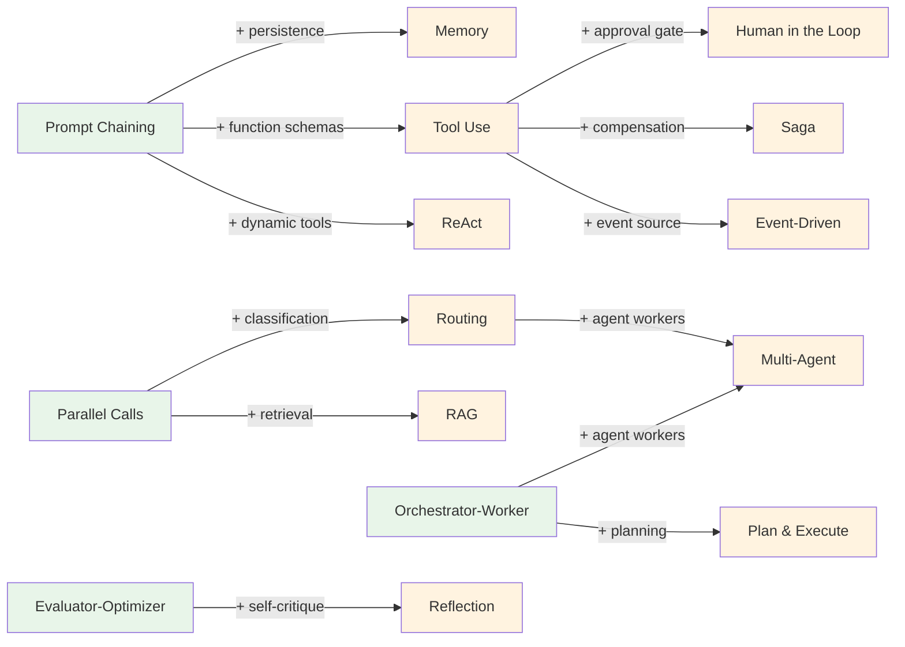

# Agent Blueprints

[](https://github.com/jagguvarma15/agent-blueprints/actions/workflows/docs.yml)
[](https://github.com/jagguvarma15/agent-blueprints/actions/workflows/catalog-drift.yml)
[](./LICENSE)
[](./foundations/README.md)
[](./meta/contributing.md)

**An architecture-first guide to designing LLM workflow and agent systems.**

---

This repository teaches you how to *think about and design* agent systems — before you write a single line of code. It covers both LLM workflows (where the developer controls the flow) and agent patterns (where the LLM controls the flow), with an explicit progression showing how one evolves into the other.

Every pattern is documented at three levels of depth. Read only what you need:
- **Overview** (Tier 1) — Architecture diagram, tradeoffs, when to use it. 1–2 pages.
- **Design** (Tier 2) — Component breakdown, data flow, error handling, scaling. 3–5 pages.
- **Implementation** (Tier 3) — Pseudocode, interfaces, testing strategy, pitfalls. 5–10 pages.

---

## For AI tools

If you're an AI tool (Claude Code, Cursor, GitHub Copilot, agent-scaffold, …) reading this repo, start here:

- [`llms.txt`](./llms.txt) — minimal AI-tool discovery file ([llmstxt.org](https://llmstxt.org/) spec).
- [`agents.md`](./agents.md) — how to programmatically consume the catalog (entry shapes, tier file conventions, pinning to a version).
- [`patterns-catalog.yaml`](./patterns-catalog.yaml) — canonical machine-readable index. Schema in [`PATTERNS_CATALOG_SCHEMA.md`](./PATTERNS_CATALOG_SCHEMA.md).
- [`meta/HOW_TO_ADD_AN_ENTRY.md`](./meta/HOW_TO_ADD_AN_ENTRY.md) — contributor walkthrough, including AI-tool prompts.

---

## The three-repo ecosystem

This repo is the first stop in a three-repo pipeline that takes you from pattern to running agent:



- **[agent-blueprints](https://github.com/jagguvarma15/agent-blueprints)** *(this repo)* — framework-agnostic *cognitive* patterns, tradeoffs, and design guidance. Start here if you want to design before you build.
- **[agent-deployments](https://github.com/jagguvarma15/agent-deployments)** — opinionated, production-shaped markdown specs for ten concrete agents (Python + TypeScript tracks), plus the *reliability/ops* layer (auth, rate limiting, retries, idempotency, distributed tracing, observability) that every agent inherits.
- **[agent-scaffold](https://github.com/jagguvarma15/agent-scaffold)** — a CLI that consumes a deployment spec, asks Claude to emit a complete project, and writes the files atomically to disk.

> **Boundary:** cognitive patterns (how the agent thinks) live here; operational patterns (how the agent survives production) live in `agent-deployments`. See [System Design Heritage](./foundations/system-design-heritage.md) for the full mapping.

### From pattern to running agent

- **[Blueprints → Deployments](./composition/blueprints-to-deployments.md)** — which deployment recipes use which patterns, and what every recipe inherits from the operational layer.
- **[Blueprint → Spec → Scaffold](./composition/blueprint-to-spec-to-scaffold.md)** — end-to-end walkthrough on one concrete agent (Research Assistant).
- **[`patterns-catalog.yaml`](./patterns-catalog.yaml)** — machine-readable index aggregating every pattern + workflow + composition edge. Consumed by `agent-deployments` CI; regenerate via `node meta/validate-metadata.js --emit patterns-catalog.yaml`. See [`PATTERNS_CATALOG_SCHEMA.md`](./PATTERNS_CATALOG_SCHEMA.md).

---

## Start Here

| If You... | Read This |
|-----------|-----------|
| Are new to LLM systems | [Foundations](./foundations/README.md) — concepts, terminology, mental models |
| Need to pick a pattern | [Choosing a Pattern](./foundations/choosing-a-pattern.md) — decision flowchart |
| Want structured LLM pipelines | [Workflows](./workflows/README.md) — 4 pre-agent patterns |
| Want autonomous LLM behavior | [Agent Patterns](./patterns/README.md) — <!-- AUTO:count cohort=patterns filter=category:agent -->10<!-- /AUTO --> agent architectures |
| Are designing a production system | [Composition](./composition/README.md) — how patterns combine |
| Want a production-shaped agent | [Blueprints → Deployments](./composition/blueprints-to-deployments.md) — which patterns power which deployments |
| Want to generate a starter project | [Blueprint → Spec → Scaffold](./composition/blueprint-to-spec-to-scaffold.md) — end-to-end walkthrough |
| Are building a reactive system on a queue or stream | [Event-Driven Agents](./patterns/event_driven/overview.md) — async triggers, idempotency, DLQ |
| Want to avoid common mistakes | [Anti-Patterns](./foundations/anti-patterns.md) — what not to build |
| Need to test your agent system | [Testing Strategies](./foundations/testing-strategies.md) — mock LLMs, evaluation, regression |

## Workflow Patterns

Workflows are orchestrated patterns where **the code controls the flow**. The developer defines the structure; the LLM fills in the content.

<!-- AUTO:cohort-table cohort=patterns filter=category:workflow style=tiers base=./ -->
| Pattern | What It Does | Overview | Design | Implementation |
|---|---|---|---|---|
| **Evaluator-Optimizer** | Generate-evaluate feedback loop that iteratively improves output. | [overview](./patterns/evaluator-optimizer/overview.md) | [design](./patterns/evaluator-optimizer/design.md) | [impl](./patterns/evaluator-optimizer/implementation.md) |
| **Orchestrator-Worker** | LLM decomposes a task and delegates to specialized workers. | [overview](./patterns/orchestrator-worker/overview.md) | [design](./patterns/orchestrator-worker/design.md) | [impl](./patterns/orchestrator-worker/implementation.md) |
| **Parallel Calls** | Concurrent LLM calls on independent inputs, aggregated at the end. | [overview](./patterns/parallel-calls/overview.md) | [design](./patterns/parallel-calls/design.md) | [impl](./patterns/parallel-calls/implementation.md) |
| **Prompt Chaining** | Sequential LLM calls with validation gates between steps. | [overview](./patterns/prompt-chaining/overview.md) | [design](./patterns/prompt-chaining/design.md) | [impl](./patterns/prompt-chaining/implementation.md) |
<!-- /AUTO -->

## Agent Patterns

Agents are systems where **the LLM controls the flow**. The developer provides tools and constraints; the LLM decides what to do.

<!-- AUTO:cohort-table cohort=patterns filter=category:agent style=tiers base=./ -->
| Pattern | What It Does | Evolves From | Overview | Design | Implementation |
|---|---|---|---|---|---|
| **Agentic RAG** | RAG where the agent plans retrievals, decomposes queries, routes across sources, reflects on sufficiency, and enforces citation-bound answers. | RAG, Plan & Execute | [overview](./patterns/agentic_rag/overview.md) | [design](./patterns/agentic_rag/design.md) | [impl](./patterns/agentic_rag/implementation.md) |
| **Event-Driven** | Agents triggered by queue or stream events rather than HTTP requests. | Tool Use | [overview](./patterns/event_driven/overview.md) | [design](./patterns/event_driven/design.md) | [impl](./patterns/event_driven/implementation.md) |
| **Long-Horizon** | Multi-session agent tasks that span hours to weeks; checkpoint-and-resume across crashes, deploys, and external waits. | Saga, Event-Driven | [overview](./patterns/long_horizon/overview.md) | [design](./patterns/long_horizon/design.md) | [impl](./patterns/long_horizon/implementation.md) |
| **Multi-Agent** | Supervisor-worker delegation across multiple autonomous agents. | Orchestrator-Worker, Routing | [overview](./patterns/multi_agent/overview.md) | [design](./patterns/multi_agent/design.md) | [impl](./patterns/multi_agent/implementation.md) |
| **Plan & Execute** | LLM creates a full plan upfront, then executes each step sequentially. | Orchestrator-Worker | [overview](./patterns/plan_and_execute/overview.md) | [design](./patterns/plan_and_execute/design.md) | [impl](./patterns/plan_and_execute/implementation.md) |
| **RAG** | Retrieval-augmented generation: retrieve relevant context before generating. | Parallel Calls | [overview](./patterns/rag/overview.md) | [design](./patterns/rag/design.md) | [impl](./patterns/rag/implementation.md) |
| **ReAct** | Reason-act loop: the LLM reasons, calls a tool, observes, and repeats until done. | Prompt Chaining | [overview](./patterns/react/overview.md) | [design](./patterns/react/design.md) | [impl](./patterns/react/implementation.md) |
| **Reflection** | LLM critiques its own output and self-improves through structured feedback. | Evaluator-Optimizer | [overview](./patterns/reflection/overview.md) | [design](./patterns/reflection/design.md) | [impl](./patterns/reflection/implementation.md) |
| **Routing** | Intent classification dispatches inputs to specialized handlers. | Parallel Calls | [overview](./patterns/routing/overview.md) | [design](./patterns/routing/design.md) | [impl](./patterns/routing/implementation.md) |
| **Saga** | Long-running, multi-step business processes that need compensation when an intermediate step fails. | Tool Use, Prompt Chaining | [overview](./patterns/saga/overview.md) | [design](./patterns/saga/design.md) | [impl](./patterns/saga/implementation.md) |
<!-- /AUTO -->

## Primitives

Primitives are building blocks the agent uses orthogonally to any pattern. Picking primitives is the second of three decisions (pattern → primitives → modifiers) when designing an agent.

<!-- AUTO:cohort-table cohort=primitives style=tiers base=./ -->
| Pattern | What It Does | Evolves From | Overview | Design | Implementation |
|---|---|---|---|---|---|
| **Memory** | Persistent state across sessions: short-term, long-term, and semantic memory. | Prompt Chaining | [overview](./primitives/memory/overview.md) | [design](./primitives/memory/design.md) | [impl](./primitives/memory/implementation.md) |
| **Skills** | File-based, agent-discovered procedural modules. Cheap to ship many; loaded on demand at runtime. | Tool Use | [overview](./primitives/skills/overview.md) | [design](./primitives/skills/design.md) | [impl](./primitives/skills/implementation.md) |
| **Sub-agents** | Named, role-scoped agent instances spawned by a parent for delimited tasks; each has its own context window, tool grants, and (optionally) model. | Tool Use | [overview](./primitives/sub_agents/overview.md) | [design](./primitives/sub_agents/design.md) | [impl](./primitives/sub_agents/implementation.md) |
| **Tool Use** | Structured function calling with schema-validated tool dispatch. | Prompt Chaining | [overview](./primitives/tool_use/overview.md) | [design](./primitives/tool_use/design.md) | [impl](./primitives/tool_use/implementation.md) |
<!-- /AUTO -->

## Modifiers

Modifiers wrap a chosen pattern with a transformation (gates, overlays). Picking modifiers is the third decision.

<!-- AUTO:cohort-table cohort=modifiers style=tiers base=./ -->
| Pattern | What It Does | Evolves From | Overview | Design | Implementation |
|---|---|---|---|---|---|
| **Guardrails** | Layered input / tool / output policy checks plus a dual-LLM split that breaks the indirect-prompt-injection path. | Tool Use | [overview](./modifiers/guardrails/overview.md) | [design](./modifiers/guardrails/design.md) | [impl](./modifiers/guardrails/implementation.md) |
| **Human in the Loop** | Agent proposes an action; a human approves, denies, or modifies before the action commits. | Tool Use | [overview](./modifiers/human_in_the_loop/overview.md) | [design](./modifiers/human_in_the_loop/design.md) | [impl](./modifiers/human_in_the_loop/implementation.md) |
<!-- /AUTO -->

## How Workflows Become Agents

Each agent pattern evolves from a workflow. When a workflow's conditional logic becomes too complex, it's time to let the LLM make those decisions.



Each agent pattern includes an [evolution.md](./patterns/react/evolution.md) document that traces this bridge in detail.

## Repository Structure

```
agent-blueprints/
├── foundations/          # Core concepts, terminology, pattern selection
├── patterns/             # Flow shapes: agent (LLM-controlled) + workflow
│                           (code-controlled), split by the `category` field
├── primitives/           # Building blocks the agent uses
│                           (tool_use, memory, skills, sub_agents)
├── modifiers/            # Transformations layered on a pattern
│                           (guardrails, human_in_the_loop)
├── composition/          # How patterns + primitives + modifiers combine
├── meta/                 # Contributing, style guide, roadmap
└── code/                 # Reference implementations under
                            patterns/*/code/, primitives/*/code/, modifiers/*/code/
```

> **Three-tier taxonomy.** Picking an agent shape is three orthogonal decisions: one pattern + N primitives + N modifiers. See [`foundations/choosing-a-pattern.md`](./foundations/choosing-a-pattern.md) for the picker. The machine-readable index is [`patterns-catalog.yaml`](./patterns-catalog.yaml) (schema v2).

## Design Principles

1. **Architecture-first** — Teach readers to design before they build
2. **3-tier depth** — Overview → Design → Implementation. Read only what you need.
3. **Pattern + primitives + modifiers** — Three orthogonal decisions, not one. Patterns describe flow shape; primitives are building blocks; modifiers are transforms layered on top.
4. **Workflows → Agents** — Workflows (code-controlled flow) are the foundation; agent patterns (LLM-controlled flow) build on them. Both live in `patterns/` distinguished by category.
5. **Generalized, not use-case-bound** — Patterns are abstract and composable.
6. **Framework-agnostic** — No provider lock-in. The LLM is a swappable layer.

## Contributing

See the [Contributing Guide](./meta/contributing.md) and [Style Guide](./meta/style-guide.md).

## Roadmap

The knowledge base, framework-agnostic Python and TypeScript reference implementations for every pattern, and the documentation website are delivered. Advanced patterns and scaffolding tooling are ongoing — see the [full roadmap](./ROADMAP.md).

## License

Released under the [MIT License](./LICENSE). Copyright (c) 2026 Jagadesh Varma Nadimpalli.
