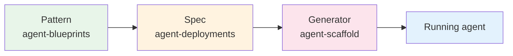
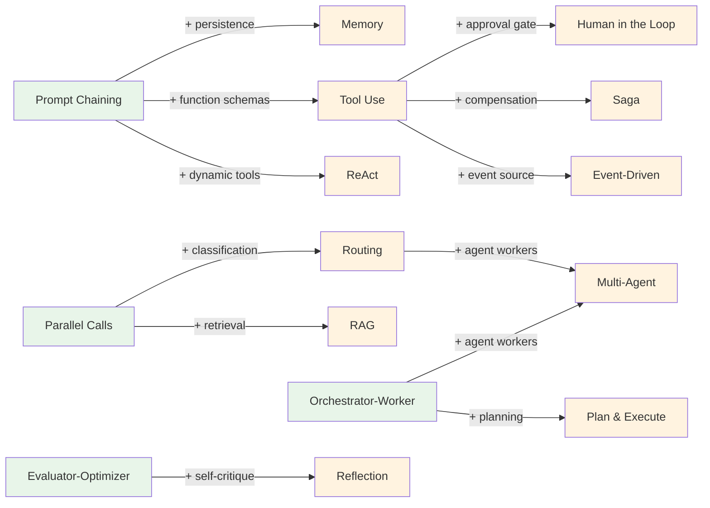

# Agent Blueprints

[](https://github.com/jagguvarma15/agent-blueprints/actions/workflows/docs.yml)
[](https://github.com/jagguvarma15/agent-blueprints/actions/workflows/catalog-drift.yml)
[](./LICENSE)
[](./foundations/README.md)
[](./meta/contributing.md)

**An architecture-first guide to designing LLM workflow and agent systems.**

---

This repository teaches you how to *think about and design* agent systems — before you write a single line of code. It covers both LLM workflows (where the developer controls the flow) and agent patterns (where the LLM controls the flow), with an explicit progression showing how one evolves into the other.

Every pattern is documented at three levels of depth. Read only what you need:
- **Overview** (Tier 1) — Architecture diagram, tradeoffs, when to use it. 1–2 pages.
- **Design** (Tier 2) — Component breakdown, data flow, error handling, scaling. 3–5 pages.
- **Implementation** (Tier 3) — Pseudocode, interfaces, testing strategy, pitfalls. 5–10 pages.

---

## The three-repo ecosystem

This repo is the first stop in a three-repo pipeline that takes you from pattern to running agent:



- **[agent-blueprints](https://github.com/jagguvarma15/agent-blueprints)** *(this repo)* — framework-agnostic *cognitive* patterns, tradeoffs, and design guidance. Start here if you want to design before you build.
- **[agent-deployments](https://github.com/jagguvarma15/agent-deployments)** — opinionated, production-shaped markdown specs for ten concrete agents (Python + TypeScript tracks), plus the *reliability/ops* layer (auth, rate limiting, retries, idempotency, distributed tracing, observability) that every agent inherits.
- **[agent-scaffold](https://github.com/jagguvarma15/agent-scaffold)** — a CLI that consumes a deployment spec, asks Claude to emit a complete project, and writes the files atomically to disk.

> **Boundary:** cognitive patterns (how the agent thinks) live here; operational patterns (how the agent survives production) live in `agent-deployments`. See [System Design Heritage](./foundations/system-design-heritage.md) for the full mapping.

### From pattern to running agent

- **[Blueprints → Deployments](./composition/blueprints-to-deployments.md)** — which deployment recipes use which patterns, and what every recipe inherits from the operational layer.
- **[Blueprint → Spec → Scaffold](./composition/blueprint-to-spec-to-scaffold.md)** — end-to-end walkthrough on one concrete agent (Research Assistant).
- **[`patterns-catalog.yaml`](./patterns-catalog.yaml)** — machine-readable index aggregating every pattern + workflow + composition edge. Consumed by `agent-deployments` CI; regenerate via `node meta/validate-metadata.js --emit patterns-catalog.yaml`. See [`PATTERNS_CATALOG_SCHEMA.md`](./PATTERNS_CATALOG_SCHEMA.md).

---

## Start Here

| If You... | Read This |
|-----------|-----------|
| Are new to LLM systems | [Foundations](./foundations/README.md) — concepts, terminology, mental models |
| Need to pick a pattern | [Choosing a Pattern](./foundations/choosing-a-pattern.md) — decision flowchart |
| Want structured LLM pipelines | [Workflows](./workflows/README.md) — 4 pre-agent patterns |
| Want autonomous LLM behavior | [Agent Patterns](./patterns/README.md) — 11 agent architectures |
| Are designing a production system | [Composition](./composition/README.md) — how patterns combine |
| Want a production-shaped agent | [Blueprints → Deployments](./composition/blueprints-to-deployments.md) — which patterns power which deployments |
| Want to generate a starter project | [Blueprint → Spec → Scaffold](./composition/blueprint-to-spec-to-scaffold.md) — end-to-end walkthrough |
| Are building a reactive system on a queue or stream | [Event-Driven Agents](./patterns/event_driven/overview.md) — async triggers, idempotency, DLQ |
| Want to avoid common mistakes | [Anti-Patterns](./foundations/anti-patterns.md) — what not to build |
| Need to test your agent system | [Testing Strategies](./foundations/testing-strategies.md) — mock LLMs, evaluation, regression |

## Workflow Patterns

Workflows are orchestrated patterns where **the code controls the flow**. The developer defines the structure; the LLM fills in the content.

| Pattern | What It Does | Overview | Design | Implementation |
|---------|-------------|----------|--------|----------------|
| **Prompt Chaining** | Sequential LLM calls with validation gates | [overview](./workflows/prompt-chaining/overview.md) | [design](./workflows/prompt-chaining/design.md) | [implementation](./workflows/prompt-chaining/implementation.md) |
| **Parallel Calls** | Concurrent LLM calls on independent inputs | [overview](./workflows/parallel-calls/overview.md) | [design](./workflows/parallel-calls/design.md) | [implementation](./workflows/parallel-calls/implementation.md) |
| **Orchestrator-Worker** | LLM decomposes task, delegates to workers | [overview](./workflows/orchestrator-worker/overview.md) | [design](./workflows/orchestrator-worker/design.md) | [implementation](./workflows/orchestrator-worker/implementation.md) |
| **Evaluator-Optimizer** | Generate-evaluate feedback loop | [overview](./workflows/evaluator-optimizer/overview.md) | [design](./workflows/evaluator-optimizer/design.md) | [implementation](./workflows/evaluator-optimizer/implementation.md) |

## Agent Patterns

Agents are systems where **the LLM controls the flow**. The developer provides tools and constraints; the LLM decides what to do.

| Pattern | What It Does | Evolves From | Overview | Design | Implementation |
|---------|-------------|-------------|----------|--------|----------------|
| **ReAct** | Reason-act loop with tools | Prompt Chaining | [overview](./patterns/react/overview.md) | [design](./patterns/react/design.md) | [impl](./patterns/react/implementation.md) |
| **Plan & Execute** | Plan first, then execute steps | Orchestrator-Worker | [overview](./patterns/plan_and_execute/overview.md) | [design](./patterns/plan_and_execute/design.md) | [impl](./patterns/plan_and_execute/implementation.md) |
| **Tool Use** | Structured function calling | Prompt Chaining | [overview](./patterns/tool_use/overview.md) | [design](./patterns/tool_use/design.md) | [impl](./patterns/tool_use/implementation.md) |
| **Memory** | Persistent state across sessions | Prompt Chaining | [overview](./patterns/memory/overview.md) | [design](./patterns/memory/design.md) | [impl](./patterns/memory/implementation.md) |
| **RAG** | Retrieval-augmented generation | Parallel Calls | [overview](./patterns/rag/overview.md) | [design](./patterns/rag/design.md) | [impl](./patterns/rag/implementation.md) |
| **Reflection** | Self-critique and refinement | Evaluator-Optimizer | [overview](./patterns/reflection/overview.md) | [design](./patterns/reflection/design.md) | [impl](./patterns/reflection/implementation.md) |
| **Routing** | Intent classification + dispatch | Parallel Calls | [overview](./patterns/routing/overview.md) | [design](./patterns/routing/design.md) | [impl](./patterns/routing/implementation.md) |
| **Multi-Agent** | Supervisor-worker delegation | Orchestrator-Worker + Routing | [overview](./patterns/multi_agent/overview.md) | [design](./patterns/multi_agent/design.md) | [impl](./patterns/multi_agent/implementation.md) |
| **Event-Driven** | Agents triggered by stream/queue events | Tool Use | [overview](./patterns/event_driven/overview.md) | [design](./patterns/event_driven/design.md) | [impl](./patterns/event_driven/implementation.md) |
| **Saga** | Long-running multi-step processes with compensation | Tool Use + Prompt Chaining | [overview](./patterns/saga/overview.md) | [design](./patterns/saga/design.md) | [impl](./patterns/saga/implementation.md) |
| **Human in the Loop** | Agent proposes, human approves before commit | Tool Use | [overview](./patterns/human_in_the_loop/overview.md) | [design](./patterns/human_in_the_loop/design.md) | [impl](./patterns/human_in_the_loop/implementation.md) |

## How Workflows Become Agents

Each agent pattern evolves from a workflow. When a workflow's conditional logic becomes too complex, it's time to let the LLM make those decisions.



Each agent pattern includes an [evolution.md](./patterns/react/evolution.md) document that traces this bridge in detail.

## Repository Structure

```
agent-blueprints/
├── foundations/          # Core concepts, terminology, pattern selection
├── workflows/           # 4 pre-agent workflow patterns (3 tiers each)
├── patterns/            # 11 agent patterns (3 tiers + evolution bridge each)
├── composition/         # How patterns combine into production systems
├── meta/                # Contributing, style guide, roadmap
└── code/                # Reference implementations (per-pattern under patterns/*/code/ and workflows/*/code/)
```

## Design Principles

1. **Architecture-first** — Teach readers to design before they build
2. **3-tier depth** — Overview → Design → Implementation. Read only what you need.
3. **Workflows → Agents** — Workflows are the foundation. Agents build on them.
4. **Generalized, not use-case-bound** — Patterns are abstract and composable
5. **Framework-agnostic** — No provider lock-in. The LLM is a swappable layer.

## Contributing

See the [Contributing Guide](./meta/contributing.md) and [Style Guide](./meta/style-guide.md).

## Roadmap

This is Phase 1 (documentation). Code implementations, advanced patterns, and tooling are planned for future phases. See the [full roadmap](./meta/roadmap.md).

## License

Released under the [MIT License](./LICENSE). Copyright (c) 2026 Jagadesh Varma Nadimpalli.
