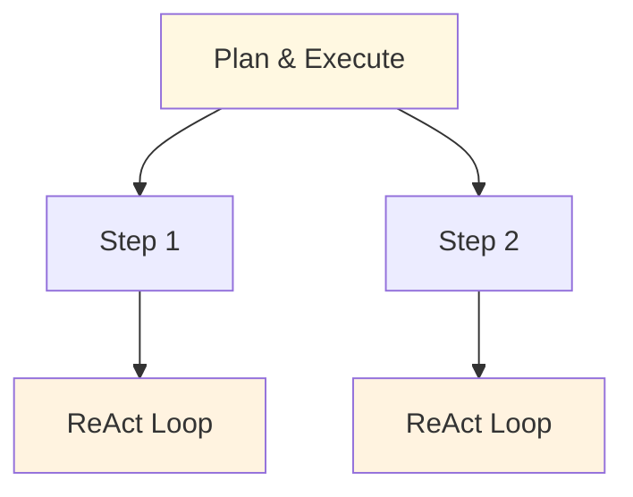

# Composition

Patterns are building blocks. Production systems combine them. This section covers how to compose patterns into complete systems — which combinations work well, which create problems, and how to think about composition as an architectural practice.

## Why Compose?

No single pattern handles every requirement. A real-world system might need:
- External knowledge (RAG) + adaptive reasoning (ReAct) + quality assurance (Reflection)
- Task decomposition (Plan & Execute) + specialized execution (Multi-Agent) + context persistence (Memory)

Composition lets you match the complexity of your system to the complexity of your problem — no more, no less.

## Composition Principles

### 1. Start Simple, Compose as Needed
Begin with the simplest pattern that could work. Add patterns only when you hit a specific limitation that a new pattern addresses.

### 2. Each Pattern Solves One Problem
When composing, each pattern should address a distinct need. If two patterns address the same need, you likely only need one.

### 3. Composition Points Are Interfaces
Patterns connect through well-defined interfaces: message histories, tool call results, shared state stores, or function calls. Design these interfaces explicitly.

### 4. Test Composed Systems End-to-End
Unit testing each pattern independently isn't enough. Integration tests must verify that patterns compose correctly — that data flows, state is shared, and error propagation works across pattern boundaries.

## Composition Methods

### Nesting
One pattern runs inside another. Example: each step of a Plan & Execute agent runs a ReAct loop.

### Chaining
Output of one pattern feeds input of another. Example: Routing classifies the input, then the selected handler runs a RAG pipeline.

### Layering
One pattern wraps another. Example: Reflection wraps a ReAct agent — after the agent produces output, reflection evaluates and potentially reruns it.

### Sharing
Multiple patterns share a resource. Example: RAG and Memory both use the same vector store — one side writes documents, the other writes interaction history.

## In This Section

- **[Combination Matrix](./combination-matrix.md)** — Which patterns pair well, which conflict, and why
- **[Anti-Compositions](./anti-compositions.md)** — Pattern pairs that fight, overlap, or leak state, with concrete what-to-use-instead guidance
- **[Reference Architectures](./reference-architectures.md)** — Example composed systems for common use cases
- **[Blueprints → Deployments](./blueprints-to-deployments.md)** — Which deployment recipes in `agent-deployments` use which patterns
- **[Blueprint → Spec → Scaffold](./blueprint-to-spec-to-scaffold.md)** — End-to-end walkthrough of the pattern → spec → generated project lifecycle
