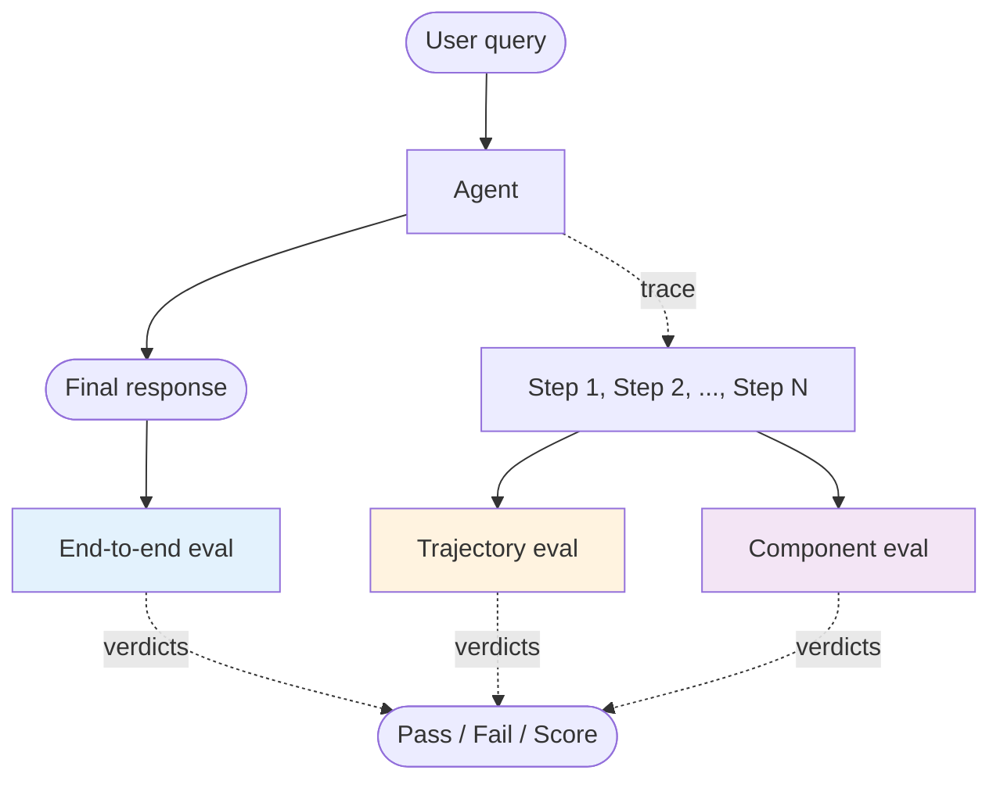
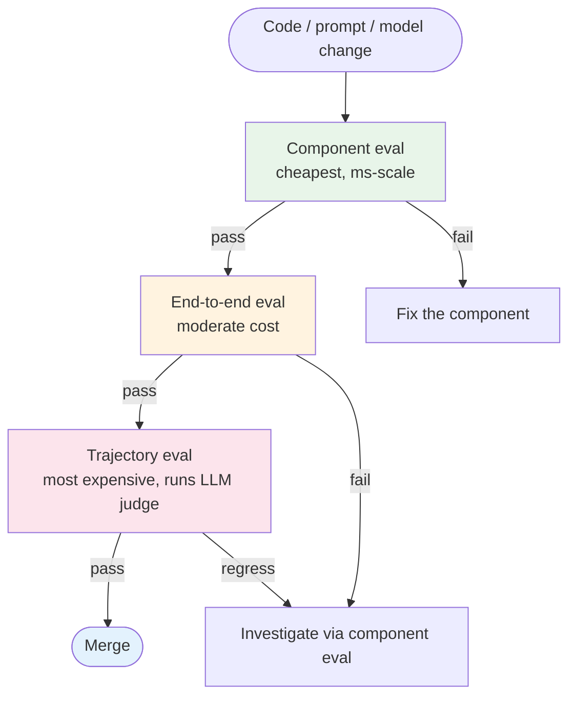

# Agentic Eval Pipeline

Evaluating agents is not the same as evaluating LLM completions. An agent that produces a correct final answer through reckless tool use is still a production failure. An agent that fails on a single edge case but degrades gracefully is fine. This document is the cognitive case for **three eval surfaces** — end-to-end, trajectory, and component — and how they compose into a pipeline that catches regressions without choking on noise.

It's framework-agnostic. The mapping to specific harnesses (DeepEval, Promptfoo, RAGAS, Langfuse Evals) lives in [`agent-deployments/docs/cross-cutting/testing-strategy.md`](https://github.com/jagguvarma15/agent-deployments/blob/main/docs/cross-cutting/testing-strategy.md) and the matching `eval/*` capability docs.

## Why three surfaces

A single eval that grades only the final answer hides too much. A single eval that grades every step drowns in noise. Production agent teams have converged on three layers, each answering a different question:

| Surface | Question | Failure looks like |
|---|---|---|
| **End-to-end** | Did the user get the right answer? | Wrong / empty / unsafe response. |
| **Trajectory** | Was the path the agent took sound? | Right answer through 30 wasted tool calls; right answer through a forbidden tool; right answer with hallucinated reasoning. |
| **Component** | Which internal step is broken? | Retriever returned wrong docs; classifier picked wrong route; tool returned malformed JSON. |

A useful pipeline runs all three. End-to-end is the production gate; trajectory is the regression guard; component is the debugging surface.

## Surface 1 — End-to-end eval

**Input:** the user query + the agent's final response.
**Output:** a score (binary pass/fail or graded) per query.

This is the bluntest signal: did the user get what they needed? It's the only surface that maps cleanly to product KPIs. It's also the surface most likely to be wrong about *why* a regression happened — a fail might be a retriever bug, a classifier bug, a generation bug, or a prompt regression.

### Grader choices

End-to-end evals can be graded by:

- **Code-based check** (cheap, deterministic). Suitable when the answer is structured: tool was called, output JSON matches a schema, contains required fields. Use whenever you can.
- **Reference match** (cheap, requires golden answers). Compare against a known-good output via exact match, fuzzy match, or embedding similarity.
- **LLM-as-judge** (flexible, expensive, requires calibration). A separate stronger LLM reads the query, the agent's answer, an optional rubric, and emits a score plus a rationale. Necessary when the answer space is open-ended (research summaries, conversational replies); risky when the judge model overlaps too much with the agent model.

Most production pipelines use all three: code-based for structural checks, reference match for known queries, LLM-as-judge for open-ended ones.

### Calibration matters

LLM judges drift. A pipeline that trusts an uncalibrated judge will silently rotate its definition of "correct" as models change. Calibration:

- Periodically (monthly is typical) sample N judge verdicts and have humans grade them. Compute agreement.
- Track agreement over time. A drop below ~80% triggers a rubric refresh or a judge model change.
- Document the judge model + the rubric in the eval suite's metadata so changes are auditable.

## Surface 2 — Trajectory eval

**Input:** the full sequence of steps the agent took (tool calls, intermediate reasoning, observations).
**Output:** a score per trajectory + structured findings (which step was off).

Trajectory eval is what makes agent eval different from LLM eval. A correct final answer is not enough — the path matters because the path costs money, the path can be unsafe, and the path is what regresses subtly when prompts or models change.

### What trajectory eval scores

- **Tool selection.** Did the agent pick the right tool at each step? Did it call any forbidden tools?
- **Tool order.** Were dependencies respected? Did the agent retrieve before generating?
- **Tool argument quality.** Were calls well-formed? Was the agent passing recoverable data structures or hallucinated content?
- **Step efficiency.** How many steps did the trajectory take versus a known-good baseline? An agent that solves a 3-step task in 20 steps is technically passing but practically failing the cost SLO.
- **Loop detection.** Did the agent enter a Think → Act → Observe → Think → same Act loop? This is one of the most common ReAct failure modes; trajectory eval is where it gets caught.
- **Plan adherence.** For [Plan & Execute](../patterns/plan_and_execute/overview.md) recipes — did the executed steps follow the plan? Were re-plans warranted?

### Rubric design

Trajectory rubrics are recipe-specific. A trajectory rubric for a [`RAG`](../patterns/rag/overview.md) agent emphasizes retrieval quality and grounding; a rubric for a [`research-assistant` ReAct](../patterns/react/overview.md) agent emphasizes step efficiency and citation discipline. The rubric lives with the recipe, not the eval framework.

The rubric should answer:

1. What's the maximum acceptable step count for this task class?
2. What's the canonical tool-call sequence for the happy path?
3. What tools should never be called for this task class?
4. What signals (e.g., "the agent tried the same tool 3 times with same args") flag a stuck loop?

### Why trajectory eval is the regression guard

End-to-end can pass while trajectory regresses badly. A model upgrade might preserve final-answer quality while doubling the number of tool calls. A prompt tweak might make the agent more conservative — answers are still right, but it now refuses to use tools it should use. Trajectory eval is the surface that catches *quality-of-process* drift.

## Surface 3 — Component eval

**Input:** isolated invocations of internal pieces (retriever, classifier, single-prompt-call, individual tool).
**Output:** a score per component + golden dataset per component.

When end-to-end fails or trajectory regresses, component eval is the debugging surface. It asks: of the moving parts inside this agent, which one is broken in isolation?

### What gets a component eval

A component is worth a dedicated eval suite when:

- It has a measurable contract you can isolate (retriever: query → ranked docs; classifier: text → label).
- It changes more often than the recipe shape (you tune the retriever weekly; you change the recipe monthly).
- Its failure mode is hard to attribute from trajectory data alone.

Common component evals:

| Component | Golden dataset shape | Metrics |
|---|---|---|
| Retriever | (query, list[doc_id]) | Recall@k, MRR, nDCG. |
| Reranker | (query, list[doc], list[doc] reranked) | Win rate vs. baseline; nDCG lift. |
| Classifier / router | (input, expected_label) | Accuracy, per-class precision/recall. |
| Tool wrapper | (input args, expected response) | Match rate; error rate. |
| Prompt template | (input, expected fields in output) | Schema-validation pass rate. |

### Versioning component datasets

Component goldens drift even faster than the agent itself. A retriever golden built against last quarter's corpus stops being relevant once the corpus changes. Treat component datasets as versioned artifacts:

- Tag each dataset with the corpus snapshot, embedding model, and reranker version it was built against.
- Refresh datasets on a cadence tied to upstream changes (corpus refresh → retriever dataset refresh).
- Don't silently merge stale datasets into the suite — failing on stale data is worse than not running it.

## How the surfaces compose into a pipeline

A useful pipeline does not run all three surfaces on every change. It runs the cheapest signal first, then escalates.

### Production gates by surface

| Surface | Pre-merge | Pre-release | Continuous in prod |
|---|---|---|---|
| Component | Yes — fast unit-test-style suite. | Yes — full golden datasets. | Sampled — too expensive to run every request. |
| End-to-end | Yes — small fixed set (~50 queries). | Yes — large golden set (~500 queries). | Sampled per recipe — production traffic with shadow grading. |
| Trajectory | Spot-check on representative sample. | Full sample with LLM-judge rubric. | Sampled per recipe; alert on rubric-score drift. |

The continuous-in-prod layer is what catches *drift* (the system slowly getting worse without any deploy). It's also the surface where LLM-judge cost matters most — judge spending often exceeds agent spending in heavily-evaluated recipes. Budget accordingly.

## Golden datasets — how to build them

Goldens are not synthetic data. The most useful goldens come from real production failures:

1. Run the agent in shadow mode (no user-visible action; just logged).
2. Sample failures (low scores, complaints, retries, escalations).
3. Have humans label the correct answer + the right trajectory.
4. Add to the golden set; the golden set grows organically with production maturity.

Target dataset sizes:

- **Tier 1 (working agent):** ~50 hand-picked queries covering common shapes. Built in an afternoon. Catches >80% of obvious regressions.
- **Tier 2 (production-ready):** ~200-500 queries spanning happy path + known failure modes. Catches subtle regressions.
- **Tier 3 (mature):** 1000+ queries; sliced by user segment, query type, recipe variant. Catches drift.

Don't skip Tier 1 to "do it right." Ship Tier 1, find out what's actually breaking, grow toward Tier 2 from there.

## Anti-patterns

- **Eval only end-to-end.** Final-answer-only evals miss every trajectory regression and every component drift. They give a comfortable green when the agent has quietly become 3× more expensive.
- **Eval every single step.** Component-eval-everything generates noise that no one investigates. Pick the components that matter — retriever, classifier, the ones with high blast radius.
- **Eval without golden datasets.** "Trust the LLM judge" without a calibration loop means your eval drifts with model updates. Calibrate.
- **One judge model.** If your agent uses Claude and your judge is also Claude, certain blind spots correlate. Mix judge models periodically as a sanity check.
- **Eval that doesn't gate.** An eval suite that runs but doesn't block merges is decoration. Wire it to CI; make it block PRs that regress.

## See also

- [`evals-and-quality.md`](../foundations/evals-and-quality.md) — the foundational case for evaluating LLM systems at all.
- [`testing-strategies.md`](../foundations/testing-strategies.md) — broader testing strategy (unit, integration, eval).
- [`composition/blueprints-to-deployments.md`](./blueprints-to-deployments.md) — how cognitive patterns become production recipes; eval is one of the production layers.
- Each pattern's `observability.md` — the per-pattern trace shape that trajectory eval consumes.
- [`agent-deployments/docs/cross-cutting/testing-strategy.md`](https://github.com/jagguvarma15/agent-deployments/blob/main/docs/cross-cutting/testing-strategy.md) — the production-shaped version of these surfaces with framework recommendations.
- [`agent-deployments/docs/capabilities/eval/`](https://github.com/jagguvarma15/agent-deployments/tree/main/docs/capabilities/eval) — concrete eval-framework capabilities (deepeval, promptfoo, ragas, trajectory).
