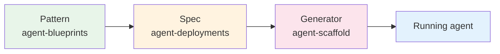

# Blueprint → Spec → Scaffold

End-to-end walkthrough of how a pattern in this repo becomes a running agent. One example, four steps, no hand-waving.

## The lifecycle



Each of the three repos owns one segment:

- **agent-blueprints** — the cognitive pattern (how it thinks).
- **agent-deployments** — the production spec (what to build, what reliability concerns to inherit).
- **agent-scaffold** — the CLI that reads the spec and asks Claude to write the code.

The example below follows one mid-complexity agent through all three.

## The use case

A user wants a **research assistant** that can answer a question like *"Compare GraphQL vs gRPC for streaming workloads in 2026"* by iteratively searching the web, extracting facts, and producing a cited summary.

The hard part isn't any single tool call. It's the loop: the agent has to decide what to search for next based on what it just read, decide when it has enough information, and produce a synthesis with citations. That's a **cognitive** pattern decision before it's an infrastructure decision.

## 1. Pattern selection (agent-blueprints)

Open [`foundations/choosing-a-pattern.md`](../foundations/choosing-a-pattern.md) and walk the decision flowchart:

- Is the trigger an external event? *No — user request.*
- Does the LLM need to take actions or use tools? *Yes — web search at minimum.*
- Can you define the exact steps in advance? *No — the search plan emerges from what each result reveals.*
- Need to break the task into a plan first? *No — step by step is fine; the question is open-ended but not multi-stage.*
- Need external knowledge? *Yes — current web information.*

Landing pattern: **ReAct + tools (search, fetch, summarize)**. RAG is technically applicable but unnecessary here — the agent retrieves on demand via tools rather than from a pre-indexed corpus. If the question were about *internal* documentation, RAG would be the right call.

Open the [ReAct pattern docs](../patterns/react/overview.md). The three tiers tell you:

- **Overview** — the reason-act-observe loop, when it fits, when it doesn't.
- **Design** — components (reasoner, tool dispatcher, observation buffer), data flow, failure modes (infinite loops, tool errors, hallucinated tool calls), cost shape (variable token count per step), composition pointers.
- **Implementation** — pseudocode for the loop, an iteration cap, prompt structure for `Thought` / `Action` / `Observation`, where to inject tools, a `MockLLM` test harness.

This is everything you need to *design* the agent. It is intentionally silent on auth, rate limiting, retries, and observability — those belong in the deployment layer.

## 2. Reading the deployment spec (agent-deployments)

The cognitive design tells you *what shape to build*. The deployment spec tells you *what to build with*.

Open [`agent-deployments/docs/recipes/research-assistant.md`](https://github.com/jagguvarma15/agent-deployments/blob/main/docs/recipes/research-assistant.md). Notice the structure:

```markdown
**Composes:**
- Pattern: ReAct
- Framework (Py): Pydantic AI (agent with tool-based ReAct loop)
- Framework (TS): Vercel AI SDK (generateText with tools + maxSteps)
- Stack: FastAPI / Hono, Postgres, Redis, Langfuse
- Cross-cutting: Auth, Logging, Observability, Rate limiting
```

The recipe says: take the ReAct *shape* from agent-blueprints, pick one of two framework realizations, plug into the standard stack, and inherit the cross-cutting reliability layer. Each item links to a separate spec file you can read in depth.

The recipe also contains:

- A **"Load as Context"** section listing exactly which files to feed an AI coding assistant in tiered order (core / stack / production concerns). This is the recipe's machine-facing contract.
- An **architecture diagram** showing where the ReAct loop sits relative to the API, auth, rate limiter, and tools.
- A **tool surface** specification (`web_search`, `fetch_url`, `summarize`).
- **Required files** for the generated project (Dockerfile, compose file, CI workflow, test scaffolding).

Note what's *not* in the recipe: pattern theory, when-to-use guidance, alternative designs. Those stayed in agent-blueprints. The recipe is opinionated and production-shaped — exactly the boundary [system-design-heritage](../foundations/system-design-heritage.md) defines.

## 3. Generating the project (agent-scaffold)

With the spec in hand, generation is one command:

```bash
agent-scaffold new --recipe research-assistant ./out/research
```

What happens behind the scenes (high level — read [`agent-scaffold`](https://github.com/jagguvarma15/agent-scaffold) for the full flow):

1. The CLI loads the recipe markdown and walks its explicit links transitively (patterns, framework, stack, cross-cutting docs).
2. It assembles a tiered prompt (core context → stack → production concerns) and asks Claude to emit a complete project.
3. It writes the resulting files atomically to `./out/research`, runs a post-write formatter pass, and prints a welcome panel listing every live URL once the local stack is up.
4. If the recipe declares a `capabilities:` block (some do, some don't yet), the scaffold also bootstraps the supporting infra — vector DB, queues, dashboards, eval baselines — via the capability catalog.

The output is a real project, not a starter kit: a runnable FastAPI service with the ReAct agent, the four cross-cutting concerns wired in, tests, Docker, CI. You can read the diff against a blank directory and trace every file back to a spec.

## 4. Running it

After `agent-scaffold new`, the CLI defaults to chaining into `agent-scaffold up`, launching the local stack, opening the frontend in a browser, and printing a welcome panel with every live URL. To disable that auto-chain (CI, restricted environments), pass `--no-autorun`.

```
agent-scaffold new --recipe research-assistant ./out/research
agent-scaffold new --recipe research-assistant ./out/research --no-autorun
```

What you verify first:

- The agent responds to a real query end-to-end.
- The trace appears in Langfuse with the ReAct steps visible.
- Rate limiting kicks in under bursty load.
- The eval baseline scores show in the welcome panel.

If something is wrong with the cognitive behavior — bad reasoning, looping, missing citations — you go back to **agent-blueprints** and reread the design tier of ReAct. If something is wrong with the operational behavior — leaking secrets, missing traces, no rate limit — you go back to **agent-deployments** and reread the relevant cross-cutting doc.

## How the three repos stay in sync

When a recipe is added or changed in `agent-deployments`, its `Composes:` block has to point at real patterns in `agent-blueprints`. When a pattern is added or renamed here, the recipes that compose it have to update their links. The [agent-deployments blueprint map](https://github.com/jagguvarma15/agent-deployments/blob/main/docs/blueprint-map.md) and this repo's [blueprints-to-deployments](./blueprints-to-deployments.md) are the two sides of the same index — keep them in sync when you add either a pattern or a recipe.

## What this walkthrough leaves out

- **Framework deep dives.** Pydantic AI and the Vercel AI SDK are documented in `agent-deployments/docs/frameworks/`.
- **Production tuning.** Rate-limit values, prompt-cache budgets, retry policies — those live in the deployment spec, not the cognitive pattern.
- **Live model selection.** Recipes use `model_hint: sonnet|opus|haiku`; the scaffold reads the hint and lets you override at generation time.
- **Alternative composition.** Research Assistant is vanilla ReAct. For deployments that combine multiple cognitive patterns — `code-review-agent` (Plan & Execute + Reflection), `content-pipeline` (Prompt Chaining + Evaluator-Optimizer) — see the [combination matrix](./combination-matrix.md) and [reference architectures](./reference-architectures.md).
