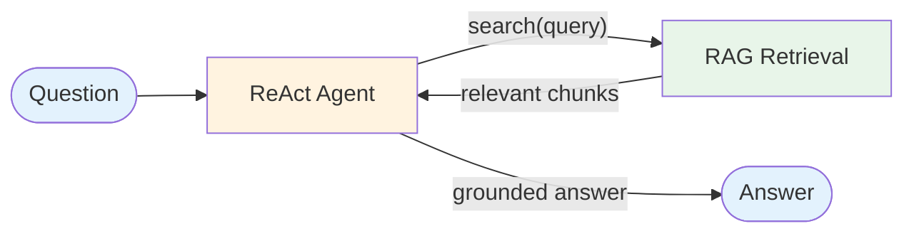

# Combination Matrix

This matrix shows how each pair of patterns interacts when composed. Use it to quickly assess whether a combination is natural, possible but complex, or problematic.

## Reading the Matrix

- **Natural** — These patterns are designed to work together. The composition is straightforward and well-understood.
- **Useful** — These patterns can be combined with some design effort. The combination adds value but requires careful interface design.
- **Complex** — Possible but adds significant complexity. Consider whether the added capability justifies the cost.
- **Redundant** — These patterns overlap in functionality. Using both is usually unnecessary.
- **N/A** — Same pattern.

## Workflow + Workflow Combinations

| | Prompt Chaining | Parallel Calls | Orchestrator-Worker | Evaluator-Optimizer |
|---|---|---|---|---|
| **Prompt Chaining** | N/A | **Useful** — Parallelize independent chain steps | **Useful** — Chain is the simplest form of worker | **Natural** — Evaluate chain output quality |
| **Parallel Calls** | **Useful** | N/A | **Natural** — Workers execute in parallel | **Useful** — Evaluate aggregated output |
| **Orchestrator-Worker** | **Useful** | **Natural** | N/A | **Useful** — Evaluate synthesized result |
| **Evaluator-Optimizer** | **Natural** | **Useful** | **Useful** | N/A |

## Workflow + Agent Combinations

Workflows often serve as the *substrate* that agent patterns build on.

| Workflow ↓ / Agent → | ReAct | Plan & Execute | Tool Use | Memory | RAG | Reflection | Routing | Multi-Agent |
|---|---|---|---|---|---|---|---|---|
| **Prompt Chaining** | Evolves into | — | Evolves into | Evolves into | — | — | — | — |
| **Parallel Calls** | — | — | — | — | Evolves into | — | Evolves into | — |
| **Orchestrator-Worker** | — | Evolves into | — | — | — | — | — | Evolves into |
| **Evaluator-Optimizer** | — | — | — | — | — | Evolves into | — | — |

## Agent + Agent Combinations

This is where the interesting compositions happen.

| | ReAct | Plan & Execute | Tool Use | Memory | RAG | Reflection | Routing | Multi-Agent |
|---|---|---|---|---|---|---|---|---|
| **ReAct** | N/A | **Natural** — ReAct runs each plan step | **Natural** — ReAct uses tool calling | **Natural** — Add session persistence | **Natural** — Retrieve before reasoning | **Useful** — Reflect on agent output | **Useful** — Route then run agent | **Natural** — Workers are ReAct agents |
| **Plan & Execute** | **Natural** | N/A | **Natural** — Steps use tools | **Useful** — Remember plans across sessions | **Useful** — Retrieve context for planning | **Useful** — Reflect on plan quality | **Complex** — Route then plan | **Natural** — Delegate steps to agents |
| **Tool Use** | **Natural** | **Natural** | N/A | **Useful** — Tools store/retrieve memory | **Natural** — Retrieval as a tool | **Useful** — Validate tool results | **Useful** — Different tools per route | **Natural** — Each agent has tools |
| **Memory** | **Natural** | **Useful** | **Useful** | N/A | **Natural** — Shared vector store | **Complex** — Remember critiques | **Useful** — Per-route memory | **Natural** — Shared agent memory |
| **RAG** | **Natural** | **Useful** | **Natural** | **Natural** | N/A | **Useful** — Evaluate retrieval quality | **Useful** — RAG as one route handler | **Useful** — Agents with knowledge |
| **Reflection** | **Useful** | **Useful** | **Useful** | **Complex** | **Useful** | N/A | **Complex** — Reflect on routing | **Useful** — Reflect on synthesis |
| **Routing** | **Useful** | **Complex** | **Useful** | **Useful** | **Useful** | **Complex** | N/A | **Natural** — Route to agents |
| **Multi-Agent** | **Natural** | **Natural** | **Natural** | **Natural** | **Useful** | **Useful** | **Natural** | N/A |

## Top Recommended Combinations

These are the most common and well-understood compositions in production systems:

### 1. RAG + ReAct
**Use case:** Question-answering agent with knowledge base access.

The agent reasons about what to retrieve, fetches relevant documents, and generates a grounded answer. The ReAct loop allows multiple retrieval rounds if the first results are insufficient.

### 2. Plan & Execute + ReAct
**Use case:** Complex multi-step tasks requiring both strategy and adaptive execution.

The planner creates a step-by-step strategy. Each step is executed by a ReAct agent that can use tools and adapt. If a step fails, the planner revises the strategy.

### 3. Multi-Agent + Memory
**Use case:** Collaborative agents with shared context.

Worker agents read from and write to a shared memory store. The supervisor accesses accumulated knowledge to make better delegation decisions over time.

### 4. Routing + Specialized Agents
**Use case:** Systems handling diverse input types.

A classifier routes inputs to purpose-built agents, each with their own tools and prompts. New agents can be added without modifying existing ones.

### 5. Reflection + Any Generator
**Use case:** High-quality output that needs iterative refinement.

Wraps any generation pattern (ReAct, RAG, Plan & Execute) with a self-critique loop. The generator produces output, reflection evaluates it, and the cycle repeats until quality is satisfactory.

## Combinations to Avoid

### Reflection + Routing
Reflecting on routing decisions adds cost without clear benefit. If routing is inaccurate, fix the classifier — don't add a reflection loop.

### Multiple Nested Agent Loops
A multi-agent system where each worker runs Plan & Execute, which runs ReAct with Reflection. The call depth and token cost explode. Keep nesting to 2 levels maximum.

### Memory + Evaluator-Optimizer
Storing evaluation history in long-term memory rarely adds value. Evaluations are task-specific — the context from a previous task's evaluation loop is usually irrelevant.

## Composition Design Checklist

When designing a composed system, verify:

- [ ] Each pattern addresses a distinct need (no redundancy)
- [ ] Interface points between patterns are explicitly defined
- [ ] Error propagation crosses pattern boundaries correctly
- [ ] Total latency and cost are within budget
- [ ] The system can be tested end-to-end, not just per-pattern
- [ ] There's a clear degradation path (what happens if one pattern fails?)
