# Reference Architectures

These are example composed systems showing how patterns combine to solve real-world problems. Each architecture is an *application* of composable patterns — not a pattern itself.

Use these as starting points and adapt them to your specific requirements.

> **Before shipping any of these to production**, read [Security & Safety](../foundations/security-and-safety.md), [Hallucination & Grounding](../foundations/hallucination-and-grounding.md), and [Evals & Quality](../foundations/evals-and-quality.md). The architectures below name the cognitive shape; the foundations docs name the failure modes you'll hit at scale.

## 1. Research Assistant

**Patterns used:** Routing + RAG + ReAct + Reflection

**What it does:** Takes a research question, retrieves relevant sources, reasons through the evidence, and produces a cited, quality-checked analysis.

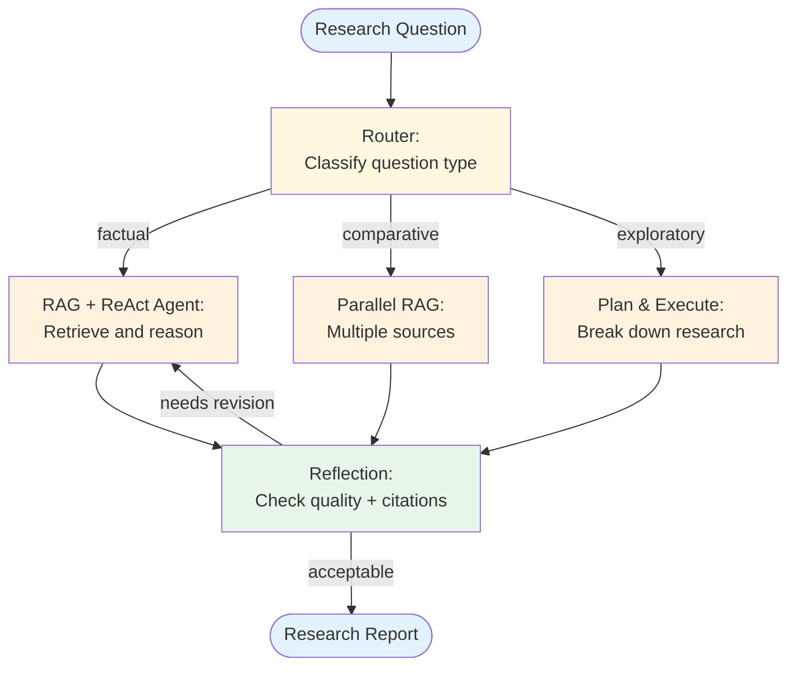

**Design decisions:**
- Routing separates factual queries (single retrieval) from comparative queries (multi-source) and exploratory queries (planning needed)
- Reflection validates citation accuracy and argument completeness
- Iteration budget: max 2 reflection cycles to control cost

## 2. Code Review Agent

**Patterns used:** Multi-Agent + Tool Use + Reflection

**What it does:** Reviews code changes using specialized agents for different aspects (correctness, security, performance), then synthesizes findings.

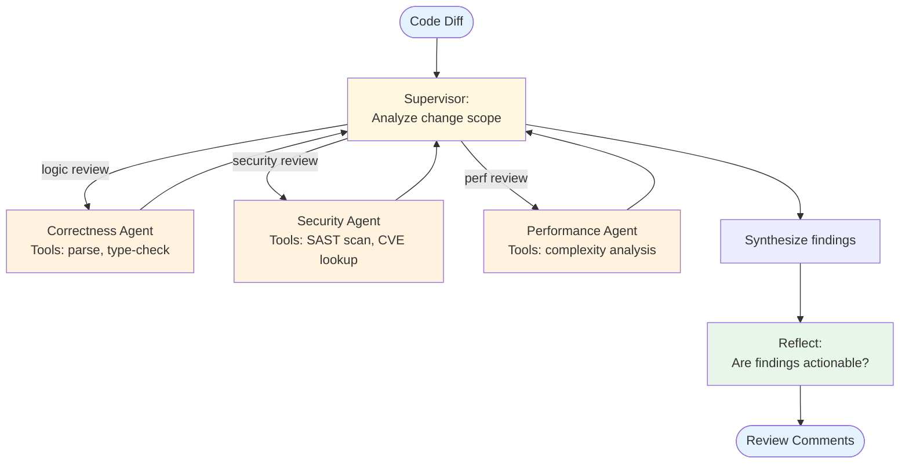

**Design decisions:**
- Specialized agents with domain-specific tools and prompts
- Supervisor decides which agents to invoke based on the change scope (a CSS-only change skips the security agent)
- Reflection ensures findings are specific and actionable, not vague

## 3. Customer Support System

**Patterns used:** Routing + RAG + Memory + Tool Use

**What it does:** Handles customer inquiries by classifying intent, retrieving relevant knowledge, remembering conversation history, and taking actions when needed.

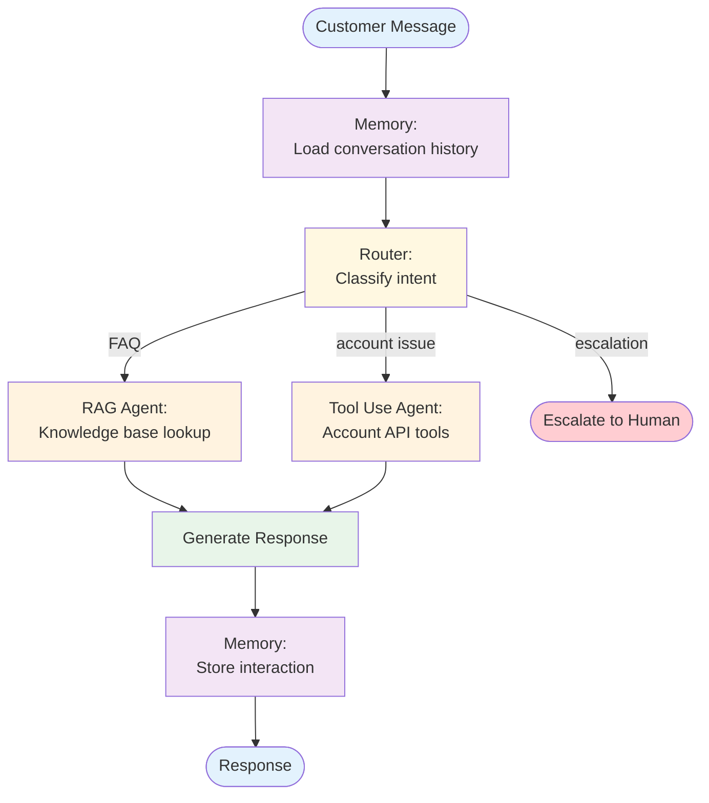

**Design decisions:**
- Memory loads before routing so the classifier has conversation context
- Routing includes an explicit escalation path for issues agents can't handle
- RAG for knowledge questions, Tool Use for account actions (refund, update, etc.)
- Every interaction is stored for future context

## 4. Data Analysis Pipeline

**Patterns used:** Plan & Execute + Tool Use + Evaluator-Optimizer

**What it does:** Takes an analytical question, plans a data analysis approach, executes queries and transformations, then validates the results.

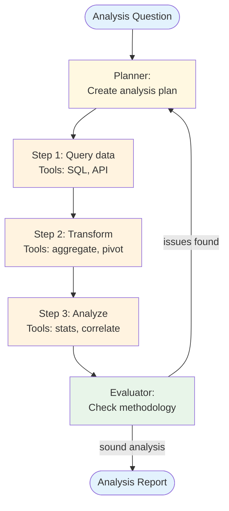

**Design decisions:**
- Plan & Execute ensures the analysis follows a methodical approach
- Each step has specialized tools (data querying, transformation, statistical analysis)
- Evaluator-Optimizer validates the methodology and results before producing the final report
- Replanning if the evaluator finds methodological issues

## 5. Content Generation System

**Patterns used:** Orchestrator-Worker + Reflection + Memory

**What it does:** Generates long-form content by breaking it into sections, writing each section with relevant context, and iteratively improving quality.

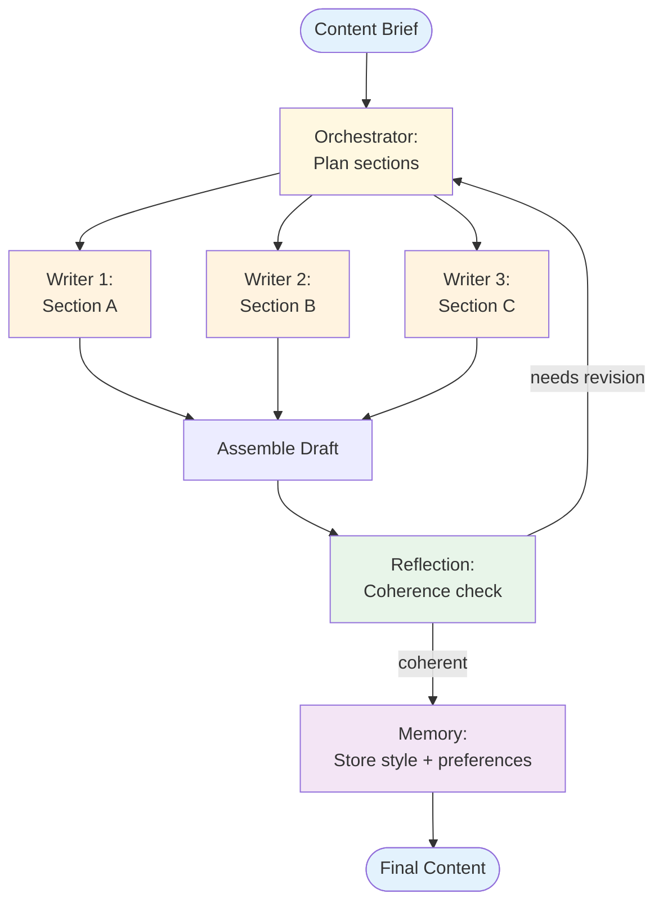

**Design decisions:**
- Orchestrator-Worker for parallel section writing
- Reflection checks coherence across sections (not just individual quality)
- Memory stores learned style preferences for future content generation
- Workers can receive style guidance from memory

## 6. Autonomous Coding Agent

**Patterns used:** Plan & Execute + Tool Use + Reflection + Memory

**What it does:** Takes a feature specification, plans an implementation, writes and runs code iteratively, fixes failures, and stores project conventions in memory for future tasks.

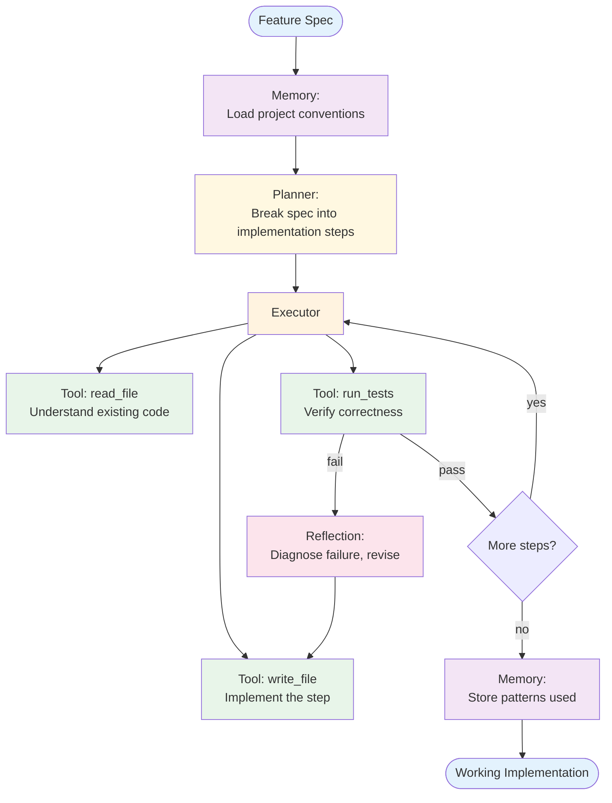

**Design decisions:**
- Plan & Execute creates an ordered implementation plan upfront (read existing code → write tests → implement → verify), reducing the ad-hoc thrashing of a pure ReAct approach
- Tool Use provides grounded access to the actual filesystem and test runner — the agent operates on real files, not simulated output
- Reflection is scoped specifically to test failures: diagnose the error, identify the fix, revise the relevant file only
- Memory stores coding conventions, directory structure, and patterns discovered in previous tasks — a new task on the same codebase doesn't re-explore from scratch
- Iteration guard: max 3 reflection cycles per step; if exceeded, escalate to the developer

**Key tradeoff:** Upfront planning is efficient for straightforward specs but brittle for exploratory tasks where requirements emerge through implementation. For exploratory work, replace Plan & Execute with ReAct.

---

## 7. Document Processing Pipeline

**Patterns used:** Parallel Calls + Prompt Chaining + Evaluator-Optimizer + Routing

**What it does:** Ingests batches of documents (invoices, contracts, reports), classifies each, extracts structured fields in parallel, validates extraction quality, and routes anomalies for human review.

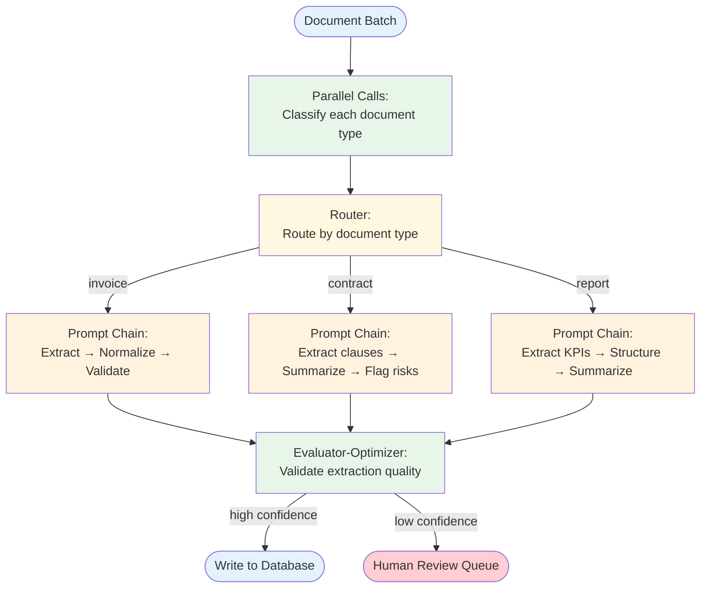

**Design decisions:**
- Parallel Calls for classification: all documents in the batch are typed simultaneously before any extraction begins, making the pipeline significantly faster
- Routing on document type: each type has a different extraction chain (invoices need line items; contracts need clause identification; reports need KPI extraction)
- Prompt Chaining for extraction: multi-step transformation (raw text → extracted fields → normalized format → validated structure) with gates between steps to catch format errors early
- Evaluator-Optimizer as a confidence gate: low-confidence extractions go to a human review queue rather than silently propagating errors to the database
- Cost note: use a cheap model for classification (short, structured output) and a more capable model for extraction (complex structured output)

**Key tradeoff:** This architecture favors throughput over latency. For interactive document Q&A, replace the Prompt Chain with a RAG pipeline.

---

## 8. Personalized Onboarding Agent

**Patterns used:** Routing + Memory + RAG + Prompt Chaining

**What it does:** Guides new users through onboarding by adapting the flow to their role and experience level, answering questions from documentation, and remembering progress across sessions.

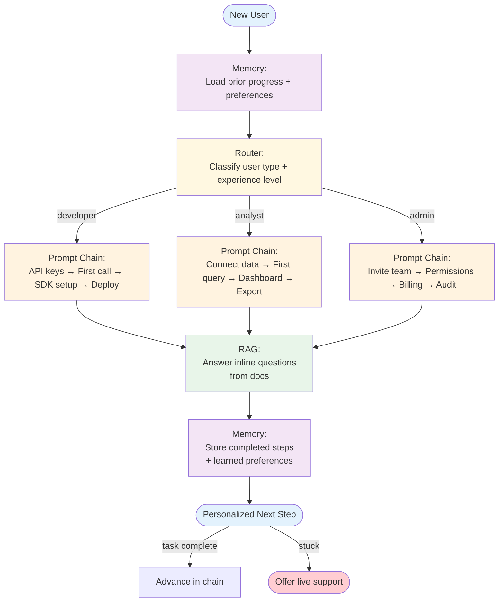

**Design decisions:**
- Memory loads first: if the user returns mid-onboarding, they resume from their last completed step rather than starting over — the single most impactful improvement to onboarding completion rates
- Routing on user role + experience level: a developer with 5 years of API experience gets a different chain than a first-time developer; detection is a short LLM call at session start
- Prompt Chaining for each path: each step in the chain is a discrete task (complete the action, confirm it worked) with a gate that checks completion before advancing
- RAG for inline Q&A: users can ask "what does this parameter do?" at any point without leaving the onboarding flow; answers come from the actual documentation, not the LLM's training data
- Human escalation: if a user is stuck on the same step for 2+ attempts, offer a live support link rather than looping indefinitely
- Memory stores not just progress but also which explanations were helpful, enabling personalization of future onboarding sessions

**Key tradeoff:** This architecture assumes users follow a sequential path. For products with non-linear onboarding, replace the Prompt Chain paths with Plan & Execute so the agent can adapt the sequence based on user actions.

---

## 9. High-Stakes Content Moderation Pipeline

**Patterns used:** Routing + Tool Use + Reflection + Human-in-the-Loop

**The problem:** Inbound user-generated content (forum posts, support tickets, comments) needs moderation. Most items are obvious — clearly safe or clearly unsafe — but a meaningful fraction sit in a borderline zone where automated decisions are wrong often enough to cause real harm (account suspension on a misread comment, hateful content slipping through on a misclassification). Latency tolerance is hours, not seconds; cost tolerance is "much less than human review for every item."

**Pattern selection — why these and not alternatives:**

- **Routing** (rather than a single classifier) because the system has three distinct downstream paths: clear-safe (pass through), clear-unsafe (block + log), borderline (escalate). Conflating them into a single confidence threshold loses the routing semantics.
- **Tool Use** (rather than pure LLM judgment) because the moderation policy lives in a versioned knowledge base, not the model's weights. A `lookup_policy(category)` tool keeps the policy independently auditable.
- **Reflection** *on borderline cases only* (rather than always) because reflection cost is justified when the alternative is human review cost. A self-critique pass that catches 30% of borderline cases as actually-clear-safe cuts human queue load meaningfully.
- **Human-in-the-Loop** *for what reflection couldn't resolve* (rather than for everything) because human time is the most expensive resource in this system. HITL is the abstention path, not the default.

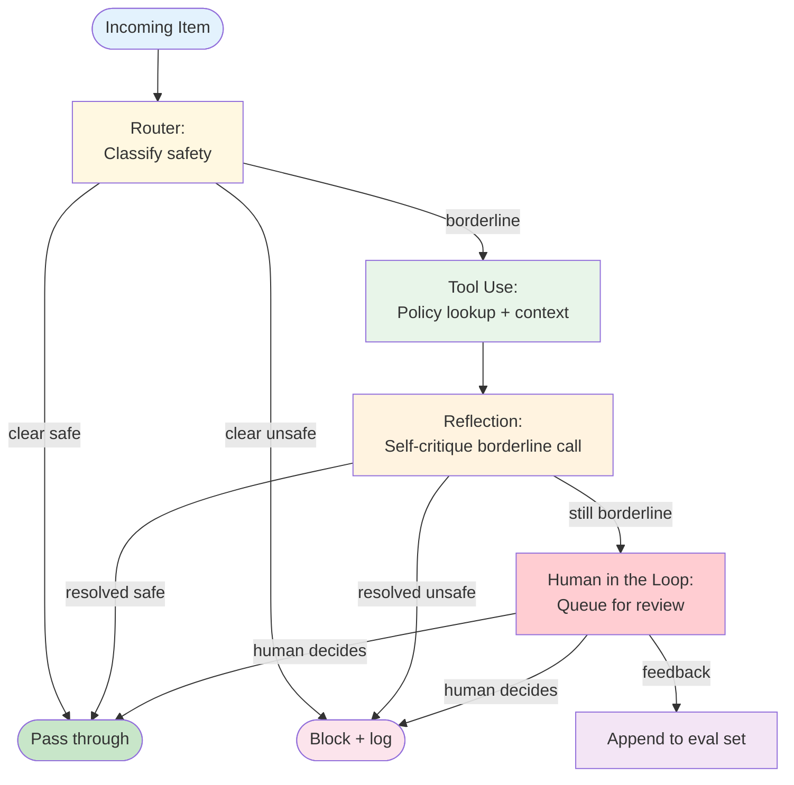

**Failure modes considered:**
- *Router miscalibrated.* The classifier confidently routes borderline items to "clear safe." Defense: track classifier confidence distribution; alert when the borderline rate drifts; retrain quarterly.
- *Reflection rubber-stamps the router.* When reflection always agrees with the router's borderline call, it adds cost without value. Defense: eval the reflector against historical human decisions; require disagreement rate above a threshold.
- *HITL queue overflow.* Borderline rate spikes (a new attack pattern) and the human queue can't keep up. Defense: queue depth alerts; auto-escalate to "block + log" when depth exceeds threshold (false positives are recoverable; missed harms aren't).
- *Policy lookup tool returns stale policy.* Defense: cache invalidation on policy publish; eval against current policy nightly.
- *Adversarial inputs craft a borderline classification deliberately.* Defense: refuse-list of known-bad patterns at the router; track adversarial signal (e.g., obvious obfuscation) as a route input.

**Pointers:**
- Production wiring for the human queue, async work, and audit logs: see [`agent-deployments`](https://github.com/jagguvarma15/agent-deployments) cross-cutting docs.
- Security: see [Security & Safety](../foundations/security-and-safety.md) for adversarial input handling and provenance-tracked audit logs.
- Evals: every human decision lands in the eval suite — see [Evals & Quality](../foundations/evals-and-quality.md).

---

## 10. Event-Driven Ingestion + RAG Enrichment

**Patterns used:** Event-Driven + Tool Use + RAG + Memory

**The problem:** A system needs to react asynchronously to inbound events (webhooks, queue messages, scheduled jobs) by enriching each event with context from a knowledge base and writing the enriched record back to storage. Volume is high (hundreds of events/sec at peak), the knowledge base is too large to load in-context, and event order matters within a user but not across users.

**Pattern selection — why these and not alternatives:**

- **Event-Driven** (rather than synchronous request handling) because the upstream is a queue/stream, the user isn't waiting, and the workload is naturally bursty. Idempotency is mandatory because the event source delivers at-least-once.
- **Tool Use** (rather than freeform LLM action) because each event must produce a structured downstream write. Free-form output would corrupt the storage schema.
- **RAG** (rather than memory or context-stuffing) because the knowledge base is large and authored externally — it's documents to be retrieved against, not memories to be accumulated.
- **Memory** *per-user only* (rather than across users) because event order matters within a user (a "user updated" event after a "user created" should see the updated state) but cross-user memory adds no value and amplifies the cross-tenant blast radius.

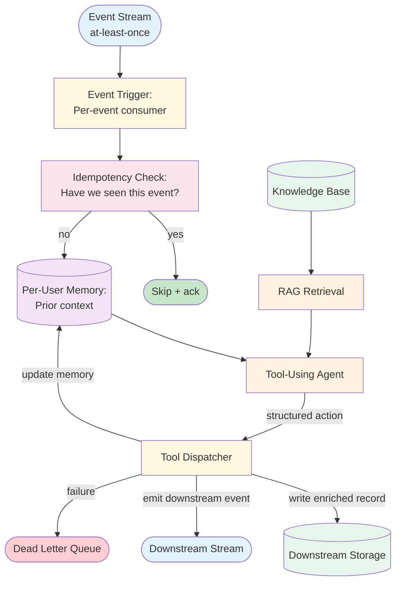

**Failure modes considered:**
- *Idempotency key collision.* Two events with the same key but different payloads. Defense: idempotency key includes payload hash; mismatches alert rather than silently dedup.
- *RAG retrieval drift.* Knowledge base updates change what retrieval returns over time; the same event reprocessed yields different enrichment. Defense: version-pin the KB snapshot per event when reprocessing matters; otherwise accept the drift and document it.
- *Per-user memory poisoning.* A bad earlier event pollutes future enrichment for that user. Defense: provenance tags on memory; supersession on contradicting events; periodic memory audits.
- *DLQ pile-up.* A bad upstream event format starts failing all consumers. Defense: DLQ depth alerts; per-event-type circuit breakers (see `agent-deployments`).
- *Hot user.* One user's event volume saturates a partition. Defense: per-user rate limits; partition reassignment under sustained load.

**Pointers:**
- Idempotency, retries, DLQ, distributed tracing: see [`agent-deployments/docs/cross-cutting/`](https://github.com/jagguvarma15/agent-deployments/tree/main/docs/cross-cutting).
- Per-pattern guidance: [Event-Driven](../patterns/event_driven/overview.md), [RAG](../patterns/rag/overview.md), [Memory](../primitives/memory/overview.md), [Tool Use](../primitives/tool_use/overview.md).
- Recipes that share this shape: see [`restaurant-rebooking`](https://github.com/jagguvarma15/agent-deployments/blob/main/docs/recipes/restaurant-rebooking.md) for an event-driven recipe in `agent-deployments`.

---

## 11. Multi-Step Booking Flow (Saga headline)

**Patterns used:** Saga + Tool Use + Human in the Loop (escalation)

**The problem:** A travel-booking agent has to commit a multi-step transaction across three independent services — reserve a hotel, reserve a flight, charge the customer's card. Any step can fail (no rooms left, card declined, flight pricing changed). The system has no shared database transaction across these services. A naive sequential implementation leaves the user with a charged card but no booking, or a held room with no flight. Saga is the right shape: each step has a compensator that reverses or mitigates its side effect.

**Pattern selection — why these and not alternatives:**

- **Saga** (rather than a single tool-using agent with manual undo logic) because steps cross service boundaries that don't share a transaction context. The compensator contract makes the failure semantics explicit at design time instead of buried in error handlers.
- **Tool Use** (rather than ReAct) because each step is a well-defined action with known arguments and return shape. There's no reasoning loop inside a step; the LLM picks the next step from the saga's plan, not from open-ended exploration.
- **Human in the Loop** *only on compensation failure* (rather than always) because the happy path doesn't need human review — it's a routine booking. But a saga stuck in a `partially_compensated` state (the customer is charged but the flight cancellation API returned a permanent error) is exactly the kind of edge case that needs a human, not another retry loop.

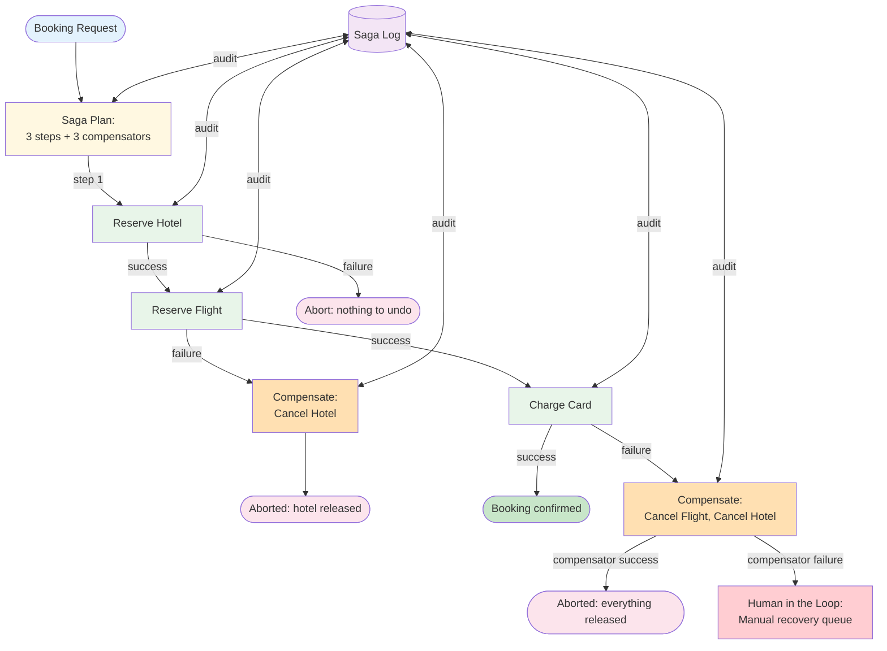

**Failure modes considered:**

- *Hotel reserved, flight reservation times out without confirming.* Compensator runs `cancel_hotel`; saga ends aborted. Customer not charged, hotel released. The flight API may have actually reserved despite the timeout — saga log carries the attempted reservation_id so a separate reconciliation job can claim it back later.
- *Card declined after both reservations succeed.* Two compensators fire in reverse order (cancel flight, then cancel hotel). Both must be idempotent because saga retry on coordinator restart may re-invoke them.
- *Compensator itself fails permanently* (e.g., hotel cancellation API returns 410 Gone). Saga enters `partially_compensated` state; alert fires; HITL queue receives a structured case with the saga log, the failed compensator's error, and a one-click "manually mark resolved" action.
- *Coordinator crashes mid-saga.* On restart, saga log replay determines the last completed step and resumes; idempotent `do` and `undo` make this safe.
- *Two concurrent bookings for the same room.* Step 1's `reserve_hotel` returns a unique reservation_id; the hotel service handles concurrency at its own boundary. Saga doesn't need to.

**Pointers:**

- Pattern guidance: [Saga](../patterns/saga/overview.md) — compensation semantics, orchestration vs choreography, saga log shape.
- Production wiring: [`agent-deployments/docs/cross-cutting/idempotency.md`](https://github.com/jagguvarma15/agent-deployments/blob/main/docs/cross-cutting/idempotency.md). Saga compensators rely on it heavily.
- Composition cross-references: [Saga + Human-in-the-Loop](./combination-matrix.md) is rated *Useful* for exactly this escalation pattern.

---

## Architecture Selection Guide

| If You Need... | Start With | Then Add | Reference |
|----------------|-----------|----------|-----------|
| Knowledge-grounded Q&A | RAG | + ReAct for multi-step reasoning | #1 Research Assistant |
| Automated code review | Multi-Agent | + Tool Use for static analysis tools | #2 Code Review Agent |
| Customer-facing support | Routing | + RAG + Memory + Tool Use | #3 Customer Support |
| Analytical pipelines | Plan & Execute | + Tool Use for data tools | #4 Data Analysis |
| Long-form content generation | Orchestrator-Worker | + Reflection + Memory | #5 Content Generation |
| Writing and running code | Plan & Execute | + Tool Use + Reflection + Memory | #6 Autonomous Coding |
| Batch document processing | Parallel Calls | + Routing + Prompt Chaining + Evaluator-Optimizer | #7 Document Processing |
| User onboarding / guided flows | Routing + Memory | + RAG + Prompt Chaining | #8 Personalized Onboarding |
| Multi-domain complex tasks | Multi-Agent | + RAG + Memory per worker | #1, #2, #6 |
| High-quality output guarantee | Any generator | + Reflection or Evaluator-Optimizer | #4, #5, #7 |

## Design Considerations for All Architectures

### Cost Control
- Set iteration limits on every loop (ReAct, Reflection, Evaluator-Optimizer)
- Use cheaper models for classification/routing, more capable models for generation
- Cache retrieval results and tool outputs where possible

### Latency
- Identify the critical path and parallelize where possible
- Put routing early to avoid unnecessary processing
- Set timeouts on tool calls and agent loops

### Observability
- Log every pattern boundary crossing (routing decisions, delegation, reflection cycles)
- Track token usage and latency per pattern per request
- Alert on iteration count anomalies (agent loops using max iterations too often)

### Failure Modes
- Define fallback behavior at each composition point
- Graceful degradation: if RAG retrieval fails, can the agent still provide a useful (if less grounded) response?
- Human escalation paths for cases the system can't handle
