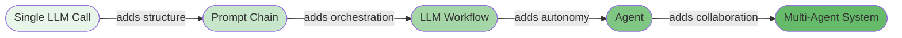

# Foundations

This section establishes the mental models and vocabulary you need before diving into any specific pattern. Read this first.

## What Are LLM Applications?

An LLM application is any system that uses a large language model to process inputs and produce outputs. These range from a single API call with a well-crafted prompt to complex multi-agent systems that plan, reason, and act autonomously.

Most production LLM systems fall somewhere on this spectrum:

**Single LLM Call** — One prompt in, one response out. No loops, no tools. Useful for classification, summarization, and extraction.

**Prompt Chain** — Multiple LLM calls in sequence where each output feeds the next input. Adds structure and validation gates between steps.

**LLM Workflow** — Orchestrated patterns of LLM calls with branching, parallelism, or evaluation loops. The system follows a *predetermined* control flow — the code decides what happens next, not the LLM.

**Agent** — An LLM-driven system where the *model itself* decides what to do next. The LLM chooses which tools to call, when to stop, and how to respond to observations. Control flow is dynamic.

**Multi-Agent System** — Multiple agents collaborating, each with specialized capabilities. A supervisor or protocol coordinates their interactions.

## The Key Insight

The difference between a workflow and an agent is **who controls the loop**:

- In a **workflow**, the developer writes the control flow. The LLM fills in the blanks.
- In an **agent**, the LLM *is* the control flow. The developer provides tools and constraints.

This distinction matters because it determines your system's predictability, debuggability, and failure modes. Workflows are easier to test and reason about. Agents are more flexible but harder to control.

## How This Repository Is Organized

| Section | What It Covers | Start Here If... |
|---------|---------------|-----------------|
| [Foundations](./README.md) | Core concepts, terminology, pattern selection | You're new to agent design |
| [Workflows](../workflows/README.md) | Pre-agent LLM patterns (chaining, parallelism, orchestration, evaluation) | You need structured LLM pipelines |
| [Agent Patterns](../patterns/README.md) | Agent architectures (ReAct, planning, memory, RAG, multi-agent) | You need autonomous LLM behavior |
| [Composition](../composition/README.md) | How to combine patterns into complete systems | You're designing a production system |

## Reading Order

If you're learning from scratch, read in this order:

1. **[Terminology](./terminology.md)** — Get the vocabulary right
2. **[Anatomy of an Agent](./anatomy-of-an-agent.md)** — Understand what makes agents tick
3. **[Choosing a Pattern](./choosing-a-pattern.md)** — Pick the right tool for your problem
4. **[Workflows](../workflows/README.md)** — Learn the foundational patterns
5. **[Agent Patterns](../patterns/README.md)** — See how workflows evolve into agents

Before shipping to production, also read:

- **[Anti-Patterns](./anti-patterns.md)** — The 12 most common design mistakes and how to avoid them

For background and positioning:

- **[System Design Heritage](./system-design-heritage.md)** — How blueprints map to classical distributed-systems patterns, and which patterns are scoped to `agent-deployments`

## In This Section

The foundations split into three groups. Read them in the order that matches your goal.

### Core concepts — read first

The vocabulary, mental models, and decision frameworks you'll use everywhere else.

- **[Terminology](./terminology.md)** — Precise definitions of agent, workflow, tool, and other overloaded terms
- **[Anatomy of an Agent](./anatomy-of-an-agent.md)** — The components every agent has and what distinguishes agents from workflows
- **[Choosing a Pattern](./choosing-a-pattern.md)** — Decision flowchart and guidance for selecting the right pattern
- **[Anti-Patterns](./anti-patterns.md)** — What not to build, why people build it anyway, and the correct alternative

### Production concerns — read before shipping

Cross-cutting concerns every production agent inherits. Not pattern-specific; safe to read at any depth tier.

- **[Security & Safety](./security-and-safety.md)** — Prompt injection, tool-use safety, secrets, output filtering, MCP supply chain
- **[Hallucination & Grounding](./hallucination-and-grounding.md)** — Why agents hallucinate, grounding strategies, abstention, eval-gated deployment
- **[Evals & Quality](./evals-and-quality.md)** — Evals as tests (not benchmarks), golden datasets, metric selection, online vs offline, regression suites
- **[Cost & Model Selection](./cost-and-model-selection.md)** — Model tier selection, token budgets, per-pattern cost shape, the latency/cost/quality triangle, guardrails
- **[Testing Strategies](./testing-strategies.md)** — Unit tests, mock LLMs, integration tests, evaluation, and regression testing for LLM systems

### Reference and positioning

The repo's lineage and its place in the broader ecosystem.

- **[System Design Heritage](./system-design-heritage.md)** — Lineage map from classical system-design patterns to the blueprints here, and the reliability gap scoped to `agent-deployments`
- **[Frameworks & Integrations](./frameworks-and-integrations.md)** — A map from patterns to LangGraph, Claude Agent SDK, CrewAI, AutoGen, LlamaIndex, and MCP
