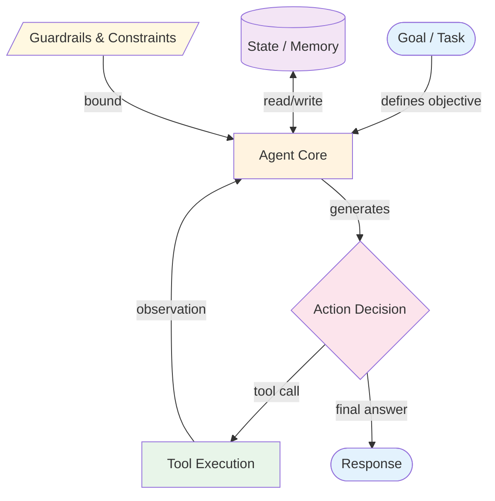
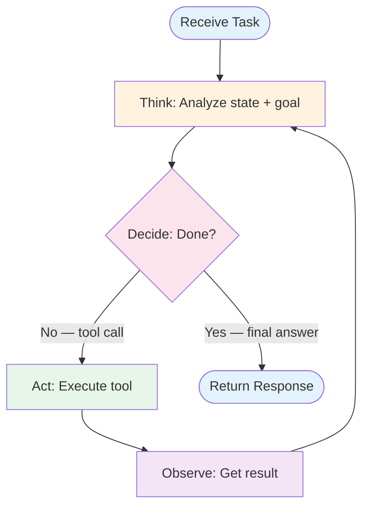
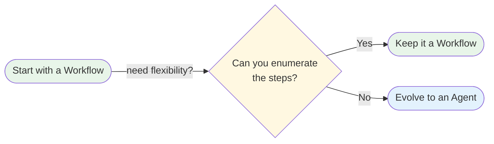

# Anatomy of an Agent

What makes something an "agent" versus a "workflow"? This document breaks down the components every agent has and draws the line between the two concepts.

## The Components

Every agent system, regardless of complexity, has these components:



### 1. Agent Core (The LLM)
The reasoning engine. Receives the current goal, state, and available tools. Produces either a tool call (to take action) or a final answer (to terminate). The core is where the LLM lives.

### 2. Goal / Task
What the agent is trying to accomplish. Can be explicit ("Find the 3 most cited papers on X") or implicit (derived from conversation context). The goal shapes every decision the agent makes.

### 3. Tools
Functions the agent can invoke to interact with the world. Each tool has a schema describing its name, purpose, and parameters. The agent *requests* tool calls; your code *executes* them.

Tools are what separate an agent from a chatbot. Without tools, an LLM can only generate text. With tools, it can search, compute, read files, call APIs, and modify state.

### 4. State
The accumulated context from previous steps. At minimum, this is the message history (what has been said and done so far). More sophisticated agents maintain structured state — plans, intermediate results, retrieved documents, counters.

### 5. Observations
Results returned from tool execution, fed back into the agent's context. Observations let the agent learn from its actions within a single run. This feedback loop is what makes agents adaptive.

### 6. Guardrails and Constraints
Boundaries that prevent the agent from running forever, using too many resources, or producing harmful output. Common guardrails:
- **Max iterations** — Stop after N reasoning steps
- **Max tokens / cost budget** — Cap resource usage
- **Tool restrictions** — Limit which tools are available
- **Output validation** — Check responses against schemas or rules

## The Agent Loop

The core behavior of every agent is a loop:



1. **Think** — The LLM examines the current state (goal + history + observations) and reasons about what to do next.
2. **Decide** — Based on its reasoning, the LLM either requests a tool call or produces a final answer.
3. **Act** — If a tool was requested, the system executes it.
4. **Observe** — The tool's result is appended to the agent's state.
5. **Repeat** — Back to Think with the updated state.

This loop continues until the agent decides it's done or a guardrail stops it (max iterations, error threshold, etc.).

## Workflow vs Agent: The Line

The distinction is not about complexity — it's about **who controls the branching logic**:

| Dimension | Workflow | Agent |
|-----------|----------|-------|
| **Control flow** | Defined by developer code | Decided by the LLM at runtime |
| **Predictability** | High — same input produces same flow path | Variable — LLM may take different paths |
| **Tool usage** | Tools called at predetermined points | LLM chooses which tools, when, and in what order |
| **Termination** | Coded exit conditions | LLM decides when task is complete |
| **Debugging** | Trace through code logic | Inspect LLM reasoning chain |
| **Testing** | Standard unit/integration tests | Requires evaluation harnesses, stochastic testing |
| **Best for** | Known, repeatable processes | Open-ended, exploratory tasks |

### Example: The Same Task, Two Ways

**Task:** Summarize a research paper and extract key findings.

**As a workflow (prompt chain):**
```
Step 1: LLM extracts the abstract → output_1
Step 2: LLM identifies methodology from body → output_2
Step 3: LLM lists key findings from results section → output_3
Step 4: LLM synthesizes output_1 + output_2 + output_3 → final summary
```
The developer decided there are exactly 4 steps. The LLM fills in each step's content.

**As an agent (ReAct):**
```
LLM thinks: "I should read the abstract first."
LLM calls: read_section("abstract") → observation
LLM thinks: "The methodology section mentions X, I should look at the data tables."
LLM calls: read_section("results") → observation
LLM thinks: "I notice a contradiction with the literature review, let me check."
LLM calls: read_section("literature_review") → observation
LLM thinks: "Now I have enough to summarize."
LLM returns: final summary
```
The LLM decided how many steps to take and which sections to read. It adapted its approach based on what it found.

## When Does a Workflow Become an Agent?

A workflow evolves into an agent when you add any of these:

1. **Dynamic tool selection** — The LLM picks which tool to use, not the code
2. **Conditional iteration** — The LLM decides when to stop, not a counter or score
3. **Reactive planning** — The LLM changes its approach based on intermediate results

You don't have to jump straight to agents. Often, the best path is:



**Start with a workflow.** If you find yourself writing increasingly complex conditional logic to handle edge cases, that's a signal to let the LLM make those decisions — evolve to an agent.

Each agent pattern in the [patterns section](../patterns/README.md) includes an `evolution.md` file that shows exactly how to make this transition from the corresponding workflow.

## Agent Complexity Spectrum

Not all agents are equal. They range from simple to complex:

| Level | Description | Example Pattern |
|-------|-------------|-----------------|
| **Single-loop agent** | One LLM, one tool set, one loop | [ReAct](../patterns/react/overview.md) |
| **Planning agent** | Generates a plan then executes it step-by-step | [Plan & Execute](../patterns/plan_and_execute/overview.md) |
| **Reflective agent** | Evaluates its own output and iterates | [Reflection](../patterns/reflection/overview.md) |
| **Stateful agent** | Maintains memory across conversations | [Memory](../primitives/memory/overview.md) |
| **Multi-agent system** | Multiple agents collaborating | [Multi-Agent](../patterns/multi_agent/overview.md) |

Each level adds capability but also adds complexity, cost, and failure modes. Choose the simplest level that solves your problem.
