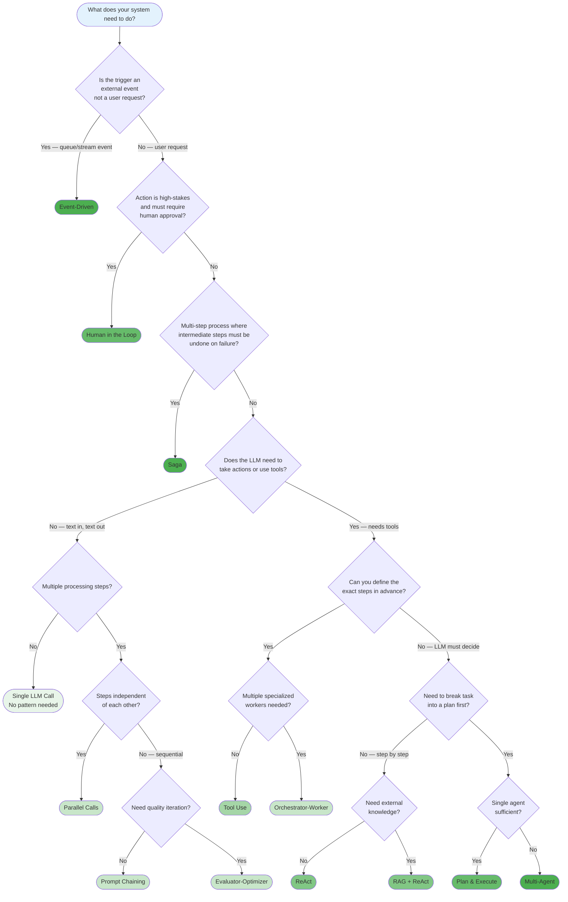
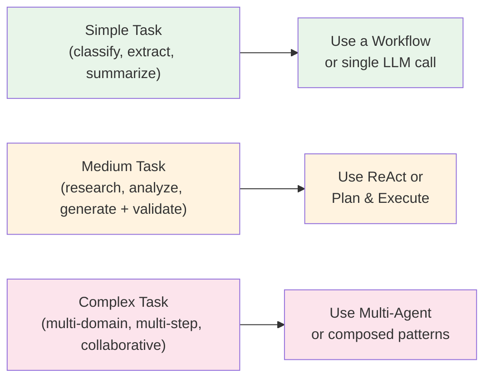

# Choosing a Pattern

Use this guide to select the right pattern for your use case. Start with the decision flowchart, then refine with the detailed guidance below.

## Decision Flowchart

Green intensity indicates increasing complexity. Start as light as possible.

## Quick Reference Table

> For a framework-specific view of these patterns (LangGraph, Claude Agent SDK, CrewAI, AutoGen, LlamaIndex, MCP), see [Frameworks & Integrations](./frameworks-and-integrations.md).
>
> Each pattern's overview has a fuller "When NOT to use this pattern" section. This table is the at-a-glance view.

| Pattern | Type | Use When | Don't Use When |
|---------|------|----------|----------------|
| [Prompt Chaining](../workflows/prompt-chaining/overview.md) | Workflow | Fixed multi-step text processing | Steps depend on dynamic decisions |
| [Parallel Calls](../workflows/parallel-calls/overview.md) | Workflow | Independent tasks that can run concurrently | Tasks depend on each other's output |
| [Orchestrator-Worker](../workflows/orchestrator-worker/overview.md) | Workflow | Complex task needs decomposition into subtasks | Task is simple enough for one call |
| [Evaluator-Optimizer](../workflows/evaluator-optimizer/overview.md) | Workflow | Output quality needs iterative refinement | First-pass quality is sufficient |
| [ReAct](../patterns/react/overview.md) | Agent | Open-ended tasks with tool use | Steps are predictable in advance |
| [Plan & Execute](../patterns/plan_and_execute/overview.md) | Agent | Complex tasks needing upfront strategy | Simple tasks with fewer than 3 steps |
| [Tool Use](../patterns/tool_use/overview.md) | Agent | LLM needs to interact with external systems | No external actions needed |
| [Memory](../patterns/memory/overview.md) | Agent | Context must persist across conversations | Single-turn interactions |
| [RAG](../patterns/rag/overview.md) | Agent | LLM needs external knowledge to answer | All needed knowledge fits in context |
| [Reflection](../patterns/reflection/overview.md) | Agent | Output quality must exceed single-pass | Latency is more important than quality |
| [Routing](../patterns/routing/overview.md) | Agent | Different inputs need different handling paths | All inputs follow the same process |
| [Multi-Agent](../patterns/multi_agent/overview.md) | Agent | Task requires multiple specialized capabilities | Single agent can handle the scope |
| [Event-Driven](../patterns/event_driven/overview.md) | Agent | Trigger is an external event (cancellation, status change, scheduled job) | User is waiting synchronously for a response |
| [Saga](../patterns/saga/overview.md) | Agent | Long-running multi-step process with steps that have to be undone on failure | All steps live in one DB that supports transactions |
| [Human in the Loop](../patterns/human_in_the_loop/overview.md) | Agent | High-stakes action must not commit without human approval | Action is low-stakes and review would be a rubber-stamp |

## Decision Criteria

### 1. Predictability vs Flexibility

**If you can enumerate the steps your system will take**, use a workflow. Workflows are deterministic (given the same input, they follow the same path), easy to test, and cheap to debug.

**If the steps depend on what the LLM discovers at runtime**, use an agent. Agents handle novel situations but are harder to predict and test.

**Rule of thumb:** Start with a workflow. Promote to an agent only when the conditional logic in your workflow code becomes unmanageable.

### 2. Latency Budget

Every LLM call adds latency. Patterns with loops (ReAct, Reflection, Evaluator-Optimizer) multiply this by the number of iterations.

| Pattern | Typical LLM Calls | Latency Profile |
|---------|-------------------|-----------------|
| Prompt Chaining | N (number of steps) | Linear, predictable |
| Parallel Calls | 1 round (parallel) + 1 (aggregate) | Low — parallel execution |
| Orchestrator-Worker | 1 (plan) + N (workers) + 1 (synthesize) | Medium, partially parallelizable |
| ReAct | 1–10+ (depends on task) | Variable, unpredictable |
| Plan & Execute | 1 (plan) + N (steps) + 0–1 (replan) | Medium-high |
| Multi-Agent | Varies widely | High, depends on delegation depth |

### 3. Cost Budget

Cost scales with tokens processed. Patterns that iterate (reflection, evaluation loops) or maintain long message histories (agents, memory) consume more tokens.

**Cost-sensitive?** Prefer workflows with short chains. Avoid open-ended agent loops without iteration caps.

### 4. Error Tolerance

Some systems can tolerate occasional LLM errors (a chatbot gives a mediocre answer). Others cannot (a code generation pipeline produces syntax errors).

**Low error tolerance?** Add evaluation loops (Evaluator-Optimizer or Reflection) or compose with validation tools.

### 5. Task Complexity

Match pattern complexity to task complexity:

## Common Combinations

Patterns are composable. Most production systems use more than one:

- **RAG + ReAct** — Agent that retrieves knowledge before reasoning. The most common production pattern.
- **Plan & Execute + Tool Use** — Planner generates strategy, executor uses tools at each step.
- **Multi-Agent + Memory** — Agents that remember previous interactions and learn.
- **Routing + specialized workflows** — Classifier directs to purpose-built pipelines.
- **Reflection + any generator** — Adds self-critique loop to improve output quality.

See [Composition](../composition/README.md) for detailed combination guidance.

## Anti-Patterns

### Over-engineering
Using a multi-agent system when a prompt chain would work. **Cost:** Higher latency, more failure points, harder debugging. **Fix:** Start simple, add complexity only when you hit the limits of simpler patterns.

### Under-constraining Agents
Giving an agent access to many tools without iteration limits or scope restrictions. **Cost:** Runaway loops, high token usage, unpredictable behavior. **Fix:** Always set max iterations, restrict tool sets, validate outputs.

### Skipping Workflows
Jumping straight to agent patterns without considering whether a workflow would suffice. **Cost:** Unnecessary complexity and cost. **Fix:** Use the decision flowchart above — if you can enumerate the steps, use a workflow.

### Ignoring Composition
Building one monolithic pattern instead of composing simpler ones. **Cost:** Rigid, hard to modify, hard to test. **Fix:** Design with composition in mind from the start.
