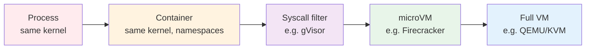

# Sandboxed Execution

When an agent writes and runs code, every tool call that touches the runtime is a potential blast radius. This document is the cognitive case for sandboxes: when you need one, what isolation level fits which threat model, and what the operational tradeoffs are at a pattern level. Vendor specifics (E2B / Modal / Daytona / Firecracker tuning) live in [`agent-deployments/docs/stack/`](https://github.com/jagguvarma15/agent-deployments/tree/main/docs/stack/) and the matching `capabilities/sandbox/*.md` capability docs.

## Why sandbox

Agents that *only read* can leak. Agents that *also write and execute* can destroy. The 2026 agent stack is dominated by code-running shapes — coding assistants, data-analysis agents, automation agents, autonomous research agents that pipe results into scripts. The instant an LLM's output becomes a command that runs, the threat surface changes:

| Failure mode | Without sandbox | With sandbox |
|---|---|---|
| LLM hallucinates `rm -rf /` | Host filesystem destroyed. | Sandbox session ends; host untouched. |
| Tool output contains prompt injection that exfiltrates secrets via a subsequent code execution | Secrets in agent env leak. | Sandbox env is segregated; even successful exfil only leaks sandbox state. |
| Agent runs code that exhausts memory or CPU | Host degrades or crashes. | Sandbox kernel hits its quota; sibling tenants unaffected. |
| Generated code calls outbound to an attacker URL | Direct egress from your network. | Egress policy at sandbox boundary limits or blocks. |
| Long-running script left orphan | Host process table fills up. | Sandbox times out; process tree dies with it. |

The argument for sandboxing isn't "you might run malicious code" — it's "you *will* run wrong code, often, and the host is the wrong place for that to happen."

## The line: when do you need a sandbox?

You need a sandbox when **any** of these are true:

1. **The agent executes LLM-emitted code.** Coding agents, data-science agents, "run this shell command and tell me what happens" agents.
2. **The agent runs user-supplied or third-party scripts.** Notebook agents, automation builders, anything that ingests untrusted input as executable text.
3. **The agent operates browsers, GUIs, or other rich runtimes.** Computer-use agents, browser-automation agents — these have huge implicit attack surfaces (cookies, local storage, native dialogs).
4. **The agent has filesystem write tools and you don't fully trust the prompt path.** Even read-only intentions can become writes via prompt injection or LLM confusion.

You do **not** need a sandbox when:

- The agent only calls structured APIs (MCP tools that don't shell out, REST clients, DB queries with parameterized inputs).
- The agent only reads — pure RAG, summarization, classification.
- The runtime is already in a per-request ephemeral container (e.g., a serverless function). In that case the deployment topology is the sandbox.

## Isolation taxonomy

Sandboxes differ in the *kernel boundary* they enforce. Stronger boundaries cost more (startup time, hardware, complexity); weaker boundaries are cheaper but leak more failure modes through.



Read left-to-right: weaker isolation, faster startup, less overhead. Read right-to-left: stronger isolation, slower startup, more overhead.

### Process isolation (no kernel boundary)

Just a subprocess. Fast (<10 ms startup), trivial to set up — and a kernel exploit, a buggy syscall, or a hostile env var compromises the host. **Acceptable only for code you authored and trust completely.** Not a sandbox for LLM-emitted code.

### Container isolation (shared kernel, namespaces + cgroups)

Docker, Podman, vanilla container runtimes. ~100 ms startup. Filesystems isolated, process tables isolated, network namespaceable. Kernel is shared — a kernel CVE is a host compromise. cgroup quotas are best-effort under contention. **Acceptable for trusted code in dev environments; not the recommended ceiling for production LLM-emitted code.**

### Syscall-filter isolation (gVisor, Kata)

Adds a user-space syscall interceptor between the container and the host kernel. ~200 ms startup. Many high-risk syscalls (raw networking, kernel modules) are blocked or emulated; the host kernel surface is dramatically smaller. Compatible with most workloads but blocks some (raw sockets, certain ioctls). **A practical production option** — used by Modal and several hosted notebook services.

### microVM isolation (Firecracker, Cloud Hypervisor)

Full hardware-virtualization boundary (KVM), but with a stripped-down VMM optimized for fast cold starts. ~100-300 ms startup, MB-not-GB memory footprint. Each sandbox is a distinct guest kernel running in a distinct VM. A kernel exploit in the guest doesn't reach the host. **The 2026 reference for production code-running agents** — used by E2B, Fly Machines, and serverless platforms.

### Full VM isolation (QEMU/KVM, hardware vendors' hypervisors)

Standard cloud VMs. ~seconds startup, full GB-scale memory. Maximum isolation, maximum cost. **Use when you need GPU passthrough, when regulatory requirements demand it, or when the sandboxed workload is heavy enough that startup cost is amortized.**

## Picking an isolation level

A decision tree, not a rule:

```
Q: Will the agent execute LLM-emitted code (Python, shell, JS, ...)?
   ├─ No → No sandbox needed.
   └─ Yes → Continue.

Q: Will the code be transient (one task) or long-lived (interactive notebook)?
   ├─ Transient → Cold-start sensitivity matters. Pick microVM or syscall-filter.
   └─ Long-lived → Cold start amortizes. microVM is still default; full VM if GPU.

Q: Does the code need GPU?
   ├─ No → microVM or syscall-filter.
   └─ Yes → Full VM with GPU passthrough, or a hosted-GPU sandbox vendor.

Q: Is the workload sensitive to ~100-200 ms cold start latency?
   ├─ No → microVM (E2B, Fly).
   └─ Yes → syscall-filter (gVisor); accept the smaller isolation in exchange.

Q: Are you operating in a regulated environment (HIPAA, PCI, FedRAMP)?
   ├─ Yes → Full VM or microVM with attested hardware; document the kernel boundary.
   └─ No → microVM is the recommended default.
```

The defaults the 2026 ecosystem has settled on: **microVM for production code-running agents, syscall-filter for cost-sensitive deployments, full VM only when regulatory or GPU constraints force it.**

## Operational concerns at a pattern level

Sandbox choice cascades into several non-obvious design decisions:

### Session persistence

A sandbox is a tiny computer. Files written during one tool call need to survive into the next. Two patterns:

- **Long-lived session per agent run.** Agent boots one sandbox at the start of its session; all tool calls hit the same sandbox. Files persist trivially. Costs sandbox runtime even between idle tool calls.
- **Fresh sandbox per tool call + explicit state passthrough.** Agent boots a sandbox per call, passes any needed state in as input, retrieves outputs as artifacts. Stateless and cheaper, but the agent has to track state itself.

The agent's pattern dictates the right answer: ReAct loops generally want long-lived sessions (intermediate state matters); parallel-fan-out workflows generally want fresh sandboxes (no shared state by design).

### File mounts

Sandboxes need a way to receive inputs and emit outputs. Convention is a *workspace mount* — a single directory the agent treats as the sandbox's view of the world. The agent uploads inputs to the workspace, runs code, downloads outputs. This narrows the I/O surface enormously and makes audit / replay tractable.

### Network egress

The biggest exfiltration vector in a code-running agent is "code that decides to call out to the internet." Three egress postures:

- **Deny by default.** Sandbox can reach nothing; specific allowed hosts opted in per recipe. Highest security; breaks any code that does `pip install` or fetches data.
- **Allowlist.** Specific domains permitted (PyPI, npm, your own APIs). Tight but workable; the allowlist is recipe-scoped.
- **Open.** Sandbox can reach the internet. Operates fine; accepts that compromised code can phone home. Acceptable in dev, dangerous in prod for high-value agents.

### Snapshot / restore

Some vendors expose VM snapshots — pause a sandbox, restore it later in the same state. Useful for [`Saga`](../patterns/saga/overview.md) patterns (long-running multi-step processes with checkpoints) and for [`Human in the Loop`](../modifiers/human_in_the_loop/overview.md) flows where an agent pauses for human review. Not all sandbox runtimes support this; it's a feature to check for, not assume.

## What sandboxing does not solve

- **Wrong code.** A sandbox catches code that *succeeds at the wrong thing*. It does not catch logic bugs that *succeed at no thing*. Evals (see [`evals-and-quality.md`](./evals-and-quality.md)) are the answer there.
- **Adversarial prompts that don't run code.** Prompt injection that hijacks reasoning toward a destructive intent still results in the agent invoking the right tool with the wrong arguments. Sandbox limits the blast radius of the action; doesn't prevent the misjudgment. See [`security-and-safety.md`](./security-and-safety.md) for the cognitive defenses.
- **Cost.** Sandbox runtime is metered — a hot session burning CPU is a real bill. Budget enforcement (see [`cost-and-model-selection.md`](./cost-and-model-selection.md)) applies to sandbox compute just like it applies to tokens.
- **Auditability.** Sandboxing isolates; it doesn't log. Pair sandboxes with structured tracing (see per-pattern `observability.md`) so reviewers can reconstruct what the agent ran.

## See also

- [`security-and-safety.md`](./security-and-safety.md) — broader threat model the sandbox is one mitigation within.
- [`agent-protocols.md`](./agent-protocols.md) — MCP's tool-call surface is the boundary the sandbox sits behind.
- [`patterns/tool_use/overview.md`](../primitives/tool_use/overview.md) — the pattern that most often needs sandboxing.
- [`agent-deployments/docs/capabilities/sandbox/`](https://github.com/jagguvarma15/agent-deployments/tree/main/docs/capabilities/sandbox) — production-shape capability docs for specific sandbox vendors.
- [`composition/agentic-eval-pipeline.md`](../composition/agentic-eval-pipeline.md) — how to evaluate that a sandboxed agent is actually safer, not just slower.
