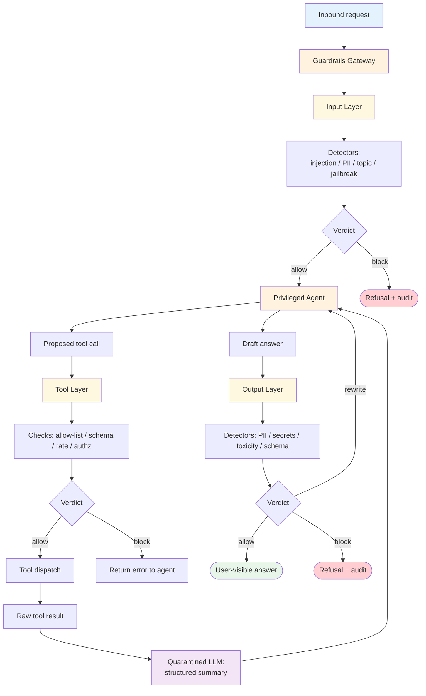

# Guardrails — Design

> Canonical Pydantic state schema: [`schemas/state.py`](schemas/state.py) — `GuardrailsState` is the top-level shape; `Verdict`, `BlockDecision`, `LayerResult` are the auxiliary models.
>
> Typed prompts: [`prompts/`](prompts/) — `quarantined-summarizer.md` (the dual-LLM quarantined reader) + `policy-rewriter.md` (output rewriter on soft-block).

## Component Breakdown



### Guardrails Gateway

The single entry point the agent is wrapped behind. Owns layer ordering, detector registration, audit emission, and policy reload. In-process for low-latency single-tenant systems; out-of-process gateway service (Bifrost, in-house) for fleet-wide policy.

### Input Layer

Detectors run in declared order. First `block` short-circuits. `flag` results aggregate and bias downstream layers. Cheap detectors (regex, length cap, char-set) run first; expensive ones (classifier model, embedding similarity to attack corpus) run last.

### Tool Layer

Pre-dispatch validation: tool name is on the allow-list for this agent/tenant; arguments validate against the tool schema; the per-tool rate budget is not exhausted; authorization passes for the tenant/user. Mutating tools also check parameter ranges (a `refund` tool gets max-amount and max-frequency caps independent of the agent).

### Quarantined LLM

A separate model invocation that reads untrusted tool output and emits a structured summary in a schema the actor agent expects. The quarantined model has no tools, no memory of prior calls, no system prompt that grants authority — its only job is "extract the data points the actor needs." The structured output is the only thing crossing back into the privileged context.

### Output Layer

Detectors validate the actor's draft answer. PII / secret leak detection catches accidental dumps (the model copying a credit card number from context). Schema validation catches format drift. Soft blocks (rewrite) loop back to the agent with a directive; hard blocks return a stock refusal.

### Audit Sink

Every block decision becomes an audit row: `(request_id, layer, detector, verdict, action, input_hash, decided_at)`. Used for false-positive triage, attack-pattern dashboards, and compliance evidence.

## The Dual-LLM Split

The single most important architectural decision. It maps onto the classical OS separation of privileged and unprivileged execution:

| Privileged actor LLM | Quarantined LLM |
|---|---|
| Holds tool dispatch authority | No tool access |
| Reads system prompt + sanitized inputs | Reads raw untrusted text |
| Can plan, decide, and act | Can only summarize / extract |
| Trusts its context | Treats its context as adversarial |
| Outputs decisions and tool calls | Outputs structured data only |

The path indirect prompt injection needs is `untrusted text → privileged context → action`. The dual-LLM breaks the middle arrow: untrusted text never enters the privileged context as text; it enters as a schema-bound summary the quarantined LLM produced. Even if the quarantined LLM is fully manipulated, the summary it can emit is restricted to the schema — and the actor treats the summary as data, not instructions.

**When to skip dual-LLM**: trusted-only tool output (internal databases you control, deterministic calculators); workloads where every tool result already conforms to a strict schema; latency budgets that can't afford a second model call. Otherwise default to dual-LLM whenever tools can return free-text from sources you don't control (web search, third-party APIs, retrieved docs, MCP servers).

## Detector Taxonomy

| Layer | Detector | Mechanism | False-positive risk | Latency |
|---|---|---|---|---|
| Input | Injection-pattern regex | "ignore previous", "system:" etc. | Low (cheap baseline) | < 1ms |
| Input | Injection classifier | Fine-tuned small model | Medium — calibrate on traffic | 50–200ms |
| Input | PII detector | Regex (SSN, CC, email) + NER for names | Low for shapes, high for names | 5–50ms |
| Input | Topic policy | Zero-shot classifier or embedding-similarity to forbidden topics | Medium-high | 100–300ms |
| Input | Jailbreak corpus | Embedding similarity to known jailbreaks | Medium | 50–100ms |
| Tool | Allow-list | Static config | Zero | < 1ms |
| Tool | Schema validation | JSON Schema / Pydantic | Zero | 1–5ms |
| Tool | Rate budget | Counter + window | Zero | < 1ms |
| Tool | Authorization | RBAC / Cedar / OPA | Zero (well-defined policy) | 5–20ms |
| Output | Schema validation | JSON Schema | Zero | 1–5ms |
| Output | PII leak | Same detectors as input | Low | 5–50ms |
| Output | Secret leak | Regex (AWS keys, GitHub tokens, etc.) | Low | < 5ms |
| Output | Toxicity classifier | Fine-tuned model | Medium | 50–200ms |
| Output | Faithfulness check | Re-prompt: "does this answer cite the retrieved doc?" | Medium | 200–600ms |

Order matters: cheapest first to short-circuit on the easy positives. Don't run a 200ms toxicity classifier when a 1ms allow-list block would have stopped the request.

## Fail-Open vs Fail-Closed

Each detector declares behavior on infrastructure failure (timeout, dependency down):

| Detector type | Default | Rationale |
|---|---|---|
| Allow-list, schema validation | **Fail-closed** | These are policy; if you can't check, don't allow |
| PII detection (input) | Fail-open with audit | Detector failure shouldn't take the agent down; log the gap |
| Authorization check | **Fail-closed** | Always |
| Toxicity / faithfulness | Fail-open with audit | Quality controls, not safety controls |
| Injection classifier | Fail-open with elevated audit | Don't break the product on a classifier glitch; raise the audit severity |

Fail-closed without a budget is a denial-of-service surface (a flaky detector blocks the agent fleet). Track per-detector failure rate; if a fail-closed detector's failure rate exceeds 0.1%, page on it.

## Gateway vs In-Process

| Decision | Gateway service | In-process library |
|---|---|---|
| Per-call latency | +5–20ms RPC | +0ms |
| Policy reload | Push from central console | Restart or hot-reload |
| Cross-fleet consistency | Strong (one policy artifact) | Weak (each app updates independently) |
| Per-tenant policy | Native | Build yourself |
| Failure blast radius | Whole fleet if gateway down | Per-app |
| Best for | Multi-app, multi-tenant orgs | Single app, single team |

Most teams start in-process and migrate to a gateway when they have > 3 agents needing the same policy.

## Policy as Data

Detector configuration belongs in a versioned policy artifact, not inline code:

```yaml
input:
  detect_injection: { detector: "injection_classifier_v3", threshold: 0.8, on_fail: "block" }
  pii: { shapes: ["ssn", "credit_card"], on_fail: "redact" }
  max_chars: 8000
tools:
  allow_list: ["search", "calculator", "refund"]
  rate_per_minute: { refund: 5 }
  schemas_dir: "tool-schemas/"
output:
  forbid_secrets: true
  forbid_pii: ["ssn", "credit_card"]
  require_citation: true
  on_block: "rewrite"
dual_llm:
  enabled: true
  quarantined_model: "haiku"
  summary_schema: "tool-output-summary.json"
```

The policy file is version-controlled, code-reviewed, and deployable independently of the agent. Detector calibration happens against traffic and is fed back into the policy.

## Composition

- **+ [Tool Use](../../primitives/tool_use/overview.md)** — guardrails wrap the dispatcher; every tool inherits the tool-layer checks.
- **+ [RAG](../../patterns/rag/overview.md)** — retrieved docs are untrusted input; the quarantined LLM reads them and emits the answer's grounding facts.
- **+ [Human in the Loop](../human_in_the_loop/overview.md)** — guardrails handle the deterministic cases; HITL catches the genuinely ambiguous ones flagged by the input layer.
- **+ [Multi-Agent](../../patterns/multi_agent/overview.md)** — guardrails wrap the supervisor (the privileged actor); workers run un-guarded sub-tasks behind the supervisor's authority.
- **+ Audit logging** (cross-cutting `agent-deployments/docs/cross-cutting/audit-logging.md`) — every block decision is an audit-log entry; mandatory for regulated industries.

## Production concerns

| Concern | This modifier's surface | Where to read |
|---|---|---|
| Prompt injection | input + dual-LLM are the primary defense; output check catches the leakage tail | [foundations/security-and-safety.md](../../foundations/security-and-safety.md) |
| Tool poisoning | tool layer allow-list + schema check are the primary defense | [foundations/security-and-safety.md](../../foundations/security-and-safety.md) |
| Hallucination | output faithfulness check is one of the defenses, not all of them | [foundations/hallucination-and-grounding.md](../../foundations/hallucination-and-grounding.md) |
| Cost & model selection | dual-LLM doubles tool-result reads; budget accordingly | [foundations/cost-and-model-selection.md](../../foundations/cost-and-model-selection.md) |
| Context engineering | quarantined-summary is a context-compression decision | [foundations/context-engineering.md](../../foundations/context-engineering.md) |
| Observability hooks | see `observability.md` | [foundations](../../foundations/README.md) |
