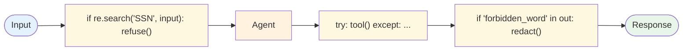

# Evolution: Tool Use → Guardrails

This document traces how the [Guardrails modifier](./overview.md) evolves from [Tool Use](../../primitives/tool_use/overview.md) augmented with ad-hoc safety checks.

## The starting point: Tool Use with prompt-level rules

The first cut at safety is usually inline in the system prompt: "If the user asks about Y, refuse." Then a regex on the input. Then a try/except around the tool call. Then an output filter when the model leaked something. Each addition is a one-line patch that does its job in isolation; the trouble is that nothing makes them coherent.



The pattern works until the team scales it.

## The breaking point

Ad-hoc safety patches break down when:

- **The team can't reason about coverage.** "Are we checking for indirect injection?" turns into a code grep across five files. No one is sure what's enforced.
- **False positives can't be triaged.** A user complains they were refused; nobody can tell which filter fired or why because there's no audit row.
- **Detector changes scare everyone.** "Update the injection regex" risks blocking real traffic; the team prefers to leave bad detectors in place rather than tune them.
- **The output filter is the last line and it shows.** Users see polished refusals from the model that include the secret the output filter was supposed to redact, because the output filter only runs on the final answer, not on intermediate reasoning.
- **Tool output starts coming back from MCP servers the team doesn't own.** Indirect prompt injection becomes a real risk; the inline rules don't account for "the tool's response might be adversarial."
- **Compliance asks for an audit trail.** "Show me every block decision in May" requires plumbing that doesn't exist.

## What changes

| Aspect | Tool Use + ad-hoc | Guardrails modifier |
|---|---|---|
| Where the policy lives | Sprinkled in code | One versioned policy artifact (YAML / JSON) |
| Detector contract | Each one ad-hoc | Uniform `Detector.check() → Verdict` interface |
| Layering | Implicit, hard to reason about | Explicit input / tool / output layers |
| Indirect injection defense | None | Dual-LLM split — actor never reads untrusted free text |
| Audit | None or per-detector ad-hoc | Per-block row with `(layer, detector, verdict, input_hash)` |
| Calibration | Manual ad-hoc | Shadow-mode + calibration eval set |
| Fail-open vs fail-closed | Whatever the try/except happened to do | Per-detector explicit declaration |
| Cross-app reuse | Copy-paste | Gateway service OR shared policy artifact |

## The evolution, step by step

### Step 1: Lift the inline filters into a Detector contract

Each inline check becomes a `Detector` with a uniform interface. Now the rules are reorderable and individually testable:

```
BEFORE:
  if re.search(r"ignore previous", input):
      refuse("injection")
  if re.search(r"\d{3}-\d{2}-\d{4}", input):
      refuse("ssn")

AFTER:
  detectors = [
      InjectionPatternDetector(corpus_version=3),
      PiiShapeDetector(shapes=["ssn", "credit_card"]),
  ]
  for d in detectors:
      v = d.check(input)
      if v.kind == "block":
          return refusal(d.name, v.reason)
```

### Step 2: Add explicit input / tool / output layers

The Gateway runs three layers in a fixed order. The same detector can be registered in multiple layers (PII on input → redact; PII on output → block).

```
gateway = Gateway(
    input_detectors=[ ... ],
    tool_detectors=[ AllowList(...), SchemaCheck(), RateBudget(...) ],
    output_detectors=[ PiiLeak(), SecretLeak(), SchemaCheck() ],
)
guarded_agent = gateway.wrap(agent)
```

### Step 3: Add the dual-LLM split

The biggest structural change. Tool output from sources the team doesn't fully trust (web search, MCP servers, retrieved docs) gets read by a quarantined LLM that emits a schema-bound summary. The privileged actor never sees the raw text.

This is what stops indirect injection. No detector can catch every adversarial string; the schema boundary catches them by construction.

### Step 4: Move policy into a versioned artifact

Detector configuration leaves code and moves to a `policy.yaml` file. Now detector tweaks are policy-review tickets, not code reviews. Per-tenant overrides and per-detector kill-switches become tractable.

### Step 5: Add shadow-mode + calibration

Each detector can run `audit_only=true`. New detectors land in shadow mode, accumulate verdicts against real traffic for a week, and get promoted to enforcement only after the FP rate is measured. The calibration eval set is part of the policy artifact.

### Step 6: Compose with the rest

Once the modifier is in place it composes naturally:

- **+ [Human in the Loop](../human_in_the_loop/overview.md)** — anything the input layer flags but doesn't block gets routed to HITL.
- **+ [RAG](../../patterns/rag/overview.md)** — retrieved docs are untrusted; the quarantined LLM reads them, the actor sees only the citation-bound summary.
- **+ [Multi-Agent](../../patterns/multi_agent/overview.md)** — the supervisor's tool surface is guarded; workers run under the supervisor's authority.

## When to make this transition

**Stay with ad-hoc checks when:**

- All input is trusted (internal automation, single-team dev workflow).
- Tools are all in-house, deterministic, and the tool output is structured by construction.
- Latency budget is sub-second and you can recover from rare wrong outputs cheaply.

**Evolve to Guardrails when:**

- The agent reads or proxies any third-party content (web, retrieved docs, MCP).
- The agent calls mutating tools (refunds, account changes, messaging).
- Compliance, security review, or an incident demands a coherent answer to "what's enforced and how do we know."
- The team is adding > 1 ad-hoc safety check per week.

## What you gain and lose

**Gain:** Coherent, layered defenses with per-block audit; the dual-LLM split as the strongest indirect-injection defense; calibration as a first-class workflow; per-tenant policy without per-tenant code; cross-app reuse via gateway or shared policy artifact.

**Lose:** 10–40% added latency; doubled model spend for tool-heavy workflows (the quarantined LLM); a new ML-ops surface (detector maintenance, calibration); a small operational team to own the policy and respond to false-positive triage.

## Evolves into

When the guardrails modifier itself accumulates complexity:

- **Centralized policy engine** — OPA / Cedar / a custom rule DSL becomes the source of truth; detectors emit signals, the policy engine decides the action. Decouples "what we observed" from "what we do about it."
- **Cross-agent policy console** — UI for security/policy teams to manage detector versions, thresholds, escape hatches, and per-tenant overrides without code deploys.
- **Adversarial red-teaming pipeline** — instead of curating an attack corpus by hand, an adversarial agent generates attacks against the guarded agent and the calibration eval set updates from the results.
