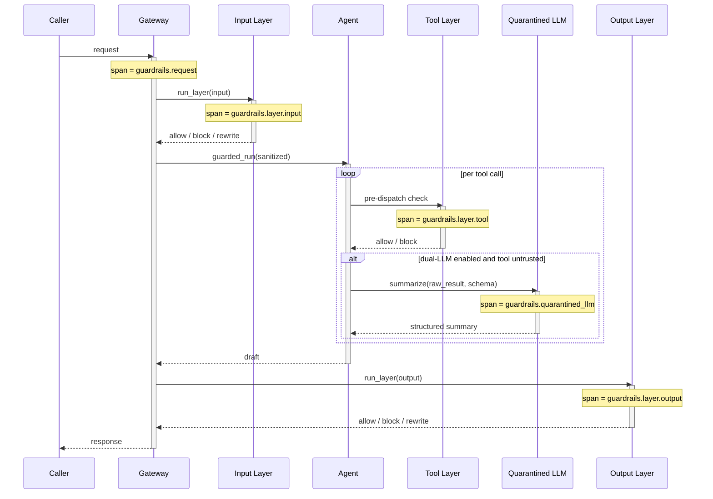

# Observability: Guardrails

What to instrument, what to log, and how to diagnose failures in guardrail-wrapped agents.

---

## Key Metrics

| Metric | Description | Alert if |
|---|---|---|
| `guardrails.block_rate{layer}` | Fraction of requests blocked at each layer | Spike (>2× baseline) — detector regression or attack wave |
| `guardrails.block_rate{detector}` | Per-detector block rate | Sudden drop — detector broken; sudden spike — calibration drift |
| `guardrails.fp_rate{detector}` | Confirmed false positives / blocks | > 5% — detector needs retuning |
| `guardrails.latency_seconds{layer}` | P50/P95/P99 latency per layer | P95 > layer budget (1ms allow-list, 200ms classifier) |
| `guardrails.detector_failure_rate{detector}` | Detector infrastructure errors / checks | > 0.1% for fail-closed detectors — page |
| `guardrails.shadow_disagreement_rate{detector}` | Shadow detector verdicts that differ from enforced verdict | Informational — informs promotion decisions |
| `guardrails.quarantined_llm_calls_total` | Quarantined LLM invocations (dual-LLM split) | Drop to 0 with non-zero tool calls — dual-LLM bypassed |
| `guardrails.quarantined_llm_latency_seconds` | Latency of the quarantined call | P95 — cap budget; consider faster model |
| `guardrails.bypass_uses_total` | Times an escape hatch was used | **Any** — investigate every use |
| `guardrails.rewrites_total` | Times the output layer triggered a regenerate | Trending up — output drift; tune prompt or model |

Page on `detector_failure_rate{fail_closed} > 0.1%` and any `bypass_uses_total` increment. The rest are notification-level.

---

## Trace Structure

Each request is a root span; each layer is a child span; each detector is a grandchild span.



---

## Span Reference

| Span name | Emitted | Key attributes |
|---|---|---|
| `guardrails.request` | Once per wrapped agent run | `request_id`, `tenant`, `policy_version`, `outcome` (allowed / blocked / rewritten) |
| `guardrails.layer.input` | Once per request | `verdict_summary`, `detectors_run`, `duration_ms`, `blocked_by` (if blocked) |
| `guardrails.layer.tool` | Once per tool call | `tool_name`, `verdict_summary`, `duration_ms`, `blocked_by` |
| `guardrails.layer.output` | Once per request | `verdict_summary`, `detectors_run`, `duration_ms`, `blocked_by`, `rewrites` |
| `guardrails.detector.check` | Once per detector check | `detector_name`, `verdict`, `confidence`, `duration_ms`, `shadow_mode` |
| `guardrails.quarantined_llm` | Once per quarantined summarization | `tool_name`, `input_tokens`, `output_tokens`, `model`, `duration_ms`, `schema` |
| `guardrails.bypass.use` | Once per escape-hatch use | `bypass_id`, `actor`, `reason`, `policy_section` |

Propagate `request_id` through every child span and into the wrapped agent's downstream spans so the full lifecycle is queryable.

---

## What to Log

### On a normal (allow) request

```
INFO  guardrails.request.start        request_id=req_01HV...  tenant=acme  policy_version=2026-05-04
INFO  guardrails.layer.input.done     request_id=...  outcome=allow  detectors_run=5  duration_ms=42
INFO  guardrails.quarantined_llm.call request_id=...  tool=web_search  input_tokens=320  output_tokens=64
INFO  guardrails.layer.output.done    request_id=...  outcome=allow  detectors_run=4  duration_ms=18
INFO  guardrails.request.done         request_id=...  outcome=allowed  total_duration_ms=412
```

### On a block

```
WARN  guardrails.layer.input.block    request_id=...  detector=injection_classifier_v3  verdict=block
                                      confidence=0.91  input_hash=sha256:...
INFO  guardrails.request.done         request_id=...  outcome=blocked  blocked_at=input
                                      blocked_by=injection_classifier_v3
```

### On a rewrite (output layer soft-block)

```
WARN  guardrails.layer.output.rewrite request_id=...  detector=pii_leak  field=email
                                      suggestion="redact_email_address"
INFO  guardrails.request.done         request_id=...  outcome=rewritten  rewrites=1
```

### On detector failure (fail-open)

```
ERROR guardrails.detector.failure     detector=toxicity_classifier_v2  error="upstream timeout"
                                      policy=fail_open  action=allow_with_audit
```

### On detector failure (fail-closed)

```
ERROR guardrails.detector.failure     detector=auth_check  error="OPA unreachable"
                                      policy=fail_closed  action=block
```

### On bypass

```
WARN  guardrails.bypass.use           bypass_id=ops-emergency-2026-06-09
                                      actor=alice@acme.com  reason="prod incident #4123"
                                      policy_section=tool.allow_list
```

---

## Common Failure Signatures

### Block rate spike at the input layer

- **Symptom**: `block_rate{layer=input}` jumps from 0.5% to 20%.
- **Log pattern**: Clustered `guardrails.layer.input.block` lines, mostly one detector firing.
- **Diagnosis**: Either a real attack wave, or detector drift (the threshold is too tight). Check the per-detector `confidence` distribution.
- **Fix**: If real attacks, leave the block in place and notify security. If drift, pull samples from the audit log, label them, and adjust the threshold via the policy artifact.

### Detector silently broken

- **Symptom**: `block_rate{detector=X}` drops to ~0 after a deploy.
- **Log pattern**: Detector `check` spans complete but `verdict=allow` for cases that historically blocked.
- **Diagnosis**: A model update, a regex regression, or a dependency change broke the detector.
- **Fix**: Roll back the detector version in the policy. The shadow-mode harness should have caught this; if it didn't, the eval set is stale.

### Quarantined LLM bypass

- **Symptom**: `quarantined_llm_calls_total` drops while tool calls continue normally.
- **Log pattern**: `guardrails.quarantined_llm` spans missing; tool results flowing directly into the actor span.
- **Diagnosis**: A code path bypassed the dual-LLM split. Often a new tool added without the `untrusted_source` flag.
- **Fix**: Default tool registration to `untrusted_source=true`; require an explicit `trusted=true` override.

### Fail-closed detector taking down the agent

- **Symptom**: `request_blocked_by=auth_check` spike; `auth_check.failure_rate` matches.
- **Diagnosis**: The fail-closed detector is itself failing. Infrastructure dependency is down.
- **Fix**: Page on-call for the dependency. If the detector is over-strict on fail-closed (e.g., a soft dependency that should fail-open), adjust the policy.

### Output rewrites trending up

- **Symptom**: `rewrites_total` doubles over a week with no policy change.
- **Diagnosis**: The model is drifting toward outputs the output layer doesn't like (PII leakage, citation drop, format drift). Often follows a prompt change or model upgrade.
- **Fix**: Pull recent rewrite samples; identify the common pattern; fix the agent prompt (better default), not the output layer (the layer is correctly catching the drift).

### Bypass usage

- **Symptom**: Any `bypass_uses_total` increment.
- **Diagnosis**: Per policy, every bypass use is investigated. The hatch exists for legitimate emergency operations; mis-use means the policy has the wrong default.
- **Fix**: Confirm the bypass was authorized (auth token + audit row). If a class of bypass is used regularly, the policy should change to allow it without a bypass; if it's used rarely, the audit is sufficient.

---

## What ends up in the policy console

The audit log is the source of truth for tuning the policy. Most teams build (or buy) a console that surfaces:

- Per-detector block rate trend (week-over-week).
- Top 20 blocked inputs per detector (input hashes + samples surfaced for human review).
- Shadow-mode disagreement rate (where the shadow detector said something different from the enforced one).
- Per-tenant policy diffs.
- Bypass-uses feed with a Triage button.

The console doesn't need to be Anthropic-grade — a Grafana board + an audit-log search is enough for most teams to start.
