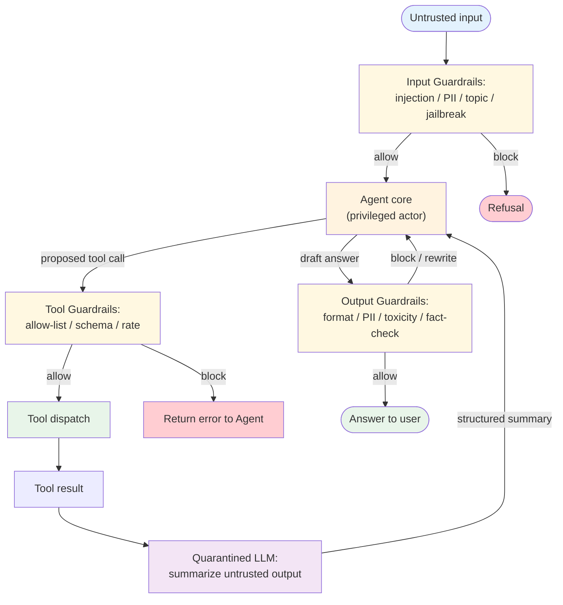

# Guardrails — Overview

An agent that touches untrusted input, untrusted tool output, or customer-visible output usually needs structural defenses around it — not just a hopeful system prompt. The **Guardrails** modifier formalises those defenses: layered checks on the way in, on the way out, and around tool dispatch, with explicit fail-open vs fail-closed behavior on each layer.

**Evolves from:** [Tool Use](../../primitives/tool_use/overview.md) — adds policy-driven validators between the LLM and the tool call, between the tool result and the LLM, and between the LLM's final answer and the user.

## Architecture



*Figure: Three guardrail layers wrap the agent — input, tool, and output. The dual-LLM split (privileged actor + quarantined reader) prevents untrusted tool output from carrying instructions back to the actor.*

## How It Works

1. **Input layer.** Every untrusted input (user message, retrieved doc, webhook body) passes through detectors: prompt-injection patterns, PII shapes, topic policy, jailbreak strings, length / structure caps. Each detector has a verdict (`allow` / `block` / `flag`) and an action policy (refuse, sanitize, escalate).
2. **Privileged-actor LLM.** The main agent never reads raw untrusted content directly when possible. It works from sanitized, structured summaries produced by the quarantined LLM.
3. **Tool layer.** Before any tool dispatch, the call is validated against an allow-list (tool name), a schema (argument shape), and a rate budget (per-agent, per-tenant). Mutating tools get extra checks (parameter ranges, authorization).
4. **Quarantined LLM (dual-LLM).** Untrusted tool output is read by a separate, non-privileged LLM that can only emit a structured summary in a known schema. That summary — not the raw output — re-enters the actor's context.
5. **Output layer.** The actor's draft answer passes through output validators: schema compliance, PII leak detection, secret leak detection, toxicity, policy adherence. A block triggers a regenerate or a stock refusal.
6. **Audit.** Every block decision logs `(layer, detector, verdict, input_hash, action)` for after-the-fact tuning.

## Minimal Example

```python
from modifiers.guardrails.code.python.gateway import (
    Guardrails, InputPolicy, ToolPolicy, OutputPolicy,
)

guards = Guardrails(
    input=InputPolicy(
        detect_injection=True,
        detect_pii=("email", "ssn"),
        block_topics=("legal_advice", "medical_diagnosis"),
        max_chars=8000,
    ),
    tools=ToolPolicy(
        allow_list=("search", "calculator", "refund"),
        rate_per_minute={"refund": 5},
        require_schema=True,
    ),
    output=OutputPolicy(
        forbid_secrets=True,
        forbid_pii=("ssn", "credit_card"),
        max_chars=4000,
        require_citation=True,
    ),
    dual_llm=True,                 # quarantined LLM reads untrusted tool output
    on_block="refuse_with_audit",  # "rewrite" | "refuse_with_audit" | "escalate"
)

# Wrap an existing ReAct agent
guarded_agent = guards.wrap(react_agent)
answer = guarded_agent.run(user_message=untrusted_input)
```

## Input / Output

- **Input:** Untrusted text (user message, retrieved document, webhook body, tool result) + policy config
- **Output:** Either the agent's answer (allowed) OR a refusal / sanitized rewrite / escalation
- **Audit row:** `(layer, detector, verdict, input_hash, decided_at, action_taken)` per block decision

## Key Tradeoffs

| Strength | Limitation |
|----------|-----------|
| Defense in depth — no single check is load-bearing | Each layer adds latency; total agent latency increases 10–40% |
| Composable with every pattern (the modifier wraps the pattern) | Over-blocking erodes trust; users learn to phrase around the rules |
| Dual-LLM split breaks the indirect-injection attack path | Doubles model spend for tool-heavy workflows |
| Detectors evolve independently of the agent | Detector maintenance becomes its own ML-ops surface |
| Auditable per-block reasoning | Block decisions can be hard to explain to the affected user |

## When to Use

- **The agent handles untrusted input** — user messages, retrieved documents (RAG), webhook payloads, MCP tool output from third-party servers.
- **The agent calls mutating tools** — refunds, account changes, sending messages, posting to external services. Tool-layer guardrails are mandatory here.
- **Compliance requires output controls** — no PII leakage, no policy-violating content, no unsanctioned advice. Output-layer guardrails are mandatory.
- **The cost of a wrong action is high enough to justify the latency tax.**
- **You're integrating MCP servers you don't own** — tool poisoning and indirect injection are real attack surfaces. See [Security & Safety](../../foundations/security-and-safety.md).

## When NOT to Use

- The agent only handles trusted input (internal-only, single-developer workflow) — defense in depth is over-engineering.
- Latency budget is sub-second and the cost of a wrong output is recoverable — gate after the fact instead.
- Every detector you'd add has > 30% false positive rate against your traffic — over-blocking will cost more than the attack would.
- You only need a single layer (e.g., just output schema validation) — use the validator directly; no modifier needed.

## Dual-LLM in one sentence

The privileged LLM holds the tools but never reads untrusted content directly; the quarantined LLM reads untrusted content but cannot take action. The privileged model receives only structured summaries from the quarantined one. This is the strongest architectural defense against indirect prompt injection — it breaks the path that injected instructions need to reach the actor.

## Related

- **Evolves from:** [Tool Use](../../primitives/tool_use/overview.md) — adds three policy layers around the tool dispatch
- **Composes with:** [Human in the Loop](../human_in_the_loop/overview.md) — guardrails handle the routine; HITL gates the genuinely ambiguous; [RAG](../../patterns/rag/overview.md) — retrieved docs are untrusted input; the quarantined LLM is the natural reader; [Multi-Agent](../../patterns/multi_agent/overview.md) — guardrails wrap the supervisor's tool-call surface
- **Contrast with:** HITL — HITL is a human deciding ambiguous cases; guardrails are policy deciding routine cases. Use both for serious risk surfaces.

## Deeper Dive

- **[Design](./design.md)** — Three-layer architecture; the dual-LLM pattern; detector taxonomy; fail-open vs fail-closed; gateway vs in-process; policy as data
- **[Implementation](./implementation.md)** — Detector interfaces, layering, escape hatches, calibration, integration with NeMo Guardrails / Guardrails AI / LlamaFirewall
- **[Evolution](./evolution.md)** — Tool Use → output filter → input filter → dual-LLM
- **[Observability](./observability.md)** — Block rate, false-positive rate, layer-wise latency, attack-pattern dashboards
- **[Cost & Latency](./cost-and-latency.md)** — Per-layer latency tax, dual-LLM cost shape, calibration cost

## When NOT to use this pattern

- The input is fully trusted (internal automation, dev workflows) — the cost is all overhead.
- You can't calibrate the detectors against real traffic — uncalibrated detectors over-block and erode trust.
- You're using a single check (e.g., only output schema validation) — use the validator directly, don't wrap it in a modifier.

## Next steps

- Production version: see [Blueprints → Deployments](../../composition/blueprints-to-deployments.md) for the deployment agents that use this modifier.
- Generate a starter project: see [Blueprint → Spec → Scaffold](../../composition/blueprint-to-spec-to-scaffold.md).
- Combine with other patterns: see the [Composition guide](../../composition/README.md).
