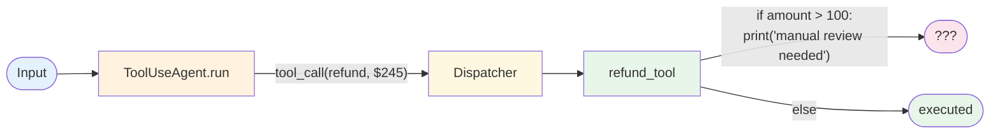

# Evolution: Tool Use → Human in the Loop

This document traces how the [Human in the Loop pattern](./overview.md) evolves from [Tool Use](../../primitives/tool_use/overview.md) augmented with an approval flag.

## The Starting Point: Tool Use with a "needs review" flag

In Tool Use, the agent picks a tool and the dispatcher executes it. If the team needs governance, the first naive cut is to put a conditional in the tool function itself:



The tool function prints a warning and either executes anyway (lose) or raises an exception (lose: the agent has no way to actually request approval). There's no concept of "pause, get a human, resume." Real systems then accumulate ad-hoc workarounds: emails to a shared inbox, hand-pasted CSVs of pending actions, a Slack channel where someone manually runs `psql` to commit the approved row.

## The Breaking Point

Approval-as-tool-side-effect breaks down when:

- **The pending state has nowhere to live.** The agent process holds the proposal in memory; if it crashes or the HTTP request times out, the proposal is lost. The approver responds to an email about a proposal that no longer exists.
- **No surface, no audit trail.** The team finds out about a bad approval after the customer complaint, because no one wrote down who approved what at what time.
- **Approvers race or duplicate.** Two ops engineers both see the same Slack message and both manually execute the underlying action. The customer gets two refunds.
- **Timeouts don't have a policy.** Approvals sit pending forever; revenue work stalls because Alice is on vacation and nobody picks up her queue.
- **Compliance demands a named approver.** The auditor asks "who approved this $5000 refund?" and the answer is "I think Bob? Maybe? Let me check Slack history."

## What Changes

| Aspect | Tool Use + flag | Human in the Loop |
|--------|-----------------|-------------------|
| Where the proposal lives | Agent process memory | Durable pending store (DB / checkpoint) |
| Approver surface | Ad-hoc (email, Slack, "tap me on the shoulder") | First-class (Slack / email / web UI / CLI) with structured render + decision contract |
| Decision capture | Manual SQL after the fact | Webhook → audit log → agent resume, all in one flow |
| Timeout behaviour | Proposal stuck forever | Explicit TTL + policy (auto-approve / auto-deny / escalate) |
| Audit trail | Slack history (incomplete) | Per-decision `(proposal_id, approver, decision, context_shown, decided_at)` row |
| Concurrent approvers | Race condition; double-execute possible | First-decision wins (idempotent); second approver gets "already decided" |
| Crash recovery | Lose the proposal | Reload pending state from store; resume on decision |
| Compliance defensibility | Weak | "Alice saw THIS context and approved THIS action" |

## The Evolution, Step by Step

### Step 1: Pull the approval flag out of the tool into a policy

The decision of "does this need review?" is not the tool's responsibility. It's a policy applied **between** the agent picking the tool and the dispatcher invoking it:

```
BEFORE:
  def refund_tool(amount, customer_id):
      if amount > 100:
          print("manual review needed")   # not actually a gate
      issue_refund(amount, customer_id)

AFTER:
  def needs_review(tool_call):
      if tool_call.name == "refund_tool" and tool_call.args["amount"] > 100:
          return True
      return False

  if needs_review(tool_call):
      decision = approval_gate.request_approval(tool_call)
      if decision.outcome != "approved":
          return decision
  dispatch(tool_call)
```

### Step 2: Add a durable pending store

The pending state survives the agent process dying:

```
proposals table:
  proposal_id      UUID
  agent_checkpoint JSONB           -- full agent state at the gate
  surface          TEXT
  expires_at       TIMESTAMPTZ
  state            ENUM            -- pending | approved | denied | timed_out | modified
  created_at       TIMESTAMPTZ
```

Now a coordinator restart loads any `pending` proposals and re-arms their wait — the agent is resumable.

### Step 3: Make the surface a first-class component

Stop bolting Slack onto the side. Define a `Surface` interface (`render(proposal) → message`, `parse(reply) → decision`) so the same gate can route to Slack, email, web, or CLI per proposal class without rewriting the gate logic:

```
class Surface(Protocol):
    def deliver(self, proposal: Proposal) -> str: ...   # returns surface-side handle (msg_id, ticket_id)
    def parse_decision(self, payload: dict) -> Decision: ...
```

Now the gate can route high-value proposals to Slack-with-buttons and low-value ones to an email digest queue, with the same audit + resume plumbing.

### Step 4: Add TTL and escalation policy

Approvals need a deadline. Per proposal class, declare:

```
escalation_policy:
  ttl_seconds: 900
  on_timeout: escalate          # auto_approve | auto_deny | escalate
  escalate_to: approver_pool_l2
```

A timeout handler scans for expired pending proposals and applies the policy. Without this, your queue fills with stale proposals and approvers learn to ignore the channel.

### Step 5: Compose with the rest

Once HITL is a first-class gate, it composes naturally:

- **+ [Saga](../../patterns/saga/overview.md)** — Gate the most irreversible step in a saga; if denied, the saga compensates the prior steps.
- **+ [Event-Driven](../../patterns/event_driven/overview.md)** — Proposals become events; decisions become events; the agent is a consumer like any other.
- **+ Audit logging** (`agent-deployments/docs/cross-cutting/audit-logging.md`) — every decision is automatically an audit-log row.

## When to Make This Transition

**Stay with auto-execute when:**

- All your tools are safe to run without review (read-only, idempotent, easy to undo).
- The cost of a wrong action is small enough that catching it after-the-fact is cheaper than gating.
- The action is reversible via a Saga compensator without customer-visible damage.

**Evolve to HITL when:**

- Tools commit money, send customer-visible communications, or trigger irreversible workflows.
- Compliance / regulatory rules require a named accountable human per action class.
- The model's confidence is low for the decision but high enough to propose; let a human be the tiebreaker.
- You're bootstrapping a new agent and want a human reviewing everything for the first N days (then graduating tools out of the gate as confidence grows).

## What You Gain and Lose

**Gain:** Auditable governance without rewriting agents; crash-resilient approvals (the pending state survives a coordinator restart); pluggable approver surfaces (Slack today, web tomorrow); explicit timeout + escalation policy that you can tune from metrics; first-class composition with Saga and Event-Driven.

**Lose:** Wall-clock latency dominated by human response time (seconds-to-hours, not milliseconds); a new operational dependency (approvers and their on-call rotation); the risk of approval fatigue if the policy flags too much (mitigate by tracking approval rate and tuning the gate).

## Evolves Into

When HITL itself becomes a bottleneck or a sprawling collection of one-off gates:

- **Policy-engine-driven gates** — instead of per-tool `if amount > 100` checks scattered through code, a centralized policy engine (OPA, Cedar, custom rule DSL) decides what's gated. The gate becomes the enforcement point; the policy becomes its own versioned artefact.
- **Multi-party approvals** — two-of-three approval for high-value actions; quorum-based decisions; named-approver rotation. Doable on top of the same gate, just a richer Decision shape.
- **Workflow-engine HITL** — When approvals span multiple steps and approver roles (KYC review → fraud review → compliance sign-off), a workflow engine (Temporal, Step Functions) with first-class HITL primitives starts to pay off vs maintaining custom gate plumbing.
