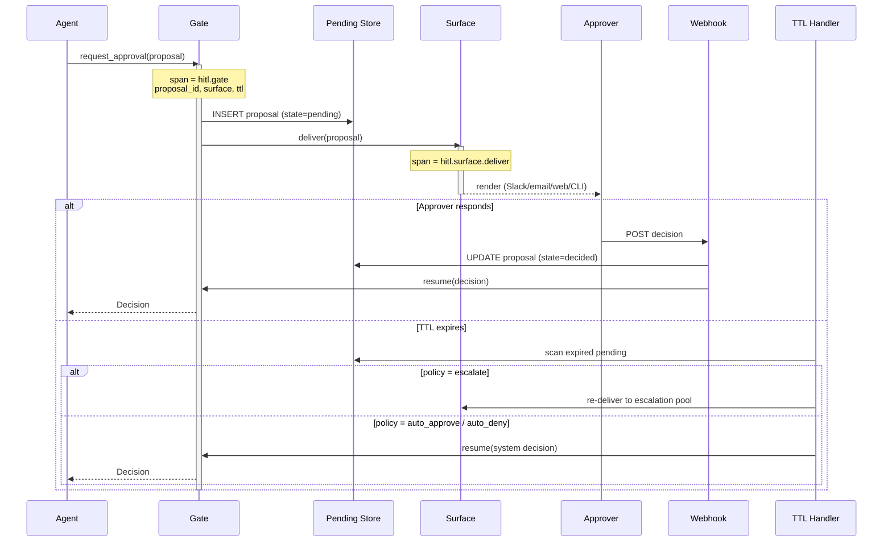

# Observability: Human in the Loop

What to instrument, what to log, and how to diagnose failures in HITL-gated agents.

---

## Key Metrics

| Metric | Description | Alert if |
|--------|-------------|----------|
| `hitl.proposals.created_total` | Total proposals submitted to a gate | Drop to 0 over 1h (gate broken, or no high-risk actions; investigate) |
| `hitl.proposals.pending_count` | Current `pending` proposals (gauge) | Growing — approver pool can't keep up |
| `hitl.approval_latency_seconds` | Time from proposal create → decision (P50/P95/P99) | P95 > SLA for the proposal class |
| `hitl.timeout_rate` | Proposals that expired before any decision | > 10% sustained — TTL too short or surface wrong |
| `hitl.approval_rate` | Approved decisions / total decisions | Sudden change (>20% delta) — model behaviour shift or policy regression |
| `hitl.denial_rate` | Denied decisions / total decisions | Sudden spike — proposals are landing that the approver doesn't want |
| `hitl.modification_rate` | Modified decisions / total decisions | High (>20%) — agent's proposals are close-but-wrong; tune the prompt |
| `hitl.escalation_rate` | Proposals that hit the escalation surface / total | > 15% — primary surface is unreachable or under-staffed |
| `hitl.stuck_proposals` | Proposals `pending` past 2× their TTL | **Any non-zero** — TTL handler is broken; page |
| `hitl.race_collisions` | Concurrent decisions on the same proposal_id | Sustained nonzero — webhook idempotency issue |
| `hitl.per_approver_throughput` | Decisions / approver / day | Drop to 0 for any approver (sick, on leave, never logged in) |

Page on `stuck_proposals > 0` and `race_collisions > 0`. Notify on timeout-rate, escalation-rate, and denial-rate spikes. The rest are informational.

---

## Trace Structure

Each gated proposal is a span across the agent root span. The pause between `interrupt()` and `resume` is the dominant duration.



---

## Span Reference

| Span name | Emitted | Key attributes |
|-----------|---------|----------------|
| `hitl.gate` | Once per proposal (covers entire pause) | `proposal_id`, `action`, `approver_pool`, `surface`, `ttl_seconds`, `outcome`, `decided_in_seconds`, `escalated` |
| `hitl.surface.deliver` | Once per surface attempt (including escalations) | `proposal_id`, `surface`, `escalation_level`, `duration_ms` |
| `hitl.webhook.receive` | Once per inbound decision | `proposal_id`, `approver`, `outcome`, `duration_ms` |
| `hitl.ttl.expire` | Once per timeout handler run | `proposal_id`, `policy`, `escalation_level`, `final_outcome` |
| `hitl.audit.append` | Once per decision | `proposal_id`, `decision_class`, `duration_ms` |

Propagate `proposal_id` through every child span and into the agent's downstream spans so the full lifecycle is queryable (`proposal_id = X` returns the gate span, every surface delivery, the webhook receipt, the audit append, and the agent execute span that followed).

---

## What to Log

### On proposal create

```
INFO  hitl.gate.start         proposal_id=rebook:case_01HVY...  action=rebook_reservation
                              approver_pool=restaurant_staff  surface=slack:#rebooking-approvals
                              ttl_seconds=900  estimated_value_usd=245
INFO  hitl.surface.delivered  proposal_id=rebook:case_01HVY...  surface=slack  msg_id=...  duration_ms=312
```

### On approval

```
INFO  hitl.webhook.receive    proposal_id=rebook:case_01HVY...  approver=alice@acme.com  outcome=approved
INFO  hitl.gate.done          proposal_id=rebook:case_01HVY...  outcome=approved  decided_in_seconds=412
INFO  hitl.audit.append       proposal_id=rebook:case_01HVY...
```

### On modification

```
INFO  hitl.webhook.receive    proposal_id=...  approver=alice@acme.com  outcome=modified
                              modification={"candidate_index": 1, "send_sms": false}
INFO  hitl.gate.done          proposal_id=...  outcome=modified  decided_in_seconds=288
```

### On TTL escalation

```
WARN  hitl.ttl.expire         proposal_id=...  ttl_elapsed_seconds=915  policy=escalate
                              escalation_level=1  escalating_to=#rebooking-l2
INFO  hitl.surface.delivered  proposal_id=...  surface=slack  msg_id=...  escalation_level=1
```

### On TTL auto-deny

```
WARN  hitl.ttl.expire         proposal_id=...  policy=auto_deny  final_outcome=denied
                              approver=system:ttl_expired
INFO  hitl.gate.done          proposal_id=...  outcome=denied  decided_in_seconds=1801
```

### On stuck proposal (TTL handler missed it)

```
ERROR hitl.proposal.stuck     proposal_id=...  age_seconds=2104  expected_ttl=900
                              note="TTL handler should have caught this; investigate scheduler"
```

The `hitl.proposal.stuck` log line fires the page. The TTL handler missing entries usually means the cron isn't running or the SCAN query is selecting the wrong rows.

---

## Common Failure Signatures

### Pending count climbing while ingress is flat

- **Symptom**: `hitl.proposals.pending_count` rises monotonically; approval latency P95 climbing.
- **Log pattern**: Many `hitl.gate.start` lines, fewer matching `hitl.gate.done`.
- **Diagnosis**: Approver pool is saturated. The bottleneck has moved from the agent to the humans.
- **Fix**: Short-term, expand the on-call pool or lower the gate threshold (auto-approve more low-risk cases). Long-term, tune `needs_review` to flag fewer false positives, OR move to a more responsive surface (Slack with @-mentions instead of email).

### Timeout rate jumps

- **Symptom**: `hitl.timeout_rate` rises from steady-state ~2% to 20%+.
- **Log pattern**: Many `hitl.ttl.expire` events; clusters by `surface`.
- **Diagnosis**: Either the TTL is too short for actual human-response time on this surface, OR the surface is unreachable (Slack down, email blocked, web UI throwing 500s).
- **Fix**: Pull up `hitl.surface.deliver` errors first to rule out delivery failures. If delivery is fine, raise the TTL for that proposal class to the actual P95 response time, or move to a faster surface.

### Modification rate high

- **Symptom**: `hitl.modification_rate` consistently > 20%; approvers frequently tweak the proposal before approving.
- **Log pattern**: `hitl.webhook.receive outcome=modified` lines with structured `modification` payloads showing the same kind of tweak.
- **Diagnosis**: The agent's proposals are systematically close-but-wrong. Same modification type repeated means a prompt regression OR a missing context input.
- **Fix**: Sample 20 recent modifications, find the common tweak, fix the agent's prompt or input. If the modifications are all "lower the value by X%", maybe the agent is over-quoting; if they're all "send to channel Y instead of Z", maybe the agent is missing a routing input.

### Race collisions

- **Symptom**: `hitl.race_collisions` nonzero; two approvers' webhooks land within milliseconds for the same proposal.
- **Log pattern**: Two `hitl.webhook.receive` lines with the same `proposal_id` and different `approver`.
- **Diagnosis**: Webhook handler isn't idempotent. The pending store update should use `UPDATE ... WHERE state = 'pending'` so the second writer sees zero rows affected and returns "already decided."
- **Fix**: Wrap the decision in a `BEGIN; SELECT ... FOR UPDATE; ... COMMIT` block, or use a per-proposal Redis lock. Verify by replaying the original collision: the second writer should get the "already decided" response.

### Auto-approve / auto-deny rate spikes for a specific approver

- **Symptom**: `hitl.per_approver_throughput` drops to 0 for one approver; their queue's `timeout_rate` jumps.
- **Diagnosis**: That approver is unavailable (sick, on leave, account deactivated) but is still in the pool.
- **Fix**: Wire the approver pool to your team's on-call schedule (PagerDuty, OpsGenie) so disabled approvers are skipped automatically.
