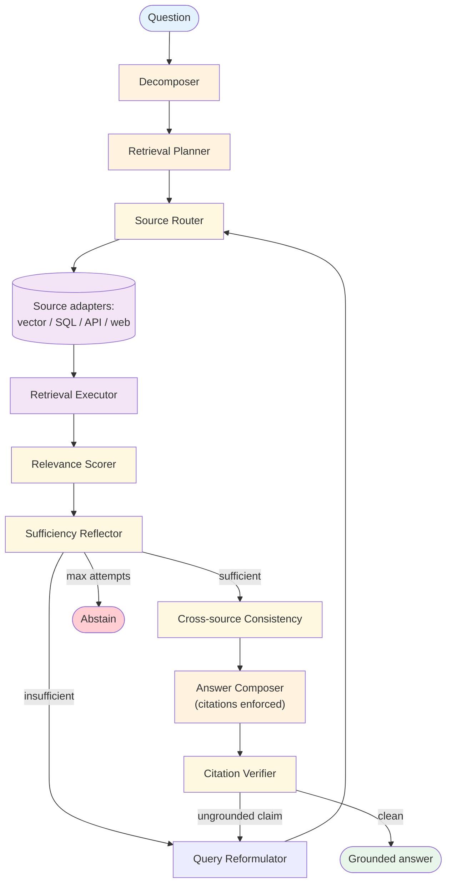

# Agentic RAG — Design

> Canonical Pydantic state schema: [`schemas/state.py`](schemas/state.py) — `AgenticRagState` is the top-level shape; `SubQuestion`, `RetrievalAttempt`, `EvidenceChunk`, `Citation` are the auxiliary models.

## Component Breakdown



### Decomposer

LLM call that splits a compound question into sub-questions. Simple questions pass through unchanged. The decomposer's output is a structured list of `SubQuestion` records, each carrying the sub-question text and (optionally) a routing hint.

Failure mode: over-decomposition (asking three questions when one would do) inflates cost. Calibrate against typical queries — most questions decompose into 1–3 sub-questions.

### Retrieval Planner

For each sub-question, decides: which source(s), how many results to pull, whether to issue multiple variations. Often a single LLM call that reads source descriptions and routes.

### Source Router

The runtime side of the planner's routing. Takes a `(sub_question, source_name)` and dispatches to the right adapter. Source adapters are uniform — they all accept a query string and return ranked `EvidenceChunk` records.

### Source Adapters

| Kind | Query shape | Returns |
|---|---|---|
| `vector` | Natural language → embedding → top-K | Chunks with embedding distance |
| `sql` | Natural language → LLM-translated SQL → rows | Row sets as chunks |
| `api` | Structured query → API call | Structured JSON as chunks |
| `web` | Natural language → search → fetch | Web snippets as chunks |

Adding a new source type is an adapter implementation. The runner doesn't know the difference.

### Relevance Scorer

Embedding similarity is a starting signal, not the answer. A scorer pass (often an LLM call) reads each retrieved chunk and labels it as relevant / partially-relevant / irrelevant. This is cheap (Haiku-class) and catches false-positive retrievals before they reach the answer.

### Sufficiency Reflector

The agentic part. Given the sub-question, the retrieved chunks, and their scores: is there enough evidence to answer? Outputs `{verdict: "sufficient" | "insufficient", missing: "..."}`. Insufficient verdicts trigger reformulation.

### Query Reformulator

Given the sub-question, the reflection's `missing` field, and the prior attempts: produce a new query that targets the gap. Often a different phrasing, a different source, or a narrower / broader scope.

### Cross-source Consistency

When the same sub-question pulled evidence from multiple sources, does the evidence agree? Conflicts are surfaced in the answer ("Source A says X, source B says Y") rather than silently merged. This is the primary defense against RAG poisoning of a single source.

### Answer Composer

Generates the final answer. The prompt requires citation markers (e.g., `[handbook:§3.2]`) inline with claims. Without citations, the composer refuses to emit (regenerate, not commit).

### Citation Verifier

Re-reads the answer and checks: every factual claim has a citation; every citation resolves to an actual chunk in the retrieved evidence. Ungrounded claims either trigger a regenerate (with the missing claim flagged) or a reformulation pass.

## The reflection-driven retrieval loop

The loop is the heart of the pattern. Pseudocode:

```
for attempt in range(max_attempts):
    chunks = source_router.retrieve(sub_question)
    scored = relevance_scorer.score(sub_question, chunks)
    verdict = sufficiency_reflector.check(sub_question, scored)
    if verdict.sufficient:
        evidence[sub_question] = scored
        break
    sub_question = query_reformulator.refine(sub_question, verdict.missing, attempts_so_far=attempt)
else:
    evidence[sub_question] = None   # abstain on this sub-question
```

The cap (`max_attempts`) bounds cost. Common settings: 3 for cost-sensitive, 5 for high-stakes.

## Abstention policy

When evidence is insufficient after the cap, three options:

| Policy | What happens | Best for |
|---|---|---|
| Hard abstain | "I don't have enough information to answer." | Customer support, anything with a "could be wrong" cost |
| Partial answer with caveat | "I can answer X but not Y; here's what I have on X." | Multi-part questions where partial value is real |
| Escalate to human | Route to HITL | High-stakes domains, ambiguous-by-design queries |

The wrong choice is silent guessing. Picking and stating the policy upfront prevents drift.

## Cross-source consistency

When evidence for the same sub-question comes from multiple sources, four cases:

| Case | Action |
|---|---|
| Sources agree | Use any; cite the most authoritative |
| Sources mildly disagree | Cite both; note the divergence in the answer |
| Sources strongly disagree | Flag conflict; surface to the user with both citations |
| One source poisoned, others clean | The clean majority wins; the outlier is noted but not cited |

The poisoning-defense story: if an attacker manipulates one vector store, cross-source consistency exposes the outlier. If the attacker has compromised every source the same way, the pattern doesn't help — but that's a much higher bar.

## Source registry

Each source has a description the planner reads. The description is what makes routing work.

```yaml
sources:
  - name: handbook
    kind: vector
    description: "Internal HR policies, benefits, compensation, and procedures. Updated quarterly. Authoritative for current company policy."
    when_to_use: "Questions about benefits, leave policies, internal procedures."
    when_not_to_use: "External benchmark questions, industry comparisons."
  - name: hr_policy_db
    kind: sql
    description: "Structured table of policy effective dates, version history, exception logs. Authoritative for *when* a policy applied."
    when_to_use: "Questions about policy timing, version history, exception decisions."
    when_not_to_use: "Free-text policy questions."
  - name: web
    kind: web_search
    description: "Public web search. Good for industry benchmarks, news, general references."
    when_to_use: "Industry comparisons, external benchmarks, current events."
    when_not_to_use: "Anything requiring authoritative answers about our company specifically."
```

Bad descriptions are the most common source of bad routing. Audit them against a labeled query set.

## Citation discipline

Every factual claim must cite. The chunks_used contract:

- Each retrieved chunk has a stable id (`source:doc:chunk` or `source:row_id` for SQL).
- The composer's prompt requires citation markers inline (`[handbook:§3.2]`, `[hr_db:row_4198]`).
- The verifier maps citation markers to retrieved chunk ids; unmapped markers are a failure.
- Citations carry the chunk's relevance score so the answer can surface confidence per claim.

## Production concerns

| Concern | This pattern's surface | Where to read |
|---|---|---|
| Prompt injection | retrieved chunks are untrusted; route them through a quarantined LLM | [foundations/security-and-safety.md](../../foundations/security-and-safety.md) |
| Hallucination | citation verifier IS the grounding check; abstention policy IS the safety net | [foundations/hallucination-and-grounding.md](../../foundations/hallucination-and-grounding.md) |
| RAG poisoning | cross-source consistency is the primary defense; single-source agentic RAG inherits baseline RAG's vulnerability | [foundations/security-and-safety.md](../../foundations/security-and-safety.md) |
| Cost & model selection | retries multiply cost; tier the loop (Haiku for relevance scoring, Sonnet for reflection, Opus for compose) | [foundations/cost-and-model-selection.md](../../foundations/cost-and-model-selection.md) |
| Context engineering | per-attempt context is curated, not cumulative; don't pass prior retrievals into the next attempt's context | [foundations/context-engineering.md](../../foundations/context-engineering.md) |
| Observability hooks | see `observability.md` | [foundations](../../foundations/README.md) |

## Composition

- **+ [Reflection](../reflection/overview.md)** — the sufficiency reflector and citation verifier ARE reflection components. Some teams build the whole pattern from a reflection harness over baseline RAG.
- **+ [Sub-agents](../../primitives/sub_agents/overview.md)** — each sub-question can spawn a sub-agent that owns its retrieval loop. Useful for parallel sub-questions.
- **+ [Routing](../routing/overview.md)** — source routing IS routing. Some teams have a separate Routing pattern in front of the agentic RAG that decides "RAG-domain question? or tool-use question?"
- **+ [Guardrails](../../modifiers/guardrails/overview.md)** — retrieved chunks are untrusted text. The quarantined LLM reads them; the actor sees only the citation-bound summary.
- **+ [Memory](../../primitives/memory/overview.md)** — successful (sub-question, source) pairings become memory hints for similar future questions.
