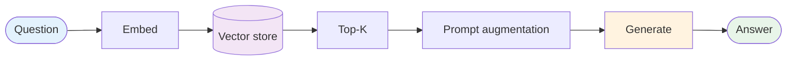

# Evolution: RAG → Agentic RAG

This document traces how [Agentic RAG](./overview.md) emerges from baseline [RAG](../rag/overview.md) once a single retrieval per question stops being enough.

## The starting point: one retrieval per question

Baseline RAG is a one-shot pipeline: embed the question, query the vector store, top-K chunks, generate.



It works well for: factual lookup over a focused corpus, single-source domains, high-recall retrievers, simple questions.

It breaks for: compound questions, multi-source domains, low-recall retrievers, RAG-poisoning surfaces, questions where the answer requires synthesis across multiple chunks the retriever can't see as related.

## The breaking point

Baseline RAG hits its limits when:

- **The retriever pulls 3 chunks for a 5-part question.** The answer comes back missing two parts; the user has to ask again. Or worse, the model fills the gaps from training data and produces partial hallucinations.
- **Compound questions split badly.** "Compare X and Y" returns chunks about X (winning the similarity race) and almost no Y. The answer is biased.
- **Different sub-questions need different sources.** The internal handbook has the policy; the DB has the effective dates; the web has industry comparisons. One vector store can't cover all three.
- **Single-source poisoning.** Five adversarial docs in the vector store manipulate the top-K. The grounded answer is grounded in the wrong evidence.
- **Citation discipline is on the model's good behavior, not enforced.** The model sometimes cites, sometimes paraphrases, sometimes invents. No verifier closes the loop.
- **No "I don't know" path.** When retrieval misses, the model confabulates. There's no abstention.

## What changes

| Aspect | Baseline RAG | Agentic RAG |
|---|---|---|
| Number of retrievals | 1 | 1–N per sub-question |
| Number of sources | Usually 1 | Often many |
| Query mutation | None | Reformulation between attempts |
| Decomposition | None | Per-question, when compound |
| Sufficiency check | Trust top-K | Reflector verdicts; retry on insufficient |
| Cross-source consistency | N/A | First-class |
| Citations | Optional | Enforced; verified |
| Abstention | Implicit (or absent) | Explicit policy |
| Control flow | Developer | LLM |
| Per-question cost | Low | 3–10× baseline |

## The evolution, step by step

### Step 1: Add a reflection pass on retrieved chunks

The smallest first move: after retrieval, ask "given the question, is the top-K sufficient to answer?" The answer is a Sonnet-class LLM call. If insufficient, surface that to the user instead of generating a wrong answer.

```
BEFORE:
  chunks = retrieve(query)
  return generate(query, chunks)

AFTER:
  chunks = retrieve(query)
  if not sufficient(query, chunks):
      return abstain_or_clarify()
  return generate(query, chunks)
```

That's it — no new sources, no loops yet. Already a measurable hallucination reduction.

### Step 2: Reformulate and retry

Insufficient chunks → reformulate the query → retry. Cap retries to keep cost bounded.

```
for attempt in range(3):
    chunks = retrieve(query)
    if sufficient(query, chunks):
        return generate(query, chunks)
    query = reformulate(query, missing=...)
return abstain()
```

This is what makes the pattern "agentic" — the LLM decides whether and how to retry.

### Step 3: Decompose compound questions

A question that asks for two things needs two retrievals. The decomposer produces sub-questions; each gets its own retrieval loop. The composer aggregates.

### Step 4: Multiple sources

Different sub-questions need different sources. Register sources with descriptions; let the planner route. Source adapters are uniform — the runner doesn't case on type.

### Step 5: Enforce citation discipline

Every claim cites; the verifier checks. Ungrounded claims trigger another reformulation or abstention. This is what makes the answer trustworthy.

### Step 6: Cross-source consistency

Same sub-question, multiple sources, conflicting evidence: surface the conflict in the answer rather than silently merging. Defends against single-source poisoning.

### Step 7: Abstention policy

Pick one of: hard abstain, partial answer with caveat, escalate to human. Without a policy, the pattern degrades to baseline RAG with extra latency.

### Step 8: Compose

Once agentic RAG is in place:

- **+ [Reflection](../reflection/overview.md)** — already there; surface it as the explicit composition.
- **+ [Sub-agents](../../primitives/sub_agents/overview.md)** — heavy sub-questions spawn sub-agents, each owning a retrieval loop.
- **+ [Routing](../routing/overview.md)** — a front-line router decides if the question even belongs in agentic RAG vs. a different tool path.
- **+ [Guardrails](../../modifiers/guardrails/overview.md)** — retrieved chunks (especially web) are untrusted; route through the quarantined LLM.

## When to make this transition

**Stay with baseline RAG when:**

- The corpus is single-source and well-curated.
- Recall is measured > 95% on the typical query mix.
- Questions are mostly simple (one-hop).
- Latency budget is sub-second.

**Evolve to Agentic RAG when:**

- A measurable fraction of questions are compound or multi-hop.
- The domain has multiple authoritative sources.
- Hallucinations have a real business cost (customer-facing, compliance).
- The corpus is open to writes from many people — poisoning is a real risk.

## What you gain and lose

**Gain:** Coverage of compound and multi-hop questions; multi-source routing; reformulation when the first retrieval misses; cross-source consistency as a poisoning defense; enforced citations; explicit abstention.

**Lose:** 3–10× cost per question; 2–5× latency; complexity (more moving parts to monitor and tune); source descriptions become a discipline of their own.

## Evolves into

When agentic RAG itself accumulates demands:

- **Multi-modal agentic RAG** — sources include images, tables, audio. The decomposer and retriever extend to non-text modalities. The substrate stays the same.
- **Self-improving retrieval** — successful (sub-question, source, chunk) triples become training data for a re-ranker or a fine-tuned router. The pattern is the harness; the learned components are upgrades.
- **Agentic RAG over a virtual filesystem** — the retrieval substrate is no longer a vector store but a structured corpus the agent navigates (read directory, read file, search). Looks more like a coding agent. Composes naturally with [Long-Horizon](../long_horizon/overview.md) for deep research.
