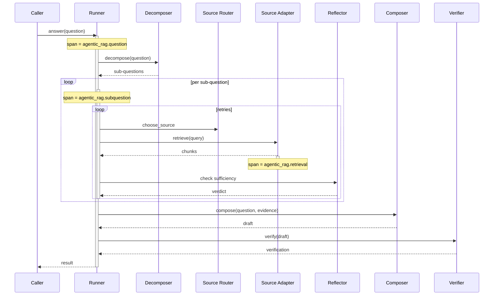

# Observability: Agentic RAG

What to instrument, what to log, and how to diagnose failures across the retrieval loop.

---

## Key Metrics

| Metric | Description | Alert if |
|---|---|---|
| `agentic_rag.questions_total` | Total questions answered | Drop unexpectedly — upstream broken |
| `agentic_rag.outcome{kind}` | Distribution of `answered` / `abstained` / `escalated` | Sudden shift toward `abstained` — retrieval quality regression |
| `agentic_rag.subquestions_per_question` | Distribution (histogram) | Average > 4 — over-decomposing |
| `agentic_rag.retrieval_attempts_per_subquestion` | Distribution (histogram) | Average > 2 — reformulation loop running hot |
| `agentic_rag.attempts_hit_cap_rate` | Fraction of sub-questions that exhausted retries | > 10% — caps too tight or retrieval quality poor |
| `agentic_rag.source_usage{source}` | Per-source retrieval counts | Concentration on one source (>80%) when others are registered — routing biased |
| `agentic_rag.relevance_score_distribution{source}` | Per-source chunk relevance histogram | Median < 0.4 — source not pulling relevant content |
| `agentic_rag.cross_source_conflict_rate` | Fraction of sub-questions with cross-source disagreement | Spike — possible poisoning or genuine source divergence |
| `agentic_rag.citation_verification_pass_rate` | Drafts that passed verification first time | < 80% — composer producing ungrounded claims |
| `agentic_rag.abstention_rate` | Fraction of questions that abstained | Sudden change — retrieval regression OR policy change |
| `agentic_rag.duration_seconds` | End-to-end per question (P50/P95/P99) | P95 > SLA |
| `agentic_rag.cost_per_question` | LLM spend per question | Trending up faster than question volume — model drift or excess retries |

Notify on `abstention_rate` shifts and `cross_source_conflict_rate` spikes. Page on `citation_verification_pass_rate < 50%` (the pattern is broken).

---

## Trace Structure

Each question is a root span. Sub-questions are children. Each sub-question's retrieval attempts are grandchildren.



---

## Span Reference

| Span name | Emitted | Key attributes |
|---|---|---|
| `agentic_rag.question` | Once per question | `question_id`, `outcome`, `subquestions_count`, `total_attempts`, `duration_ms`, `total_tokens` |
| `agentic_rag.decompose` | Once per question (when decomposed) | `subquestions_count`, `duration_ms` |
| `agentic_rag.subquestion` | Once per sub-question | `subquestion_id`, `text`, `attempts`, `sufficient`, `duration_ms` |
| `agentic_rag.retrieval` | Once per retrieval attempt | `subquestion_id`, `attempt`, `source`, `k`, `chunks_returned`, `top_score`, `duration_ms` |
| `agentic_rag.score` | Once per scoring pass | `subquestion_id`, `attempt`, `chunks_scored`, `mean_score`, `duration_ms` |
| `agentic_rag.reflect` | Once per sufficiency check | `subquestion_id`, `attempt`, `verdict`, `missing` (if insufficient), `duration_ms` |
| `agentic_rag.reformulate` | Once per query rewrite | `subquestion_id`, `attempt`, `prior_query`, `new_query`, `duration_ms` |
| `agentic_rag.cross_source_consistency` | Once per question (when multi-source) | `question_id`, `conflicts_count`, `duration_ms` |
| `agentic_rag.compose` | Once per draft | `question_id`, `tokens_out`, `citation_markers_count`, `duration_ms` |
| `agentic_rag.verify` | Once per verification | `question_id`, `ungrounded_citations`, `unsupported_claims`, `pass`, `duration_ms` |

Propagate `question_id` and `subquestion_id` through every child span so trace search returns the full retrieval lineage for any answer.

---

## What to Log

### On question start

```
INFO  agentic_rag.question.start  question_id=q_01HV...  text="Compare parental leave..."
```

### On decomposition

```
INFO  agentic_rag.decompose       question_id=q_01HV...  subquestions=2
                                  subqs=["our parental-leave policy","industry US tech leave norms"]
```

### On a retrieval attempt

```
INFO  agentic_rag.retrieval       subquestion_id=sq_01HV...  attempt=0  source=handbook
                                  k=5  top_score=0.83  duration_ms=42
```

### On insufficient evidence + reformulation

```
WARN  agentic_rag.reflect.insufficient  subquestion_id=...  attempt=0  missing="effective dates"
INFO  agentic_rag.reformulate     subquestion_id=...  attempt=1
                                  prior="parental leave policy details"
                                  new="parental leave effective date and policy revision history"
```

### On cross-source conflict

```
WARN  agentic_rag.cross_source_conflict subquestion_id=...
                                       sources=["handbook","hr_policy_db"]
                                       conflict_summary="handbook says 16 weeks; db says 18 weeks (current revision)"
```

### On citation verification failure

```
WARN  agentic_rag.verify.failed   question_id=q_01HV...  ungrounded_citations=1
                                  unsupported_claims=["industry average is 12 weeks"]
                                  retrying=true
```

### On abstention

```
WARN  agentic_rag.abstain         question_id=q_01HV...  reason="insufficient_evidence_after_retries"
                                  subquestions_failed=["industry US tech leave norms"]
```

### On completion

```
INFO  agentic_rag.question.done   question_id=q_01HV...  outcome=answered  citations=4
                                  total_attempts=3  duration_ms=4180  total_tokens=12480
                                  cost_usd=0.018
```

---

## Common Failure Signatures

### Retries exhausting frequently

- **Symptom**: `attempts_hit_cap_rate > 10%`.
- **Log pattern**: Many `agentic_rag.reflect.insufficient` followed by reformulations followed by abstention.
- **Diagnosis**: Either the cap is too tight, or the retrieval substrate genuinely can't answer the queries (corpus gap), or the reformulator isn't producing better queries.
- **Fix**: Sample 20 cap-hit sub-questions. If the corpus genuinely doesn't have the answer, abstention is correct. If it does, inspect what the reformulator is producing — often it's restating, not refining.

### Cross-source conflicts spiking

- **Symptom**: `cross_source_conflict_rate` doubles unexpectedly.
- **Diagnosis**: Either a real divergence (a source was updated, another wasn't) or possible poisoning (an attacker has manipulated one source to disagree with others).
- **Fix**: Audit the conflicts. Genuine divergence → update the stale source's description and notify owners. Poisoning → investigate writes to the affected source.

### Citation verification failing often

- **Symptom**: `citation_verification_pass_rate < 80%`.
- **Log pattern**: `agentic_rag.verify.failed` with `unsupported_claims` showing patterns.
- **Diagnosis**: The composer is paraphrasing the chunks but adding asides without citations. Often a prompt regression.
- **Fix**: Tighten the composer's prompt — emphasize "if not in a chunk, do not write it." Test against held-out examples.

### Source bias in routing

- **Symptom**: `source_usage{source=A}` is 90% while three other sources are registered.
- **Diagnosis**: A's description is overly broad, or the planner has been trained-by-exposure to prefer it.
- **Fix**: Audit source descriptions. Each should have a clear `when_to_use` and `when_not_to_use`. Add labeled routing test cases; track routing precision per source.

### Per-question cost climbing

- **Symptom**: `cost_per_question` trending up without question-volume change.
- **Diagnosis**: Either retries per sub-question are climbing, or decomposition is producing more sub-questions than before.
- **Fix**: Cross-correlate `subquestions_per_question` and `retrieval_attempts_per_subquestion` with cost. The one that moved is the lever to tune.

### Abstention rate spike

- **Symptom**: `abstention_rate` jumps from 5% to 25%.
- **Diagnosis**: Either retrieval got worse (corpus update broke chunking), the sufficiency reflector got tighter (intentional or otherwise), or the question mix changed.
- **Fix**: Bucket abstentions by sub-question topic. If concentrated on one topic, the corpus / source for that topic regressed. If broad, the reflector or planner changed behavior.

---

## What ends up in the operator UI

For agentic RAG the operator dashboard typically shows:

- Per-question drill-down: question → decomposition → retrieval attempts (with chunks visible) → reflection verdicts → composed draft → verification outcome → final answer.
- Citation precision sampling queue (human labels a random sample weekly).
- Source-level health: usage, mean relevance, conflict rate.
- Abstention review queue: abstained questions with their attempts so operators can decide if the corpus needs a new doc.

Without per-question drill-down, the loop is opaque. Build the drill-down before scaling the pattern.
