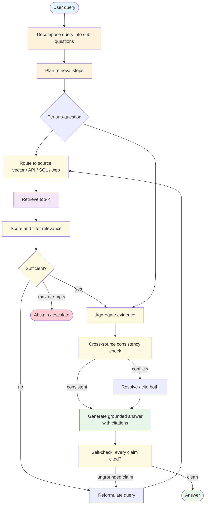

# Agentic RAG — Overview

Baseline [RAG](../rag/overview.md) retrieves once and generates once. **Agentic RAG** lets the agent decide *what* to retrieve, *how many times*, *from which sources*, and *whether the retrieved evidence is enough* — looping retrieval and reasoning until the answer is grounded or the agent decides to abstain. The control flow shifts from the developer to the LLM, while the retrieval stack stays the same.

**Evolves from:** [RAG](../rag/overview.md) (the retrieval substrate) + [Plan & Execute](../plan_and_execute/overview.md) (the agent's planning over what to retrieve).

## Architecture



*Figure: The agent plans the retrieval, executes per-source retrievals (possibly in parallel), reflects on whether the evidence is sufficient, reformulates and re-retrieves until ready, then generates a citation-bound answer and self-checks every claim.*

## How It Works

1. **Decompose the query.** If the question is compound ("compare X and Y under condition Z"), the agent splits it into sub-questions. Simple questions skip this.
2. **Plan retrieval.** For each sub-question, pick a source (vector store, structured DB, web search, API). Different sub-questions may go to different sources.
3. **Retrieve and score.** Pull top-K from each source. Score relevance per chunk — embedding similarity is a starting signal, not the answer.
4. **Reflect on sufficiency.** Is the evidence enough to answer the sub-question? If not, reformulate the query (different keywords, different source) and retry. Cap retries.
5. **Cross-source consistency.** When the same fact comes from multiple sources, do they agree? Conflicts are surfaced in the answer, not silently merged.
6. **Generate with citations.** The answer must cite the retrieved chunks. Every claim is linked to a source.
7. **Self-verify.** Re-read the draft: is every claim grounded in a cited chunk? Ungrounded claims trigger another retrieval round or abstention.
8. **Abstain when warranted.** If retries hit the cap and the question can't be grounded, the agent says so. Hallucinating is the failure mode.

## Minimal Example

```python
from patterns.agentic_rag.code.python.runner import AgenticRag, SourceConfig

agent = AgenticRag(
    llm=your_llm,
    sources=[
        SourceConfig(name="handbook", kind="vector", store=handbook_vstore),
        SourceConfig(name="hr_policy_db", kind="sql", conn=hr_db),
        SourceConfig(name="web", kind="web_search", api=tavily),
    ],
    max_retrieval_attempts=4,
    require_citations=True,
    abstain_on_low_confidence=True,
)

result = agent.answer(
    "Compare our parental-leave policy to industry norms in the US tech sector."
)

# result.answer       → grounded answer with citation markers
# result.citations    → [{source, chunk_id, span}]
# result.subquestions → ["our policy", "industry US tech"]
# result.confidence   → 0.0–1.0
# result.abstained    → bool; True when the agent couldn't ground enough
```

## Input / Output

- **Input:** A natural-language question + the source registry (vector stores, DBs, APIs, web)
- **Output:** A grounded answer with explicit citations, or an abstention
- **Trace:** Per-sub-question retrieval attempts, sources hit, evidence scored, reflection verdicts
- **Confidence:** Agent's self-reported confidence in the grounding

## Key Tradeoffs

| Strength | Limitation |
|----------|-----------|
| Handles compound and multi-hop questions baseline RAG can't | 3–10× the per-request cost of baseline RAG |
| Routes per sub-question to the best source | Source registry must be curated; bad source descriptions misroute |
| Cross-source consistency defends against single-source poisoning | Cross-checking misses when all sources are compromised the same way |
| Self-verify catches drift between retrieval and generation | Self-verify can also produce false negatives (refuses to answer correctly-grounded answers) |
| Citations are first-class | Citation precision depends on the chunk-to-claim alignment, which is unsolved at the edges |

## When to Use

- **Compound questions.** "Compare A and B," "Find X that satisfies both Y and Z," "Trace the change in policy from year P to year Q."
- **Multi-source domains.** Internal docs + structured DB + external web. Baseline RAG over a single store can't pull from all three.
- **High-stakes grounding.** Customer-facing answers where ungrounded claims have business or compliance cost.
- **RAG-poisoning resistance.** Adversaries can manipulate single sources (RAG poisoning research shows 5 docs can manipulate single-source answers 90% of the time). Cross-source agentic RAG raises the bar.
- **Long-tail queries.** Questions the baseline retriever can't easily express as one embedding query.

## When NOT to Use

- **Simple lookup questions.** "What's the dial-in number for the Tuesday standup?" Baseline RAG (or just a flat document lookup) is faster and cheaper.
- **Single-source corpora with high recall already.** If the existing RAG hits the right chunks > 95% of the time, the agentic layer adds latency without measurable gain.
- **Sub-second latency budgets.** Agentic RAG's per-question wall-clock is 3–10× baseline. Don't pay it without need.
- **Heavily structured queries.** "Get sales for Q3 by region" is a SQL query, not a RAG question. Use [Tool Use](../../primitives/tool_use/overview.md) with the DB.

## How Agentic RAG differs from baseline RAG

| Question | Baseline RAG | Agentic RAG |
|---|---|---|
| Who decides what to retrieve? | The developer (one fixed retrieval) | The LLM (planned retrievals) |
| Number of retrievals per query | 1 | 1–N (until grounded) |
| Number of sources | Usually 1 | Often many |
| Reformulation on poor results | None | Standard |
| Citation discipline | Optional | Standard |
| Cost per query | Low | 3–10× baseline |
| Cost per *wrong* answer | High | Lower (more likely to abstain) |

The cost-of-wrongness reframing is the point. Baseline RAG produces a confident answer from whatever it retrieved. Agentic RAG either grounds the answer or abstains.

## Related Patterns

- **Evolves from:** [RAG](../rag/overview.md) (retrieval substrate) + [Plan & Execute](../plan_and_execute/overview.md) (planning the retrievals) + [Reflection](../reflection/overview.md) (self-checking the grounding) — see [evolution.md](./evolution.md)
- **Combines with:** [Reflection](../reflection/overview.md) (the self-verify step IS reflection), [Sub-agents](../../primitives/sub_agents/overview.md) (each sub-question can spawn a sub-agent), [Routing](../routing/overview.md) (the source-selection step IS routing), [Guardrails](../../modifiers/guardrails/overview.md) (retrieved chunks are untrusted; the quarantined LLM is a natural reader)
- **Contrast with:** Baseline RAG — simpler, faster, but a single fixed retrieval. Agentic RAG is when "one retrieval isn't enough" is the common case.

## Deeper Dive

- **[Design](./design.md)** — Query decomposition, source routing, sufficiency reflection, cross-source consistency, citation discipline, abstention policy
- **[Implementation](./implementation.md)** — Runner shape, source adapter interface, citation tracking, integration with reflection
- **[Evolution](./evolution.md)** — RAG → Agentic RAG: decomposition + planned retrievals + self-verify
- **[Observability](./observability.md)** — Per-sub-question metrics, retrieval-attempt distributions, abstention rate, citation density
- **[Cost & Latency](./cost-and-latency.md)** — Per-question cost shape, retry budgets, when the extra cost pays for itself

## When NOT to use this pattern

- The baseline RAG hits recall on > 95% of queries — agentic adds latency without measurable lift.
- Latency budget is sub-second — agentic RAG can't fit.
- You can't curate good source descriptions — routing degrades to random.

## Next steps

- Production version: see [Blueprints → Deployments](../../composition/blueprints-to-deployments.md) for the deployment agents that use this pattern.
- Generate a starter project: see [Blueprint → Spec → Scaffold](../../composition/blueprint-to-spec-to-scaffold.md).
- Combine with other patterns: see the [Composition guide](../../composition/README.md).
