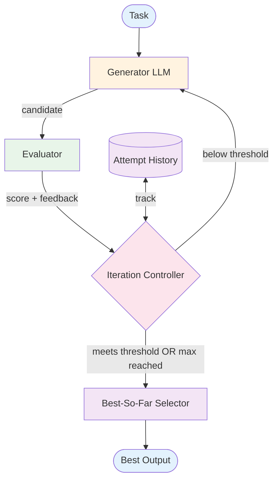

# Evaluator-Optimizer — Design

Detailed component breakdown and design decisions for building a generate-evaluate optimization loop.

## Component Breakdown



### Generator
Produces output for the task. On iteration 2+, receives the original task, previous attempt, and evaluator feedback. Must be prompted to *use* feedback, not regenerate from scratch.

### Evaluator
Assesses quality. Types:

| Type | Description | Tradeoff |
|------|------------|----------|
| **LLM evaluator** | LLM scores with evaluation prompt | Flexible; costs tokens |
| **Rule-based** | Code checks format, length, keywords | Cheap, deterministic; limited |
| **Hybrid** | Rules for format + LLM for content | Balanced |

Evaluator output: score (0.0–1.0), actionable feedback, optional per-criterion scores.

### Iteration Controller
Checks: score met threshold? Max iterations reached? Score converged (no improvement in K rounds)?

### Best-So-Far Selector
Tracks highest-scoring attempt. Returns the best — not necessarily the last, since later iterations can regress.

### Attempt History
Records: `{iteration, output, score, feedback}`. Used for convergence detection and debugging.

## Data Flow Specification

```
history = []
best = {score: -1, output: null}

for i in 1..max_iterations:
  if i == 1:
    candidate = generator(task)
  else:
    candidate = generator(task, previous.output, previous.feedback)

  eval = evaluator(candidate)
  history.append({i, candidate, eval})

  if eval.score > best.score:
    best = {score: eval.score, output: candidate}

  if eval.score >= threshold:
    return best.output

  if converged(history):
    return best.output

return best.output
```

## Error Handling Strategy

### Generator Issues
- **Degenerate output** — Check length/similarity; adjust temperature
- **Regression** — Best-so-far tracker handles this
- **Ignores feedback** — Structure feedback as explicit instructions

### Evaluator Issues
- **Score inflation** — Calibrate with known examples; use dimension scores
- **Inconsistency** — Lower temperature; add rule-based components
- **Gaming** — Diverse criteria; periodic human review

### Convergence Issues
- **Oscillation** — Track score variance; stop if exceeding threshold
- **False convergence** — Separate minimum quality from convergence detection

## Scaling Considerations

### Cost
2 LLM calls per iteration. Total = 2 × K iterations. K = 2–3 typically (diminishing returns).

### Latency
K × (generator_latency + evaluator_latency). Use faster model for evaluation if possible.

### Diminishing Returns
- Iteration 1→2: significant improvement
- Iteration 2→3: moderate improvement
- Iteration 3+: rarely worth the cost

**Default:** max_iterations = 3.

## Composition Notes

### With Prompt Chaining
Evaluate per-step or end-to-end. Per-step is thorough but expensive.

### With Orchestrator-Worker
Evaluate synthesized output; feedback guides re-decomposition.

### Evolving to Reflection
When evaluator and generator should be the same entity with richer self-critique. See [Reflection evolution](../../patterns/reflection/evolution.md).

## Decision Matrix: Evaluation Strategy

| Factor | LLM Evaluator | Rule-Based | Hybrid |
|--------|--------------|------------|--------|
| Setup cost | Low | Medium | Medium-high |
| Per-call cost | High | Free | Medium |
| Nuance | High | Low | Medium-high |
| Determinism | Low | High | Medium |
| Best for | Prototyping | Format checks | Production |

**Guideline:** Start LLM-based. Replace measurable criteria with rules as you identify them. Production = hybrid.

## Production concerns

Cognitive concerns this repo covers; operational concerns belong in [agent-deployments](https://github.com/jagguvarma15/agent-deployments).

| Concern | This pattern's surface | Where to read |
|---|---|---|
| Prompt injection | evaluator output feeds back into generator — a poisoned evaluator output drives a bad next generation | [foundations/security-and-safety.md](../../foundations/security-and-safety.md) |
| Hallucination & grounding | this pattern IS a grounding mechanism; evaluator needs its own grounding to be trustworthy | [foundations/hallucination-and-grounding.md](../../foundations/hallucination-and-grounding.md) |
| Cost & model selection | 2× per iteration; cap iterations explicitly | [foundations/cost-and-model-selection.md](../../foundations/cost-and-model-selection.md) |
| Rate limiting & retries | inherited | [agent-deployments cross-cutting](https://github.com/jagguvarma15/agent-deployments/tree/main/docs/cross-cutting) |
| Idempotency | inherited | [agent-deployments cross-cutting](https://github.com/jagguvarma15/agent-deployments/blob/main/docs/cross-cutting/idempotency.md) |
| Observability hooks | see `observability.md` alongside this file | [foundations](../../foundations/README.md) |
