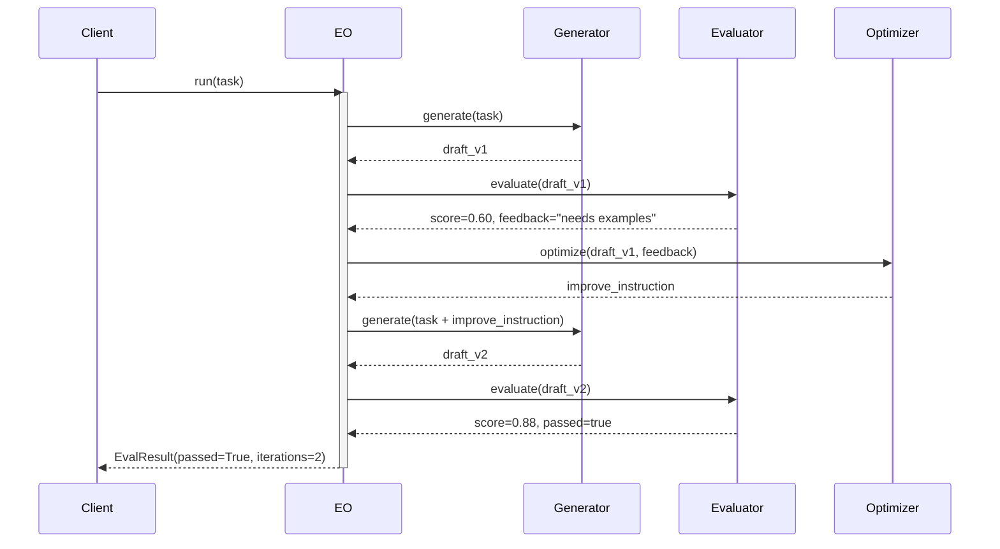

# Observability: Evaluator-Optimizer

What to instrument, what to log, and how to diagnose failures in the generate-evaluate loop.

---

## Key Metrics

| Metric | Description | Alert if |
|--------|-------------|----------|
| `eval_opt.iterations_used` | Iterations before pass or exhaustion | Consistently equals `max_iterations` |
| `eval_opt.pass_rate` | Fraction of runs that pass before max iterations | < 70% |
| `eval_opt.score.{iteration}` | Quality score at each iteration | Not trending upward across iterations |
| `eval_opt.total_tokens` | Total tokens across all iterations | > 3× single-pass cost baseline |
| `eval_opt.evaluate.parse_error_rate` | Evaluator responses that fail format parsing | > 2% |

---

## Trace Structure

A root span with nested `generate → evaluate → optimize` spans for each iteration.



---

## Span Reference

| Span name | Emitted | Key attributes |
|-----------|---------|----------------|
| `eval_opt.run` | Once per call | `passed`, `iterations_used`, `final_score`, `total_duration_ms` |
| `eval_opt.generate.{n}` | Once per iteration | `iteration`, `tokens_in`, `tokens_out`, `duration_ms` |
| `eval_opt.evaluate.{n}` | Once per iteration | `iteration`, `score`, `passed`, `parse_error` |
| `eval_opt.optimize.{n}` | Once per iteration (if not final) | `iteration`, `feedback_len`, `instruction_len` |

---

## What to Log

### On each iteration
```
INFO  eval_opt.iter.start   iteration=1
INFO  eval_opt.generate.done  iteration=1  tokens_out=210  ms=620
INFO  eval_opt.evaluate.done  iteration=1  score=0.60  passed=false  feedback="lacks examples"
INFO  eval_opt.optimize.done  iteration=1  instruction="Add a concrete Python example"
```

### On pass
```
INFO  eval_opt.done  passed=true  iterations=2  final_score=0.88  total_ms=2840
```

### On exhaustion
```
WARN  eval_opt.done  passed=false  iterations=3  final_score=0.72  total_ms=4200
         reason="max_iterations reached"
```

### On parse failure
```
WARN  eval_opt.evaluate.parse_error  iteration=2  raw_response="The output is good but..."
         fallback_score=0.5
```

---

## Common Failure Signatures

### Never converges (exhausts iterations every time)
- **Symptom**: `pass_rate` is near 0%; `iterations_used` always equals `max_iterations`.
- **Log pattern**: Scores plateau (e.g., 0.60 → 0.63 → 0.65) instead of trending toward threshold.
- **Diagnosis**: Either the criteria are too strict for the model to satisfy, or the feedback loop isn't producing actionable instructions.
- **Fix**: Lower the threshold, reduce criteria complexity, or increase `max_iterations`. Add logging of the full criteria sent to the evaluator.

### Scores oscillate (improve then worsen)
- **Symptom**: Scores go 0.60 → 0.82 → 0.55 — improvement is not monotonic.
- **Log pattern**: `eval_opt.evaluate.{n}.score` alternates high-low across iterations.
- **Diagnosis**: The optimizer's instructions are overcorrecting — fixing one criterion while breaking another.
- **Fix**: Change the optimizer prompt to instruct it to fix the *highest-priority* issue only, not all issues at once.

### Evaluator returns inconsistent format
- **Symptom**: `eval_opt.evaluate.parse_error_rate` > 5%.
- **Log pattern**: `raw_response` contains prose rather than structured `SCORE: / FEEDBACK: / PASS:`.
- **Diagnosis**: The evaluator prompt format instructions are not being followed.
- **Fix**: Strengthen the format instruction with a filled-in example; add a final line: `"Do not add anything outside this format"`.

### Cost creep from long iteration context
- **Symptom**: `eval_opt.generate.{n}.tokens_in` grows with each iteration.
- **Log pattern**: Iteration 1 has 500 tokens_in; iteration 3 has 2000 tokens_in.
- **Diagnosis**: Each iteration is appending the full previous draft plus feedback to the prompt.
- **Fix**: Only pass the improvement instruction to the generator, not the full history; or summarize feedback before passing it.
