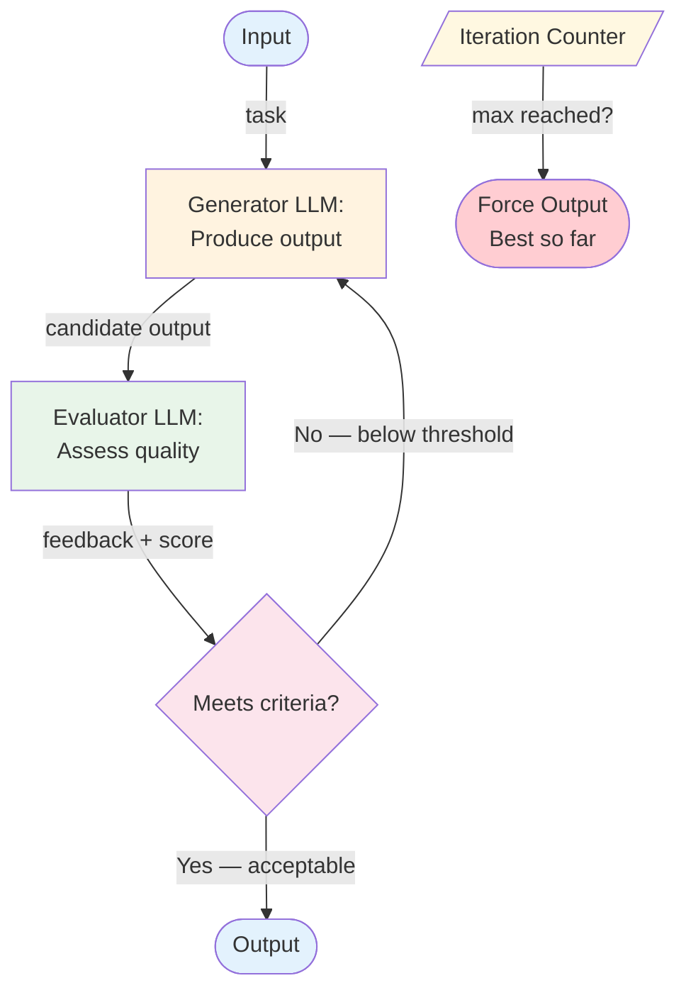

# Evaluator-Optimizer — Overview

The evaluator-optimizer pattern creates a feedback loop between two roles: a generator that produces output and an evaluator that assesses it. The cycle repeats until the output meets quality criteria or a maximum iteration count is reached.

## Architecture



*Figure: The generator-evaluator loop. The generator produces output, the evaluator scores it with feedback. If quality criteria aren't met, the generator tries again with the feedback. An iteration counter prevents infinite loops.*

## How It Works

1. **Generate** — The generator LLM produces a candidate output based on the input (and any feedback from previous iterations).
2. **Evaluate** — The evaluator LLM (or the same LLM with an evaluation prompt) assesses the output against defined quality criteria. It produces a score and specific feedback.
3. **Decide** — If the score meets the acceptance threshold, output the result. If not, loop back with the evaluator's feedback.
4. **Guard** — An iteration counter ensures the loop terminates even if quality criteria are never met. When max iterations are reached, return the best output so far.

The generator and evaluator can be the same LLM with different prompts, or different models entirely (e.g., a cheaper model generates, a more capable model evaluates).

## Minimal Example

Generate a technical explanation, evaluate it against a rubric, and iterate until it meets the quality bar.

```python
from workflows.evaluator_optimizer.code.python.evaluator_optimizer import EvaluatorOptimizer

eo = EvaluatorOptimizer(
    generator=your_llm,
    evaluator=your_llm,   # can be a different, more capable model
    criteria="""
    - Technically accurate (no hallucinated APIs or concepts)
    - Includes a concrete, runnable code example
    - Under 300 words
    - Suitable for an intermediate Python developer
    """,
    threshold=0.85,       # stop iterating once score >= 0.85
    max_iterations=3,
)

result = eo.run("Explain Python's asyncio event loop with a practical example")
# result.passed              → True if threshold was met within max_iterations
# result.iterations[i].score → quality score at each iteration (0.0–1.0)
# result.iterations[i].feedback → what the evaluator said to improve
# result.final_output        → best version produced
```

> Full implementation: [`code/python/evaluator_optimizer.py`](code/python/evaluator_optimizer.py)

## Input / Output

- **Input:** A task requiring high-quality output
- **Output:** The refined output that passed evaluation (or the best attempt within the iteration budget)
- **Generator output:** Candidate content
- **Evaluator output:** Quality score + actionable feedback

## Key Tradeoffs

| Strength | Limitation |
|----------|-----------|
| Iteratively improves output quality | At least 2 LLM calls per iteration (cost multiplier) |
| Evaluator feedback guides specific improvements | Latency multiplied by iteration count |
| Separates generation from quality assessment | Evaluator must be reliable — bad evaluation = bad optimization direction |
| Natural stopping condition (quality threshold) | Can converge on local optima or oscillate without improvement |
| Works with any generation task | Diminishing returns after 2–3 iterations for most tasks |

## When to Use

- Output quality is critical and first-pass generation isn't reliable enough
- You have clear, measurable quality criteria (rubrics, checklists, format requirements)
- The task benefits from iterative refinement (writing, code generation, translation)
- When you can define what "good" looks like but generating it in one shot is hard
- Cost and latency budgets allow multiple iterations

## When NOT to Use

- When first-pass quality is sufficient — the extra iterations add cost without value
- When latency is more important than quality — each iteration adds a full round-trip
- When quality criteria are subjective or hard to articulate — the evaluator can't help
- When the task is simple enough that one LLM call gets it right — don't loop unnecessarily
- When you need the LLM to self-critique its own reasoning — use [Reflection](../../patterns/reflection/overview.md) instead

## Related Patterns

- **Evolves into:** [Reflection](../../patterns/reflection/overview.md) (the LLM evaluates and critiques its own output, with richer self-awareness)
- **Combines with:** [Prompt Chaining](../prompt-chaining/overview.md) (evaluate at each step of a chain), [Orchestrator-Worker](../orchestrator-worker/overview.md) (evaluate the synthesized output)
- **Simpler alternative to:** [Reflection](../../patterns/reflection/overview.md) (when you want external evaluation rather than self-critique)

## Deeper Dive

- **[Design](./design.md)** — Evaluation criteria design, scoring strategies, convergence detection, generator-evaluator prompt pairing
- **[Implementation](./implementation.md)** — Pseudocode, iteration management, best-so-far tracking, testing the loop

## When NOT to use this pattern

- First-pass quality is sufficient — iteration is wasted cost.
- Latency budget is tight — every iteration adds an LLM round-trip.
- The evaluator itself is unreliable — refine the evaluator first; the loop amplifies a bad evaluator's mistakes.

## Next steps

- Production version: see [Blueprints → Deployments](../../composition/blueprints-to-deployments.md) for the deployment agents that use this pattern.
- Generate a starter project: see [Blueprint → Spec → Scaffold](../../composition/blueprint-to-spec-to-scaffold.md).
- Combine with other patterns: see the [Composition guide](../../composition/README.md).
