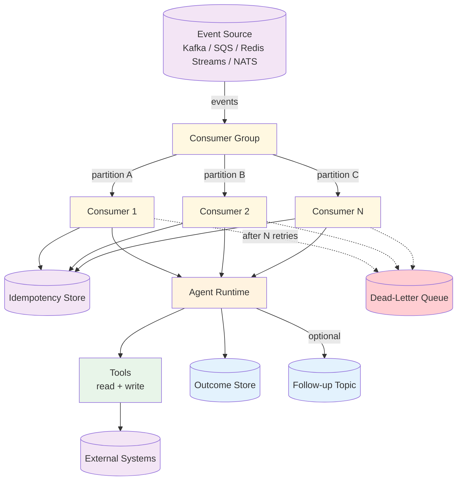

# Event-Driven Agents — Design

> Canonical Pydantic state schema: [`schemas/state.py`](schemas/state.py) — `EventDrivenState` is the top-level shape; `Event`, `Case`, `Outcome` are the auxiliary models. Recipes targeting Event-Driven reference these names verbatim.
>
> Typed prompts: [`prompts/`](prompts/) — `enricher.md`, `decider.md`, `actor.md`. See [`meta/style-guide.md`](../../meta/style-guide.md#typed-prompts) for the frontmatter contract.

## Component Breakdown



### Event Source
Durable, ordered (within a partition), at-least-once delivery. Partitions enable parallelism: events sharing a partition key are processed in order by a single consumer; events with different keys can run in parallel.

### Consumer Group
A named subscription. Each event is delivered to exactly one consumer in the group. Scaling out means adding consumers; the source rebalances partitions across them.

### Idempotency Store
A small, fast key-value store keyed by `event_id`. Two writers — one before agent execution (claim), one after (mark done) — make duplicate detection robust to mid-processing crashes.

### Agent Runtime
The same Tool-Use agent loop you'd use for a request-driven flow, but invoked by the consumer rather than an HTTP handler. Has read-tools (state enrichment) and write-tools (actions). All write-tools must be idempotent.

### Outcome Store
Persists what the agent decided and did. Required so a duplicate event detects "already processed" with full context, and so audits / replays can reconstruct history.

### Dead-Letter Queue (DLQ)
Where poison events go after `MAX_RETRIES`. The DLQ entry carries the original event, error history, and a `retry_count`. DLQ depth is a first-class alert.

## Data Flow

```
Event:
  event_id: string             // producer-assigned UUID (preferred)
  partition_key: string        // e.g., restaurant_id, user_id
  timestamp: ISO-8601
  schema_version: integer
  type: string                 // e.g., "reservation.cancelled"
  payload: object              // typed per type+schema_version

IdempotencyRecord:
  event_id: string             // primary key
  status: "in_progress" | "done"
  claimed_at: ISO-8601
  ttl: seconds                 // ≥ source retention window

Outcome:
  event_id: string             // foreign key
  decision: string
  actions_taken: list of {tool, args, result}
  emitted_events: list of event_id
  completed_at: ISO-8601
```

## Event-Source Comparison

| Source | Throughput | Ordering | Ops complexity | Good for |
|--------|------------|----------|----------------|----------|
| **Kafka** | Very high (100k+/sec/partition) | Strong, per partition | Heavy (Zookeeper/KRaft, brokers, monitoring) | Multi-team event backbone, replay-heavy workloads |
| **AWS SQS (standard)** | High | None | Low (managed) | Fan-out work where ordering doesn't matter |
| **AWS SQS FIFO** | Lower (300 msg/sec/group, 3000 with batching) | Per `MessageGroupId` | Low | Strict-ordering use cases on AWS |
| **Redis Streams** | Medium-high (~10k/sec) | Per stream | Low–medium (one component) | Single-service or small fleet, prototypes, dev environments |
| **NATS JetStream** | High | Per subject | Medium | Lightweight + persistent middle ground; multi-tenant |

**Picking heuristics:**
- Prototype or single-service deployment → Redis Streams.
- AWS-native, no ordering needs → SQS.
- Multi-team backbone with replay → Kafka.
- Mixed pub/sub + persistence, lightweight → NATS JetStream.

## Consumer Groups

One agent process = one consumer instance. The group is the shared subscription identity. Two consumers in the same group split partitions between them; two consumers in *different* groups each receive a copy.

- **Scale horizontally** by adding consumers, up to the partition count. Beyond that, you need more partitions on the source.
- **Partition key** controls which consumer sees an event. A coarse key (e.g., `region`) gives weak parallelism; a too-fine key (e.g., `event_id`) destroys ordering. Pick the key that matches the *unit of consistency* — usually the entity whose state the agent will mutate.

## Idempotency Store Design

| Choice | Properties | Use When |
|--------|------------|----------|
| **Redis SET with TTL** | Fast, atomic via `SET NX EX`, expires automatically | Most cases. TTL must exceed source retention so late redeliveries still hit the cache. |
| **Postgres unique constraint** | Durable, queryable, joins with outcome data | Compliance / audit requires permanent record; throughput is moderate. |
| **DynamoDB conditional put** | Managed, durable, AWS-native | High-throughput on AWS without managing Redis. |

**Event ID source:**
- **Producer-assigned UUID** (preferred). The producer generates it at emission time so retries from the producer side also dedupe.
- **Hash of `(type, partition_key, payload, minute_bucket)`** as a fallback when producers don't tag events. Risky: legitimately distinct events with identical payloads collide.

**Two-phase pattern:** claim → process → mark done. A crash between claim and mark-done leaves a stale "in_progress" record; the redelivery sees it, checks `claimed_at` against a staleness threshold, and either resumes or treats it as a duplicate. See [Implementation](./implementation.md) for the exact write sequence.

## Retry and DLQ Semantics

**Transient vs permanent.** Categorize errors before retrying:
- **Transient:** network timeouts, rate limits, 5xx from downstream, optimistic-lock contention. → Retry with backoff.
- **Permanent:** schema validation failure, 4xx from downstream (other than 429), missing required state. → DLQ immediately. Retrying makes no progress and costs LLM calls.

**Backoff schedule.** Exponential with jitter:

| Attempt | Base delay | With jitter (±20%) |
|---------|-----------|--------------------|
| 1 | 1s | 0.8–1.2s |
| 2 | 4s | 3.2–4.8s |
| 3 | 16s | 12.8–19.2s |
| 4 | 64s | 51–77s |
| 5 → DLQ | — | — |

**DLQ payload:**

```
{
  original_event: {...},
  error_history: [{attempt, error, timestamp}, ...],
  retry_count: integer,
  failed_at: ISO-8601
}
```

DLQ depth must page someone. A DLQ that fills silently is the worst failure mode of an event-driven system — the agent silently stops handling a class of events.

## Ordering Guarantees

**Within a partition key:** in-order processing matters. A `reservation.cancelled` followed by `reservation.recreated` for the same `restaurant_id` must apply in order; reversing them produces a phantom cancellation.

**Across partition keys:** no guarantee. Don't write logic that assumes a global timestamp ordering across partitions.

**Choosing the partition key:**
- Too coarse (e.g., `region`) → no parallelism.
- Too fine (e.g., `event_id`) → no ordering across related events; bugs.
- Right answer is usually the entity whose state mutates: `restaurant_id`, `user_id`, `order_id`.

## Schema Evolution

Every event carries `schema_version`. Rules:

- **Additive only on the same version.** Add optional fields without bumping the version. Consumers must ignore unknown fields.
- **Breaking changes bump the version.** Change a field's type, remove a required field, or rename → new `schema_version`.
- **Topic-versioned for major changes.** When v1 and v2 must coexist (multiple consumers, can't migrate atomically), use separate topics (`reservations.v1`, `reservations.v2`) and let producers fan out.
- **Schema registry** (e.g., Confluent Schema Registry, AWS Glue Schema Registry) is worth adopting once you have >5 event types or >2 producing teams.

## Backpressure

The consumer pulls at its own rate; the producer does not block on the consumer. Good — but it means:

- **The source storage fills up if the consumer can't keep up.** Watch consumer lag (events-behind-head).
- **Alert thresholds:** lag > 10× normal, or lag > N minutes worth of events.
- **Scaling response:** add consumers (up to partition count), increase consumer concurrency per process, or shed load (route low-priority events to a separate stream with a slower consumer).

## Observability

Trace ID propagated *through the event payload* (most useful single observability decision):

```
payload: {
  ...,
  trace_id: "abc123",
  parent_span_id: "...",
}
```

The consumer extracts these into the agent's logging context so every tool call, LLM call, and outcome carries the same trace.

| Signal | What to capture |
|--------|-----------------|
| **Logs** | event received, idempotency hit/miss, agent decision, each tool call + result, ACK / NACK, DLQ push |
| **Metrics — counters** | `events_received`, `events_processed`, `events_acked`, `events_dlqed`, `idempotency_hits` |
| **Metrics — histograms** | end-to-end processing latency (p50/p95/p99), agent LLM-call duration, tool-call duration |
| **Metrics — gauges** | consumer lag, idempotency-store size, DLQ depth |
| **Alerts** | DLQ depth > 0 (page), consumer lag > threshold (page), error rate > 1% (page), idempotency hit rate suddenly drops to 0 (warn — producer may have stopped tagging events) |

## Failure Modes

| Failure | Symptom | Mitigation |
|---------|---------|------------|
| Consumer crashes mid-handler | Event redelivered after pending timeout | Idempotency check at start of handler; two-phase claim/done pattern |
| Tool call partially succeeds | External side effect applied, agent didn't record outcome | Split into atomic tools; use transactional outbox when crossing service boundaries |
| LLM hallucinates the wrong action | Wrong external state change | Confidence thresholds; human-in-the-loop for high-stakes actions; eval dataset gating deploys |
| Idempotency TTL < source retention | Late redeliveries re-execute | TTL ≥ retention window + safety margin |
| Producer stops tagging `event_id` | Idempotency hit rate drops to 0; duplicates re-execute | Alert on hit-rate drop; reject events missing `event_id` at consumer boundary |
| Coarse partition key | No parallelism; throughput bottlenecked | Re-key on a finer entity that still preserves ordering invariants |
| Fine partition key | Out-of-order processing for related events | Re-key on the entity whose state mutates |
| DLQ never re-examined | Class of events silently stops working | Alert on DLQ depth > 0; weekly DLQ review process |

## Composition

- **+ Multi-Agent:** Route events by `type` to specialized agents; supervisor optional. Each agent has its own consumer group on the same stream, or separate streams per agent.
- **+ Routing:** Single consumer dispatches to handlers based on `type`. Use when handlers share the same toolchain and only the prompt differs.
- **+ Memory:** Rebuild agent working state by replaying the event log. Combine with the Outcome Store as a write-through cache.
- **+ Outbox pattern:** When the agent must update its own DB and emit a follow-up event atomically, write both to the same transaction; a separate worker reads the outbox table and publishes.
- **+ Saga pattern:** Long-running multi-step workflows where each step is an event; compensating actions roll back on failure.

## Production concerns

Cognitive concerns this repo covers; operational concerns belong in [agent-deployments](https://github.com/jagguvarma15/agent-deployments).

| Concern | This pattern's surface | Where to read |
|---|---|---|
| Prompt injection | event payloads from external sources are untrusted input; validate schemas before agent invocation | [foundations/security-and-safety.md](../../foundations/security-and-safety.md) |
| Hallucination & grounding | schema-validated event payloads constrain the agent's reasoning surface | [foundations/hallucination-and-grounding.md](../../foundations/hallucination-and-grounding.md) |
| Cost & model selection | per-event agent cost × event rate; rate-limit per partition | [foundations/cost-and-model-selection.md](../../foundations/cost-and-model-selection.md) |
| Rate limiting & retries | inherited | [agent-deployments cross-cutting](https://github.com/jagguvarma15/agent-deployments/tree/main/docs/cross-cutting) |
| Idempotency | required (replays are normal); idempotency keys are part of the event contract | [agent-deployments cross-cutting](https://github.com/jagguvarma15/agent-deployments/blob/main/docs/cross-cutting/idempotency.md) |
| Observability hooks | see `observability.md` alongside this file | [foundations](../../foundations/README.md) |
