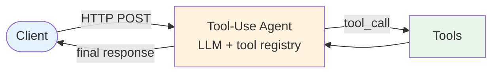

# Evolution: Tool Use → Event-Driven

This document traces how the [Event-Driven pattern](./overview.md) evolves from the [Tool Use pattern](../../primitives/tool_use/overview.md), and what it evolves into when latency, throughput, or windowing requirements grow.

## The Starting Point: Tool Use

In Tool Use, the agent is request-driven. A caller sends an input, the LLM picks tools, executes them, and returns a final response. The lifecycle is bounded by the HTTP round-trip:



The caller waits for the answer. There's no concept of an event arriving later, no idempotency requirement (each call is logically once), and no operational queue to babysit.

## The Breaking Point

Request-driven Tool Use breaks down when:

- **The trigger isn't a user request.** A reservation gets cancelled, a payment fires a webhook, a scheduled job ticks — there's no waiting HTTP client to return to.
- **The same trigger can be redelivered.** Webhooks retry, message brokers re-deliver after consumer crashes, schedulers double-fire. If the agent isn't idempotent, you get duplicate side effects.
- **Throughput needs to scale independently of producers.** With request-driven, the producer's rate sets the consumer's rate. With queue-fronted, the consumer rate is independent — you can scale workers up while the producer stays steady.
- **Failures need a recovery path that isn't "the user retries."** Transient failures need automatic retry + backoff; permanent failures need a dead-letter queue and a human reviewer.

## What Changes

| Aspect | Tool Use (request-driven) | Event-Driven |
|--------|---------------------------|--------------|
| Trigger | HTTP request from caller | Event arriving on a queue/stream |
| Lifecycle | Bounded by HTTP timeout (~30s typical) | Bounded by the broker's redelivery window (minutes to hours) |
| Idempotency | Implicit (one call = one execution) | Explicit (every handler must dedupe on event_id) |
| Failure handling | 5xx to caller; caller retries | Retry with backoff; DLQ after N attempts; alerts on DLQ growth |
| Throughput | Capped by inbound request rate | Capped by consumer pool + broker partitions |
| Observability | Per-request log + trace | Per-event log + trace + consumer-lag + DLQ-depth + idempotency-hit-rate |
| State on failure | Lost (client retries from scratch) | Preserved on the queue (broker holds the message) |

## The Evolution, Step by Step

### Step 1: Add an event source intake

Replace the HTTP handler with a consumer loop. The same tool-using agent now reads from a stream instead of an HTTP body:

```
BEFORE (Tool Use):
  @app.post("/handle")
  async def handle(req: Request):
      result = agent.run(req.json())
      return result

AFTER (Event-Driven):
  while True:
      events = await stream.xreadgroup(group, consumer, {STREAM: ">"}, count=10, block=5000)
      for event_id, payload in events:
          result = agent.run(payload)
          await stream.xack(STREAM, group, event_id)
```

### Step 2: Make every handler idempotent

At-least-once delivery is the default. Each event must be safely processable multiple times. Add a dedupe check before the agent runs:

```
seen = await redis.set(f"idemp:{event_id}", "1", nx=True, ex=86400)
if not seen:
    await stream.xack(STREAM, group, event_id)
    continue   # already processed, safe to skip
result = agent.run(payload)
```

See the Idempotency cross-cutting doc (`agent-deployments/docs/cross-cutting/idempotency.md`) for two-phase claim/release (safer than single-phase SETNX when handlers can crash mid-work).

### Step 3: Add retry + DLQ

Failures aren't returned to a caller; they need an automatic recovery path. The broker re-delivers on non-ACK; after N failures, route to the dead-letter queue:

```
try:
    await agent.run(payload)
    await stream.xack(STREAM, group, event_id)
except TransientError:
    # Don't ACK; the broker will re-deliver after idle-ms.
    raise
except PermanentError:
    await stream.xadd(DLQ, {"event_id": event_id, "payload": payload, ...})
    await stream.xack(STREAM, group, event_id)
```

Combine with `agent-deployments/docs/cross-cutting/resilience.md` § Retries for the retry layer.

### Step 4: Wire backpressure + observability

A queue is invisible until it's full. Add metrics and shed load explicitly:

- Track consumer lag (stream depth minus last-consumed id).
- Cap in-flight handlers per consumer (semaphore).
- Bound stream length (`XADD MAXLEN ~ N`).
- Page on DLQ growth velocity, not just absolute depth.

See [observability.md](./observability.md) for the full metric/log/trace shape.

## When to Make This Transition

**Stay with Tool Use when:**

- The agent is invoked synchronously by a user or a synchronous upstream service.
- There's a waiting client that expects a response within seconds.
- Triggers are one-shot — no replay, no retry, no broker.

**Evolve to Event-Driven when:**

- Triggers come from webhooks, schedulers, or upstream services that emit events.
- The work isn't time-critical from the producer's perspective (producer fires-and-forgets).
- Multiple downstream consumers need to react to the same trigger independently.
- You need durable retry + dead-letter semantics, not "the client retries on 5xx."
- Throughput needs to scale independently of producer rate.

## What You Gain and Lose

**Gain:** Independent scaling of producers and consumers, durable retry + DLQ, replay capability, decoupling that lets multiple consumers fan out from one event, natural fit for long-running or batched work.

**Lose:** Bounded synchronous response semantics (no HTTP-client-waiting), implicit "once" delivery (must explicitly dedupe), simpler observability (now you need to instrument a queue too).

## Composable With

| Pattern | How it composes |
|---------|-----------------|
| [Multi-Agent (flat)](../multi_agent/overview.md) | Multiple specialized consumers on different event types or partition keys; each one is its own event-driven agent. |
| [Routing](../routing/overview.md) | Event type drives which consumer / which handler picks it up. |
| [Memory](../../primitives/memory/overview.md) | Long-running case state lives in shared memory, addressable by a case key carried in the event. |
| **Saga / compensation** *(planned: BP2)* | When a sequence of events spans multiple agents and one step fails, compensating events undo prior steps. |
| **Human-in-the-Loop** *(planned: BP3)* | An event arrives that needs human approval before continuing; the consumer pauses or routes to an approval queue. |

## Evolves Into

When latency, throughput, or windowing requirements grow beyond what a single-consumer-loop-per-handler can serve:

- **Stream-processing topologies** — Kafka Streams, Apache Flink, Materialize. The "consumer + handler" becomes a topology of stateful operators (joins, windows, aggregations) over the event stream. The agent is one operator among many; the runtime manages parallelism, state, and exactly-once semantics for you.
- **CQRS / event sourcing** — When the system of record itself is the event log, the agent becomes a projection-builder, materializing read models from the event stream.

The transition is worth it when you have multi-stream joins, windowed aggregations, or exactly-once requirements that the simple consumer loop can't meet without significant custom plumbing.
