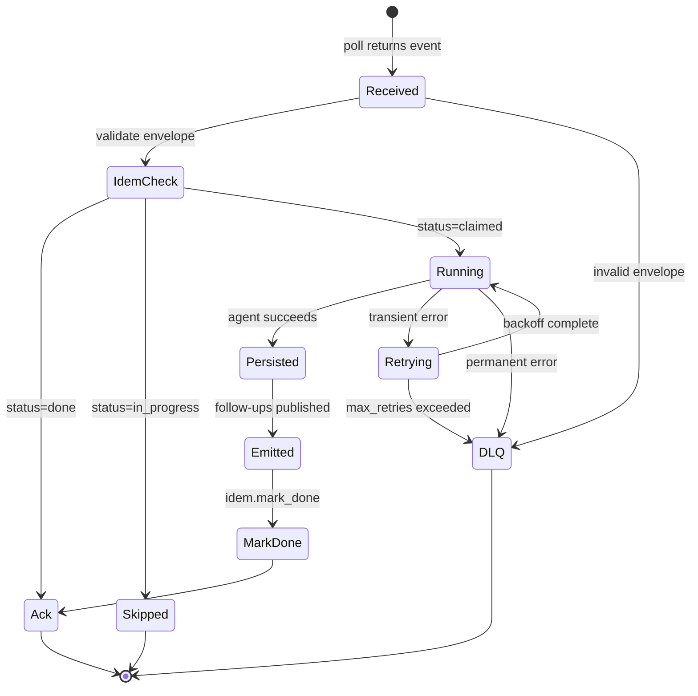

# Event-Driven Agents — Implementation

## Core Interfaces

```
Event:
  event_id: string                       // producer-assigned UUID
  partition_key: string
  timestamp: ISO-8601
  schema_version: integer
  type: string
  payload: object
  trace_id: string or null

ConsumerConfig:
  stream: string                         // source name (Kafka topic, Redis stream, SQS queue, ...)
  group: string                          // consumer group identity
  consumer_name: string                  // per-process identity
  max_in_flight: integer                 // batch size per poll
  pending_timeout_ms: integer            // before unacked events are redelivered
  max_retries: integer                   // before DLQ
  dlq_stream: string

AgentResult:
  decision: string                       // populated on success
  actions_taken: list of {tool, args, result}
  emitted_events: list of Event
  error: string or null                  // null on success
  is_transient: boolean                  // only meaningful when error is set
  attempts: integer                      // 1 on first-try success

IdempotencyStore:
  claim(event_id, ttl) -> "claimed" | "in_progress" | "done"
  mark_done(event_id) -> none
  status(event_id) -> "unseen" | "in_progress" | "done"
```

## Core Pseudocode

### consume

```
async function consume(config, agent_fn, idem, dlq):
  while running:
    batch = await source.read_group(
      stream=config.stream,
      group=config.group,
      consumer=config.consumer_name,
      count=config.max_in_flight,
      block_ms=5000,
    )

    if batch is empty:
      // also reclaim events whose owner crashed
      batch = await source.claim_pending(
        stream=config.stream,
        group=config.group,
        min_idle_ms=config.pending_timeout_ms,
        count=config.max_in_flight,
      )

    for (msg_id, event) in batch:
      await handle(msg_id, event, config, agent_fn, idem, dlq)
```

### handle

```
async function handle(msg_id, event, config, agent_fn, idem, dlq):
  // 1. Validate envelope. Permanent failure → DLQ immediately.
  if not is_valid_envelope(event):
    await push_dlq(dlq, event, "invalid envelope")
    await source.ack(config.stream, config.group, msg_id)
    return

  // 2. Idempotency claim.
  status = await idem.claim(event.event_id, ttl=source_retention + safety_margin)
  if status == "done":
    await source.ack(config.stream, config.group, msg_id)
    return
  if status == "in_progress":
    // another consumer is mid-handler; let pending timeout decide ownership
    return

  // 3. Run the agent with retry-on-transient.
  result = await with_retries(
    fn=() => agent_fn(event),
    max_attempts=config.max_retries,
    is_transient=is_transient_error,
  )

  // Permanent error → DLQ on first failure.
  // Transient error → DLQ only after max_attempts.
  // Either way, ACK so we don't re-deliver indefinitely.
  if result.error:
    await push_dlq(dlq, event, result.error, retry_count=result.attempts)
    await source.ack(config.stream, config.group, msg_id)
    return

  // 4. Persist outcome BEFORE ack — outcome store is the source of truth.
  await persist_outcome(event, result)

  // 5. Emit follow-ups (also idempotent via their own event_ids).
  for follow_up in result.emitted_events:
    await source.publish(follow_up)

  // 6. Mark done and ack.
  await idem.mark_done(event.event_id)
  await source.ack(config.stream, config.group, msg_id)
```

### Idempotency check (Redis SET NX EX)

```
async function claim(event_id, ttl):
  // Atomic check-and-set. Returns "claimed" if we got it, else existing status.
  acquired = await redis.set(
    key="idem:" + event_id,
    value="in_progress",
    nx=true,            // only set if not exists
    ex=ttl,             // expiry in seconds
  )
  if acquired:
    return "claimed"
  current = await redis.get("idem:" + event_id)
  return current  // "in_progress" or "done"

async function mark_done(event_id):
  // Preserve TTL; only flip the value.
  await redis.set("idem:" + event_id, "done", xx=true, keepttl=true)
```

> **Why two-phase.** A single SET-on-success leaves a window where a crash after the side effect but before the SET causes a duplicate to re-execute. Claim-first ensures the second consumer sees `in_progress` and backs off. The pending-timeout reclaim path handles the case where the original consumer never recovers.

### Retry with backoff and jitter

```
import random

async function with_retries(fn, max_attempts, is_transient, base_delay=1.0):
  for attempt in 1..max_attempts:
    try:
      result = await fn()                                // returns AgentResult on success
      result.attempts = attempt
      return result
    except Exception as e:
      if not is_transient(e):
        return AgentResult(error=str(e), is_transient=false, attempts=attempt)
      if attempt == max_attempts:
        return AgentResult(error=str(e), is_transient=true, attempts=attempt)
      delay = base_delay * (4 ** (attempt - 1))          // 1s, 4s, 16s, 64s
      jitter = delay * 0.2 * (random.random() * 2 - 1)
      await sleep(delay + jitter)
```

### Classifying errors

```
function is_transient_error(e):
  // Network and downstream-temporary errors → retry.
  if e is NetworkError, TimeoutError, RateLimitError:
    return true
  if e is HTTPError and e.status in [502, 503, 504]:
    return true
  if e is HTTPError and e.status == 429:
    return true
  if e is DatabaseError and e.code in [serialization_failure, deadlock_detected]:
    return true
  // Everything else (4xx other than 429, parse errors, validation) → permanent.
  return false
```

## State Diagram



## TypeScript Sketch

The shape is the same; only syntax changes. Redis Streams client is `ioredis`; SQS is `@aws-sdk/client-sqs`; Kafka is `kafkajs`.

```typescript
async function handle(msgId: string, event: Event, config: ConsumerConfig) {
  if (!isValidEnvelope(event)) {
    await pushDLQ(config.dlqStream, event, "invalid envelope");
    return source.ack(config.stream, config.group, msgId);
  }
  const status = await idem.claim(event.eventId, sourceRetention + safetyMargin);
  if (status === "done") return source.ack(config.stream, config.group, msgId);
  if (status === "in_progress") return;

  const result = await withRetries(() => runAgent(event), config.maxRetries, isTransient);
  if (result.error) {
    await pushDLQ(config.dlqStream, event, result.error, result.attempts);
    return source.ack(config.stream, config.group, msgId);
  }
  await persistOutcome(event, result);
  await Promise.all(result.emittedEvents.map(e => source.publish(e)));
  await idem.markDone(event.eventId);
  await source.ack(config.stream, config.group, msgId);
}
```

## Testing Strategy

| Layer | What to test | How |
|-------|--------------|-----|
| **Unit — handler** | Routes valid events to the agent; rejects invalid envelopes to DLQ | Inject a fake source + fake agent; assert call counts and DLQ writes |
| **Unit — idempotency** | `claim` returns "claimed" once and "in_progress" on the second call; `mark_done` flips status without resetting TTL | Real Redis in a fixture, or fakeredis |
| **Unit — retry/backoff** | Transient errors retried with the right schedule; permanent errors fail fast; jitter stays within ±20% | Patch `sleep` to no-op; record delay arguments |
| **Integration** | Publish a sequence including a duplicate, a poison event, and a transient-then-success | docker-compose with real Redis Stream; assert outcome store has exactly one row per unique event_id, DLQ has the poison, success row exists for the recovered transient |
| **Ordering** | Two events with same partition key process in publish order; events with different keys may interleave | Publish A1, A2 (same key) and B1 between them; assert agent saw A1 before A2; B1 may land anywhere |
| **Chaos** | Kill the consumer mid-handler; verify the event is redelivered and processed exactly once | Start handler, send SIGKILL between `claim` and `mark_done`; restart consumer; assert outcome store has one row, no duplicate side effects |
| **Eval (agent)** | The agent's *decisions* on real events. Build a labeled fixture set of `(event, expected_decision)` and run on every PR | Same eval harness used for any LLM agent; gate deploys on a regression bar |

## Common Pitfalls

- **Forgetting to ACK in error paths.** A handler that returns silently on permanent errors leaves the event un-ACKed and it redelivers forever. Always ACK after pushing to DLQ.
- **DLQ entries that never get re-examined.** A DLQ is not a destination; it's a hospital. Alert on depth > 0 and review weekly.
- **Idempotency TTL < event-retention window.** Source retention is 7 days; idempotency TTL is 1 day → late redeliveries re-execute. Set TTL ≥ retention + safety margin (typically 10–20% extra).
- **Ordering bugs from a coarse partition key.** `region` looks reasonable until two events for the same user land on different consumers and interleave. Re-key on the mutating entity.
- **Tool-call retries that re-charge the customer.** If a tool isn't idempotent, the retry path applies the side effect twice. Either make the tool idempotent (idempotency-key header on the downstream API) or wrap it in an "applied this event_id?" check.
- **`mark_done` without `keepttl`.** Resets TTL to the default. The "done" record then expires later than expected, OR (with a fresh TTL) blocks legitimate replays.
- **Reading from one DB and writing to another mid-handler.** Without a transactional outbox, a crash between the read and the emit produces "ghost" outcomes that aren't reflected in any outbound event. Use the outbox pattern when you must update local state and emit atomically.
- **Trusting `event.timestamp` for ordering across partitions.** Wall-clock time skews across producers. Use it for diagnostics, not for ordering logic.

## Migrating from Polling

If you currently have a cron job polling a database for changed rows:

1. **Identify the source-of-truth state change** that the poller is detecting (e.g., `reservations.status` flips to `cancelled`).
2. **Emit an event from the same transaction** that changes the state — use the [outbox pattern](https://microservices.io/patterns/data/transactional-outbox.html): write the event into an `outbox` table in the same DB transaction that changes `reservations.status`; a separate process tails `outbox` and publishes to the stream.
3. **Start the consumer in shadow mode** — it consumes events and logs the decision it *would* have made, but doesn't act. Compare against the poller's decisions for a week.
4. **Cut over.** Switch the consumer from shadow to active; stop the poller.
5. **Backfill via replay.** If you have a Kafka log or Redis Stream with history, run the consumer over historical events from a known starting offset to populate the outcome store. Set a separate consumer group identity for backfill so it doesn't interfere with the live consumer.

**What you give up:** the simplicity of "look at the DB, find changed rows." What you gain: latency drops from `poll_interval / 2` (avg) to milliseconds; multiple consumers can react to the same change without each running its own query; the event log is replay-able.

## Going Further

Deferred to follow-up PRs:

- `evolution.md` — How Event-Driven evolves from Tool Use.
- `cost-and-latency.md` — Per-event cost breakdown; latency budgets for sync vs async response.
- `observability.md` — Full dashboard spec; trace propagation across the agent + tool stack.
- `code/` — Production Python and TypeScript implementations for Redis Streams + SQS.
