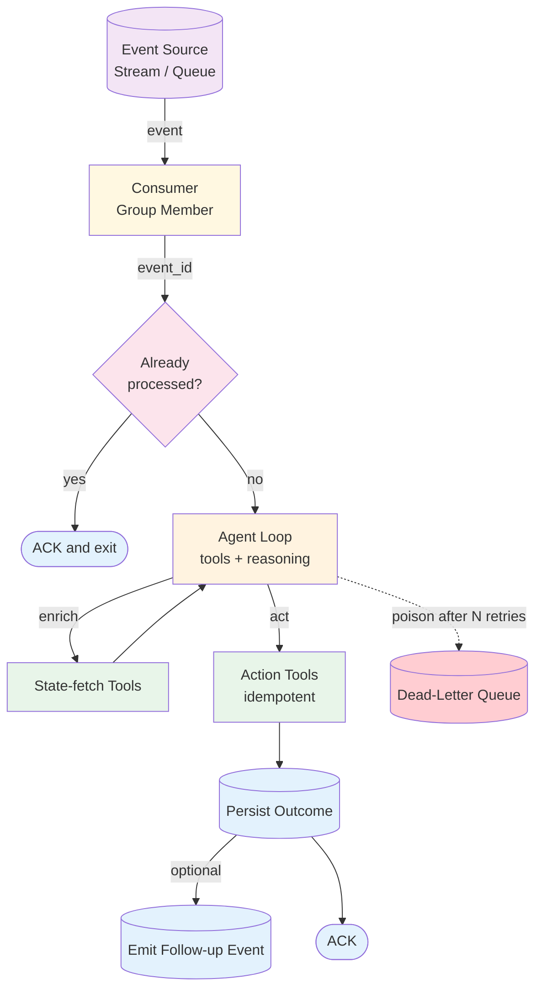

# Event-Driven Agents — Overview

Event-driven agents consume events from a queue or stream rather than responding to HTTP requests. The agent's lifecycle is: subscribe → receive event → enrich with current state via tools → decide → act → emit outcome. Triggers are external (cancellations, status changes, scheduled events), not user-initiated.

**Evolves from:** [Tool Use](../tool_use/overview.md) — adds an event-source intake, idempotency requirements, and operational concerns (backpressure, retries, DLQ) that don't exist in request-driven setups.

## Architecture



*Figure: An event arrives via a queue or stream. A consumer dequeues, checks idempotency, runs the agent loop (enrich → decide → act), persists the outcome, optionally emits a follow-up event, then ACKs. Poison events route to a dead-letter queue after N retries.*

## How It Works

1. **Subscribe** — The consumer subscribes to one or more event streams/topics with a consumer-group identity (for horizontal scaling).
2. **Receive** — Events arrive in order *within a partition key* (e.g., `restaurant_id`). The consumer pulls at its own rate; the source buffers behind it.
3. **Deduplicate** — Look up the event ID in an idempotency store; if seen, ACK and exit. (At-least-once delivery is the norm.)
4. **Enrich** — The agent uses tools to fetch current world state needed to decide (waitlist, availability, customer preferences).
5. **Decide** — The LLM reasons over the event + enriched state and picks an action (or chooses to take no action).
6. **Act** — The agent calls action-taking tools (modify reservation, notify customer). These tools should themselves be idempotent.
7. **Emit + persist** — Persist the decision + outcome to durable state; optionally emit a follow-up event for downstream agents.
8. **ACK** — Acknowledge the event to the source. Failures before ACK trigger redelivery.

## Minimal Example

Subscribe to a Redis Stream consumer group, dispatch each event to an agent function, ACK on success, and DLQ after N attempts.

```python
import redis.asyncio as redis
from your_app.agent import run_agent

r = redis.Redis()
STREAM, GROUP, CONSUMER, DLQ = "reservations", "rebooking", "worker-1", "reservations:dlq"
MAX_RETRIES = 5

async def consume():
    while True:
        # XREADGROUP blocks until events arrive; ">" = only undelivered messages
        batches = await r.xreadgroup(GROUP, CONSUMER, {STREAM: ">"}, count=10, block=5000)
        for _, messages in batches or []:
            for msg_id, event in messages:
                try:
                    if await seen_before(event[b"event_id"]):
                        await r.xack(STREAM, GROUP, msg_id)
                        continue
                    await run_agent(event)              # enrich → decide → act → persist
                    await mark_seen(event[b"event_id"])
                    await r.xack(STREAM, GROUP, msg_id)
                except TransientError:
                    pass  # leave un-ACKed; redelivered after pending timeout
                except Exception as e:
                    retries = await bump_retry(msg_id)
                    if retries >= MAX_RETRIES:
                        await r.xadd(DLQ, {**event, b"last_error": str(e).encode()})
                        await r.xack(STREAM, GROUP, msg_id)
```

### Code variants

| Implementation | Language | Path |
|----------------|----------|------|
| Framework-agnostic consumer (asyncio, idempotency claims, retry / DLQ) | Python | [`code/python/event_driven.py`](code/python/event_driven.py) |
| Vercel AI SDK (typed `HandlerOutcome`, in-memory broker, plain handler fn) | TypeScript | [`code/typescript/vercel-ai-sdk/event-driven.ts`](code/typescript/vercel-ai-sdk/event-driven.ts) |
| Mastra (`Agent.generate({ output: HandlerDecision })` per event) | TypeScript | [`code/typescript/mastra/event-driven.ts`](code/typescript/mastra/event-driven.ts) |

All three variants run the same five-event smoke (two clean events, one permanent-failure, one no-op `reservation.no_show`, and a duplicate of `evt_001` that the idempotency claim deduplicates) so they're diff-friendly across stacks. See [Implementation](./implementation.md) for the complete pseudocode and retry-with-backoff helper.

## Examples

- [Restaurant rebooking](examples/restaurant-rebooking.md) — concrete domain overlay anchored to the `restaurant-rebooking` recipe. Worked schemas, mock Resy / OpenTable / notifier tools, role prompts for intake / eligibility / search / notifier, and an end-to-end walkthrough with offline tests in [`examples/restaurant_rebooking/`](examples/restaurant_rebooking/).

## Input / Output

- **Input:** A typed event message — at minimum `event_id`, `partition_key`, `timestamp`, `schema_version`, and a typed `payload`.
- **Output:** An outcome record persisted to durable state, plus an ACK to the source.
- **Side effects:** Tool calls that modify external state. These must be idempotent — at-least-once delivery means the same event can arrive twice.

## Key Tradeoffs

| Strength | Limitation |
|----------|-----------|
| Decouples producers and consumers | Operational complexity: queue/stream infra, consumer groups, DLQs |
| Natural fit for reactive workflows | Debugging is harder — no synchronous response to trace |
| Backpressure absorbs spikes | Eventual consistency between event arrival and outcome |
| Horizontal scaling via consumer groups | Idempotency burden falls on tool implementations |
| Replay-able from the event log | Ordering only guaranteed within a partition key |

## When to Use

- The trigger is an external event (cancellation, status change, scheduled job), not a user request.
- The agent needs to react in near-real-time, but the response doesn't need to reach a human in the same turn.
- Multiple downstream agents need to react to the same event (fan-out via topic).
- You need durable replay of historical events for backfills or onboarding new agents.

## When NOT to Use

- The user is waiting synchronously for a response — use a request-driven pattern instead.
- Events arrive at <1/minute and a polling cron job would suffice.
- Idempotent tool implementations are infeasible (some legacy adapters can't support it).
- The task naturally produces a single response to a single input — event-driven adds overhead without benefit.

## Related Patterns

- **Evolves from:** [Tool Use](../tool_use/overview.md) — same agent reasoning loop, different trigger.
- **Combines with:** [Multi-Agent](../multi_agent/overview.md) (one agent per event type; supervisor optional), [Routing](../routing/overview.md) (route on event type), [Memory](../memory/overview.md) (rebuild agent state from event log).
- **Often composed with:** Outbox pattern (transactional event emission) and Saga pattern (long-running multi-step workflows).

## Deeper Dive

- **[Design](./design.md)** — Event-source choice (Kafka / SQS / Redis Streams / NATS), consumer groups, idempotency keys, retry + DLQ, ordering, schema evolution, backpressure, observability, failure modes.
- **[Implementation](./implementation.md)** — Subscriber pseudocode, idempotency store design, retry-with-backoff, testing event-driven agents, migration from polling.

## When NOT to use this pattern

- The user is waiting synchronously for a response — async patterns add latency from the user's view.
- The event source doesn't guarantee at-least-once delivery — you'll need idempotency without a clear contract.
- You don't yet handle replays — silent double-processing is hard to detect in production.

## Next steps

- Production version: see [Blueprints → Deployments](../../composition/blueprints-to-deployments.md) for the deployment agents that use this pattern.
- Generate a starter project: see [Blueprint → Spec → Scaffold](../../composition/blueprint-to-spec-to-scaffold.md).
- Combine with other patterns: see the [Composition guide](../../composition/README.md).
