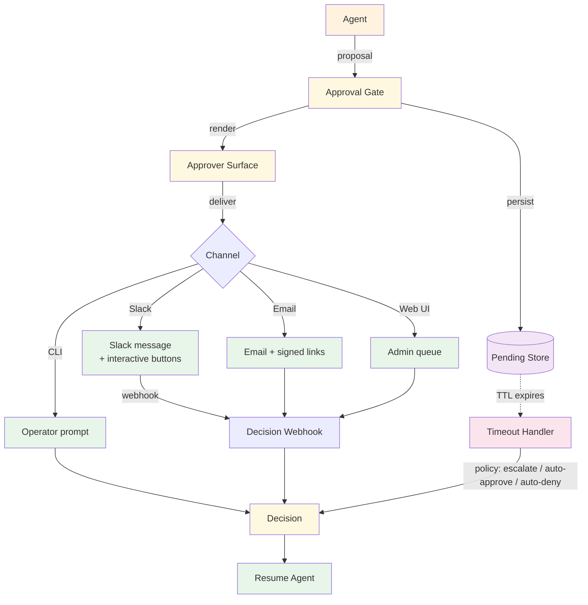

# Human in the Loop — Design

> Canonical Pydantic state schema: [`schemas/state.py`](schemas/state.py) — `HitlState` is the top-level shape; `Interrupt`, `HumanInput` are the auxiliary models. Recipes targeting Human-in-the-Loop reference these names verbatim.
>
> Typed prompts: [`prompts/`](prompts/) — `agent.md` (the main loop with interrupt capability) + `interrupt-formatter.md` (sanitizes interrupts for the UI). See [`meta/style-guide.md`](../../meta/style-guide.md#typed-prompts) for the frontmatter contract.

## Component Breakdown



### Approval Gate

The boundary the agent calls into when a proposal needs review. Persists pending state, picks a surface, blocks (sync) or schedules (async) for the decision, applies the timeout policy.

### Pending Store

Durable row per proposal: `(proposal_id, agent_checkpoint, surface, approver_pool, expires_at, state, created_at)`. Postgres for transactional pairing with audit log; Redis with persistence on for higher write rates.

### Approver Surface

Renders the proposal into a channel-native format and parses the decision back. Four flavours below; one gate can route to different surfaces per proposal class.

### Decision Webhook

Inbound endpoint for Slack/email/web responses. Validates the decision (auth, signature, idempotency), writes the decision row, signals the waiting agent to resume.

### Timeout Handler

A scheduled job that scans for `expires_at < now AND state = pending` and applies the per-proposal escalation policy.

## Sync-Blocking vs Async-Resume

Two structural choices. Pick per proposal class based on expected human-response time.

| Aspect | Sync-blocking | Async-resume |
|--------|---------------|--------------|
| Agent process | Blocks (HTTP request held open) | Returns; resumes later |
| Approver TTL | Seconds (5–30) | Minutes to hours |
| State store | Optional (in-memory acceptable) | Required (DB-backed checkpoint) |
| Webhook needed | No | Yes — decision routes back via webhook |
| Resilience | Crash = proposal lost; reissue | Crash-safe; another worker resumes from checkpoint |
| Typical surface | CLI prompt (dev), web (live ops watching the screen) | Slack, email, web queue (humans elsewhere) |
| Best fit | Dev workflows; live ops with humans in the loop in real-time | Production approvals where the approver isn't sitting at the screen |

**Guideline:** Default to async-resume in production. Use sync-blocking only when the expected response is < 30s and you control both sides of the HTTP boundary.

## Approver Surfaces

| Surface | Strengths | Weaknesses | Best for |
|---------|-----------|------------|----------|
| **Slack** | Where ops teams already live; interactive buttons; instant notification | Buttons can race (multiple approvers click); link expiry / channel deletion | Most production ops approvals |
| **Email** | Universal; audit-friendly (every decision is in someone's sent-folder); signed links survive long TTLs | Slower P50; risk of phishing-spoofing (mitigate with signed action URLs) | Approvals with long TTL or compliance audit needs |
| **Web admin UI** | Rich context display (timeline, history, related cases); approver pool routing | Requires building + maintaining the UI; logged-out approvers don't see notifications | High-context decisions, manager-tier approvals |
| **CLI prompt** | Zero infrastructure; great for dev / test; deterministic for replay | Single approver per terminal; no audit beyond shell history | Dev, integration tests, one-off ops scripts |

A single gate can route to different surfaces per proposal class: high-value rebookings → Slack to the on-call manager; routine compliance flags → email digest queue once per hour; bootstrap-phase everything → web admin UI for full context.

## TTL + Escalation Policy

Every approval has a TTL. On expiry, one of three policies fires:

| Policy | When to use | Risk |
|--------|-------------|------|
| **Auto-approve** | The default is to act; review is best-effort governance | Quietly committing actions the approver would have caught |
| **Auto-deny** | The default is to NOT act; absence of approval = no-go | False negatives: legitimate actions stuck in limbo |
| **Escalate** | Re-surface to a different approver pool (L2, manager, on-call) | Doubles the approver burden when L2 is also slow |

For rebooking, `escalate` is the right default for revenue-impacting decisions (route a stuck approval to the manager pool after 15 min). `auto-approve` is appropriate for low-risk routine flags (auto-approve "send confirmation SMS to verified phone" after 60 min). `auto-deny` is appropriate for compliance gates ("issue refund > $500 requires named approver"; after TTL, fail closed).

**TTL design rule of thumb**:

| Surface | Suggested TTL |
|---------|---------------|
| CLI (live ops watching) | 60 seconds |
| Slack (active channel) | 5–15 minutes |
| Slack (off-hours) | 30 minutes → escalate |
| Email | 60–240 minutes |
| Web admin queue | 30 minutes → escalate |

Pick the TTL so the **typical** approver responds before it expires — escalation should be the exception, not the rule. Track `timeout_rate` per surface; if > 10%, the TTL is wrong (or the surface is).

## Audit Trail

Every decision is an auditable event. Persist with at minimum:

```json
{
  "proposal_id": "rebook:case_01HVY...",
  "action": "rebook_reservation",
  "context_shown": {
    "case_summary": "...",
    "candidates_top3": [...],
    "estimated_value_usd": 245
  },
  "surface": "slack:#rebooking-approvals",
  "approver": "alice@acme.com",
  "approver_pool": "restaurant_staff",
  "decision": "approved",
  "modification": null,
  "decided_at": "2026-05-24T17:42:11Z",
  "decided_in_seconds": 312,
  "escalated_from": null
}
```

`context_shown` is the exact payload the approver saw — not a freshly-rendered version at audit time, because the world may have moved on. This is what makes a stale approval defensible: "Alice saw THIS context and approved THIS action." Cross-reference: `agent-deployments/docs/cross-cutting/audit-logging.md`.

For multi-approver workflows (two-of-three approval), audit each individual decision plus a final composite decision.

## Reversibility Boundary

HITL gates a **forward step** before it commits. It does NOT undo a committed action — that's what [Saga](../saga/overview.md) compensators are for.

| Need | Use |
|------|-----|
| Block a not-yet-committed action pending approval | HITL |
| Unwind a previously-committed action when later steps fail | Saga compensator |
| Both: gate the riskiest step in a saga before its `do` runs | HITL + Saga composition |

The combination is powerful: a refund saga can gate the `refund_step` behind HITL (the most expensive irreversible step) while leaving the cheap reversible steps to run unattended. The approver only sees the proposal when the saga is about to commit something hard to take back.

## Composition

- **+ [Saga](../saga/overview.md)** — Gate the highest-risk step in a saga; the gate happens before the step's `do` runs. If approval is denied or times out (deny policy), the saga compensates the prior completed steps.
- **+ [Event-Driven](../event_driven/overview.md)** — A proposal-pending event is published to an approval stream; the surface consumer renders it; the decision is published back as an event the agent consumer reacts to.
- **+ [Tool Use](../tool_use/overview.md)** — Tools can carry an `approval_required` flag; the tool dispatcher routes those through the gate before invoking the tool function.
- **+ Audit logging** (cross-cutting `agent-deployments/docs/cross-cutting/audit-logging.md`) — every decision is an audit-log entry; mandatory for compliance use cases.
- **+ Authorization** (cross-cutting `agent-deployments/docs/cross-cutting/authorization-rbac.md`) — the gate must verify the approver has the right role for the proposal class; otherwise any Slack user could approve anything.

## Production concerns

Cognitive concerns this repo covers; operational concerns belong in [agent-deployments](https://github.com/jagguvarma15/agent-deployments).

| Concern | This pattern's surface | Where to read |
|---|---|---|
| Prompt injection | proposed actions presented to humans should be schema-bound; free-text proposals can hide injected instructions | [foundations/security-and-safety.md](../../foundations/security-and-safety.md) |
| Hallucination & grounding | the human IS the grounding mechanism for the gated action | [foundations/hallucination-and-grounding.md](../../foundations/hallucination-and-grounding.md) |
| Cost & model selection | low LLM cost; high human-time cost — budget review time as a first-class resource | [foundations/cost-and-model-selection.md](../../foundations/cost-and-model-selection.md) |
| Rate limiting & retries | inherited | [agent-deployments cross-cutting](https://github.com/jagguvarma15/agent-deployments/tree/main/docs/cross-cutting) |
| Idempotency | approval replay must be safe | [agent-deployments cross-cutting](https://github.com/jagguvarma15/agent-deployments/blob/main/docs/cross-cutting/idempotency.md) |
| Observability hooks | see `observability.md` alongside this file | [foundations](../../foundations/README.md) |
