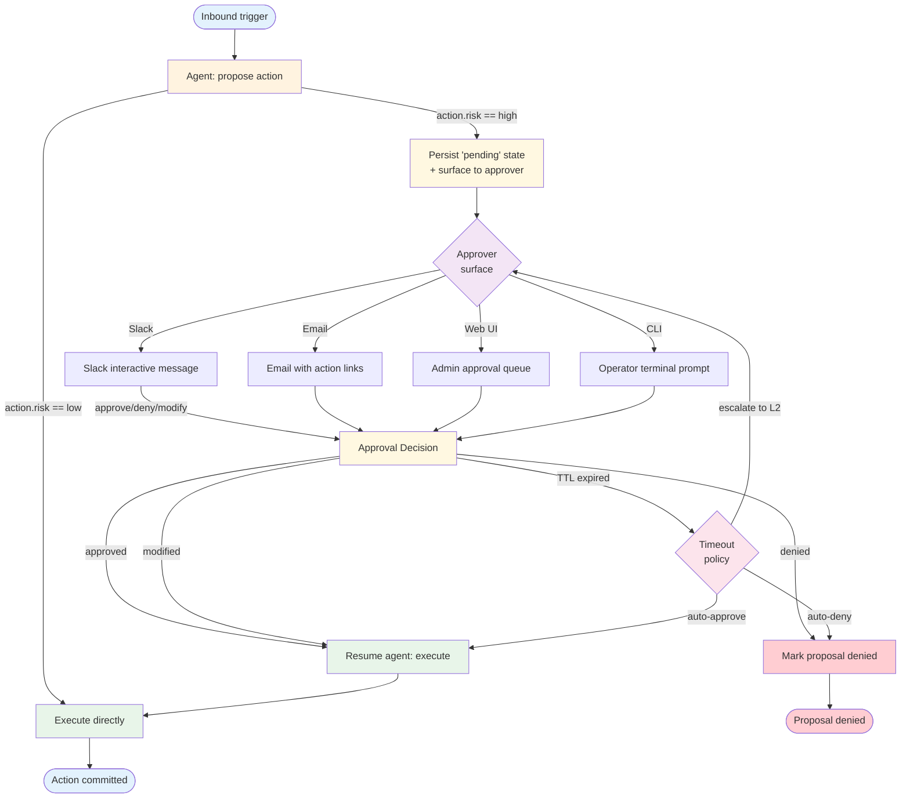

# Human in the Loop — Overview

An agent that handles money, customer-visible changes, or policy decisions usually needs a human checkpoint before some actions commit. The Human-in-the-Loop (HITL) pattern formalises this: the agent **proposes** an action, **pauses** in a known state, surfaces the proposal to an approver, and **resumes** with the approver's decision (approve / deny / modify) before committing.

**Evolves from:** [Tool Use](../tool_use/overview.md) — adds an explicit `approve_then_execute` step around tool calls flagged for human review.

## Architecture



*Figure: An agent runs until it picks an action flagged for approval. State is persisted (pending), the proposal is surfaced via one of four channels, and the agent resumes on the approver's decision (or on TTL-driven escalation).*

## How It Works

1. **Propose** — The agent reaches a decision point. For low-risk actions it executes directly; for actions flagged for review (per a policy or per a confidence threshold) it pauses.
2. **Persist pending state** — The full agent state goes into a durable store (DB row, LangGraph checkpoint, Temporal signal). The pause is **crash-resilient** — the agent can be killed and a fresh process picks up the pending state.
3. **Surface** — The proposal is delivered to the approver via the configured channel: Slack message with approve/deny buttons, email with signed action links, admin web UI tile, CLI prompt for dev workflows.
4. **Wait** — Either the approver responds, or the proposal's TTL expires.
5. **Resume on decision** — Approver responds → agent loads pending state → executes the approved action (or the modified version) → continues. Approver denies → agent loads pending state → records the denial → terminates.
6. **Escalate on timeout** — TTL expires → apply the escalation policy: auto-approve (low-risk default), auto-deny (high-risk default), or re-surface to an L2 approver.

## Minimal Example

A rebooking flow that pauses for staff approval when the rebooking value exceeds a tier threshold.

```python
from patterns.human_in_the_loop.code.python.approval import (
    Approval, ApprovalGate, SlackSurface,
)

gate = ApprovalGate(
    surface=SlackSurface(channel="#rebooking-approvals", webhook_url=...),
    timeout_seconds=900,             # 15 minutes
    on_timeout="escalate",           # "auto_approve" | "auto_deny" | "escalate"
    escalation_surface=SlackSurface(channel="#rebooking-l2", ...),
)

def needs_review(proposal: dict) -> bool:
    return proposal["estimated_value_usd"] > 200 or proposal["tier"] == "vip"

# In the agent loop:
proposal = build_rebooking_proposal(case)
if needs_review(proposal):
    decision = gate.request_approval(Approval(
        proposal_id=f"rebook:{case.id}",
        action="rebook_reservation",
        context={"case": case.summary(), "candidates": proposal["candidates"][:3]},
        approver_pool="restaurant_staff",
    ))
    if decision.outcome == "denied":
        return CaseResult.declined(reason=decision.reason)
    if decision.outcome == "modified":
        proposal = apply_modification(proposal, decision.modification)
execute_rebooking(proposal)
```

### Code variants

| Implementation | Language | Path |
|----------------|----------|------|
| Framework-agnostic gate (CLI / Slack / web-queue surfaces, TTL escalation, idempotent inbox) | Python | [`code/python/approval.py`](code/python/approval.py) |
| Vercel AI SDK (`generateObject` proposal + in-memory gate + idempotent inbox) | TypeScript | [`code/typescript/vercel-ai-sdk/human-in-the-loop.ts`](code/typescript/vercel-ai-sdk/human-in-the-loop.ts) |

The Python sibling is the fuller example — three surface flavours, escalation policies, threading-driven race tests. The TypeScript variant scopes down to the core contract (model proposes, gate suspends, idempotent inbox decides, TTL settles) so the dispatcher shape stays diff-friendly. Lift the Python file's escalation chain or Slack surface into TS as production needs.

## Input / Output

- **Input:** A proposal envelope `(action, context, approver_pool, ttl)` plus the surface configuration
- **Output:** A `Decision(outcome, approver, decided_at, reason, modification)` once the approver responds OR the timeout policy fires
- **Pending state:** Durable record `(proposal_id, state, expires_at, agent_checkpoint)` — what makes the agent resumable after crash or restart
- **Audit trail:** Every decision logs `(proposal_id, approver, decision, context_shown, decided_at)` for compliance

## Key Tradeoffs

| Strength | Limitation |
|----------|-----------|
| Inserts governance without rewriting the agent | Wall-clock latency dominated by human response time (minutes to hours, not seconds) |
| Auditable: every committed action of this class has a named approver | Approvers become the bottleneck; on-call rotations / pool routing become operational concerns |
| Policy lives in code (`needs_review`) not folklore | Mis-classifying low-risk as high-risk burns approver attention; mis-classifying high-risk as low-risk skips the gate entirely |
| Composable with [Saga](../saga/overview.md) (gate the riskiest step) | Doesn't unwind committed actions — use saga for that |
| Crash-resilient via the pending-state store | TTL + escalation policy must be designed; bad defaults strand proposals or auto-approve dangerous things |

## When to Use

- **Money-moving or customer-visible actions** — refunds, fee waivers, plan changes, manual price overrides.
- **Policy decisions where the model isn't authoritative** — VIP customer handling, exception cases that the recipe doesn't fully specify.
- **Low-confidence model outputs** — the agent itself signals "I'm not sure"; the policy escalates rather than guessing.
- **Compliance / regulatory requirements** — actions that must have a named human accountable per regulation (KYC overrides, GDPR right-to-be-forgotten executions).
- **Bootstrapping new agents** — gate everything during the first week; remove gates as confidence grows.

## When NOT to Use

- For every action — approval fatigue kills the gate's value. Use a policy that flags only the riskiest 1–5% of actions.
- When the action is reversible and cheap to redo — let the agent act and use a [Saga](../saga/overview.md) compensator if it goes wrong.
- For automation where the human approval is rubber-stamping — replace with a deterministic rule or a higher-confidence model.
- When the work is too time-sensitive to wait for a human (sub-second decisions) — push the policy into the agent's prompt or a guardrail check instead.

## Related Patterns

- **Evolves from:** [Tool Use](../tool_use/overview.md) — adds the propose-pause-resume gate around tool dispatch
- **Composes with:** [Saga](../saga/overview.md) — gate the most irreversible step in a saga before its `do` runs; [Event-Driven](../event_driven/overview.md) — proposals become events on an "approval-pending" stream and decisions become events on a "approved/denied" stream
- **Contrast with:** Reflection — Reflection is the agent critiquing itself; HITL is a human critiquing the agent

## Deeper Dive

- **[Design](./design.md)** — Sync-blocking vs async-resume; four approver surfaces; TTL + escalation policy; audit trail; reversibility boundary vs Saga
- **[Implementation](./implementation.md)** — LangGraph `interrupt()` + Slack approval, plus a web-UI variant for richer context
- **[Evolution](./evolution.md)** — Tool Use + approval flag → HITL
- **[Observability](./observability.md)** — Approval latency P50/P95, approval rate, timeout/escalation rate, per-approver throughput
- **[Cost & Latency](./cost-and-latency.md)** — LLM cost is negligible; wall-clock is the constraint — SLO design and approver-pool sizing

## When NOT to use this pattern

- The action is low-stakes and human approval is a rubber-stamp — wastes both the agent's and the human's time.
- You don't have a clear approver surface (queue, UI, escalation channel) — HITL without surfaces is a dropped action.
- Human review latency breaks the user-facing flow — async handoff or a different pattern fits better.

## Next steps

- Production version: see [Blueprints → Deployments](../../composition/blueprints-to-deployments.md) for the deployment agents that use this pattern.
- Generate a starter project: see [Blueprint → Spec → Scaffold](../../composition/blueprint-to-spec-to-scaffold.md).
- Combine with other patterns: see the [Composition guide](../../composition/README.md).
