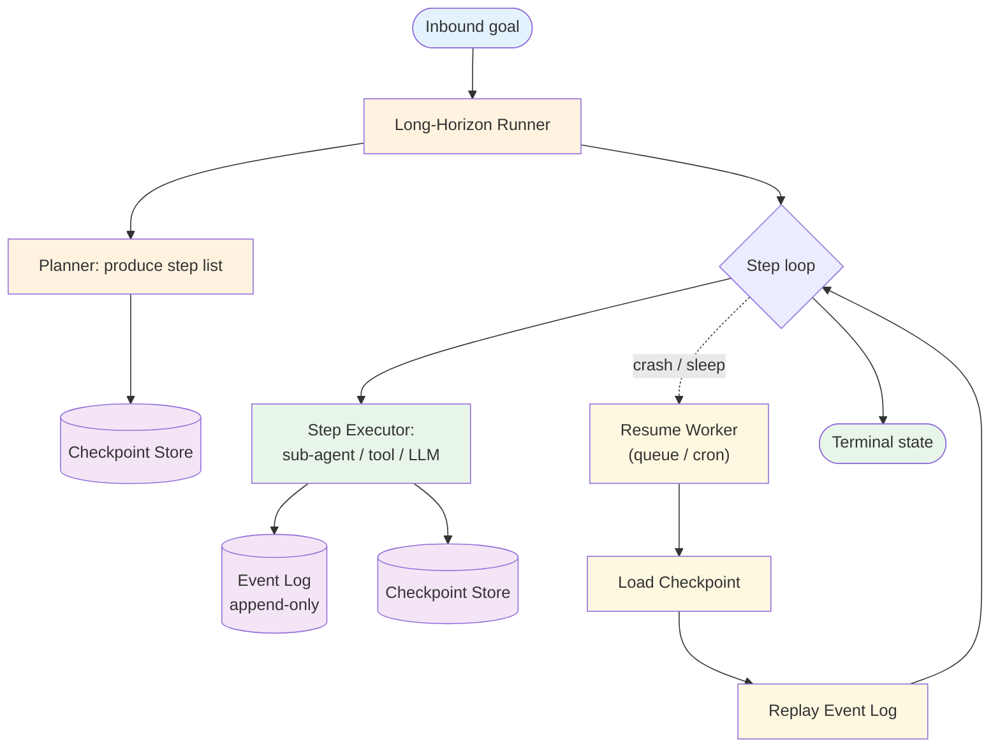
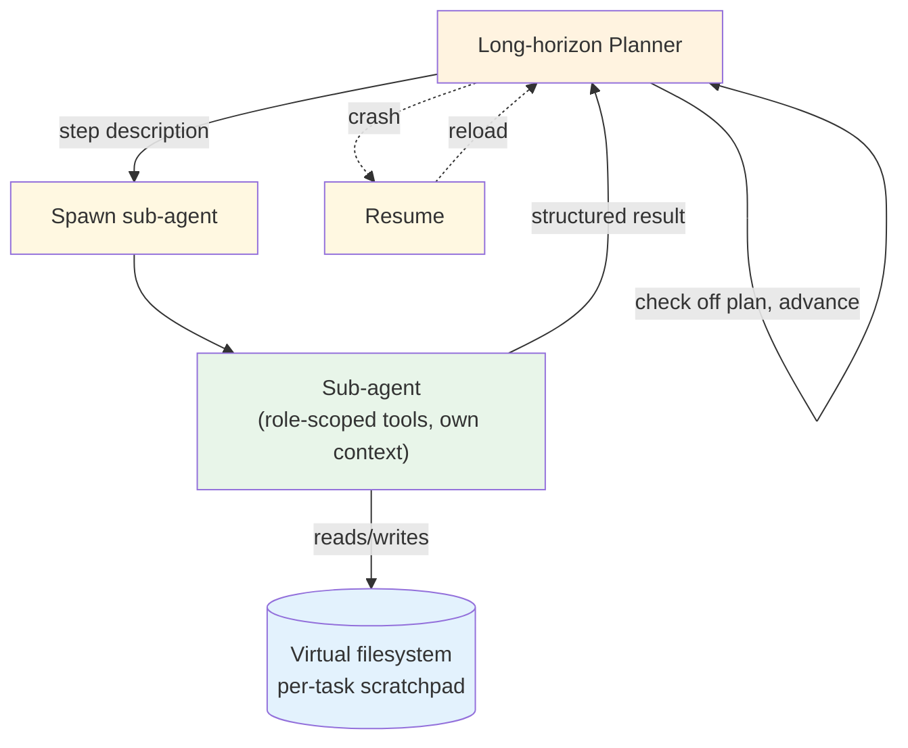

# Long-Horizon — Design

> Canonical Pydantic state schema: [`schemas/state.py`](schemas/state.py) — `LongHorizonState` is the top-level shape; `Checkpoint`, `EventLogEntry`, `StepRecord` are the auxiliary models.

## Component Breakdown



### Long-Horizon Runner

The harness around the agent. Owns the step loop, checkpoint emission, event-log append, deadline enforcement. Stateless across `tick()` calls — all state lives in the checkpoint store.

### Planner

Produces the initial plan from the goal + initial context. Often Opus-class (planning quality matters; cost amortizes over the task lifetime). The plan goes into the first checkpoint. Re-planning happens explicitly when a step result changes the world enough to require it; otherwise the plan is fixed.

### Checkpoint Store

Keyed by `task_id`, holds the latest snapshot per task: `(task_id, version, state_blob, last_step_index, updated_at)`. Postgres for transactional pairing with the event log; Redis with persistence for higher write rates.

### Event Log

Append-only record of every important event: `step_started`, `step_completed`, `tool_called`, `tool_returned`, `external_signal_received`, `checkpoint_emitted`, `human_escalation_requested`. Carries deltas between checkpoint snapshots. Keep at least the last N checkpoints' worth so replay is always possible.

### Step Executor

Runs one step. Often a [sub-agent](../../primitives/sub_agents/overview.md) invocation (each step is "research X" or "provision Y"); sometimes a direct tool call; occasionally a fresh LLM reasoning call. The executor's contract: take the current state, produce a result, return without holding resources.

### Resume Worker

Pulls in-flight task ids from a queue or a cron. For each, loads the checkpoint, replays the event log since that checkpoint, and calls `tick()`. The same worker code runs for the initial kickoff and for every resume.

## Checkpoint vs Event Log

Two complementary persistence shapes. You need both.

| Aspect | Checkpoint snapshot | Event log |
|---|---|---|
| Write frequency | Once per N steps (configurable, often per step) | Once per event (multiple per step) |
| Read frequency | On resume (one per resume) | On resume (range scan) + audit |
| Size | Full state blob | Small per-event row |
| Storage cost | Linear in task count × snapshot size | Linear in task count × event volume |
| Read pattern | Point lookup by `task_id` | Range scan by `(task_id, since_checkpoint)` |
| Failure mode | Stale snapshot — replay catches up | Lost events — replay produces a stale resume state |
| Best for | "What is the agent's last known state?" | "Exactly what happened between then and now?" |

The two-tier shape (snapshot + log) keeps storage and read costs bounded. A pure event log requires replay from t=0; a pure snapshot loses the ability to audit step-by-step.

## Resume Protocol

```
def resume(task_id):
    cp = checkpoint_store.load_latest(task_id)
    if cp is None:
        raise UnknownTask(task_id)
    events_since = event_log.range(task_id, since_version=cp.version)
    state = apply_events(cp.state_blob, events_since)
    runner = LongHorizonRunner.from_state(state)
    return runner
```

`apply_events` is a pure reducer: `(state, event) → state`. The reducer must be deterministic — given the same checkpoint + event sequence, two workers produce the same in-memory state. Otherwise replay is non-reproducible.

## Idempotency

The single biggest design constraint. A resume may re-issue a step whose side effects already happened (the crash was between "issued tool call" and "wrote checkpoint"). Three options per step:

1. **Naturally idempotent.** Use idempotency keys (HTTP `Idempotency-Key`, database `INSERT ... ON CONFLICT DO NOTHING`). The step can be safely retried.
2. **Wrap with a deduplication store.** The step generates a stable id; the wrapper checks "did we already do this id?" before invoking.
3. **Pair with a compensation.** If a step's side effect is irreversible and can't be deduplicated, the step is a saga step in disguise. Use the [Saga](../saga/overview.md) pattern's compensation semantics for that sub-flow.

Skipping this design step is the most common cause of long-horizon agents in production silently corrupting state.

## Context Engineering Across Resumes

Long-horizon agents force [context engineering](../../foundations/context-engineering.md) into a first-class concern. The full task history won't fit in one window, even at week one.

| Strategy | What it does | When to use |
|---|---|---|
| Compacted recap per step | LLM produces a short structured recap; the recap becomes the model's input next step | Default — covers most flows |
| Plan + delta | Persist the plan once; per-step persist only the delta from plan | When the plan is stable and steps are predictable |
| Virtual filesystem | Sub-agents read and write a shared filesystem; the runner passes file paths, not file contents | Deep-agents pattern — long research / coding tasks |
| Vector store recall | Past summaries embedded; the runner retrieves relevant ones for the next step | When the agent needs cross-task knowledge transfer |

Most production long-horizon agents combine compacted recap + virtual filesystem. The plan + delta shape works when the plan really doesn't change; in practice it usually does.

## The Deep-Agents Shape

A specific composition that has become the 2026 default for long, autonomous tasks:



The planner stays small (one model call per resume tick). The work happens in sub-agents. The virtual filesystem is the cross-resume memory — the planner reads and writes files between sub-agent invocations. This is how Claude Code's research agents and Anthropic's autonomous coding work shape look.

## Termination Conditions

A long-horizon task ends in one of:

- **`completed`** — all plan steps done, goal reached.
- **`aborted`** — the agent (or operator) decided the task can't continue; persisted with reason.
- **`requires_human`** — a step's executor returned "I can't continue without human input"; the task pauses until [HITL](../../modifiers/human_in_the_loop/overview.md) resolves it.
- **`deadline_exceeded`** — overall task deadline elapsed; persisted with the last good state.

Every termination is a row in the audit log. The runner doesn't silently exit.

## Failure Modes

- **Stuck task.** Last activity older than expected; no step ran during the last tick window. Diagnosis: external dependency is down, or a sub-agent crashed without recording the failure. Resume worker has to detect this; emit an alert.
- **Replay produces a different state.** Non-deterministic reducer. Diagnosis: the reducer reads wall-clock time, or uses non-deterministic dict ordering, or relies on tool output that changed (a search index that updated). Fix: capture the tool outputs in the event log so replay sees the same data.
- **Checkpoint inconsistency.** Checkpoint written but the event log row didn't make it (or vice versa). Diagnosis: not running both in one transaction. Fix: transactional store, or store both in the same row.
- **Step idempotency leak.** A retried step issues a duplicate side effect (two emails, two payments). Diagnosis: step isn't idempotent and isn't wrapped. Fix: idempotency key per step, deduplication store, or compensation.
- **Plan drift.** The original plan no longer fits the current world. Diagnosis: the agent should re-plan but doesn't. Fix: explicit re-plan checkpoints; trigger when a step result indicates the world changed materially.

## Composition

- **+ [Sub-agents](../../primitives/sub_agents/overview.md)** — every step is a sub-agent. The primary composition.
- **+ [Memory](../../primitives/memory/overview.md)** — long-term facts that survive across tasks live in memory; the long-horizon checkpoint covers only the current task's state.
- **+ [Saga](../saga/overview.md)** — sub-flows within a long-horizon task that need compensation use saga semantics for those steps.
- **+ [Event-Driven](../event_driven/overview.md)** — external signals (a webhook arriving days later) route through an event queue; the runner's `tick()` is the consumer.
- **+ [Human in the Loop](../../modifiers/human_in_the_loop/overview.md)** — the `requires_human` termination opens the door; HITL handles the resolution.
- **+ [Multi-Agent](../multi_agent/overview.md)** — the planner IS the supervisor; the steps are workers. Long-horizon is what makes Multi-Agent durable across time.

## Production concerns

| Concern | This pattern's surface | Where to read |
|---|---|---|
| Prompt injection | each sub-agent step has its own input surface; guardrails apply per step | [foundations/security-and-safety.md](../../foundations/security-and-safety.md) |
| Hallucination | recap compaction is lossy; track grounded vs ungrounded facts in the event log | [foundations/hallucination-and-grounding.md](../../foundations/hallucination-and-grounding.md) |
| Cost & model selection | task-lifetime cost is the right unit, not per-call | [foundations/cost-and-model-selection.md](../../foundations/cost-and-model-selection.md) |
| Context engineering | recap strategy is the primary lever; virtual FS is the canonical scale-out | [foundations/context-engineering.md](../../foundations/context-engineering.md) |
| Idempotency | mandatory per step; the pattern doesn't work without it | [agent-deployments cross-cutting](https://github.com/jagguvarma15/agent-deployments/blob/main/docs/cross-cutting/idempotency.md) |
| Observability hooks | see `observability.md` | [foundations](../../foundations/README.md) |
