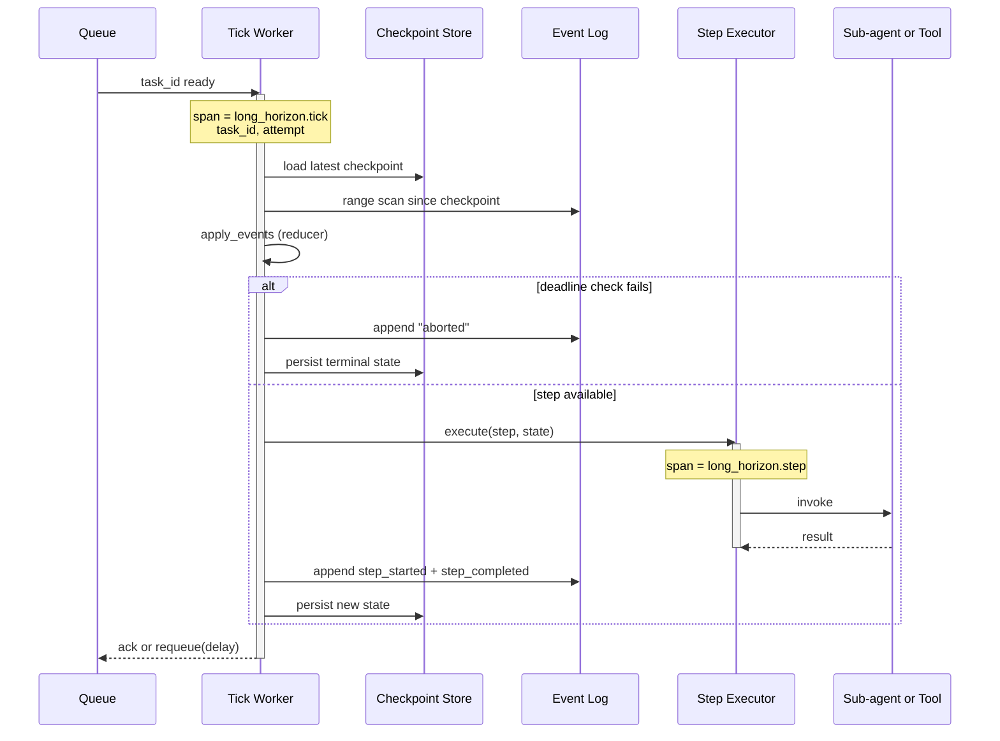

# Observability: Long-Horizon

What to instrument, what to log, and how to diagnose failures across multi-day agent tasks.

---

## Key Metrics

| Metric | Description | Alert if |
|---|---|---|
| `long_horizon.tasks_active` | Currently in-flight tasks (gauge) | Spike (>2× baseline) — kickoff bug or stuck-task accumulation |
| `long_horizon.tasks_completed_total{outcome}` | Tasks ending in `completed` / `aborted` / `requires_human` / `deadline_exceeded` | Sudden change in `outcome=aborted` ratio |
| `long_horizon.task_duration_seconds` | End-to-end task duration (P50/P95/P99) | P95 > 2× the expected duration for the task class |
| `long_horizon.step_duration_seconds{step_kind}` | Per-step duration | One step kind dominating wall-clock unexpectedly |
| `long_horizon.tick_latency_seconds` | One tick wall-clock (P50/P95) | P95 > 60s — tick is doing too much work; break it up |
| `long_horizon.resumes_total` | Times a task was resumed after a worker swap or restart | Trending up sharply — worker fleet unstable |
| `long_horizon.stuck_tasks` | Tasks with no activity past their expected step window | **Any nonzero** — investigate per task |
| `long_horizon.replan_total` | Re-plans issued per task | Average > 3 per task — planner producing stale plans |
| `long_horizon.idempotency_dedup_total` | Times the downstream deduplicated a retried step | Informational; sustained nonzero means resume protocol working as designed |
| `long_horizon.event_log_growth_per_task` | Event rows per task | Outliers (>10× median) — likely runaway loop inside one task |
| `long_horizon.checkpoint_load_latency_seconds` | Time to load a checkpoint on resume | P95 > 500ms — checkpoint blob is too large |
| `long_horizon.deadline_remaining_hours` | Per-task deadline runway (histogram) | Concentration near zero — deadlines too tight or work is slow |

Page on `stuck_tasks > 0` and any `deadline_exceeded` for high-stakes task classes. Notify on resume-rate trends and replan averages.

---

## Trace Structure

A long-horizon task is a *long-lived logical trace* spanning many short worker spans. Stitch them by `task_id`. Each tick is one trace; the cross-tick view comes from queries.



---

## Span Reference

| Span name | Emitted | Key attributes |
|---|---|---|
| `long_horizon.tick` | Once per tick | `task_id`, `worker_id`, `attempt`, `from_version`, `to_version`, `outcome`, `duration_ms` |
| `long_horizon.checkpoint_load` | Once per tick | `task_id`, `bytes`, `duration_ms` |
| `long_horizon.event_replay` | Once per tick | `task_id`, `events_replayed`, `duration_ms` |
| `long_horizon.step` | Once per step executed in the tick | `task_id`, `step_id`, `step_kind`, `attempt`, `executor` (sub_agent / tool / llm), `duration_ms`, `outcome` |
| `long_horizon.replan` | Once per replan | `task_id`, `reason`, `steps_added`, `steps_removed`, `duration_ms` |
| `long_horizon.checkpoint_persist` | Once per tick (success path) | `task_id`, `version`, `bytes`, `duration_ms` |
| `long_horizon.deadline_exceeded` | Once per terminal deadline event | `task_id`, `wall_clock_age_hours`, `steps_completed` |

Propagate `task_id` through every step's sub-agent / tool / LLM span. Without it, cross-tick queries fall apart.

---

## What to Log

### On task start

```
INFO  long_horizon.task.start    task_id=onboard_acme_corp  goal="Provision Acme tenant..."
                                 plan_steps=12  deadline_at=2026-06-23T00:00:00Z
```

### On every tick

```
INFO  long_horizon.tick.start    task_id=onboard_acme_corp  worker_id=w-37  attempt=4
INFO  long_horizon.step.complete task_id=...  step_id=seed_reference_data  step_kind=sub_agent
                                 executor=role:data-loader  duration_s=812  result_size_kb=12
INFO  long_horizon.tick.done     task_id=...  ticks_remaining_estimate=8  next_tick_at=...
```

### On resume

```
INFO  long_horizon.resume        task_id=onboard_acme_corp  worker_id=w-42  previous_worker_id=w-37
                                 last_checkpoint_version=4  events_replayed=2
```

### On replan

```
WARN  long_horizon.replan        task_id=...  reason="customer requested region change"
                                 steps_removed=["smoke_test_us"]  steps_added=["smoke_test_eu","reprovision_dbs"]
```

### On stuck-task detection

```
ERROR long_horizon.task.stuck    task_id=...  last_tick_at=2026-06-08T14:22:00Z  age_hours=18
                                 expected_step_window_hours=4  note="external dependency check failed"
```

### On terminal states

```
INFO  long_horizon.task.complete task_id=onboard_acme_corp  outcome=completed
                                 total_wall_clock_hours=42.3  total_steps=12  total_resumes=6
                                 total_tokens_in=512000  total_tokens_out=18400

WARN  long_horizon.task.abort    task_id=...  outcome=aborted  reason="agent_decided"
                                 detail="data-provider API unreachable for 24h"
```

---

## Common Failure Signatures

### Stuck task

- **Symptom**: `stuck_tasks > 0`; one or more tasks haven't advanced in much longer than the expected step window.
- **Log pattern**: `long_horizon.tick.start` happens; `step` spans show "executor returned no progress" or never appear.
- **Diagnosis**: A step is waiting on an external dependency that's down. The executor returns "still waiting" each tick; the task makes no forward progress.
- **Fix**: Identify the external dependency from the step span. If it's down, page the dependency's on-call. If the task should abort on extended unavailability, add a per-step deadline (not just task-level).

### Resume rate spike

- **Symptom**: `resumes_total` doubles week-over-week with no workload change.
- **Log pattern**: Frequent `long_horizon.resume` events, often with the same `previous_worker_id`.
- **Diagnosis**: Worker fleet is unstable. Common: OOM kills, deploy churn, scaling-down too aggressively.
- **Fix**: Investigate worker crash logs. If it's OOM, tick is doing too much work — break long steps into smaller ones. If it's deploys, ensure tick locks have appropriate TTLs so a worker mid-tick gets to finish.

### Replan thrash

- **Symptom**: `replan_total` per task averages > 3.
- **Log pattern**: Multiple `long_horizon.replan` events with similar `reason` text on the same task.
- **Diagnosis**: The planner is producing plans the executor immediately invalidates. Often a stale planner context or a too-greedy executor that signals replan on minor surprises.
- **Fix**: Pull recent replan reasons. If they cluster on one type of surprise, tighten the executor's replan-trigger threshold OR enrich the planner's context so it accounts for the case upfront.

### Event log explosion for one task

- **Symptom**: `event_log_growth_per_task` shows one task with 10× the median event count.
- **Diagnosis**: A loop inside one step is emitting events without making progress. Often a tool-call retry loop with no exit condition.
- **Fix**: Inspect the task's event log. The event kinds will show the loop. Cap retries per tool call; surface "stuck step" as a task-level signal.

### Checkpoint load latency climbing

- **Symptom**: `checkpoint_load_latency_seconds` P95 trending up.
- **Diagnosis**: Checkpoint blobs are getting larger over time. Often: the runner is putting too much state into the snapshot (transcripts, raw tool outputs).
- **Fix**: Move large artifacts to the virtual filesystem. Snapshot holds references (file paths), not contents.

### Idempotency dedup spike followed by data inconsistency

- **Symptom**: `idempotency_dedup_total` jumps; later, a customer complaint about duplicate effects.
- **Diagnosis**: The idempotency key isn't actually unique across attempts, OR the downstream isn't honoring it.
- **Fix**: Trace one duplicate. Verify the step's `attempt` is incrementing; verify the downstream's dedup window covers your retry interval (some providers only dedupe within 24h).

### Deadline-exceeded for low-stakes tasks

- **Symptom**: `deadline_exceeded` outcome firing for tasks the operator didn't expect to be tight.
- **Diagnosis**: Deadline set against the happy-path duration. Real-world tasks need slack.
- **Fix**: Set deadlines against P95 expected duration × 1.5; track per-task-class actual durations and adjust.

---

## What ends up in the operator UI

For long-horizon tasks the operator wants:

- One row per active task with `(task_id, age, last_tick_at, last_step_id, next_step, deadline_remaining)`.
- A "stuck" filter that surfaces tasks not progressing.
- The per-task event log scrollable in time order.
- The per-task checkpoint blob viewable, with file references resolvable to the virtual FS.
- A "Resume now" button that enqueues the task for immediate tick (for diagnosing why a task isn't being picked up).

Without per-task drilldown, multi-day agents become a black box. Build the operator UI early.
