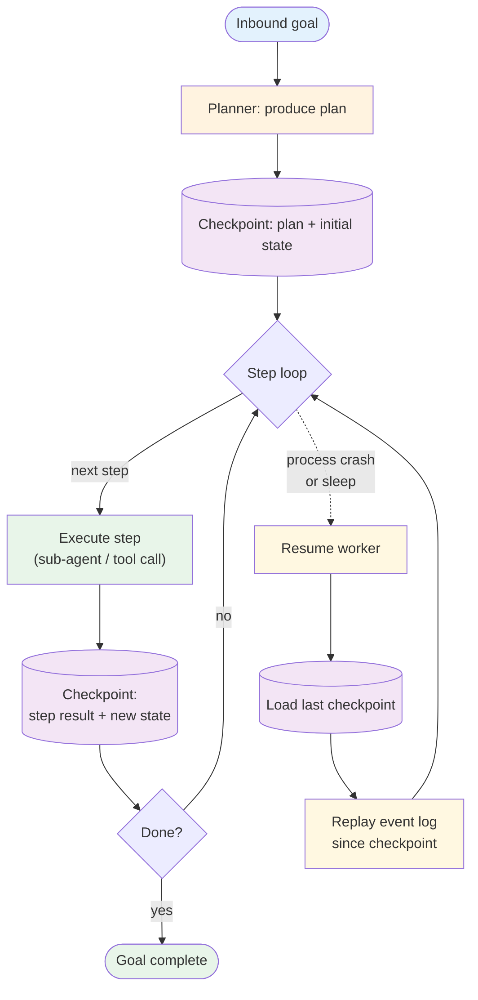

# Long-Horizon — Overview

A long-horizon agent is a task that spans **hours, days, or weeks** of wall-clock — far beyond any single LLM request, often beyond any single process lifetime. The pattern formalises the harness around such tasks: the agent **checkpoints** its state at decision points, can be **killed and resumed** without losing progress, and **replays its event log** to reconstruct what it knew. The active work is durable; the model is stateless across resumes.

**Evolves from:** [Saga](../saga/overview.md) (the state-machine flavor) and [Event-Driven](../event_driven/overview.md) (the durable event log). Saga handles *unwinding* multi-step work on failure; long-horizon handles *continuing* multi-session work across crashes and time gaps.

## Architecture



*Figure: The agent persists state at every decision point. A resume worker can pick up any in-flight task from its last checkpoint, replay the event log to catch up on anything since, and continue. The model has no memory of prior runs — the checkpoint plus replay IS the memory.*

## How It Works

1. **Plan upfront.** A planner produces an initial plan: ordered steps, expected duration per step, dependencies. The plan goes into the first checkpoint.
2. **Step-by-step execution.** Each step runs (often as a [sub-agent](../../primitives/sub_agents/overview.md) or tool call). After it completes, the result + new state is persisted to the checkpoint store.
3. **Event log alongside checkpoints.** Every important event (step started, step completed, tool called, external signal received) goes into an append-only event log. Checkpoints are snapshots; the event log carries deltas between snapshots.
4. **Crash / sleep at any point.** The agent process can be killed (deploy, OOM, scheduled shutdown) or can deliberately suspend (waiting for an external signal that may arrive tomorrow). The next worker picks up.
5. **Resume = load + replay.** A fresh worker loads the latest checkpoint, replays the event log since that checkpoint, and resumes the step loop from the next step. The LLM is told only what it needs to know — usually a compacted summary of the prior work, not the full transcript.
6. **Terminate or escalate.** The task ends when the goal is met, when the agent decides it's impossible, or when human review is required for a step the agent can't autonomously handle.

## Minimal Example

```python
from patterns.long_horizon.code.python.runner import LongHorizonRunner, Step

runner = LongHorizonRunner(
    task_id="onboard_acme_corp",
    goal="Set up the Acme tenant: provision DBs, seed reference data, run smoke tests, notify the owner.",
    checkpoint_store=postgres_store,
    event_log=postgres_log,
    plan_model="opus",
    step_executor=sub_agent_executor,   # delegates each step to a sub-agent
    max_step_duration_seconds=3600,
    overall_deadline_seconds=14 * 24 * 3600,   # two weeks
)

# Initial kickoff:
runner.start(initial_context={"tenant_name": "acme", "owner_email": "..."})

# Some time later, possibly in a different process:
runner = LongHorizonRunner.resume(task_id="onboard_acme_corp", ...)
runner.tick()   # advance one step; safe to call from a cron, a queue worker, or on a signal
```

The `tick()` shape is what makes long-horizon agents operable: a queue worker, a cron, or a webhook can all call `tick()` and the runner makes forward progress from wherever it last left off.

## Input / Output

- **Input:** A goal + initial context + a planner that can produce a step list
- **Output:** A `LongHorizonResult` with final state (`completed` / `aborted` / `requires_human`), the executed step log, total wall-clock duration, and the final checkpoint reference
- **Persistent state:** Checkpoint store (latest snapshot per task) + event log (append-only history)
- **Resume contract:** Any worker can resume any task from any checkpoint; in-flight steps are idempotent or retried-on-failure

## Key Tradeoffs

| Strength | Limitation |
|----------|-----------|
| Survives crashes, deploys, and multi-day waits | Checkpoint + replay infrastructure is non-trivial — must be built or bought |
| Wall-clock latency is decoupled from process lifetime | Total cost grows with task duration even when the agent is idle (storage, audit) |
| Each step is independently inspectable, replayable, debuggable | Event-log shape decisions ossify quickly — get them right or live with the consequences |
| Composes naturally with sub-agents (each step delegates) | Long-running tasks make eval and regression harder (each task is bespoke) |
| The LLM is stateless across resumes — easier reasoning per step | Context engineering becomes critical — the prior transcript doesn't fit in one window |

## When to Use

- **Tasks that genuinely take days.** Tenant onboarding, multi-stage data migrations, content-moderation campaigns, regulatory submissions, long-running research projects.
- **Tasks that wait for external signals.** "Submit the application, wait up to 30 days for the response, then continue." A long-horizon harness handles the wait without holding a process open.
- **Tasks that survive deploys.** If your service redeploys daily and tasks routinely span weeks, the task must outlive the process.
- **Tasks where each step's progress is valuable in isolation.** Even if the task aborts halfway, the completed steps are still useful and recorded.
- **Tasks composed of [sub-agent](../../primitives/sub_agents/overview.md) invocations.** The deep-agents pattern (planner + virtual filesystem + sub-agents) is the canonical long-horizon shape.

## When NOT to Use

- **Tasks that complete in seconds.** The checkpoint overhead is bigger than the work.
- **Tasks that don't span process lifetimes.** A simple [Plan & Execute](../plan_and_execute/overview.md) inside one request handles it.
- **Tasks where each step's correctness depends on the FULL prior transcript.** Long-horizon assumes the agent can resume from a checkpoint summary. If the agent must re-read everything, you're using the pattern wrong.
- **You can't make steps idempotent.** Resume + replay reissues some steps. If a step's side effects can't tolerate that, redesign or use [Saga](../saga/overview.md) for explicit compensation.

## How long-horizon differs from related patterns

| Question | Long-horizon | Saga | Memory |
|---|---|---|---|
| Primary concern | Continue across crashes & time gaps | Undo on failure | Recall facts across sessions |
| Failure mode | Crash → resume from checkpoint | Step fails → compensate prior steps | Forgetting → re-retrieve |
| Wall-clock | Hours to weeks | Minutes to hours | Per-call |
| Step semantics | `do_then_persist` | `do` paired with `undo` | `store` and `retrieve` |
| LLM relationship | Stateless across resumes | Stateless across steps | Stateful within session, persisted across |

Compose: a long-horizon agent uses [memory](../../primitives/memory/overview.md) for facts the agent learns; uses [saga](../saga/overview.md) for sub-flows that need compensation; uses [sub-agents](../../primitives/sub_agents/overview.md) as step executors.

## Related Patterns

- **Evolves from:** [Saga](../saga/overview.md) (state-machine flavor) + [Event-Driven](../event_driven/overview.md) (durable log) — see [evolution.md](./evolution.md)
- **Combines with:** [Sub-agents](../../primitives/sub_agents/overview.md) (each step is a sub-agent), [Memory](../../primitives/memory/overview.md) (long-term facts), [Multi-Agent](../multi_agent/overview.md) (supervisor IS the long-horizon agent), [Human in the Loop](../../modifiers/human_in_the_loop/overview.md) (pause indefinitely for human input)
- **Contrast with:** ReAct — ReAct's loop lives inside one request; long-horizon is the harness around steps that may take days each

## Deeper Dive

- **[Design](./design.md)** — Checkpoint vs event log; replay semantics; idempotency requirements; deep-agents shape (planner + virtual FS + sub-agents); failure modes
- **[Implementation](./implementation.md)** — Storage choice; tick worker; resume protocol; context-engineering for cross-resume continuity
- **[Evolution](./evolution.md)** — Saga + event log + step loop → long-horizon
- **[Observability](./observability.md)** — Per-task lifetime, step duration distribution, stuck-task alerts, resume frequency
- **[Cost & Latency](./cost-and-latency.md)** — Storage cost over time, per-tick model cost, resume-overhead amortization

## When NOT to use this pattern

- The task completes in one request — the harness is pure overhead.
- You can't make steps idempotent — resume will double-execute side effects.
- You don't have a story for stuck-task escalation — long-horizon tasks accumulate silent stalls without it.

## Next steps

- Production version: see [Blueprints → Deployments](../../composition/blueprints-to-deployments.md) for the deployment agents that use this pattern.
- Generate a starter project: see [Blueprint → Spec → Scaffold](../../composition/blueprint-to-spec-to-scaffold.md).
- Combine with other patterns: see the [Composition guide](../../composition/README.md).
