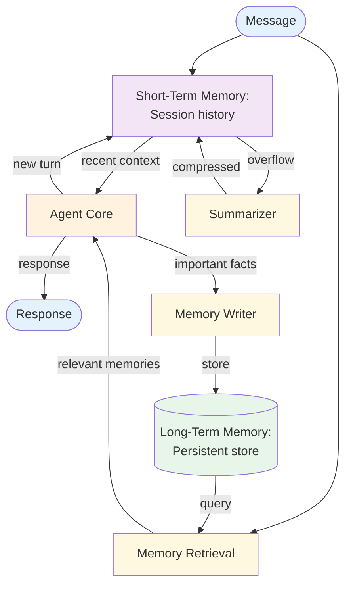

# Memory — Design

> Canonical Pydantic state schema: [`schemas/state.py`](schemas/state.py) — `MemoryState` is the top-level shape; `MemoryEntry`, `Recall` are the auxiliary models. Recipes targeting Memory reference these names verbatim.
>
> Typed prompts: [`prompts/`](prompts/) — `extractor.md` (write path) + `chat.md` (read path). See [`meta/style-guide.md`](../../meta/style-guide.md#typed-prompts) for the frontmatter contract.

## Component Breakdown



### Short-Term Memory
The current session's message history. Managed within the context window using truncation or summarization.

### Long-Term Memory
A persistent store (vector database, key-value store, or file system) that holds information across sessions: user preferences, past decisions, learned facts.

### Memory Retrieval
Queries the long-term store for memories relevant to the current context. Uses semantic search (embeddings) or keyword matching.

### Memory Writer
Extracts important information from the current session and stores it persistently. Decides *what* to remember based on salience heuristics.

### Summarizer
Compresses old short-term memory when approaching the context window limit. Preserves key facts while reducing token count.

## Data Flow

Each turn: retrieve relevant long-term memories → include with short-term context → generate response → update short-term → optionally write to long-term.

## Memory Types

Three categories of memory differ in what they store, how they're retrieved, and what failure modes they introduce. Most production agents need at least two.

| Type | Stores | Retrieval | Decay |
|------|--------|-----------|-------|
| **Episodic** | Specific past interactions ("user asked about X on May 12") | Time-ordered, recency-weighted | Stale quickly |
| **Semantic** | Distilled facts and preferences ("user prefers metric units") | Semantic search; fact lookup | Slow decay; explicit invalidation |
| **Procedural** | Learned skills, workflows, prompt fragments that worked | Pattern matching; example retrieval | Decay only if explicitly retrained |

**Guideline:** Episodic and semantic should be separate stores. Mixing them produces noisy retrieval (specific events shouldn't be treated as general facts).

## Salience: What to Remember

The Memory Writer decides what's worth storing. Wrong defaults explode storage and noise; right defaults capture what matters.

- **Explicit user signals first.** "Remember that I…", "From now on…" — these are the safest stores.
- **Repeated facts second.** A fact mentioned twice in different sessions is worth promoting from episodic to semantic memory.
- **Decisions and reasoning.** Store the *what* and the *why* — future calls need both.
- **Avoid storing inferences.** A fact inferred from another fact should be re-inferred at query time, not stored. Stored inferences fossilize and disagree with the source.

## Decay and Invalidation

Memories aren't forever. Three strategies for keeping them honest:

- **TTL.** Episodic memories expire after N days unless reinforced. Default short.
- **Explicit invalidation.** When the user contradicts a memory ("Actually, my preference changed"), mark the old memory as superseded — don't delete it, retain the audit trail.
- **Re-validation.** Periodically prompt the agent to ask the user about long-held semantic memories. *"You mentioned X 3 months ago — still accurate?"*

## Data Flow

```
Memory:
  id: string
  type: "episodic" | "semantic" | "procedural"
  content: string
  embedding: vector
  source: string              // session_id, user_id, or "inferred"
  created_at: timestamp
  updated_at: timestamp
  ttl: timestamp or null      // for episodic
  superseded_by: id or null   // for invalidated memories
  score: float                // salience / confidence
```

## Failure Modes

| Failure | Response |
|---------|----------|
| Retrieval returns 0 results | Proceed without long-term context (graceful degradation) |
| Retrieval returns stale results | Include `updated_at`; agent can assess recency and ask user |
| Contradictory memories returned | Surface both with timestamps; let the agent resolve or ask user |
| Memory writer over-stores ("remembered" everything) | Add a salience threshold; sample stored memories for review |
| Memory writer under-stores | Track recall rate of stored memories; tune threshold down if recall is low |
| Poisoned memory persists across sessions | Provenance tag (`source = user X` vs `inferred`) lets the agent down-weight low-trust sources |
| Storage failure | Log and continue; don't block the response — degraded memory is better than no response |

## Scaling Considerations

- **Context management is the critical bottleneck** — summarization keeps per-call cost bounded as session length grows.
- **Retrieval quality determines value** — tune embedding model and top-K against eval suites.
- **Storage scales independently** from the agent. Move episodic to cold storage after TTL; keep semantic hot.
- **At scale:** Cache frequent semantic queries; per-user index partitioning to avoid cross-tenant noise.
- **Shared memory across agents** (multi-agent + memory) needs explicit per-agent read/write scopes — without them, agents poison each other's view.

## Observability Hooks

- Per-session: total memories retrieved, retrieved-but-unused rate, summarization triggers.
- Per-memory: read count, last-read timestamp, supersession status.
- Per-user: total stored memory size, TTL'd memory rate.
- Track **memory-induced behavior change** — when a memory is in context, did the agent's response change? If not, the memory was wasted retrieval cost. See [observability.md](./observability.md).

## Composition

- **+ [RAG](../rag/overview.md):** Share the same vector store — documents on one side, memories on the other. Different namespaces, same infrastructure.
- **+ [Multi-Agent](../multi_agent/overview.md):** Shared memory enables agent collaboration across sessions. Scope writes per agent to prevent cross-agent poisoning.
- **+ [Routing](../routing/overview.md):** Per-route memory keeps specialized handlers' context clean. A billing-route memory doesn't pollute the technical-support route.
- **+ [Human in the Loop](../human_in_the_loop/overview.md):** Human-approved memories carry higher trust scores; unapproved ones decay faster.

## Production concerns

Cognitive concerns this repo covers; operational concerns belong in [agent-deployments](https://github.com/jagguvarma15/agent-deployments).

| Concern | This pattern's surface | Where to read |
|---|---|---|
| Prompt injection | stored memories are inputs to future calls — a poisoned memory persists across sessions | [foundations/security-and-safety.md](../../foundations/security-and-safety.md) |
| Hallucination & grounding | provenance tags on memories let the agent reason about freshness; without them, stale state reads as fact | [foundations/hallucination-and-grounding.md](../../foundations/hallucination-and-grounding.md) |
| Cost & model selection | linear in retrieved memories; compression bounds long sessions | [foundations/cost-and-model-selection.md](../../foundations/cost-and-model-selection.md) |
| Rate limiting & retries | inherited | [agent-deployments cross-cutting](https://github.com/jagguvarma15/agent-deployments/tree/main/docs/cross-cutting) |
| Idempotency | memory writes should be idempotent (replays don't double-store) | [agent-deployments cross-cutting](https://github.com/jagguvarma15/agent-deployments/blob/main/docs/cross-cutting/idempotency.md) |
| Observability hooks | see `observability.md` alongside this file | [foundations](../../foundations/README.md) |
