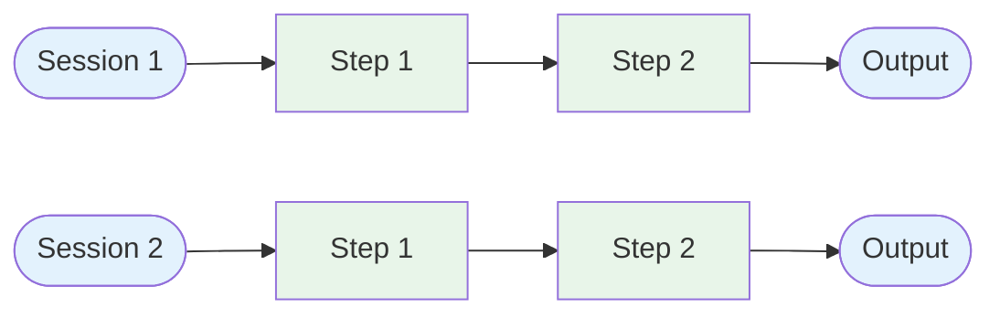

# Evolution: Prompt Chaining → Memory

This document traces how the [Memory pattern](./overview.md) evolves from the [Prompt Chaining workflow](../../workflows/prompt-chaining/overview.md).

## The Starting Point: Prompt Chaining

In a prompt chain, each call is stateless. Context flows forward through the chain but nothing persists across separate invocations:



Session 1 and Session 2 know nothing about each other. Every session starts from zero.

## The Breaking Point

Stateless chains break down when:

- **Users expect continuity.** "As I mentioned earlier..." has no meaning in a stateless system. Users expect the system to remember context from prior conversations.
- **Conversation history grows beyond the context window.** Long sessions exceed the token limit. Truncating the history loses important early context.
- **Repeated information is wasteful.** Users re-explain preferences, context, and constraints every session.

## What Changes

| Aspect | Prompt Chaining (Stateless) | Memory Pattern |
|--------|---------------------------|----------------|
| Session state | None — each call is independent | Message history maintained within session |
| Cross-session state | None | Long-term store persists facts, preferences, decisions |
| Context window overflow | Truncate or fail | Summarize older context to fit window |
| User preferences | Re-specified every session | Retrieved from memory store |
| Learning | None | Agent improves via accumulated knowledge |

## The Evolution, Step by Step

### Step 1: Maintain conversation history within a session

Instead of isolated calls, accumulate messages across the chain:

```
BEFORE:
  result_1 = llm(system_prompt, user_input_1)
  result_2 = llm(system_prompt, user_input_2)  // No memory of input_1

AFTER:
  messages = []
  messages.append({role: "user", content: user_input_1})
  result_1 = llm(system_prompt, messages)
  messages.append({role: "assistant", content: result_1})
  messages.append({role: "user", content: user_input_2})
  result_2 = llm(system_prompt, messages)  // Has full history
```

### Step 2: Add context window management

When the history exceeds the context window, summarize rather than truncate:

```
if token_count(messages) > context_limit:
  old_messages = messages[:split_point]
  summary = llm("Summarize this conversation so far: {old_messages}")
  messages = [{role: "system", content: summary}] + messages[split_point:]
```

### Step 3: Add persistent storage across sessions

Store important information in a durable store (database, vector store, file):

```
// At end of session:
facts = llm("Extract key facts and decisions from: {messages}")
memory_store.save(facts, session_id: current_session)

// At start of new session:
relevant = memory_store.search(user_input, top_k: 5)
system_prompt = base_prompt + "\nRelevant context:\n" + relevant
```

### Step 4: Add selective memory retrieval

Instead of loading all memories, query for relevant ones based on the current context:

```
relevant_memories = memory_store.semantic_search(
  query: current_user_message,
  filters: {user_id: user},
  top_k: 5
)
```

## When to Make This Transition

**Stay with stateless chains when:**
- Each interaction is independent (single-turn tasks)
- All context fits in one prompt
- Privacy requirements prevent storing conversation data

**Evolve to Memory when:**
- Users expect continuity across conversations
- Conversation history regularly exceeds the context window
- The system should personalize based on past interactions
- Tasks build on previous work over multiple sessions

## What You Gain and Lose

**Gain:** Session continuity, personalization, handling long conversations, accumulated knowledge over time.

**Lose:** Complexity (storage, retrieval, summarization), risk of stale/incorrect memories, storage costs, privacy considerations.
