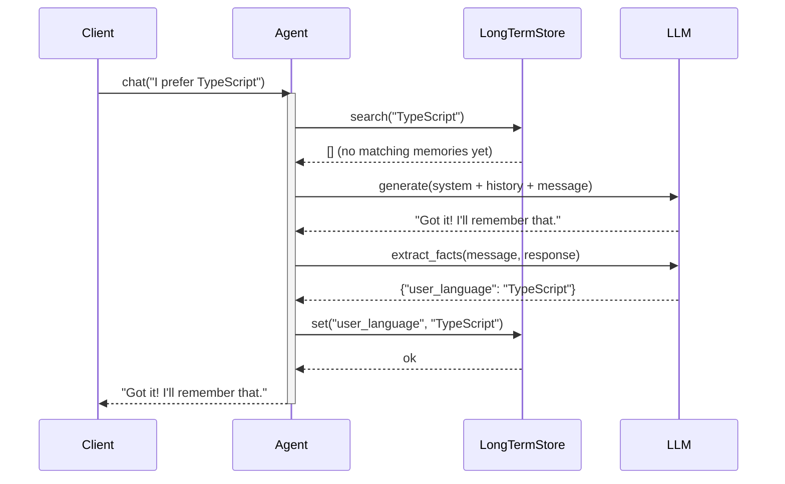

# Observability: Memory Agent

What to instrument, what to log, and how to diagnose failures in persistent memory systems.

---

## Key Metrics

| Metric | Description | Alert if |
|--------|-------------|----------|
| `memory.retrieve.hit_rate` | Fraction of queries that return ≥1 memory | Drops below 30% after warm-up |
| `memory.retrieve.latency_ms` | Long-term store query time | > 200ms (index may need optimization) |
| `memory.extract.fact_count` | Facts extracted per turn | Consistently 0 (extraction may be broken) |
| `memory.working.truncation_rate` | Turns where history was trimmed | > 20% of turns |
| `memory.store.error_rate` | Failed writes to long-term store | > 0% |

---

## Trace Structure

Each chat turn has three phases: retrieve → generate → extract+store.



---

## Span Reference

| Span name | Emitted | Key attributes |
|-----------|---------|----------------|
| `memory.chat` | Once per turn | `message_len`, `memories_retrieved`, `facts_extracted`, `duration_ms` |
| `memory.retrieve` | Once per turn | `query`, `hits`, `latency_ms` |
| `memory.llm.generate` | Once per turn | `tokens_in`, `tokens_out`, `history_turns`, `duration_ms` |
| `memory.extract` | Once per turn | `facts_found`, `parse_error` |
| `memory.store` | Once per new fact | `key`, `error` |
| `memory.working.truncate` | When history is trimmed | `turns_before`, `turns_after` |

---

## What to Log

### On retrieval
```
INFO  memory.retrieve.start  query="TypeScript project"
INFO  memory.retrieve.done   hits=2  keys=["user_language","project_type"]  ms=12
```

### On generation
```
INFO  memory.generate.start  history_turns=6  retrieved_memories=2
INFO  memory.generate.done   tokens_out=95  ms=480
```

### On fact extraction
```
INFO  memory.extract.done  facts={"prefers_zod":"true"}
WARN  memory.extract.parse_error  raw="{user likes Zod}"   # malformed JSON
WARN  memory.extract.no_facts  message_preview="What time is it?"
```

### On store write
```
INFO  memory.store.write  key=prefers_zod  value=true
WARN  memory.store.error  key=prefers_zod  error="connection refused"
```

### On working memory truncation
```
INFO  memory.working.truncate  turns_before=42  turns_after=20  strategy=sliding_window
```

---

## Common Failure Signatures

### Memories not being recalled (retrieval always returns 0 hits)
- **Symptom**: `memory.retrieve.hit_rate` is 0% despite having stored facts.
- **Log pattern**: `hits=0` on every retrieve, even for queries matching stored keys.
- **Diagnosis**: The search query doesn't match stored key names (substring mismatch in LongTermStore) or the vector store embedding model changed.
- **Fix**: Log both the query and all stored keys during debugging; in production, ensure the same embedding model is used for ingestion and query.

### Fact extraction always returns 0 facts
- **Symptom**: `memory.extract.fact_count` is always 0; memory snapshot never grows.
- **Log pattern**: Frequent `memory.extract.no_facts` log entries.
- **Diagnosis**: The extraction prompt is too conservative, the JSON format instruction is unclear, or the LLM is returning `{}` for all turns.
- **Fix**: Log the full extraction prompt; test with a direct call: `llm.generate([{"role":"user","content":extract_prompt.format(...)}])` and inspect the raw response.

### Context window explosion from long history
- **Symptom**: `memory.generate.tokens_in` grows unboundedly; eventually hits model context limit.
- **Log pattern**: `history_turns` grows without bound; eventually an API error: `"context_length_exceeded"`.
- **Diagnosis**: `max_turns` truncation is disabled or set too high; no summarization is applied.
- **Fix**: Ensure `WorkingMemory.max_turns` is set; add a summarization step that compresses old history when `len(history) > threshold`; log `memory.working.truncation_rate`.

### Stale memories overriding current user preferences
- **Symptom**: Agent responds with outdated information (e.g., old project name) even after user corrected it.
- **Log pattern**: `memory.retrieve.hits` returns an old key-value pair; newer value wasn't stored.
- **Diagnosis**: Fact extraction missed the correction, or the store `set` call silently failed.
- **Fix**: Explicitly instruct the extraction prompt to overwrite: `"If a fact updates a previous preference, include the updated value"`. Log all store writes.
