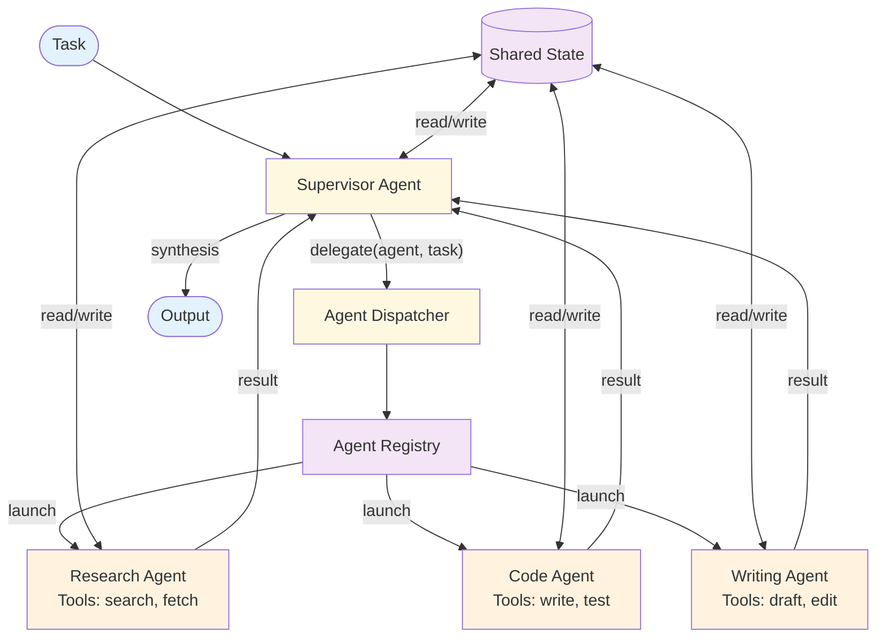

# Multi-Agent — Design

> Canonical Pydantic state schema: [`schemas/state.py`](schemas/state.py) — `MultiAgentState` is the top-level shape; `AgentResult`, `SupervisorDecision` are the auxiliary models. Recipes targeting Multi-Agent reference these names verbatim.
>
> Typed prompts: [`prompts/`](prompts/) — `supervisor.md` (routing/termination) + `worker.md` (generic, parameterized by `agent_name`). See [`meta/style-guide.md`](../../meta/style-guide.md#typed-prompts) for the frontmatter contract.

## Component Breakdown



### Supervisor Agent
An agent (ReAct loop) whose primary tool is `delegate_to_agent`. Reasons about which worker to call, what to delegate, and when to synthesize. The supervisor is the orchestration intelligence.

### Agent Registry
Maps agent names to configurations: system prompt, tools, model, and capabilities description. The supervisor receives the registry as context to inform delegation decisions.

### Worker Agents
Each worker is a full [ReAct](../react/overview.md) agent with specialized tools and system prompts. Workers run autonomously within a bounded iteration budget.

### Shared State
A key-value store accessible to all agents. Workers write their results; the supervisor and other workers read them. Enables inter-agent communication without direct messaging.

### Agent Dispatcher
Creates and runs worker agents based on delegation requests. Manages worker lifecycle and collects results.

## Data Flow

```
AgentConfig:
  name: string
  description: string                    // What this agent is good at
  system_prompt: string
  tools: list of ToolEntry
  max_iterations: integer

DelegationRequest:
  agent_name: string
  task: string
  context: string                        // Additional info for the worker

SharedState:
  entries: map of string → any           // Key-value pairs
  history: list of {agent, action, timestamp}  // Audit trail
```

## Topology Choices

Three structural topologies, each with different coupling and observability tradeoffs. Pick one consciously — drifting between them in production is a frequent source of bugs.

### Flat (peer supervisor + N workers)

One supervisor delegates to a pool of workers. Workers don't talk to each other. Simplest mental model; default starting point.

- **Pros:** Single delegation surface; supervisor sees all worker results; debugging concentrated in one place.
- **Cons:** Supervisor becomes a bottleneck; sequential delegation if workers depend on each other's outputs.
- **Use when:** Workers are independent or the workload is small enough that the supervisor isn't a bottleneck.

### Hierarchical (supervisor of supervisors)

A supervisor delegates to other supervisors, each of which has its own workers. Used for systems where the task tree is deep — e.g., research → sub-research → fetch.

- **Pros:** Scales to deeper task decomposition; each layer is locally simple.
- **Cons:** Cost amplification (every layer is its own loop); debugging spans multiple traces; orchestration overhead compounds.
- **Use when:** The task naturally decomposes into 2+ levels of subtasks and a flat topology would put 10+ workers under one supervisor.

### Blackboard (shared state, loose coordination)

No central supervisor. Agents read from and write to a shared state store, reacting to relevant updates. Each agent's "trigger condition" is what's in shared state.

- **Pros:** No single bottleneck; adding an agent doesn't touch other agents' code; natural fit for event-driven systems.
- **Cons:** Hard to debug ("why did agent X act now?"); risk of livelocks (agents trigger each other indefinitely); failure isolation is harder.
- **Use when:** Agents are owned by different teams, scale demands asynchronous coordination, or the system is naturally event-driven.

**Default:** Start flat. Upgrade to hierarchical when one supervisor manages too many workers. Move to blackboard only when team boundaries (or scale) force it.

## Communication Protocols

Within a topology, agents communicate via one of three protocols:

| Protocol | Description | Use When |
|----------|------------|----------|
| **Hub-and-spoke** | All communication through supervisor | Flat topology with worker independence |
| **Peer-to-peer** | Agents communicate directly | Tight pair-wise collaboration (e.g., generator + critic) |
| **Blackboard** | Agents read/write shared state | Loose coupling, asynchronous work, blackboard topology |

**Guideline:** Start with hub-and-spoke. Add a shared-state layer for read-only cross-agent context (history, retrieved facts) without breaking the hub-and-spoke control flow. Promote to peer-to-peer only for specific pair-wise interactions, not as a general default.

## Supervisor Design Choices

The supervisor is the orchestration intelligence. Three design dimensions matter:

| Dimension | Choices | Tradeoff |
|---|---|---|
| **Delegation surface** | Single `delegate_to_agent(name, task)` tool vs per-agent tools (`ask_researcher`, `ask_coder`) | Single tool: easier to scale; per-agent: better LLM compliance |
| **Decision frequency** | Per-message reasoning vs batched (decide N delegations upfront) | Per-message: adaptive; batched: cheaper, more predictable |
| **Termination criterion** | Supervisor decides "done" vs explicit termination tool vs iteration cap | Combine all three; never trust the supervisor's own "done" alone |

A supervisor that's "free to decide everything" is a supervisor that loops. Constrain it with: (1) an iteration cap, (2) an explicit "done" tool the supervisor must call, and (3) a budget check.

## Agent Specialization

Workers should have one job each. The temptation to make a worker "general-purpose" usually fails for two reasons: (1) the LLM picks the wrong tool when the worker has too many, and (2) the system prompt becomes a kitchen sink and quality drops everywhere.

Specialization heuristics:

- **One domain per worker.** Research, code generation, writing, data analysis — each in its own worker.
- **One toolset per worker.** A worker's tools should reinforce its specialty, not extend it.
- **Capability description matters.** The supervisor reads the worker's description to decide whether to delegate. Vague descriptions ("handles general tasks") guarantee mis-delegation.
- **Limit count.** Past ~5–7 workers, the supervisor starts confusing them. Group into a hierarchical topology rather than adding an 8th.

## Data Flow

```
AgentConfig:
  name: string
  description: string                    // What this agent is good at — read by supervisor
  system_prompt: string
  tools: list of ToolEntry
  model: string                          // Per-agent model (cheaper for simple workers)
  max_iterations: integer

DelegationRequest:
  agent_name: string
  task: string
  context: string                        // Additional info for the worker
  expected_return: string                // What the supervisor expects back

SharedState:
  entries: map of string → any           // Key-value pairs
  history: list of {agent, action, timestamp}  // Audit trail
  ttl: map of key → expiry               // Bounded growth
```

## Failure Modes

| Failure | Supervisor response |
|---------|---------------------|
| Worker raises retryable error | Retry with same instructions; log and proceed if exhausted |
| Worker raises permanent error | Choose an alternative agent or revise task; if none viable, fail upward |
| Worker exceeds its iteration budget | Treat as partial result; supervisor decides whether to retry, replace, or proceed |
| Supervisor loops without converging | Iteration cap forces termination; return best partial result with explicit "incomplete" signal |
| Worker hallucinates a tool call | Tool-use registry catches it (see [tool-use](../../primitives/tool_use/design.md)); worker reports error to supervisor |
| Shared state conflict (concurrent writes) | Last-write-wins with logged conflict; alert if conflict rate exceeds threshold |
| Missing agent ("delegate to `legal_expert`" — not registered) | Return error with agent registry listing; supervisor re-decides |
| Supervisor compromised by injection | Worst case — propagates to every worker. Defense is at the input boundary, not at delegation time |

The **supervisor-loops-without-converging** failure is the most common in production and the easiest to miss in testing. Always test against tasks the system cannot solve, not just ones it can.

## Scaling Considerations

- **Cost shape:** `supervisor_calls + Σ(per_worker_calls)`. Supervisor cost scales with handoffs (each delegation is at least 2 supervisor calls: decide-to-delegate and consume-result). Worker cost scales with depth of work.
- **Model selection:** Mix tiers consciously. Supervisor often warrants Opus (the reasoning is critical); workers often run fine on Sonnet; routing-style workers can use Haiku. See [Cost & Model Selection](../../foundations/cost-and-model-selection.md).
- **Concurrency:** Independent worker delegations should run in parallel. Sequential-only multi-agent is a common implementation mistake that doubles latency for no reason.
- **At 10×:** Pool worker instances; cache common delegations (a research agent asked the same question 5× in 10 minutes shouldn't recompute).
- **At 100×:** Move to hierarchical topology; introduce inter-agent quotas per minute to prevent one runaway supervisor from starving others.

## Observability Hooks

The minimum trace surface for a multi-agent system:

- Per-supervisor: total delegations, iteration count, time-to-converge.
- Per-worker: invocation count, success/failure rate, per-call latency and token cost.
- Per-handoff: supervisor → worker name → task summary → result summary → duration.
- Per-shared-state key: write count, read count, time-to-staleness.

The single most useful dashboard view is the **per-task delegation tree** — for one user request, show which workers ran, in what order, with what results. Without this, debugging multi-agent failures is guesswork. See [observability.md](./observability.md) alongside this file.

## Composition

- **+ [Plan & Execute](../plan_and_execute/overview.md):** Supervisor generates a plan, delegates steps to agents. The plan is the supervisor's decomposition surface; workers execute steps.
- **+ [Memory](../../primitives/memory/overview.md):** Shared long-term memory across agents — every worker reads the same context. Useful for multi-turn conversations; risky if a poisoned memory affects every agent.
- **+ [RAG](../rag/overview.md):** Knowledge-grounded workers with a shared retrieval surface. One MCP-backed vector DB serves all agents.
- **+ [Routing](../routing/overview.md):** A routing layer above the supervisor — classify the task, then choose which multi-agent topology handles it. Useful when the system serves multiple distinct task types.
- **+ [Saga](../saga/overview.md):** Saga steps delegate to specialized agents; the saga coordinator owns the step list, agents own the cognition.
- **+ [Human in the Loop](../../modifiers/human_in_the_loop/overview.md):** Supervisor or specific worker proposes a high-stakes action; human approves before commit. Often the right termination for multi-agent systems acting on the world.

## Production concerns

Cognitive concerns this repo covers; operational concerns belong in [agent-deployments](https://github.com/jagguvarma15/agent-deployments).

| Concern | This pattern's surface | Where to read |
|---|---|---|
| Prompt injection | an agent compromised by injection propagates to every agent it talks to; defense is per-message | [foundations/security-and-safety.md](../../foundations/security-and-safety.md) |
| Hallucination & grounding | cross-agent consistency checks; supervisor validates worker outputs | [foundations/hallucination-and-grounding.md](../../foundations/hallucination-and-grounding.md) |
| Cost & model selection | sum of agent-call costs + orchestration overhead; supervisor cost scales with handoffs | [foundations/cost-and-model-selection.md](../../foundations/cost-and-model-selection.md) |
| Rate limiting & retries | inherited | [agent-deployments cross-cutting](https://github.com/jagguvarma15/agent-deployments/tree/main/docs/cross-cutting) |
| Idempotency | sub-agent invocations should be idempotent under retry | [agent-deployments cross-cutting](https://github.com/jagguvarma15/agent-deployments/blob/main/docs/cross-cutting/idempotency.md) |
| Observability hooks | see `observability.md` alongside this file | [foundations](../../foundations/README.md) |
