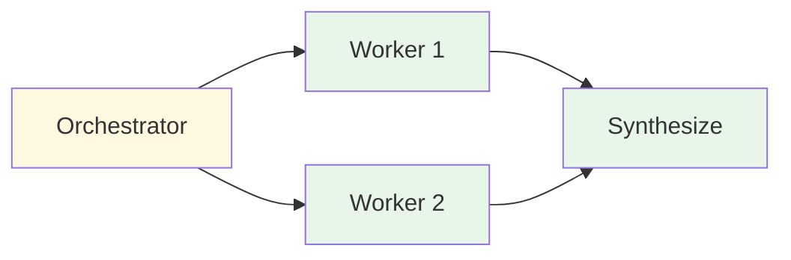
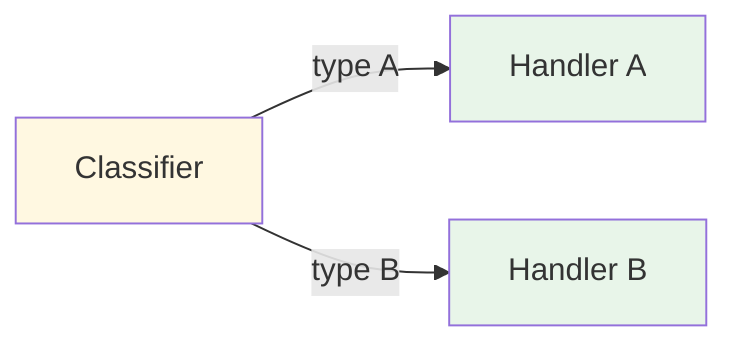

# Evolution: Orchestrator-Worker + Routing → Multi-Agent

This document traces how the [Multi-Agent pattern](./overview.md) evolves from two workflow patterns: [Orchestrator-Worker](../../workflows/orchestrator-worker/overview.md) and [Routing](../routing/overview.md).

## The Starting Points

**Orchestrator-Worker** gives us task decomposition and delegation:


**Routing** gives us intent classification and specialized dispatch:


Multi-Agent combines both: a supervisor *reasons about routing* (like a classifier) and *decomposes tasks* (like an orchestrator), but delegates to *autonomous agents* instead of stateless workers.

## The Breaking Point

These simpler patterns break down when:

- **Workers need autonomy.** In orchestrator-worker, workers are single LLM calls. But some subtasks require multiple tool calls, reasoning loops, and adaptive behavior — they need to be agents themselves.
- **Routing targets need persistence.** Routed handlers are stateless. But some specialized capabilities need to maintain state, iterate, and make decisions across multiple steps.
- **Subtasks interact.** The research agent's findings should inform the code agent's approach. Workers in orchestrator-worker are isolated — they can't share intermediate state.
- **The supervisor needs to iterate.** A single round of delegation isn't enough. The supervisor may need to send results back for refinement, or trigger new agents based on what earlier agents found.

## What Changes

| Aspect | Orchestrator-Worker + Routing | Multi-Agent |
|--------|------------------------------|-------------|
| Workers | Single LLM calls (stateless) | Full agents with tools and loops |
| Delegation | One round | Iterative — supervisor can re-delegate |
| Communication | Worker output → synthesizer | Agents can share state, read each other's results |
| Specialization | Different prompts per worker | Different tools, prompts, and system personas per agent |
| Supervisor role | Decompose task → assign workers | Reason about which agent, what task, review results, iterate |
| State | No shared state | Shared state accessible to all agents |

## The Evolution, Step by Step

### Step 1: Promote workers to agents

Give each worker its own agent loop with tools, instead of a single LLM call:

```
BEFORE (Worker):
  result = llm("Research this topic: {subtask}")

AFTER (Worker Agent):
  result = react_loop(
    system_prompt: "You are a research specialist...",
    goal: subtask,
    tools: [web_search, fetch_page, extract_data],
    max_iterations: 10
  )
```

### Step 2: Build an agent registry

Instead of a static set of workers, create a registry of available agents with their capabilities:

```
agent_registry = {
  "research": {
    description: "Researches topics using web search and document analysis",
    tools: [web_search, fetch_page, extract_data],
    system_prompt: research_prompt
  },
  "code": {
    description: "Writes, tests, and debugs code",
    tools: [write_file, run_tests, lint],
    system_prompt: code_prompt
  },
  "writing": {
    description: "Drafts and edits written content",
    tools: [draft, edit, check_style],
    system_prompt: writing_prompt
  }
}
```

### Step 3: Give the supervisor delegation tools

The supervisor becomes an agent itself, with "delegate" as its primary tool:

```
supervisor_tools = [{
  name: "delegate_to_agent",
  description: "Delegate a task to a specialized agent",
  parameters: {
    agent_name: {type: "string", enum: registry.keys()},
    task: {type: "string"},
    context: {type: "string"}
  }
}]

// The supervisor decides which agent to call:
response = llm(
  system_prompt: "You are a supervisor coordinating specialized agents...",
  message: user_task,
  tools: supervisor_tools
)
```

### Step 4: Add shared state

Let agents read each other's results through a shared state store:

```
shared_state = {}

// Research agent stores its findings:
shared_state["research_results"] = research_agent_output

// Code agent reads research results for context:
code_agent_context = shared_state.get("research_results", "")
```

### Step 5: Enable iterative delegation

The supervisor can delegate multiple times, review results, and request refinements:

```
while not task_complete:
  action = supervisor.decide(shared_state)
  if action.type == "delegate":
    result = run_agent(action.agent, action.task, shared_state)
    shared_state[action.agent + "_result"] = result
  elif action.type == "refine":
    result = run_agent(action.agent, action.feedback, shared_state)
  elif action.type == "complete":
    task_complete = true
    final_output = action.synthesis
```

## When to Make This Transition

**Stay with Orchestrator-Worker when:**
- Workers don't need tools or multi-step reasoning
- One round of delegation is sufficient
- Workers don't need to share state
- The task decomposition is straightforward

**Stay with Routing when:**
- Handlers are stateless and self-contained
- Input classification is sufficient (no task decomposition needed)
- No inter-handler communication is required

**Evolve to Multi-Agent when:**
- Subtasks require autonomous, multi-step execution
- Agents need to share intermediate results
- The supervisor needs to iterate (delegate, review, re-delegate)
- Different subtasks genuinely need different tool sets and expertise
- The task spans multiple domains that benefit from specialization

## What You Gain and Lose

**Gain:** Specialized autonomous agents, iterative delegation, shared state, ability to handle complex multi-domain tasks, clean separation of concerns.

**Lose:** Significant system complexity, higher cost (multiple agents = many LLM calls), harder debugging (traces span multiple agents), supervisor quality is critical, coordination overhead.
