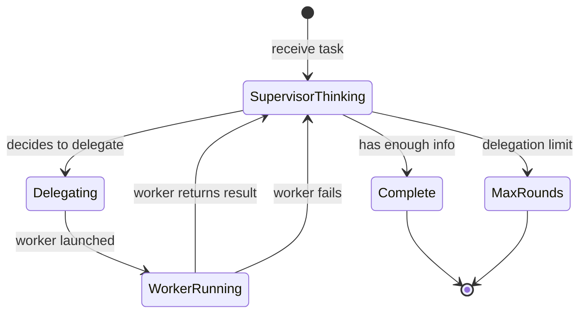

# Multi-Agent — Implementation

## Core Interfaces

```
WorkerConfig:
  name: string
  description: string
  system_prompt: string
  tools: list of ToolEntry
  max_iterations: integer              // Default: 10

SupervisorConfig:
  system_prompt: string
  agent_registry: list of WorkerConfig
  max_delegation_rounds: integer       // Default: 10
  shared_state: map of string → any

DelegationResult:
  agent_name: string
  task: string
  status: "completed" | "failed"
  output: any
  error: string or null
```

## Core Pseudocode

### supervise

```
function supervise(task, config):
  shared_state = config.shared_state or {}

  // Build agent descriptions for supervisor context
  agent_descriptions = ""
  for agent in config.agent_registry:
    agent_descriptions += "- " + agent.name + ": " + agent.description + "\n"

  // Supervisor tools
  supervisor_tools = [
    {
      name: "delegate_to_agent",
      description: "Delegate a task to a specialized agent",
      parameters: {
        agent_name: {type: "string", description: "Name of the agent"},
        task: {type: "string", description: "Task for the agent"},
        context: {type: "string", description: "Additional context"}
      }
    },
    {
      name: "read_shared_state",
      description: "Read a value from shared state",
      parameters: {key: {type: "string"}}
    },
    {
      name: "write_shared_state",
      description: "Write a value to shared state",
      parameters: {key: {type: "string"}, value: {type: "string"}}
    }
  ]

  // Supervisor system prompt with agent info
  system = config.system_prompt +
           "\n\nAvailable agents:\n" + agent_descriptions +
           "\n\nUse delegate_to_agent to assign work. " +
           "When you have all needed results, provide your final synthesized answer."

  // Run supervisor as a ReAct agent
  messages = [{role: "user", content: task}]

  for round in 1..config.max_delegation_rounds:
    response = call_llm(system: system, messages: messages, tools: supervisor_tools)

    if response.has_tool_calls:
      for tool_call in response.tool_calls:
        result = handle_supervisor_tool(tool_call, config, shared_state)
        messages.append({role: "assistant", tool_calls: [tool_call]})
        messages.append({role: "tool", tool_call_id: tool_call.id, content: result})
    else:
      return {status: "completed", output: response.text, shared_state: shared_state}

  return {status: "max_rounds", output: "Reached maximum delegation rounds", shared_state: shared_state}
```

### handle_supervisor_tool

```
function handle_supervisor_tool(tool_call, config, shared_state):
  if tool_call.name == "delegate_to_agent":
    return run_worker(
      tool_call.arguments.agent_name,
      tool_call.arguments.task,
      tool_call.arguments.context,
      config,
      shared_state
    )

  if tool_call.name == "read_shared_state":
    key = tool_call.arguments.key
    return shared_state[key] or "Key not found: " + key

  if tool_call.name == "write_shared_state":
    shared_state[tool_call.arguments.key] = tool_call.arguments.value
    return "Stored successfully"
```

### run_worker

```
function run_worker(agent_name, task, context, config, shared_state):
  // Find agent config
  agent_config = null
  for agent in config.agent_registry:
    if agent.name == agent_name:
      agent_config = agent
      break

  if agent_config == null:
    return "Error: Agent '" + agent_name + "' not found"

  // Run worker as a ReAct agent
  worker_task = task
  if context:
    worker_task += "\n\nAdditional context: " + context

  // Include relevant shared state
  state_context = "Current shared state: " + serialize(shared_state)
  worker_system = agent_config.system_prompt + "\n\n" + state_context

  result = agent_loop(
    task: worker_task,
    config: {
      system_prompt: worker_system,
      tools: agent_config.tools,
      max_iterations: agent_config.max_iterations
    }
  )

  // Store result in shared state
  shared_state[agent_name + "_last_result"] = result.answer

  return result.answer
```

## State Management



## Prompt Engineering Notes

### Supervisor Prompt
```
System:
You coordinate specialized agents to accomplish complex tasks.

Strategy:
1. Analyze the task and identify what expertise is needed
2. Delegate specific, focused subtasks to appropriate agents
3. Review results and delegate follow-up work if needed
4. Synthesize all results into a final comprehensive answer

Be efficient — don't delegate what you can answer directly.
Provide clear, specific instructions when delegating.
```

### Worker Prompts
Each worker should have a focused identity and know its role:
```
// Research agent:
System: You are a research specialist. Use your search and analysis tools
to find accurate, relevant information. Always cite your sources.

// Code agent:
System: You are a code specialist. Write clean, tested code.
Use your tools to verify your work compiles and passes tests.
```

## Prompt Templates

These are production-ready templates. Copy and adapt — replace `{placeholders}` with your specifics.

### Supervisor system prompt

```
You coordinate specialized agents to complete complex tasks.

Available agents:
- {agent_name_1}: {agent_description_1 — what it can do, what it cannot}
- {agent_name_2}: {agent_description_2}
- {agent_name_N}: {agent_description_N}

Process:
1. Review the task and the context from completed work so far.
2. Decide which agent(s) to delegate to next, and what specific sub-task to assign each.
3. When all necessary work is done, signal completion.

Delegation rules:
- Assign specific, self-contained tasks. Do not delegate "figure out the rest."
- Do not re-delegate a task that has already been completed by an agent.
- You may delegate to multiple agents in one round if their tasks are independent.
- Delegate to at most {max_agents_per_round} agents per round.

Respond with a JSON array of delegations, or a done signal:

To delegate:
[{"agent": "{agent_name}", "task": "{specific_instruction}"}]

When work is complete:
{"done": true, "reason": "{one sentence explaining why the task is complete}"}
```

### Supervisor user message (each round)

```
Original task: {original_task}

Work completed so far:
{accumulated_agent_outputs — formatted as "[agent_name]: summary of output"}

What delegations should happen next, or is the task complete?
```

### Sub-agent system prompt template

```
You are a specialist agent with a focused area of expertise.

Your role: {role_title — e.g. "Research Analyst", "Python Engineer", "Technical Writer"}
Your expertise: {what_you_are_good_at}
Your tools: {tool_list}

Rules:
- Complete only the task assigned to you.
- Be thorough within your scope, but do not expand the task beyond what was asked.
- Output should be self-contained and usable by the supervisor without clarification.
- Target output length: under {max_words} words unless the task explicitly requires more.
```

### Synthesis prompt (final step)

```
Combine the following agent outputs into a single, unified response to the original task.

Original task: {original_task}

Agent contributions:
[{agent_name_1}]
{agent_1_output}

[{agent_name_2}]
{agent_2_output}

Rules:
- Represent every agent's key contribution.
- The output should read as one coherent piece, not a list of agent summaries.
- Format: {final_output_format}
- Length: {target_length}
```

### Customization guide

| Placeholder | What to put here |
|---|---|
| `{agent_description}` | Include both capabilities AND limits — prevents the supervisor from assigning out-of-scope tasks |
| `{max_agents_per_round}` | Start at 2-3. Higher values increase parallelism but complicate context management |
| `{accumulated_agent_outputs}` | Brief per-agent summaries, not raw outputs — prevents synthesis-input explosion |
| `{original_task}` | Repeat verbatim in every supervisor round — the supervisor needs to stay grounded in the goal |

## Testing Strategy

- **Supervisor routing:** Verify correct agent selected for various tasks
- **Worker independence:** Test each worker agent in isolation
- **Shared state:** Verify state reads/writes work across agents
- **Integration:** Full task → supervisor → workers → synthesis
- **Error recovery:** Worker failure → verify supervisor adapts

## Common Pitfalls

- **Supervisor bottleneck:** All communication flows through one agent. Fix: keep delegation clear and concise.
- **Agent miscommunication:** Worker doesn't understand delegated task. Fix: supervisor provides detailed context.
- **State conflicts:** Multiple agents write to same key. Fix: use namespaced keys (agent_name + key).
- **Cost explosion:** Many agents × many iterations = high cost. Fix: strict iteration budgets per worker.
- **Over-delegation:** Supervisor delegates trivially simple tasks. Fix: instruct supervisor to handle simple things directly.
