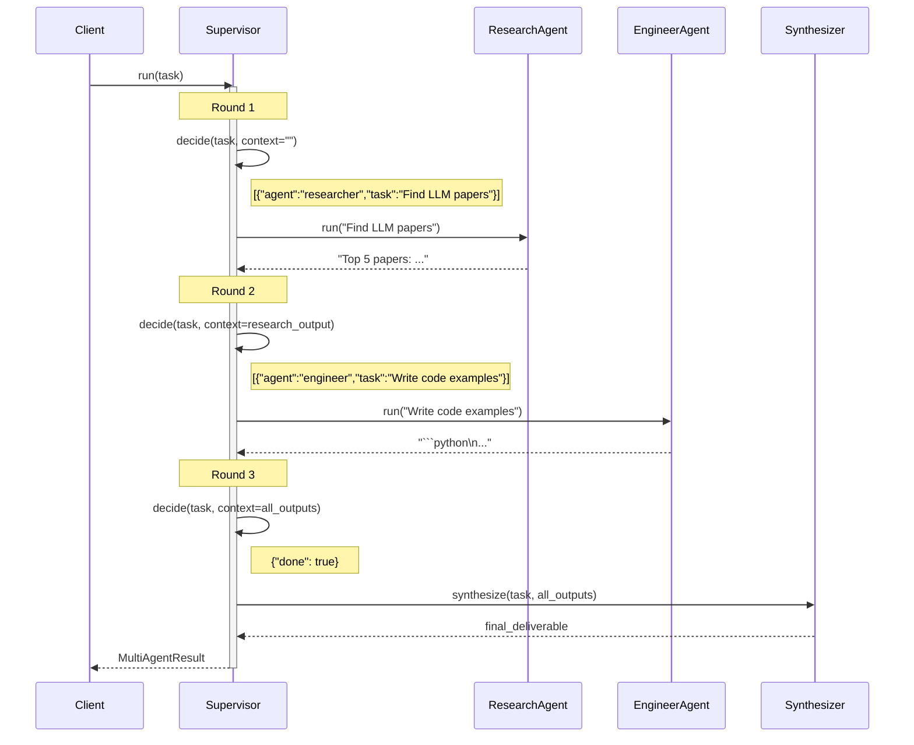

# Observability: Multi-Agent

What to instrument, what to log, and how to diagnose failures in supervisor-worker agent systems.

---

## Key Metrics

| Metric | Description | Alert if |
|--------|-------------|----------|
| `multi_agent.rounds_used` | Supervisor rounds per run | Consistently equals `max_rounds` |
| `multi_agent.agent.{name}.call_count` | How many times each agent is called per run | Any agent called > 3× (re-delegation loop) |
| `multi_agent.delegation.unknown_agent_rate` | Delegations to unregistered agents | > 0% |
| `multi_agent.decide.parse_error_rate` | Supervisor decisions that fail JSON parsing | > 1% |
| `multi_agent.total_duration_ms` | Wall-clock time for full run | > 30s for typical tasks |
| `multi_agent.agent.{name}.error_rate` | Agent execution errors | > 5% for any agent |

---

## Trace Structure

A root span with N round spans, each containing one supervisor decision span and one or more agent spans.



---

## Span Reference

| Span name | Emitted | Key attributes |
|-----------|---------|----------------|
| `multi_agent.run` | Once per call | `rounds_used`, `agents_called`, `delegations_total`, `duration_ms` |
| `multi_agent.decide.{round}` | Once per round | `round`, `context_len`, `delegations`, `done`, `parse_error` |
| `multi_agent.agent.{name}` | Once per delegation | `agent.name`, `task_len`, `context_len`, `output_len`, `duration_ms`, `error` |
| `multi_agent.synthesize` | Once | `input_agent_count`, `tokens_out`, `duration_ms` |

---

## What to Log

### On supervisor decision
```
INFO  multi_agent.decide.start  round=1  context_len=0
INFO  multi_agent.decide.done   round=1  delegations=2  agents=["researcher","engineer"]
WARN  multi_agent.decide.parse_error  round=2  raw="I think we should ask the researcher..."
WARN  multi_agent.decide.unknown_agent  agent=coder  registered=["researcher","engineer","editor"]
```

### On agent execution
```
INFO  multi_agent.agent.start  agent=researcher  task="Find top LLM inference papers"
INFO  multi_agent.agent.done   agent=researcher  output_len=680  ms=2100
WARN  multi_agent.agent.error  agent=engineer  task="Write benchmarks"  error="timeout"
```

### On shared state writes
```
INFO  multi_agent.shared_state.write  agent=researcher  key_preview="research_findings"  len=680
```

### On synthesis
```
INFO  multi_agent.synthesize.start  agent_outputs=3
INFO  multi_agent.synthesize.done   output_len=1240  ms=1800
```

### On run completion
```
INFO  multi_agent.done  rounds=3  delegations=3  total_ms=8200
WARN  multi_agent.guard.triggered  rounds_used=5  task="Comprehensive codebase audit"
```

---

## Common Failure Signatures

### Re-delegation loop (same agent called repeatedly)
- **Symptom**: `multi_agent.agent.{name}.call_count` > 3 in a single run; rounds are exhausted.
- **Log pattern**: The same agent appears in every `multi_agent.decide.done delegations` list.
- **Diagnosis**: The supervisor is not seeing that agent's output in its context, so it re-delegates the same task. Or the agent's output doesn't satisfy the supervisor's intent.
- **Fix**: Verify that `shared_state` writes and `context` accumulation are working — log `context_len` before each decide call; it should grow with each round.

### Supervisor declares done prematurely
- **Symptom**: Final output is incomplete; the supervisor returned `{"done": true}` after only one round.
- **Log pattern**: `rounds_used=1` for a complex multi-step task.
- **Diagnosis**: The supervisor's stopping condition is triggered by insufficient output, or the `done` JSON format is being returned accidentally.
- **Fix**: Add validation: if `rounds_used=1` and the task is complex, log a warning. Strengthen the decide prompt: `"Only return {"done": true} when all sub-tasks are complete and you have enough to synthesize."`.

### Agent context starvation (agents don't know what others found)
- **Symptom**: Each agent produces good output in isolation, but the final synthesis is disconnected.
- **Log pattern**: `multi_agent.agent.start context_len=0` for agents called in rounds 2+.
- **Diagnosis**: Shared state writes are failing, or context is not being threaded into subsequent agent calls.
- **Fix**: Log `multi_agent.shared_state.write` for every agent output; explicitly pass relevant shared state to each agent as part of the task string: `"{task}\n\nRelevant context: {shared_state}"`.

### Synthesis token overflow
- **Symptom**: Synthesis call fails or is truncated because all agent outputs combined exceed the context window.
- **Log pattern**: `multi_agent.synthesize.start agent_outputs=5`; synthesis LLM call errors with `context_length_exceeded`.
- **Diagnosis**: 5+ verbose agent outputs are being concatenated directly into the synthesis prompt.
- **Fix**: Each agent should return a concise summary (< 500 tokens), not a full report. Add a per-agent length constraint; summarize each output before synthesis if needed. Log `tokens_in` for the synthesis call.
