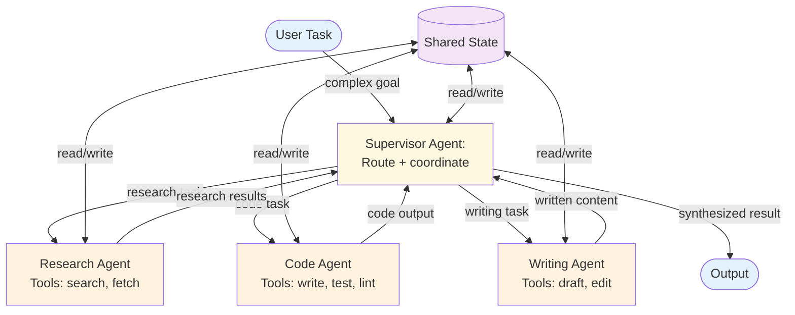

# Multi-Agent (Delegation / Supervision) — Overview

The multi-agent pattern uses multiple specialized agents coordinated by a supervisor. Each agent has its own tools, prompts, and domain expertise. The supervisor decides which agent to delegate to, interprets results, and orchestrates the overall task.

**Evolves from:** [Orchestrator-Worker](../../workflows/orchestrator-worker/overview.md) + [Routing](../routing/overview.md) — adds agent-to-agent communication, shared state, and supervisor oversight.

## Architecture



*Figure: A supervisor agent routes subtasks to specialized worker agents, each with their own tools. Shared state enables agents to read each other's results. The supervisor synthesizes the final output.*

## How It Works

1. **Receive** — The supervisor agent receives a complex task from the user.
2. **Analyze** — The supervisor reasons about the task and identifies which worker agent(s) are needed.
3. **Delegate** — The supervisor sends focused subtasks to worker agents via tool calls (e.g., `delegate_to("research_agent", "Find data on X")`).
4. **Execute** — Worker agents run autonomously, using their specialized tools to complete their subtasks. Each worker is a full agent (typically a ReAct loop).
5. **Return** — Worker results are returned to the supervisor.
6. **Iterate** — The supervisor may delegate additional tasks, refine previous results, or request corrections from workers.
7. **Synthesize** — Once all needed work is done, the supervisor combines results into a final output.

## Minimal Example

Produce a technical deep-dive — the supervisor delegates research, writing, and review to three specialized agents.

```python
from patterns.multi_agent.code.python.multi_agent import MultiAgentSystem, SubAgent

# Each sub-agent can itself be a ReActAgent, RAGPipeline, etc.
system = MultiAgentSystem(
    supervisor=your_llm,
    agents=[
        SubAgent(
            name="researcher",
            description="Finds papers, benchmarks, and technical details",
            run=lambda task, ctx: research_agent.run(task).answer,
        ),
        SubAgent(
            name="engineer",
            description="Writes technical content with code examples",
            run=lambda task, ctx: engineer_agent.run(task).answer,
        ),
        SubAgent(
            name="editor",
            description="Polishes, restructures, and ensures consistency",
            run=lambda task, ctx: editor_agent.run(task).answer,
        ),
    ],
    max_rounds=4,
)

result = system.run(
    "Produce a technical deep-dive on LLM inference optimization for a developer audience"
)
# result.delegations    → which agents were called and in what order (decided by supervisor)
# result.agent_outputs  → each agent's contribution
# result.final_output   → synthesized deliverable
```

### Code variants

| Implementation | Language | Path |
|----------------|----------|------|
| Framework-agnostic supervisor + sub-agents (MockLLM) | Python | [`code/python/multi_agent.py`](code/python/multi_agent.py) |
| LangGraph (`StateGraph` supervisor + conditional edges to role nodes) | Python | [`code/python/langgraph/multi_agent.py`](code/python/langgraph/multi_agent.py) |
| CrewAI (`Crew` + `Process.sequential` chain of role `Agent`s) | Python | [`code/python/crewai/multi_agent.py`](code/python/crewai/multi_agent.py) |
| Vercel AI SDK (`generateObject` supervisor decisions, plain sub-agent functions) | TypeScript | [`code/typescript/vercel-ai-sdk/multi-agent.ts`](code/typescript/vercel-ai-sdk/multi-agent.ts) |
| Mastra (one `Agent` per role + supervisor `Agent.generate({ output })`) | TypeScript | [`code/typescript/mastra/multi-agent.ts`](code/typescript/mastra/multi-agent.ts) |

All three variants run the same researcher → writer → reviewer delegation against the same enterprise-overview task so they're diff-friendly across stacks. The Mastra variant treats every role as a first-class `Agent`; the Vercel AI SDK variant leaves sub-agents as plain `(task, context) => Promise<string>` functions for lower ceremony.

## Examples

- [Ops crew](examples/ops-crew.md) — concrete domain overlay anchored to the `ops-crew` recipe. Worked schemas for `IncidentSignal` / `TriageDecision` / `IncidentReport`, mock PagerDuty / runbook / Slack adapters, role prompts for triage / runbook_executor / incident_writer, and an end-to-end walkthrough with offline tests in [`examples/ops_crew/`](examples/ops_crew/).

## Input / Output

- **Input:** A complex task requiring multiple specialized capabilities
- **Output:** A synthesized result combining work from multiple agents
- **Delegation:** `{agent: string, task: string, context?: object}`
- **Shared state:** Accumulated results accessible to all agents

## Key Tradeoffs

| Strength | Limitation |
|----------|-----------|
| Each agent is specialized and focused | High complexity — multiple agents to design, prompt, and debug |
| Naturally handles multi-domain tasks | Cost scales with number of agents and delegation rounds |
| New agents can be added without changing others | Inter-agent communication design is critical and hard |
| Supervisor provides oversight and quality control | Supervisor is a single point of failure |
| Parallelizable when worker tasks are independent | Shared state management adds coordination overhead |

## When to Use

- Tasks spanning multiple domains (research + code + writing)
- When different subtasks need different tool sets
- When the system needs distinct "expertise areas"
- Large-scale tasks that benefit from divide-and-conquer
- When you want clear separation of concerns between capabilities

## When NOT to Use

- When a single agent with multiple tools suffices — use [ReAct](../react/overview.md)
- When the task decomposition is static — use [Orchestrator-Worker](../../workflows/orchestrator-worker/overview.md)
- For simple routing without agent autonomy — use [Routing](../routing/overview.md)
- When the overhead of multiple agents isn't justified by the task complexity

## Related Patterns

- **Evolves from:** [Orchestrator-Worker](../../workflows/orchestrator-worker/overview.md) + [Routing](../routing/overview.md) — see [evolution.md](./evolution.md)
- **Workers use:** [ReAct](../react/overview.md) (each worker runs an agent loop), [Tool Use](../tool_use/overview.md)
- **Combines with:** [Memory](../memory/overview.md) (shared memory across agents), [Plan & Execute](../plan_and_execute/overview.md) (supervisor generates a plan, workers execute steps)

## Deeper Dive

- **[Design](./design.md)** — Agent registry, communication protocols, shared state, supervisor prompting, worker design
- **[Implementation](./implementation.md)** — Pseudocode, delegation mechanics, state management, testing strategies
- **[Evolution](./evolution.md)** — How multi-agent evolves from orchestrator-worker and routing

## When NOT to use this pattern

- One specialized agent can handle the full scope — multi-agent multiplies cost without benefit.
- You haven't yet built and stabilized the single-agent version — multi-agent is harder to debug and tune.
- Worker agents would share most tools and prompts — they're not actually specialized; the topology adds nothing.

## Next steps

- Production version: see [Blueprints → Deployments](../../composition/blueprints-to-deployments.md) for the deployment agents that use this pattern.
- Generate a starter project: see [Blueprint → Spec → Scaffold](../../composition/blueprint-to-spec-to-scaffold.md).
- Combine with other patterns: see the [Composition guide](../../composition/README.md).
