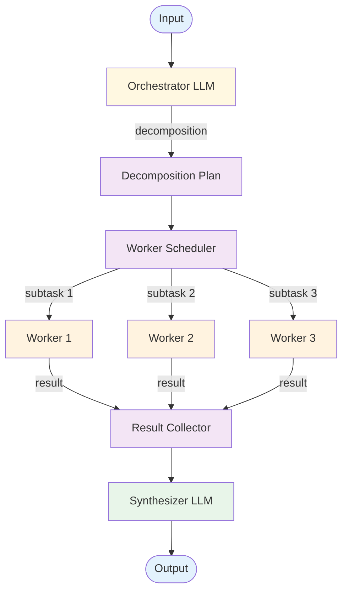

# Orchestrator-Worker — Design

Detailed component breakdown and design decisions for building an orchestrator-worker system.

## Component Breakdown



### Orchestrator
An LLM call that analyzes the task and produces a structured decomposition. Quality here determines everything downstream — a bad decomposition cascades through every worker.

The orchestrator's prompt must explain subtask decomposition, specify the output format (structured JSON), and provide guidelines for good subtasks (independent, specific, scoped).

### Decomposition Plan
Structured output with subtask list:
- **ID** — Unique identifier
- **Description** — What to accomplish
- **Context** — Relevant info from original task
- **Dependencies** — Which subtasks must complete first
- **Worker type** — Specialization (if applicable)

### Worker Scheduler
Manages execution order: independent subtasks run in parallel, dependent ones wait. Respects concurrency limits.

### Workers
LLM calls processing individual subtasks. Can be **homogeneous** (same prompt) or **heterogeneous** (specialized prompts per worker type).

### Synthesizer
Merges all worker results into coherent output. Receives the original task, the plan, and all results.

## Data Flow Specification

```
plan = orchestrator_llm("Decompose: {task}")
// plan = [{id, description, context, dependencies, worker_type}, ...]

execution_order = topological_sort(plan.subtasks)

results = {}
for batch in execution_order:
  parallel for subtask in batch:
    dep_results = {id: results[id] for id in subtask.dependencies}
    results[subtask.id] = worker_llm(subtask, dep_results)

output = synthesizer_llm(task, plan, results)
```

## Error Handling Strategy

### Orchestrator Failures
- **Bad format** — Retry with stricter format instructions
- **Vague subtasks** — Retry with examples of good descriptions
- **Wrong granularity** — Enforce min/max subtask count bounds

### Worker Failures
- **Single worker fails** — Retry; if still fails: skip, use fallback, or abort
- **Dependency failure** — Dependent subtasks can't proceed. Options: abort chain, re-decompose, or use placeholder

### Synthesis Failures
- **Lost information** — Include checklist in synthesis prompt
- **Contradictions** — Instruct synthesizer to flag conflicts, not silently resolve

## Scaling Considerations

### Cost
Minimum 3 LLM calls (orchestrator + 1 worker + synthesizer). Typical: 1 + N + 1. The synthesizer is often most expensive (receives all results).

### Latency
orchestrator + max(parallel worker latencies) + synthesizer. Dependencies increase latency by chain depth.

### At Scale
- **10x:** Parallel orchestrations, shared worker pool, cache common decompositions
- **100x:** Pre-compute for common patterns, lighter models for simple workers, batch similar subtasks

## Composition Notes

### Evolving to Plan & Execute
Add ordering, step tracking, replanning. See [Plan & Execute evolution](../../patterns/plan_and_execute/evolution.md).

### Evolving to Multi-Agent
Give workers tools and agent loops. See [Multi-Agent evolution](../../patterns/multi_agent/evolution.md).

### With Evaluator-Optimizer
Evaluate synthesized output and re-run if quality is insufficient.

## Decision Matrix: Worker Specialization

| Factor | Homogeneous | Heterogeneous |
|--------|------------|---------------|
| Setup | Low | Higher |
| Task flexibility | Workers handle any subtask | Excel at specialty |
| Orchestrator burden | Lighter | Must assign types |
| Quality | Good for uniform tasks | Better for diverse tasks |

**Guideline:** Start homogeneous. Specialize only when quality differences emerge.

## Production concerns

Cognitive concerns this repo covers; operational concerns belong in [agent-deployments](https://github.com/jagguvarma15/agent-deployments).

| Concern | This pattern's surface | Where to read |
|---|---|---|
| Prompt injection | worker outputs become orchestrator inputs — validate before re-aggregating | [foundations/security-and-safety.md](../../foundations/security-and-safety.md) |
| Hallucination & grounding | orchestrator can hallucinate task decompositions; workers can hallucinate their step outputs | [foundations/hallucination-and-grounding.md](../../foundations/hallucination-and-grounding.md) |
| Cost & model selection | 1 plan + N workers + 1 synthesis; plan and synth carry full context | [foundations/cost-and-model-selection.md](../../foundations/cost-and-model-selection.md) |
| Rate limiting & retries | inherited | [agent-deployments cross-cutting](https://github.com/jagguvarma15/agent-deployments/tree/main/docs/cross-cutting) |
| Idempotency | inherited (or per-worker if workers have side effects) | [agent-deployments cross-cutting](https://github.com/jagguvarma15/agent-deployments/blob/main/docs/cross-cutting/idempotency.md) |
| Observability hooks | see `observability.md` alongside this file | [foundations](../../foundations/README.md) |
