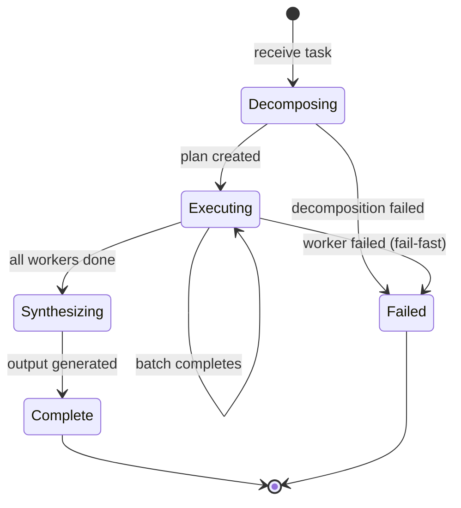

# Orchestrator-Worker — Implementation

Pseudocode, interfaces, state management, and testing strategy for building an orchestrator-worker system.

## Core Interfaces

```
Subtask:
  id: string
  description: string
  context: string
  dependencies: list of subtask_ids
  worker_type: string or null

DecompositionPlan:
  subtasks: list of Subtask
  reasoning: string                      // Why this decomposition

WorkerResult:
  subtask_id: string
  status: "success" | "error"
  output: any
  error: string or null

OrchestratorConfig:
  orchestrator_prompt: string
  worker_prompts: map of worker_type → string   // If heterogeneous
  default_worker_prompt: string                  // If homogeneous
  synthesizer_prompt: string
  max_subtasks: integer                          // Upper bound
  min_subtasks: integer                          // Lower bound (default: 1)
  max_retries: integer
```

## Core Pseudocode

### orchestrate

```
function orchestrate(task, config):
  // Phase 1: Decompose
  plan = decompose(task, config)
  if plan == null:
    return {status: "failed", error: "Decomposition failed"}

  // Phase 2: Execute workers
  results = execute_workers(plan, config)

  // Phase 3: Synthesize
  output = synthesize(task, plan, results, config)
  return {status: "success", output: output, plan: plan}
```

### decompose

```
function decompose(task, config):
  for attempt in 1..(config.max_retries + 1):
    response = call_llm(
      system: config.orchestrator_prompt,
      message: "Task: " + task + "\n\nDecompose into subtasks. Return JSON.",
    )

    plan = parse_json(response.text)

    // Validate plan
    if plan.subtasks.length < config.min_subtasks:
      continue  // Too few subtasks, retry
    if plan.subtasks.length > config.max_subtasks:
      continue  // Too many subtasks, retry
    if not validate_dependencies(plan.subtasks):
      continue  // Circular or invalid dependencies

    return plan

  return null  // Decomposition failed after retries
```

### execute_workers

```
function execute_workers(plan, config):
  results = {}
  execution_order = topological_sort(plan.subtasks)

  for batch in execution_order:
    // Each batch contains subtasks with no unmet dependencies
    batch_results = parallel_map(batch, function(subtask):
      // Gather dependency outputs
      dep_context = ""
      for dep_id in subtask.dependencies:
        dep_context += "Result from " + dep_id + ": " + results[dep_id].output + "\n"

      // Select worker prompt
      worker_prompt = config.default_worker_prompt
      if subtask.worker_type and subtask.worker_type in config.worker_prompts:
        worker_prompt = config.worker_prompts[subtask.worker_type]

      // Execute
      response = call_llm(
        system: worker_prompt,
        message: "Subtask: " + subtask.description +
                 "\nContext: " + subtask.context +
                 "\n" + dep_context
      )

      return {subtask_id: subtask.id, status: "success", output: response.text}
    )

    // Store batch results
    for result in batch_results:
      results[result.subtask_id] = result

  return results
```

### synthesize

```
function synthesize(task, plan, results, config):
  // Build synthesis input
  results_text = ""
  for subtask in plan.subtasks:
    result = results[subtask.id]
    results_text += "## " + subtask.description + "\n"
    results_text += result.output + "\n\n"

  response = call_llm(
    system: config.synthesizer_prompt,
    message: "Original task: " + task +
             "\n\nSubtask results:\n" + results_text +
             "\n\nSynthesize into a coherent final response."
  )

  return response.text
```

### topological_sort

```
function topological_sort(subtasks):
  // Returns list of batches, where each batch can run in parallel
  remaining = set(subtasks)
  batches = []

  while remaining is not empty:
    // Find subtasks whose dependencies are all completed
    ready = [s for s in remaining
             if all(d not in remaining for d in s.dependencies)]

    if ready is empty:
      error("Circular dependency detected")

    batches.append(ready)
    remaining = remaining - set(ready)

  return batches
```

## State Management

```
OrchestratorState:
  task: string
  plan: DecompositionPlan or null
  results: map of subtask_id → WorkerResult
  phase: "decomposing" | "executing" | "synthesizing" | "complete" | "failed"
```



## Prompt Engineering Notes

### Orchestrator Prompt

```
System:
You decompose complex tasks into independent subtasks.

Rules:
- Each subtask should be specific and self-contained
- Minimize dependencies between subtasks
- Each subtask should be completable with a single focused LLM call
- Return valid JSON in this format:
  {
    "subtasks": [
      {"id": "1", "description": "...", "context": "...", "dependencies": []},
      {"id": "2", "description": "...", "context": "...", "dependencies": ["1"]}
    ],
    "reasoning": "Why I decomposed the task this way"
  }
```

### Worker Prompt (general-purpose)

```
System:
You are a focused worker completing a specific subtask.
Use only the information provided in the context.
Be thorough but concise.
If the task is unclear, state your assumptions.
```

### Synthesizer Prompt

```
System:
You synthesize results from multiple subtask completions into a coherent response.

Rules:
- Ensure every subtask's key findings are represented
- Resolve minor inconsistencies between results
- Flag major contradictions rather than silently resolving them
- Maintain the structure and quality of individual results
- The final output should read as a unified response, not a list of parts
```

## Prompt Templates

These are production-ready templates. Copy and adapt — replace `{placeholders}` with your specifics.

### Orchestrator system prompt

```
You break complex tasks into focused sub-tasks and assign each to the right specialist.

Available specialists:
{worker_name_1}: {worker_description_1}
{worker_name_2}: {worker_description_2}
{worker_name_N}: {worker_description_N}

Rules:
- Assign each sub-task to exactly one specialist.
- Sub-tasks must be independent — no sub-task should depend on the output of another.
- Keep sub-tasks specific and self-contained. A good sub-task can be completed without knowing the others exist.
- Produce no more than {max_subtasks} sub-tasks.

Respond with a JSON array only. No explanation outside the JSON.

Format:
[
  {"worker": "{worker_name}", "task": "{specific_instruction_for_this_worker}"},
  {"worker": "{worker_name}", "task": "{specific_instruction_for_this_worker}"}
]
```

### Worker system prompt

```
You are a specialist completing one focused sub-task.

Your role: {worker_role — e.g. "research analyst", "copywriter", "fact-checker"}
Your expertise: {what_this_worker_is_good_at}

Rules:
- Complete only the task provided. Do not do work outside your role.
- Be thorough but concise. Aim for under {max_words} words.
- If information you need is unavailable, state clearly what is missing.
- Do not reference other specialists or the broader task structure.
```

### Synthesizer system prompt

```
You combine outputs from multiple specialists into a single, unified response.

Original task: {original_task}

Rules:
- Every specialist's key contribution must be represented in the final output.
- The output should read as a single coherent piece, not a list of sections.
- Resolve minor contradictions by choosing the more specific or better-supported claim.
- Output format: {final_format}
- Output length: {target_length_or_constraint}
```

### Synthesizer user message

```
Original task: {original_task}

Specialist outputs:

[{worker_name_1}]
{worker_1_output}

[{worker_name_2}]
{worker_2_output}

[{worker_name_N}]
{worker_N_output}
```

### Customization guide

| Placeholder | What to put here |
|---|---|
| `{worker_description}` | One sentence describing what this worker specializes in — used by the orchestrator to route tasks |
| `{max_subtasks}` | A hard cap — 3 to 5 is recommended for most tasks |
| `{worker_role}` | A job title the LLM can identify with: "research analyst", "Python engineer", "editor" |
| `{final_format}` | Exactly what the synthesized output should look like |

## Testing Strategy

### Decomposition Tests
- Provide known tasks → verify plan structure (correct JSON, valid dependencies)
- Verify subtask count is within bounds
- Verify no circular dependencies
- Test with tasks that should produce different decompositions

### Worker Tests
- Test each worker type with known subtask inputs
- Verify workers handle dependency context correctly
- Test worker failures and retries

### Synthesis Tests
- Provide known worker results → verify coherent synthesis
- Test with conflicting worker results → verify contradictions are flagged
- Test with partial results (some workers failed) → verify graceful handling

### End-to-End Tests
- Stub all LLM calls → verify full pipeline flow
- Verify topological ordering is respected
- Verify parallel execution of independent subtasks

## Common Pitfalls

### Bad Decomposition Cascading
**Problem:** Orchestrator creates vague or overlapping subtasks. Workers produce redundant or conflicting output.
**Fix:** Include examples of good decompositions in the orchestrator prompt. Validate plan quality before proceeding.

### Lost Context in Synthesis
**Problem:** Synthesizer drops important details from worker results.
**Fix:** Use a checklist in the synthesis prompt: "Ensure each subtask's key findings appear in the final output."

### Dependency Deadlocks
**Problem:** Circular dependencies in the plan cause the scheduler to hang.
**Fix:** Validate dependencies during plan validation. Reject plans with cycles.

### Over-Decomposition
**Problem:** Orchestrator creates too many tiny subtasks, increasing cost and synthesis difficulty.
**Fix:** Set max_subtasks. Include guidance in the orchestrator prompt about appropriate granularity.

## Migration Paths

### From Parallel Calls
If your parallel calls need smarter splitting:
1. Replace the code-based splitter with an LLM orchestrator
2. Keep the parallel execution infrastructure
3. Add a synthesis step after aggregation

### To Plan & Execute
When you need ordered execution and replanning:
1. Make the orchestrator produce an ordered plan (not just parallel subtasks)
2. Add a step tracker
3. Add replanning on failure
4. See [Plan & Execute evolution](../../patterns/plan_and_execute/evolution.md)
