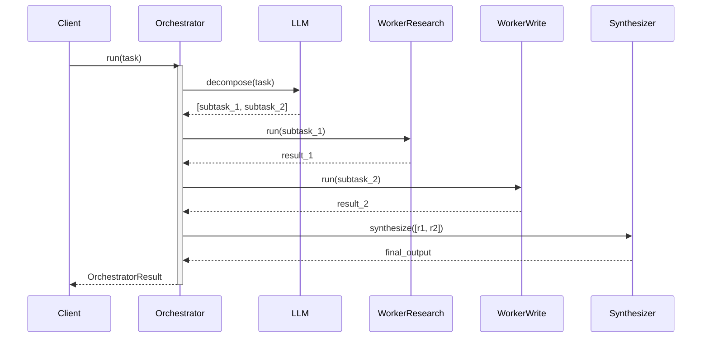

# Observability: Orchestrator-Worker

What to instrument, what to log, and how to diagnose failures when an LLM orchestrates dynamic task delegation.

---

## Key Metrics

| Metric | Description | Alert if |
|--------|-------------|----------|
| `orchestrator.duration_ms` | Total wall-clock time | > 2× p50 baseline |
| `orchestrator.subtask_count` | Number of sub-tasks delegated per run | Sudden spike (unbounded decomposition) |
| `orchestrator.worker.{name}.duration_ms` | Per-worker latency | Worker consistently > 2× others |
| `orchestrator.decompose.parse_error_rate` | Fraction of runs where JSON parse fails | > 0% |
| `orchestrator.worker.unknown_rate` | Fraction of delegations to unregistered workers | > 0% |

---

## Trace Structure

A root orchestration span with child spans for decomposition, each worker call, and final synthesis.



---

## Span Reference

| Span name | Emitted | Key attributes |
|-----------|---------|----------------|
| `orchestrator.run` | Once per call | `subtask_count`, `workers_used`, `duration_ms`, `success` |
| `orchestrator.decompose` | Once | `raw_response_len`, `subtasks_parsed`, `parse_error` |
| `worker.{name}.run` | Once per delegation | `worker.name`, `task_len`, `output_len`, `duration_ms` |
| `orchestrator.synthesize` | Once | `input_worker_count`, `tokens_out`, `duration_ms` |

---

## What to Log

### On decomposition
```
INFO  orchestrator.decompose.start  task_len=340
INFO  orchestrator.decompose.done   subtasks=3  workers=["researcher","writer","reviewer"]
WARN  orchestrator.decompose.parse_error  raw="<some unparseable text>"  fallback=true
```

### On each worker call
```
INFO  worker.call.start  worker=researcher  task="Find current LLM benchmarks"
INFO  worker.call.done   worker=researcher  output_len=420  duration_ms=850
WARN  worker.call.unknown  worker=coder  registered_workers=["researcher","writer"]
```

### On synthesis
```
INFO  orchestrator.synthesize.start  input_count=3
INFO  orchestrator.synthesize.done   output_len=680  duration_ms=940
```

### On run completion
```
INFO  orchestrator.done  subtasks=3  total_ms=3200  success=true
```

---

## Common Failure Signatures

### Decomposition returns unregistered worker names
- **Symptom**: `worker.call.unknown` events appear; those sub-tasks produce no output.
- **Log pattern**: `worker=<name>` does not match any entry in `registered_workers`.
- **Diagnosis**: The LLM is hallucinating worker names not in the prompt. The worker list in the prompt may be truncated or poorly formatted.
- **Fix**: Log the exact worker list sent in the decomposition prompt; validate each delegation before calling; add a fuzzy name-match fallback.

### Unbounded decomposition (too many sub-tasks)
- **Symptom**: `subtask_count` is 10–20 on a simple task that should produce 2–3 sub-tasks.
- **Log pattern**: Large `subtasks_parsed` values; total latency scales linearly with sub-task count.
- **Diagnosis**: The decomposition prompt has no constraint on the number of sub-tasks.
- **Fix**: Add `"Produce no more than 5 sub-tasks"` to the decomposition prompt; add a hard cap in code.

### JSON parse failure on decomposition
- **Symptom**: `orchestrator.decompose.parse_error` fires; fallback single-task path executes.
- **Log pattern**: `raw` contains explanatory text wrapping the JSON, or markdown fences.
- **Diagnosis**: The LLM is adding prose around the JSON. The prompt needs stronger format enforcement.
- **Fix**: Add `"Return ONLY the JSON array, no explanation"` to the prompt; strip markdown fences before parsing.

### Synthesis token explosion
- **Symptom**: Synthesis call is very slow and costs a lot; `synthesize.tokens_in` is huge.
- **Log pattern**: Individual worker `output_len` values are large; combined input to synthesis exceeds 8k tokens.
- **Diagnosis**: Workers are returning verbose outputs with no length constraint.
- **Fix**: Add output length constraints to each worker's system prompt; consider a summarization step before synthesis.
